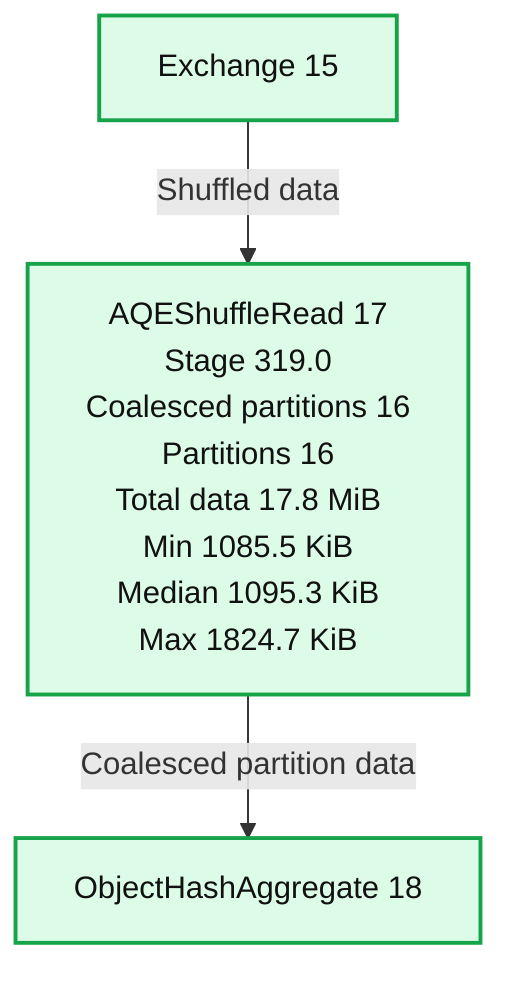
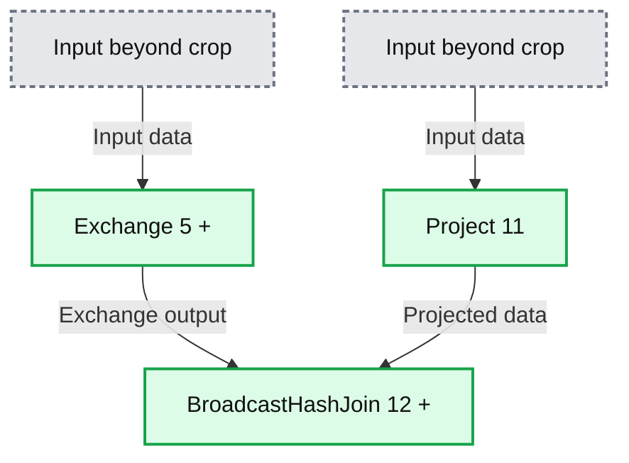
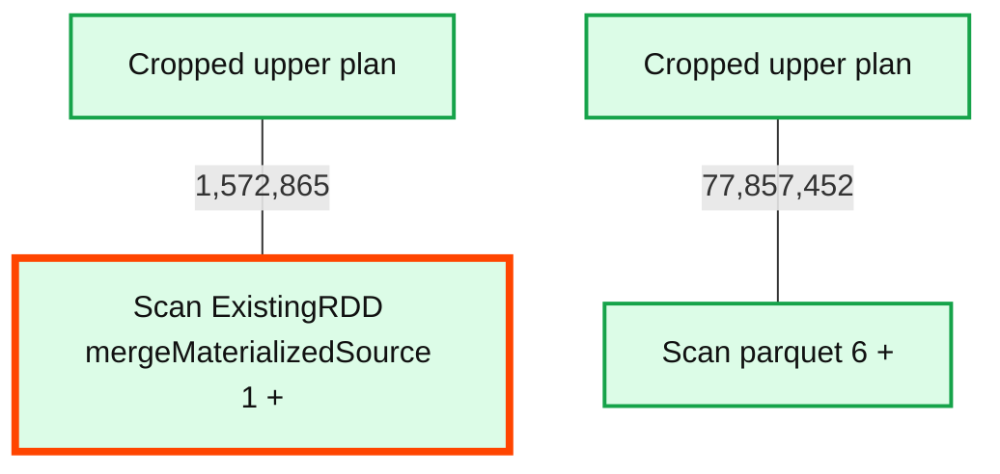
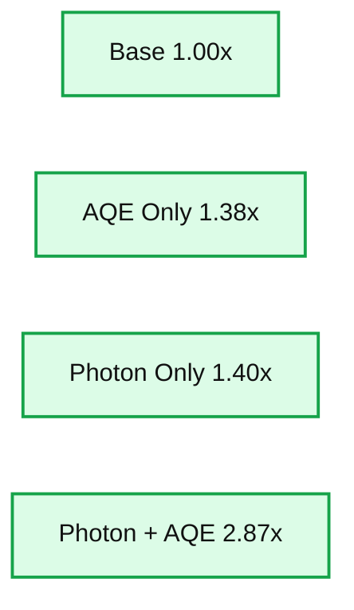

# Adaptive Query Execution in Structured Streaming

*Improving ForeachBatch Sink in Project Lightspeed*

- Source: https://www.databricks.com/blog/adaptive-query-execution-structured-streaming
- Published: 2023-06-02
- Authors: Steven Chen, MaryAnn Xue, Jungtaek Lim
- Categories: engineering, data-streaming
- Images: 5 total, 4 extracted as architecture

In Databricks Runtime, [Adaptive Query Execution](https://docs.databricks.com/optimizations/aqe.html) (AQE) is a performance feature that continuously re-optimizes batch queries using runtime statistics during query execution. Starting from Databricks Runtime 13.1, real-time streaming queries that use the [`ForeachBatch`](https://spark.apache.org/docs/latest/structured-streaming-programming-guide.html#foreachbatch) Sink will also leverage AQE for dynamic re-optimizations as part of [Project Lightspeed](https://www.databricks.com/blog/2022/06/28/project-lightspeed-faster-and-simpler-stream-processing-with-apache-spark.html).

## Limitations with Static Planning and Statistics

At Databricks, Structured Streaming handles petabytes of real-time data daily. The ForeachBatch streaming sink, used by over 40% of customers, often incorporates the most resource-intensive operations, such as joins and Delta MERGE with large volumes of data. The resulting multi-staged execution plans have the most potential to be re-optimized by AQE.

Streaming queries have relied on static query planning and estimated statistics, leading to several known issues previously seen in batch queries, including poor physical strategy decisions and skewed data distributions that degrade performance.

## Application of Dynamic Optimizations

To address those challenges, we exploit the runtime statistics collected during the micro-batch execution of the ForeachBatch Sink for dynamic optimizations. Adaptive query replanning will be triggered independently on each micro-batch because the characteristics of the data may change over time across different micro-batches.

The effect of AQE is isolated on stateless operators and is applied to the micro-batch DataFrame within the ForeachBatch callable function. Operators directly applied to the streaming DataFrame before invoking ForeachBatch are executed in a different query plan without AQE because those operators could be stateful. Separation of execution prevents AQE repartitioning on stateful operators, which can take away locality and cause correctness issues.

For Photon-enabled clusters, each micro-batch from a stateless query is executed with a cohesive query plan practically identical to that of a batch Photon query. This design allows the widest range of logical and physical optimizations. AQE will take effect for most stateless Photon-enabled queries using the ForeachBatch Sink.

Generally, AQE will be most effective when transformations can be applied within the ForeachBatch Sink. The sample code below shows two semantically identical streaming queries. The second query is recommended for potentially better AQE coverage since the join is moved inside the ForeachBatch function.

## Interpretation of Query Plans with AQE

Consider a simplified example of a streaming Delta MERGE query which is used for upserting real-time data into a Delta table:

Scanning for matches is often the most costly part of a Delta Merge query. Let’s examine the Spark UI snippets of a query plan that executes the matching process on a sample micro-batch.

First, *AQE Plan Versions* contain links that show how the plan evolved during execution. The *AdaptiveSparkPlan* root node indicates that AQE was applied to this query plan because it contained at least one shuffle.

The snippet below shows that AQE applied dynamic coalescing of small partitions in this particular example.

**Summary:** Spark AQE reads shuffle data using 16 coalesced partitions before passing it to ObjectHashAggregate.

**Components:**
- Exchange (15): Spark shuffle exchange operator.
- AQEShuffleRead (17): Spark adaptive shuffle reader, highlighted in red, with partition metrics for stage 319.0.
- ObjectHashAggregate (18): Spark object hash aggregation operator.

**Flows:**
- Exchange -> AQEShuffleRead: shuffled data.
- AQEShuffleRead -> ObjectHashAggregate: data from coalesced partitions.
- A partially visible arrow enters Exchange from below; its source is outside the image.

**Numbers:**
- Operator identifiers: 15, 17, 18.
- Stage: 319.0.
- Number of coalesced partitions: 16.
- Number of partitions: 16.
- Total partition data size: 17.8 MiB.
- Minimum partition data size: 1085.5 KiB.
- Median partition data size: 1095.3 KiB.
- Maximum partition data size: 1824.7 KiB.

source image: https://www.databricks.com/sites/default/files/inline-images/db-642-blog-img-2.png

Comparing plan versions in this example also shows that AQE dynamically switched from a `SortMergeJoin` to a `BroadcastHashJoin`, which can significantly speed up the join.

**Summary:** Exchange and Project operators feed a highlighted BroadcastHashJoin in a query execution plan.

**Components:**
- Exchange (5) +: query execution exchange operator; technology not specified in the image.
- Project (11): query execution projection operator; technology not specified in the image.
- BroadcastHashJoin (12) +: broadcast hash join operator; technology not specified in the image.

**Flows:**
- Exchange -> BroadcastHashJoin: exchange output.
- Project -> BroadcastHashJoin: projected data.
- Cropped lower input -> Exchange: input data from outside the visible area.
- Cropped lower input -> Project: input data from outside the visible area.

**Numbers:** 5, 11, 12 are operator identifiers.

source image: https://www.databricks.com/sites/default/files/inline-images/db-642-blog-img-3.png

As shown below, one of the leaf nodes of the query plan is an RDD Scan which reads the materialized micro-batch data from the streaming subplan which may contain stateful operators.

**Summary:** Two query-plan scan nodes show an RDD scan highlighted in red alongside a Parquet scan, with numeric labels on their upward connections.

**Components:**
- Scan ExistingRDD mergeMaterializedSource (1): Spark RDD scan, highlighted in red.
- Scan parquet (6): Parquet scan.
- Cropped upper nodes: labels and technologies are not visible.

**Flows:**
- RDD scan -> cropped upper plan: connection labeled 1,572,865; arrowhead and destination are not visible.
- Parquet scan -> cropped upper plan: connection labeled 77,857,452; arrowhead and destination are not visible.

**Numbers:** 1,572,865; 77,857,452; node identifiers (1) and (6). No units are visible.

source image: https://www.databricks.com/sites/default/files/inline-images/db-642-blog-img-4.png

If the same query was executed in Photon, instead of an RDD Scan, the execution plan would incorporate all downstream operators, including the data stream source.

## Performance Results

Leveraging AQE, stateless benchmark queries bottlenecked by expensive joins and aggregations typically experienced a speedup ranging from **1.2x to 2x**, with one query that had particularly poor static planning experiencing a 16x speedup. Partition size re-optimizations and dynamic join strategy selections were observed in the speedup queries. As expected, AQE did not impact the performance for stateful queries and queries with few transformations.

The additional dynamic filters enabled by AQE and join re-optimizations can be particularly effective with Delta MERGE, which is a common streaming use case. As shown in the chart below, internal benchmarks demonstrated a median **1.38x speedup** with just AQE and **2.87x speedup** if AQE is enabled along with the Photon engine.

**Summary:** Streaming Delta Merge performance increases from a 1.00x baseline to 1.38x with AQE, 1.40x with Photon, and 2.87x with Photon plus AQE.

**Components:**
- Base: baseline configuration, technology unspecified.
- AQE Only: Adaptive Query Execution.
- Photon Only: Photon engine.
- Photon + AQE: Photon engine with Adaptive Query Execution.

**Flows:**
- none. No arrows are visible.

**Numbers:**
- Base: 1.00x.
- AQE Only: 1.38x.
- Photon Only: 1.40x.
- Photon + AQE: 2.87x.
- Vertical axis ticks: 0.00x, 1.00x, 2.00x, 3.00x.

source image: https://www.databricks.com/sites/default/files/inline-images/db-642-blog-img-5.png

## Looking Forward

AQE in streaming will be enabled by default in Runtime 13.1 for non-Photon clusters and in Runtime 13.2 for Photon clusters. With AQE in ForeachBatch, customers can now benefit from the same dynamic optimizations used in batch queries for their streaming workloads. Also, look forward to the coming improvements to AQE, including Adaptive Join Fallback and other AI-powered features enabled by AQE.
