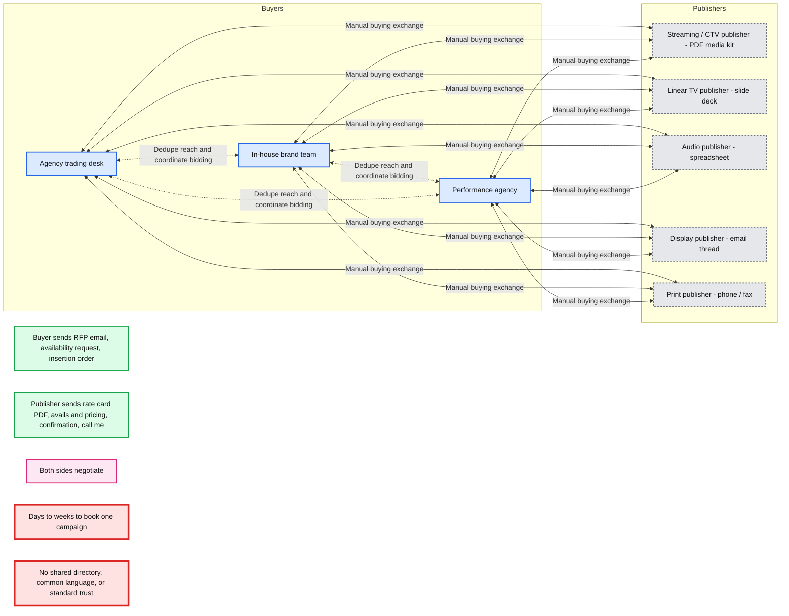
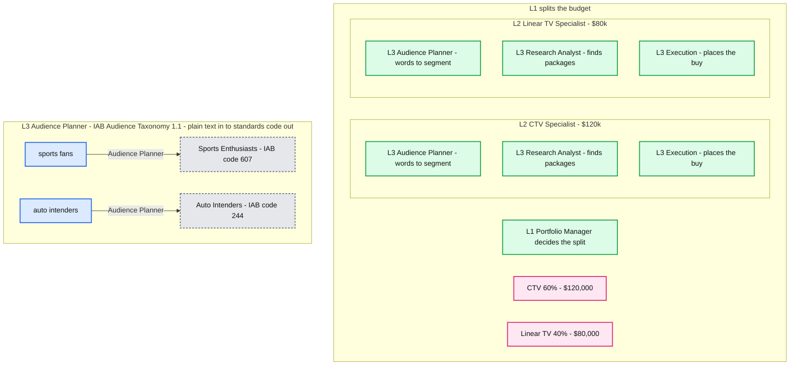
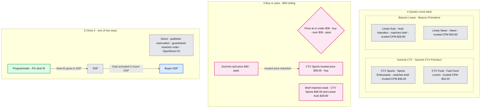

# Agentic media buying cannot scale without the right foundation. See how buyers and sellers get there on Databricks.

*The hardest part of autonomous buyer and seller agents isn't the AI — it's the state, trust, and observability to run in production. Learn how buyers and sellers clear that bar on one platform.*

- Source: https://www.databricks.com/blog/agentic-media-buying-cannot-scale-without-right-foundation-see-how-buyers-and-sellers-get
- Published: 2026-07-30
- Authors: Joe Hu, Mandy Baker, Luke Barnes
- Categories: platform, solutions, engineering, solution-accelerators, industries, media-and-entertainment
- Images: 5 total, 4 extracted as architecture

**Key takeaways**

- What it is: A reference implementation and self-deploy accelerator for agentic media buying, where autonomous buyer and seller agents transact, built entirely on Databricks.
- The challenge it solves: Enabling autonomous agents to transact takes far more than an LLM. It demands governed data, transactional state, identity, hosted models, and end-to-end observability working together as one operational platform, which is exactly where most agent projects stall.
- The outcome: Teams get a working blueprint they can stand up in their own workspace, not a multi-vendor integration project. Buyer and seller organizations can adapt these agents to their own environments, transact with partners over open standards, and pivot their resources from manual coordination to focus on strategy and results.

## The bottleneck in media buying today isn't talent, it's coordination

Every day, billions of dollars of advertising change hands through a process that has barely changed in decades: emails, spreadsheets, PDFs, and phone calls. A buyer sets a campaign, then skilled teams reach out to publishers, send RFPs, wait on rate cards, compare media kits, and negotiate price before finally cutting an insertion order. Talented people spend most of their time coordinating the transaction instead of managing the strategic and creative work.

The friction comes from fragmentation. There is no standardized way to discover inventory, evaluate audiences, or establish trusted relationships across partners, so every buyer and seller connection becomes a bespoke integration. Because that coordination takes days, decisions often get made on information that is already hours or days old. Inventory, pricing, and audience signals move continuously, and by the time a campaign is approved the best opportunity may have passed.

The rise of agentic workflows unlocks an opportunity for these teams to remove the manual, repetitive coordination from the equation so they can spend their time where judgment matters most: sharper targeting, better creatives, and campaigns that are not just faster to launch but more effective.

*Figure 1 — the media buy today: a tangle of RFPs, emails, negotiations, and manual IOs across many publishers*

**Summary:** Three buying teams manually coordinate with five publishers through RFPs, rate cards, availability requests, negotiations, and insertion orders, taking days to weeks to book one campaign.

**Components:**

- Agency trading desk: emails RFPs, decodes each rate card, and negotiates by hand.
- In-house brand team: repeats the same process with its own publishers.
- Performance agency: chases availability and quotes across overlapping publishers.
- Team coordination: deduplicates reach and avoids teams bidding against each other.
- Streaming / CTV publisher: PDF media kit.
- Linear TV publisher: slide deck.
- Audio publisher: spreadsheet.
- Display publisher: email thread.
- Print publisher: phone / fax.
- Manual exchange labels: RFP email, rate card PDF, availability request, avails + pricing, negotiate, insertion order, confirmation, and “call me.”
- Timing bottleneck: days to weeks to plan, price, and book one campaign.
- Missing shared foundations: no shared directory, common language for inventory or audiences, or standard trust.

**Flows:**

The connecting curves show every buying team paired with every publisher. Exchange labels apply collectively rather than identifying individual curves.

- Agency trading desk -> Streaming / CTV publisher: manual buying exchange.
- Agency trading desk -> Linear TV publisher: manual buying exchange.
- Agency trading desk -> Audio publisher: manual buying exchange.
- Agency trading desk -> Display publisher: manual buying exchange.
- Agency trading desk -> Print publisher: manual buying exchange.
- In-house brand team -> Streaming / CTV publisher: manual buying exchange.
- In-house brand team -> Linear TV publisher: manual buying exchange.
- In-house brand team -> Audio publisher: manual buying exchange.
- In-house brand team -> Display publisher: manual buying exchange.
- In-house brand team -> Print publisher: manual buying exchange.
- Performance agency -> Streaming / CTV publisher: manual buying exchange.
- Performance agency -> Linear TV publisher: manual buying exchange.
- Performance agency -> Audio publisher: manual buying exchange.
- Performance agency -> Display publisher: manual buying exchange.
- Performance agency -> Print publisher: manual buying exchange.
- Buying teams -> Publishers: RFP email, availability request, insertion order.
- Publishers -> Buying teams: rate card PDF, avails + pricing, confirmation, “call me.”
- Buying teams -> Publishers: negotiation, bidirectional.
- Agency trading desk -> In-house brand team: reach deduplication and bidding coordination, bidirectional.
- Agency trading desk -> Performance agency: reach deduplication and bidding coordination, bidirectional.
- In-house brand team -> Performance agency: reach deduplication and bidding coordination, bidirectional.

**Numbers:** Days to weeks to plan, price, and book one campaign.

source image: https://www.databricks.com/sites/default/files/blog_images/agentic-media-buying-cannot-scale-without-the-blog-img-3.png

Figure 1 — the media buy today: a tangle of RFPs, emails, negotiations, and manual IOs across many publishers

## Why this is finally solvable and why standards matter

The last wave of AI made software that answers. The next wave makes software that acts — agents that pursue a goal, make decisions, call tools, and transact on your behalf. That's the coordination work the manual media buy is drowning in: reading a brief, researching publishers, comparing rate cards, negotiating price, cutting the order. For the first time, multi-agent systems using LLMs and protocols like MCP can run that loop automatically.

But automation alone isn't enough. IAB Tech Lab's Agentic Advertising Management Protocols (AAMP) standards establishes a consistent communication pattern: a shared vocabulary for inventory and audiences (AdCOM, the taxonomies), a common transaction protocol (OpenDirect, OpenRTB deals), and a registry model for discovery and trust. You could solve this with AI and no standards between two parties. However, standards are what let the entire industry move together, so that any compliant buyer agent can transact with any compliant seller agent, the way any browser can load any website.

The open standards define what agents say to each other. The next question is where those agents actually run: their state, their models, their identity, their governance. That's where Databricks comes in.

We built an example of agentic media buying and selling fully on Databricks. Autonomous buyers and sellers discover each other, agree on price, and close deals. It’s built on the official open source IAB Tech Lab Software Development Kit (SDK) so there's no lock-in at the protocol layer, and now available as an accelerator that you can deploy with a single command. Instructions are at the end of the blog.

## What goes into an agentic media buy

An agentic media buy is a simple transaction with three players:

- A buyer: an advertiser (or its agency) with a campaign: a budget, the audiences to reach, and a price it won't exceed.
- Sellers: publishers with ad inventory, each with a catalog (a media kit of packages and products) and its own pricing.
- A registry: a directory that lets buyers find sellers and establish trust by identifying the buyer, and what access and pricing they get.

The buy itself is a short loop: discover which sellers have the right inventory, price it, and book the deal (or walk away). Today that loop is largely manual; the shift we're demonstrating is running it with AI agents on both sides.

Agents from different companies need a shared language to transact, and that’s where IAB Tech Lab’s open standards can add value. We won’t cover the details of [their SDK](https://github.com/IABTechLab/AAMP) here but instead focus on what it takes to run buyer and seller agents on Databricks.

## A complete ecosystem for buyer and seller agents

Complex agents go far beyond simple requests to a Large Language Model. In order for these agents to run a media transaction, which could involve a variety of tasks such as planning an audience, splitting a budget, discovering publishers, honoring a price ceiling, and booking the deal, you need a system that manages:

- **State**: briefs, identities, catalogs, quotes, and orders that must persist and be transactionally correct.
- **Models served**: governed foundation models the agents can call, with the right model for each job.
- **Governed data**: the catalog and audience data the agents reason over, with access controls.
- **Identity and trust**: who is this agent, and what is it allowed to see and do?
- **Observability**: a trace of every decision and tool call, for debugging and audit.

This system can be assembled from a database vendor, a model host, a governance tool, an app platform, and a tracing service. On Databricks, it's one platform.

## What does the right architecture look like?

Start with a fact about this market: the buyers, the sellers, and the registry are separate entities. That splits the problem in two: how the parties talk to each other, and where each party actually runs its side of the transaction. The open protocols answer the first. They are the wire between parties, carrying discovery, negotiation, and settlement, and they stop there. Where an agent runs, holds its state, proves its identity, and stays governed is the platform's job. So each party has a self-contained application, built on Databricks Apps, that owns its state, its identity, and the models it runs, and meets the others only over the protocols. The sections that follow take these pieces one at a time and show why each belongs there.

*Figure 2 — the solution accelerator is four Databricks Apps on one platform.*

**Summary:** Four Databricks Apps connect a hierarchical buyer agent crew, a human-reviewed registry, and two sellers over discovery, trust, and MCP transactions on a shared Databricks foundation.

**Components:**
- Campaign Brief: budget, audiences, and price ceiling.
- Buyer App: agentic application using CrewAI.
- L1 Portfolio Manager: strategy and budget split.
- L2 Channel Specialists: CTV and Linear.
- L3 Workers: audience, research, and execution.
- Registry: human-reviewed agent admission and trust-tier assignment.
- Seller A: CTV seller app using MCP, with media kit, products, and pricing.
- Seller B: Linear TV seller app using MCP, with media kit, products, and pricing.
- Databricks Apps: hosting and service-principal identity.
- Lakebase: serverless Postgres for agent state.
- Mosaic AI Model Serving: Claude for the agent crews.
- Built on Databricks: shared platform foundation.

**Flows:**
- Campaign Brief -> Buyer App: budget, audiences, and price ceiling.
- Buyer App -> Registry: discover and trust.
- Registry -> Seller A: approved sellers, shown as a dashed connection.
- Buyer App -> Seller A: transact over MCP through discovery, pricing, quoting, and booking.
- Buyer App -> Seller B: transact over MCP through discovery, pricing, quoting, and booking.
- Seller A media kit -> products: seller offering progression.
- Seller A products -> pricing: seller pricing progression.
- Seller B media kit -> products: seller offering progression.
- Seller B products -> pricing: seller pricing progression.

**Numbers:** Four Databricks Apps; levels L1, L2, and L3; step 1 for discover and trust; step 2 for transact over MCP.

```mermaid
%% Four Databricks Apps and their shared Databricks foundation
flowchart LR
    Brief["Campaign Brief<br/>budget · audiences · price ceiling"]

    subgraph Buyer["Buyer App · Agentic · CrewAI"]
        L1["L1 Portfolio Manager<br/>strategy + budget split"]
        L2["L2 Channel Specialists<br/>CTV · Linear"]
        L3["L3 Workers<br/>audience · research · execution"]
    end

    Registry["Registry<br/>Human-reviewed agent admission<br/>and trust tier"]

    SA["Seller A · CTV<br/>Seller App · MCP<br/>media kit → products → pricing"]
    SB["Seller B · Linear TV<br/>Seller App · MCP<br/>media kit → products → pricing"]

    Brief -->|budget · audiences · price ceiling| Buyer
    Buyer ---|1 discover + trust| Registry
    Registry -.-|approved sellers| SA
    Buyer ---|2 MCP · discover · price · quote · book| SA
    Buyer ---|2 MCP · discover · price · quote · book| SB

    subgraph Foundation["Built on Databricks"]
        Apps["Databricks Apps<br/>hosting + service-principal identity"]
        Lakebase["Lakebase<br/>Serverless Postgres · agent state"]
        Serving["Mosaic AI Model Serving<br/>Claude · the agent crews"]
    end

    classDef client fill:#dbeafe,stroke:#2563eb,stroke-width:2px,color:#111
    classDef service fill:#dcfce7,stroke:#16a34a,stroke-width:2px,color:#111
    classDef store fill:#ede9fe,stroke:#7c3aed,stroke-width:2px,color:#111
    classDef cache fill:#fef3c7,stroke:#d97706,stroke-width:2px,color:#111
    classDef queue fill:#cffafe,stroke:#0891b2,stroke-width:2px,color:#111
    classDef critical fill:#fee2e2,stroke:#dc2626,stroke-width:4px,color:#111
    classDef external fill:#e5e7eb,stroke:#6b7280,stroke-width:2px,color:#111,stroke-dasharray:4 3
    classDef decision fill:#fce7f3,stroke:#db2777,stroke-width:2px,color:#111

    class Brief client
    class Buyer,L1,L2,L3,Registry,SA,SB,Apps,Serving,Foundation service
    class Lakebase store
```

source image: https://www.databricks.com/sites/default/files/blog_images/agentic-media-buying-cannot-scale-without-the-blog-img-4.png

Figure 2 — the solution accelerator is four Databricks Apps on one platform.

## Databricks Model Serving: the agent crew

Under the hood, the buyer agent is a “crew”, or group, of specialist agents built using CrewAI. The crew works hierarchically across three levels, with the Level 1 agent able to delegate tasks to Level 2 agents and so on. These agents include a Level 1 Portfolio Manager that sets strategy and splits the budget, Level 2 Channel Specialists that specialize in shopping a specific medium, and Level 3 tactical workers that plan audiences and execute the buy. They run on Databricks Foundation Model APIs and are configured to use Claude models depending on the task complexity. Using Databricks Unity AI Gateway to run these agents makes it easy to change the LLM powering each agent without changing anything else.

## Lakebase: transactional state for agents

Agents need two things from their data: context to act on, and a place to record what they do. Our buyer reads its briefs, each seller reads its inventory catalog and pricing rules, and they write back every order booked. That's classic OLTP, so we put it on Lakebase, Databricks' serverless Postgres, running right next to the lakehouse. The agents read and write state quickly with transactional guarantees, and because it's Postgres, the seller components drop straight onto it with no bespoke data layer. And because Lakebase is serverless, it autoscales in milliseconds to meet bursty demand. Agents don't arrive at a steady rate, and buyers can fan out to many sellers at once without pre-provisioning capacity.

## Governance: Lakebase today, Unity Catalog next

Right now this demo uses Lakebase alone. In the real world, Lakebase sits between two governed Unity Catalog boundaries. On the way in, data is hydrated from Unity Catalog tables into Lakebase — a seller's inventory and its ML-model-driven pricing, a buyer's campaign briefs and audience definitions. On the way out, the transactional state the agents produce — who bought what, at what price — is synced back to your reporting environment. Both directions run on Databricks managed pipelines instead of brittle, hand-written ETL. That makes it a governed round trip: Unity Catalog automatically tracks the lineage of every hydrate and sync, so you can always trace what data moved where. The lakehouse stays the source of truth on both ends, and Lakebase is the operational, hot-serving layer where the agents transact.

## Identity and trust

The apps authenticate with each other using OAuth — the mechanism that establishes and verifies who each one claims to be — and a registry assigns each buyer a trust tier. That tier decides what a buyer can even see: an unknown, public buyer gets only price ranges and can't transact; a trusted, verified buyer gets exact prices and can book. Flip the buyer's trust and the same campaign that was locked to price ranges can now be booked. On Databricks, that identity story is native to how Apps and data access already work.Where the IAB reference SDK reaches for API keys, we simply use the platform's built-in service principals and OAuth to authenticate using today's best practice,with nothing extra to build.

## Observability

The agent crews are wired for MLflow tracing, which is easily implemented via a one-line CrewAI autolog hook. This allows us to capture the reasoning steps, the tool calls, the prices read, and the book-or-pass decision of every agent run. We kept it optional for the demo, but this is exactly how you'd want to productionize, debug, tune, and trust an autonomous system when it comes to budget controls.

## See the agentic buying app in action

Let’s follow a complete run on one campaign. We start by submitting the advertiser's brief, which in this scenario is a Q3 Brand Launch, with a budget of $200,000 across the CTV and Linear TV media types, and a $38 CPM (Cost Per Mille) ceiling. This brief is sent to the buyer app, and the agent crew kicks off the buying process.

Figure 3 — buyer app accessing a pre-created campaign brief

**1. Plan the budget:** The Portfolio Manager reads the brief and splits the spend across channels, allocating $120k to CTV and $80k to Linear.

**2. Translate the audience:** A specialist maps the brief's plain-language audiences to standard segments, validated against the IAB Tech Lab Audience Taxonomy: "sports fans" maps to “Sports Enthusiasts”, and "auto intenders" maps to “Auto Intenders”.

*Figure 4 — buyer app agents parsing the brief*

**Summary:** The L1 Portfolio Manager allocates the budget to CTV and Linear TV specialists, while an L3 Audience Planner translates audience phrases into standard IAB audience segments.

**Components:**

- L1 Portfolio Manager: reads the brief and splits the budget across channels; implementation technology unspecified.
- CTV allocation: budget share assigned to the L2 CTV Specialist.
- Linear TV allocation: budget share assigned to the L2 Linear TV Specialist.
- L2 CTV Specialist: channel agent with an L3 crew; implementation technology unspecified.
- L2 Linear TV Specialist: channel agent with an L3 crew; implementation technology unspecified.
- L3 Audience Planner: translates words into segments using IAB Audience Taxonomy 1.1.
- L3 Research Analyst: finds packages; implementation technology unspecified.
- L3 Execution: places the buy; implementation technology unspecified.
- sports fans: plain-language audience input.
- Sports Enthusiasts: IAB Audience Taxonomy segment, code 607.
- auto intenders: plain-language audience input.
- Auto Intenders: IAB Audience Taxonomy segment, code 244.

**Flows:**

- Plain text in -> Standards code out: audience translation using IAB Audience Taxonomy 1.1.
- sports fans -> Sports Enthusiasts: Audience Planner maps the phrase to code 607.
- auto intenders -> Auto Intenders: Audience Planner maps the phrase to code 244.

**Numbers:** Step 2; agent levels L1, L2, and L3; CTV 60%, $120,000, and $120k; Linear TV 40%, $80,000, and $80k; IAB Audience Taxonomy 1.1; segment codes 607 and 244.

source image: https://www.databricks.com/sites/default/files/blog_images/agentic-media-buying-cannot-scale-without-the-blog-img-6.png

Figure 4 — buyer app agents parsing the brief

**3. Discover the sellers: **The buyer discovers publishers in the registry: Seller A (CTV) and Seller B (Linear), which confirms the buyer's identity and stamps its access tier.

**4. Price it:** A Channel Specialist for each channel shops its seller over MCP, matches the audience segment to an available product, and reads the authoritative price.

**5. Book or pass:** One rule: book if the price is at or under the $38 ceiling and the product audience matches; otherwise, walk away.

*Figure 5 — buyer app agents conducting a purchase (audience plan → discovery → pricing → book/pass)*

**Summary:** Buyer pricing compares audience-matched media products against a $38 CPM ceiling, then closes approved purchases through direct or programmatic booking.

**Components:**

- Quotes come back: media kits organize packages and products with IAB audience segments.
- Summit · CTV: Summit CTV Premium package contains CTV Sports for Sports Enthusiasts and CTV Food for Fast Food Lovers.
- Beacon · Linear: Beacon Primetime package contains Linear Auto for Auto Intenders and Linear News for News audiences.
- Matches brief: CTV Sports and Linear Auto carry audience-match flags.
- Buy or pass: `price ≤ max_cpm` compares trusted CPM prices with the ceiling.
- Trust changed the answer: Summit’s trusted price qualifies where its card price fails.
- The brief’s matches book: CTV Sports and Linear Auto are selected.
- Direct: publisher reservation uses a guaranteed insertion order and OpenDirect IO.
- Programmatic: a PG deal ID goes to an SSP and is activated in the buyer’s DSP.

**Flows:**

- Summit card price -> CTV Sports trusted price: dashed leftward arrow shows the reduction from $40 to $36.
- PG deal -> SSP: programmatic deal ID is passed to the SSP.
- SSP -> DSP: programmatic deal is activated in the buyer’s DSP.

**Numbers:**

- Steps 4, 5 and 6; reference to Beat 2.
- CTV Sports: $40 crossed out; $36.00 trusted CPM.
- CTV Food: $38 crossed out; $34.20 trusted CPM.
- Linear Auto: $32 crossed out; $28.80 trusted CPM.
- Linear News: $34 crossed out; $30.60 trusted CPM.
- Ceiling: $38, repeated in the heading, rule, chart and explanatory callout.
- Chart: $28.80 Linear Auto, $30.60 Linear News, $34.20 CTV Food, $36.00 CTV Sports and $40 Summit card price.
- Trust callout: $40 card price, $36 trusted price and $38 ceiling.
- Booking callout: CTV Sports at $36.00 and Linear Auto at $28.80.

source image: https://www.databricks.com/sites/default/files/blog_images/agentic-media-buying-cannot-scale-without-the-blog-img-7.png

Figure 5 — buyer app agents conducting a purchase (audience plan → discovery → pricing → book/pass)

## What’s Next

What we've shown here is the middle of the trade: the agents that transact. But the same platform is the best place to build the left and right sides too: the buyer's brief creation, the ML models that set a seller's package pricing, the models and dashboards used to estimate revenue and expenditures. These are problems whose solutions depend on governed data and ML which both live natively on Databricks. Our team is committed to updating the repository, ensuring it evolves alongside the IAB Tech Lab as additional AAMP capabilities are released.

## Deploy it yourself

This system ships as a Databricks Automation Bundle accelerator. Clone the repo, point the Databricks CLI at your workspace, and run a single command:

Use this command to build and deploy the apps and the Lakebase instances, seed the data, and wire the buyer to the sellers through the registry. A few minutes later you have two live seller agents, a registry, and a buyer console, all transacting in your own workspace.

From there, make it yours. Swap in your own inventory, pricing rules, and audiences, or wire the Lakebase layer to your real catalog and models. Step into the trade as the buyer or the seller and watch how the agents react: change a price, flip a buyer's trust tier, add a seller, and see the negotiation play out. It's a working blueprint tailored for agentic media buying and selling.

**Watch the 5-minute **[**demo**](https://www.loom.com/share/f798e2408f9e4ed5afcf453b16140944)**, then deploy the **[**accelerator**](https://github.com/databricks-industry-solutions/databricks-iab-aamp-buy-sell)** in your own workspace.**
