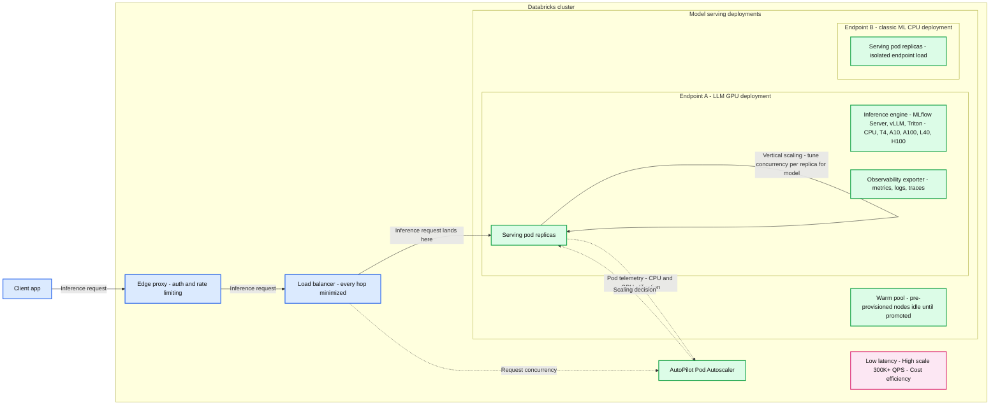
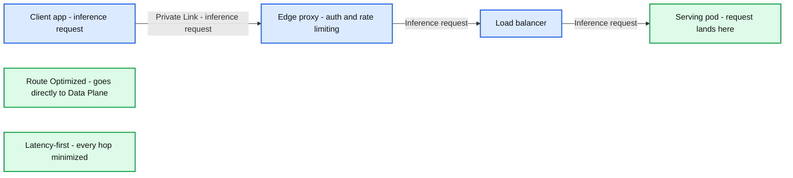
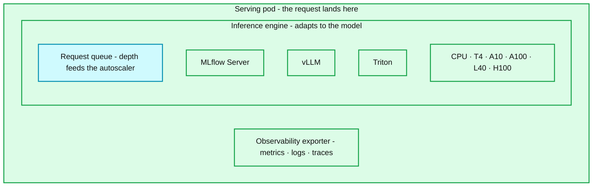
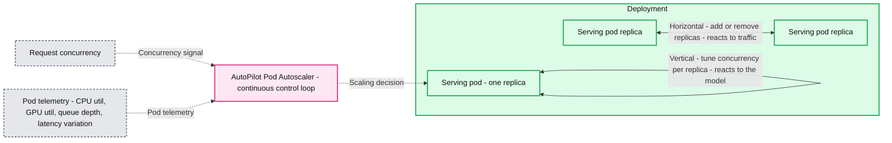

# AI Serving Platform That Adapts to Your Model

*One platform for all AI models - classic ML, deep learning, and agents - 300K+ QPS, sub-10ms, no tuning*

- Source: https://www.databricks.com/blog/ai-serving-platform-adapts-your-model
- Published: 2026-06-10
- Authors: Anshul Gupta
- Categories: engineering
- Images: 6 total, 5 extracted as architecture

**Key takeaways**

- What it is: A fully managed platform that runs any model in production, from a 2 MB scikit-learn classifier on one CPU core to a fine-tuned 70B LLM on eight GPUs, with no knobs.
- The challenge it solves: Custom models have wildly different resource profiles and traffic patterns, so no single static config fits them all. The platform adapts instead, holding latency low while keeping every node efficient.
- The results: 300K+ QPS at <10ms p99 latency overhead and up to 90% lower infrastructure cost for customers migrating off self managed stacks.

## Challenges of Running Custom Model Inferences

When you **deploy a machine learning model to production, you are committing to a contract**: every request completes within a few milliseconds regardless of traffic spikes, and your bill stays low when traffic is low. Model serving is the infrastructure that keeps that contract, and for most of the industry's history, keeping it has been as hard as building the model itself.

**Custom models are fundamentally different from foundation models.** A platform hosting a foundation model (Llama, Mistral, a CLIP variant) knows exactly what it is running: the architecture, the memory footprint, the inference characteristics, and can optimize deeply for that one model. Custom model platforms are the opposite. The same platform has to serve a 2 MB scikit-learn classifier on a single CPU core *and* a fine-tuned 70B LLM on eight GPUs; a low-latency ranker that cannot tolerate queuing *and* an embedding model that thrives on aggressive batching. A platform that can serve every kind of model and no two with the same resource profile, traffic shape, or latency budget.

Traditional platforms **offload that complexity** back to the customer: replica count, per-replica concurrency, autoscaling thresholds. This is still DIY, just at a higher abstraction. And it never stops: every new model and traffic shift means re-profiling and re-tuning, so your best engineers fire-fight production before and after shipping, and serving becomes the anchor that slows every launch. The result is the cost that matters most — models proven in dev sit for weeks before they reach production.

## Our Mission: Remove the ML Stack Tax

Re-tuning serving infrastructure by hand is a tax on every model an organization runs; at scale it becomes structural, with teams standing up dedicated serving groups whose whole job is keeping models alive and performant in production. We call it the **ML Stack Tax**.

Databricks Custom Model Serving is a fully managed real time inference platform for *any* model packaged in [MLflow](https://docs.databricks.com/aws/en/mlflow/). **Our mission is to erase that tax** across three stages of a model's life so that our customer’s serving teams can focus on more sophisticated value addition:

1. **Make pre-production simple.** A model trained in Databricks deploys with a single click — we match the environment exactly, with no runtime surprises, and optimize deployment time so iteration and rollback stays fast.
2. **Make production reliable, scalable, and cost-efficient.** The infrastructure adapts to each model and its traffic at run time, holding latency low and cost down with no knobs to set. *(The focus of this post.)*
3. **Make post-production simple.** Every endpoint emits telemetry into Unity Catalog out of the box (metrics, OTel-native logs and traces, instant inference tables capturing every request to Delta and MLflow Tracing). [Genie Code](https://www.databricks.com/blog/introducing-genie-code) sits on top of all of it to deliver first-of-its-kind agentic operational observability. Observability for AI is a context problem, and the whole context lives in one platform.

This works because Custom Model Serving is built natively into Databricks: data, features, training, MLflow packaging, serving, and agents are one governed stack, not separate systems stitched together.

This post covers the second stage on how we reach 300K+ QPS at low latency across a wide variety of models with a no knob approach. This is what makes the tax disappear.

## Architecture

Three constraints shape every decision in the architecture: low latency, high scale, and cost efficiency**.** They pull against each other (the easy way to cut latency is to over-provision, the easy way to cut cost is to under-provision) and holding all three at once, for every kind of model, without any resource wastage is the real engineering problem.

**Summary:** Databricks Model Serving routes inference requests through an edge proxy and load balancer to isolated serving deployments, with an AutoPilot Pod Autoscaler controlling capacity and a warm pool of pre-provisioned nodes.

**Components:**

- Client app: sends inference requests; technology unspecified.
- Databricks cluster: contains the request path, autoscaler, and model serving deployments.
- Edge proxy: authentication and rate limiting; technology unspecified.
- Load balancer: distributes requests; technology unspecified.
- AutoPilot Pod Autoscaler: continuous control loop adapting capacity to traffic and model demand.
- Model serving deployments: contains isolated endpoints and the warm pool.
- Endpoint A: LLM deployment using GPUs, with replicated serving pods.
- Endpoint A serving pod: contains an inference engine and observability exporter.
- Inference engine: MLflow Server, vLLM, or Triton; hardware labels include CPU, T4, A10, A100, L40, and H100.
- Observability exporter: exports metrics, logs, and traces.
- Endpoint B: classic ML deployment using CPUs, with replicated serving pods; one endpoint's load never affects another's.
- Warm pool: pre-provisioned nodes, idle until promoted; seven node icons are shown.
- Request-path annotation: latency-first, every hop minimized.
- Scaling annotations: horizontal scaling adds or removes replicas in response to traffic; vertical scaling tunes concurrency per replica in response to the model.
- Design objectives: low latency, high scale, and cost efficiency.
- Legend: solid red arrows indicate the request path, dashed cyan arrows indicate the APA control loop, and double-ended red arrows indicate scaling axes.

**Flows:**

- Client app -> Edge proxy: inference request.
- Edge proxy -> Load balancer: inference request after authentication and rate limiting.
- Load balancer -> Endpoint A serving pod: inference request lands at the pod.
- Load balancer -> AutoPilot Pod Autoscaler: request concurrency through the APA control loop.
- Endpoint A serving pods -> AutoPilot Pod Autoscaler: pod telemetry, including CPU and GPU utilization.
- AutoPilot Pod Autoscaler -> Endpoint A: scaling decision.
- Endpoint A serving pods -> Endpoint A serving pods: horizontal scaling adds or removes replicas in response to traffic; double-ended horizontal axis.
- Endpoint A serving pod -> Endpoint A serving pod: vertical scaling tunes concurrency per replica in response to the model; double-ended vertical axis.

**Numbers:**

- 300K+ QPS: high-scale objective.
- T4, A10, A100, L40, H100: hardware model identifiers.
- Seven warm-pool node icons.
- Three stacked serving-pod outlines in each endpoint.

source image: https://www.databricks.com/sites/default/files/blog_images/ai-serving-platform-that-adapts-to-your-blog-img-4.png

Three things make it work.

1. A **short, isolated request path** that keeps latency overhead minimal at every hop.
2. **Automatic runtime selection -** each model is served on the inference engine best suited to it.
3. The heart of the platform — an autoscaler** that adapts to both the model and its traffic in real time**, holding latency and scale up while driving cost down.

The first two keep a single request fast; the third keeps the whole system fast *and* cost-effective as models and traffic change. Most of this section is about the third.

#### Short, Isolated Request Path

Every serving endpoint is a **fully isolated Kubernetes deployment** with its own pods and a container image specific to the model version. This isolation is deliberate: one endpoint's traffic, failures, or resource pressure cannot affect another's, and it keeps custom workloads secure.

The path itself is kept as short as possible, because **latency is a first-class constraint at every layer**. A request arrives through a PoP proxy; once authenticated, it passes through a shared load balancer for connection management and immediately lands on the pod that serves it. Each pod also runs an observability sidecar that exports metrics, logs, payload logs, and traces, for both platform monitoring and customer-facing dashboards.

**Summary:** The route-optimized path sends inference requests from a client app through an edge proxy and load balancer directly to a serving pod in the data plane, minimizing every hop.

**Components:**
- Client app: issues inference requests; technology unspecified.
- Private Link: connection between the client app and edge proxy.
- Edge proxy: authentication and rate limiting; technology unspecified.
- Load balancer: forwards requests to the serving pod; technology unspecified.
- Serving pod: destination where requests land; runtime unspecified.
- Route Optimized: goes directly to the data plane.
- Latency-first: every hop minimized.

**Flows:**
- Client app -> Edge proxy: inference request over Private Link.
- Edge proxy -> Load balancer: inference request after authentication and rate limiting.
- Load balancer -> Serving pod: inference request lands on the serving pod.

**Numbers:** none

source image: https://www.databricks.com/sites/default/files/blog_images/ai-serving-platform-that-adapts-to-your-blog-img-5.png

#### Efficient Model Runtime Selection

Inside each pod, the model runs on the inference engine best suited to its type — an async Gunicorn MLflow server for classic ML models, and GPU-optimized engines for large models with support for vLLM, Triton or customer's own runtime — all behind one uniform serving interface.

Meeting each model with the right runtime keeps per-request overhead low without hand-tuning; the specifics are shown in the diagram below.

**Summary:** A serving pod contains a model-adaptive inference engine with a request queue, runtime options, compute hardware options, and an observability exporter.

**Components:**
- Serving pod: where the request lands.
- Inference engine: adapts to the model.
- Request queue: its depth feeds the autoscaler.
- MLflow Server: inference runtime option.
- vLLM: inference runtime option.
- Triton: inference runtime option.
- Compute hardware: CPU, T4, A10, A100, L40, H100.
- Observability exporter: exports metrics, logs, and traces.

**Flows:**
- None. No arrows are visible.

**Numbers:** No numerical measurements are shown. Hardware identifiers contain numbers: T4, A10, A100, L40, H100.

source image: https://www.databricks.com/sites/default/files/blog_images/ai-serving-platform-that-adapts-to-your-blog-img-6.png

## The Autoscaler: Adapting to Model and Traffic

A custom Kubernetes controller we built — the **AutoPilot Pod Autoscaler (APA)** — sits at the center of the platform. It continuously collects signals from the load balancer (active concurrency, queue depth) and from the pods themselves (CPU utilization, GPU utilization, GPU memory, and many others), and turns them into scaling decisions.

The autoscaler exists to absorb **two kinds of unpredictability** at once:

- **The model is unpredictable.** You do not know a custom model's resource profile in advance. A CPU heavy xgboost model may only serve 1 request per core, an agent can run 100s of requests per core, while a fine-tuned 13B LLM benefits from multiple requests batched together. APA learns each model's limit at run time and tunes how many requests every replica should accept: ***model-aware vertical scaling***.
- **The traffic is unpredictable.** It spikes, bursts, and drops to zero without warning. A fraud endpoint can jump 10× in seconds at the start of a sale; a region specific use-case fires hard for an hour and then idles overnight. APA reacts the instant demand shifts: ***request-based horizontal scaling*****.**

This is why the autoscaler is the heart of the system: it is the one component holding all three constraints — latency, scale, and cost — at the same time, for every model on the platform.

#### Two Axes of Elasticity

Traditional autoscalers either do request-based or resource-based autoscaling, but each has a weakness. Request-based scaling reacts quickly but is inefficient — it treats every request identically regardless of how loaded each replica is, so you either over-provision or thrash the replica count. Resource-based scaling (CPU, GPU utilization) is efficient but lags — utilization metrics trail traffic, so by the time the autoscaler fires, the damage to p99 is already done.

APA uses **both signals at once**, each doing what it is best at — and that is exactly what the two axes are.

**Summary:** AutoPilot Pod Autoscaler combines request concurrency and pod telemetry to adjust replica count and concurrency per replica.

**Components:**
- Request concurrency: input measuring concurrent requests; technology unspecified.
- Pod telemetry: CPU utilization, GPU utilization, queue depth, and latency variation; monitoring technology unspecified.
- AutoPilot Pod Autoscaler: continuous control loop that reshapes capacity as traffic and model demand change.
- Deployment: contains serving pod replicas; orchestration technology unspecified.
- Serving pod: one replica; serving technology unspecified.
- Control loop: cyan dashed arrows.
- Scaling axis: red bidirectional arrows.
- Horizontal scaling: adds or removes replicas in response to traffic.
- Vertical scaling: tunes concurrency per replica in response to the model.

**Flows:**
- Request concurrency -> AutoPilot Pod Autoscaler: concurrency signal through the control loop.
- Pod telemetry -> AutoPilot Pod Autoscaler: resource utilization, queue depth, and latency signals through the control loop.
- AutoPilot Pod Autoscaler -> Deployment: scaling decision.
- Serving pod -> Serving pod: bidirectional vertical scaling tunes concurrency per replica.
- Deployment -> Deployment: bidirectional horizontal scaling adds or removes replicas.

**Numbers:** One replica per serving pod.

source image: https://www.databricks.com/sites/default/files/blog_images/ai-serving-platform-that-adapts-to-your-blog-img-7.png

**Horizontal scaling reacts to requests.** It watches active concurrent requests per endpoint and adds or removes replicas the moment demand shifts. The formula follows the Kubernetes Horizontal Pod Autoscaler:

**Model-aware vertical scaling reacts to model characteristics.** Periodically, the autoscaler looks at a set of metrics to determine how much load a single replica can actually handle and adjusts target_concurrency in the above formula accordingly. This is fundamentally different from traditional vertical scaling, which changes *hardware type*. Here the hardware stays the same: what changes is how many concurrent requests each pod accepts, tuned to the resource profile of the model running on it.

The metrics we rely on include, but are not limited to:

1. Hardware metrics — CPU and GPU utilization, memory utilization, I/O wait
2. Current latency and queue-depth profile
3. GPU-specific metrics — memory bandwidth, FP16/BF16 FLOPS utilization

**Safeguards.** Concurrency per node changes are sensitive and large or frequent variations can deteriorate the performance of the system. Pod metrics can fluctuate on brief traffic changes or when the cost per request is widely different for a model. We safeguard against this metric noise**. **A brief CPU spike should not immediately shrink the concurrency limit only to re-expand it seconds later. We take three steps for this:

1.

Concurrency is adjusted only when a metric crosses a stable threshold, and thresholds are tuned per metric.

2. We cap the maximum change in concurrency per decision cycle
3. We always enforce min/max concurrency limits for a workload
4. Concurrency changes happen at a lower cadence (every 30s) compared to horizontal scaling. This is also important as they rely on historical metrics as opposed to current traffic like the HPA.

**The two axes are coupled**: the concurrency output of vertical scaling feeds the calculation in horizontal scaling through the `target_concurrency` denominator. Horizontal scaling ensures availability and low latency the moment traffic shifts. Model-aware vertical scaling ensures each node is used efficiently, and right-sizing concurrency as model behavior evolves. Together they avoid the false choice between fast-but-wasteful and efficient-but-slow.

#### Scale-Up and Scale-Down Thresholds

The raw HPA formula is not enough on its own: it is not resilient to spiky traffic. A brief 10× spike computes a 10× replica increase; a brief 95% drop computes a 95% decrease. Both are dangerous, either for cost or for latency and availability.

**Horizontal scale-up is aggressive*** *In production, high latency can mean a massive negative business impact. Many use cases have naturally highly spiky traffic patterns that are critical to support. To handle spikes, we scrape incoming requests every 1 second and APA makes an upscaling decision every 5 seconds based on traffic in the past 20 seconds. This significantly reduces queueing and 429s during spikes — many customers noticed up to 5x difference. We also limit how much we can scale up in a single cycle relative to the current load. Overall, *We can go from 10 to 10K qps in < 60 seconds (depending on the model load time)*

**Scale-down is conservative.** A spike often signals more traffic coming. For scale-down, APA still decides every 5 seconds, but considers traffic over the last ~5 minutes before removing replicas.

The asymmetry is intentional. Spikes are sudden; drops are often temporary. The cost of premature scale-down (a cold start at the worst possible moment) outweighs the cost of keeping a few idle replicas temporarily.

**Summary:** Provisioned concurrency rises sharply from zero to approximately 64, then decreases in steps to approximately 4.

**Components:**
- Provisioned Concurrency: blue time series; underlying technology is not specified.
- Horizontal axis: time.
- Vertical axis: provisioned concurrency.

**Flows:**
- No arrows are visible. The blue line connects concurrency measurements over time.

**Numbers:**
- Vertical ticks: 0.00, 10.00, 20.00, 30.00, 40.00, 50.00, 60.00.
- Time ticks: 12:50, 13:00, 13:10, 13:20, 13:30, 13:40.
- Approximate plotted levels: 0, 4, 60, 64, 32, 16, 8, then 4.

```mermaid
%% Provisioned concurrency rises sharply and then falls in steps over time
flowchart LR
    A[Concurrency 0] ---|Sharp rise| B[Approximately 60]
    B ---|Brief rise| C[Approximately 64 near 13:00]
    C ---|Step down| D[Approximately 32]
    D ---|Step down| E[Approximately 16 near 13:10]
    E ---|Step down| F[Approximately 8]
    F ---|Step down| G[Approximately 4 through 13:40]

    classDef client fill:#dbeafe,stroke:#2563eb,stroke-width:2px,color:#111
    classDef service fill:#dcfce7,stroke:#16a34a,stroke-width:2px,color:#111
    classDef store fill:#ede9fe,stroke:#7c3aed,stroke-width:2px,color:#111
    classDef cache fill:#fef3c7,stroke:#d97706,stroke-width:2px,color:#111
    classDef queue fill:#cffafe,stroke:#0891b2,stroke-width:2px,color:#111
    classDef critical fill:#fee2e2,stroke:#dc2626,stroke-width:4px,color:#111
    classDef external fill:#e5e7eb,stroke:#6b7280,stroke-width:2px,color:#111,stroke-dasharray:4 3
    classDef decision fill:#fce7f3,stroke:#db2777,stroke-width:2px,color:#111
    class A,B,C,D,E,F,G service
```

source image: https://www.databricks.com/sites/default/files/blog_images/ai-serving-platform-that-adapts-to-your-blog-img-8.png

**Vertical concurrency scale-up and scale-down.** The same asymmetric philosophy applies to vertical scaling: being quick to *reduce* concurrency when a pod shows stress (routing fewer requests to an already-loaded replica protects latency), but never below a minimum. These decisions run on a 30-second interval, slower than the 5-second horizontal loop. This is intentional: vertical scaling is a steady-state optimization that adapts to a model's resource profile over time, not a real-time reaction to spikes.

#### Minimizing Cold Start Time

A cold start is the worst latency event in a serving system; you cannot optimize your way out of it once it is happening. We attack it on two fronts: keep as much pre-warmed as possible, and make the unavoidable parts as fast as possible.

**Warm node pools.** A *predictive* algorithm maintains a pool of pre-provisioned nodes per Databricks cluster, pre-loaded with the base runtime image. When the autoscaler adds a replica, it picks from this pool: the node is already up, the base image already pulled, and the only remaining work is downloading the model. We don't charge customers for warm-pool capacity; it's direct value they get from Databricks.

**Fast model download.** Model container images are stored in a hot cache layer in cloud storage and pulled in parallel chunks at pod startup, cutting image-pull time significantly for large model containers. Config changes that don't affect the model or its dependencies (endpoint metadata updates, routing-rule changes) are applied without restarting the pod at all, since a restart avoided is the warmest start of all.

**Provisioned concurrency.** For latency-critical endpoints that cannot tolerate any cold start, users configure a minimum concurrency floor. This keeps a baseline of pods fully ready with the model loaded and ready to serve immediately, with no queuing on the first request.

**Zero-downtime updates and maintenance.** Updates and maintenance are completely zero-downtime. All pods with the new model version are up and ready before traffic moves off the old pods.

## What We Learned in Production

**Customers have seen benefits across every dimension:**

- Cost: We have customers who have had 90%+ cost savings compared to their DIY workloads.
- Latency: p99 & p50 latency improved up to 2x for many customers.
- Scale: Customers have scaled to 100K+ QPS in production with little to no maintenance.
- We sustain 99.99% availability in production.

**Two-axis autoscaling generalizes across model types.** We weren't sure the horizontal + vertical approach would hold across everything from CPU classifiers to GPU LLMs. It does: the horizontal axis handles traffic the same way for every model, while the vertical axis settles on higher concurrency for lightweight models and lower for GPU-heavy ones. Same controller, same logic, the right behavior for each.

**Most models are homogeneous.** We thought concurrency limits would drift constantly with traffic; in practice a model's resource profile under the same load stays mostly similar. The vertical axis earns its keep during onboarding, then goes quiet.

**You cannot optimize cold starts away.** We expected warm pools, parallel image pulls, and deployment reuse to shrink cold starts to near zero. They help enormously — but physics has a floor: bringing a pod up takes time that grows with model size, minutes for large GPU models. Past that floor the only answer is keeping a min capacity fully ready, which is exactly why minimum provisioned concurrency exists.

**Traffic is more predictable than it looks.** The right minimum isn't static: B2C apps quiet down overnight, batch pipelines fire on schedules. These patterns are learnable, and we're building traffic forecasting to raise minimum concurrency ahead of demand instead of chasing it. Stay tuned for that.

## Conclusion

We set out to remove the **ML Stack Tax**: the endless re-tuning, and the dedicated serving team it demands. For the full diversity of models running on Custom Model Serving today, the two-axis autoscaler, warm pools, and zero-downtime deployments do exactly that. The infrastructure adapts to the model instead of the other way around. You bring a model, set a concurrency range, and the platform handles the rest.

Model serving is not a solved field, though. Larger models, new hardware, and agentic workloads keep pushing scale and complexity past what traditional serving infrastructure was built for. The open problems are real and the ambition is high: lower cold-start times, traffic forecasting for predictive scaling, 1M+ QPS per endpoint and 10M+ QPS per cluster, smarter bin-packing of heterogeneous GPU workloads, and pushing p99 below 5ms.

And this is a problem **Databricks is uniquely positioned to solve.** Adapting infrastructure to a model means knowing the model: how it was trained, what it depends on, how it behaves under load. On Databricks all of that lives in one governed platform: data and features, training, MLflow packaging, serving, agents, and the telemetry that watches them. A standalone serving layer sees a container; we see the whole lifecycle. That context is what lets the platform tune itself to every model, and why no bolt-on serving product can erase the ML Stack Tax as well.

If this kind of infrastructure problem interests you, [we're hiring](https://www.databricks.com/company/careers).

[**Get started now**](https://docs.databricks.com/aws/en/machine-learning/model-serving/create-manage-serving-endpoints)
