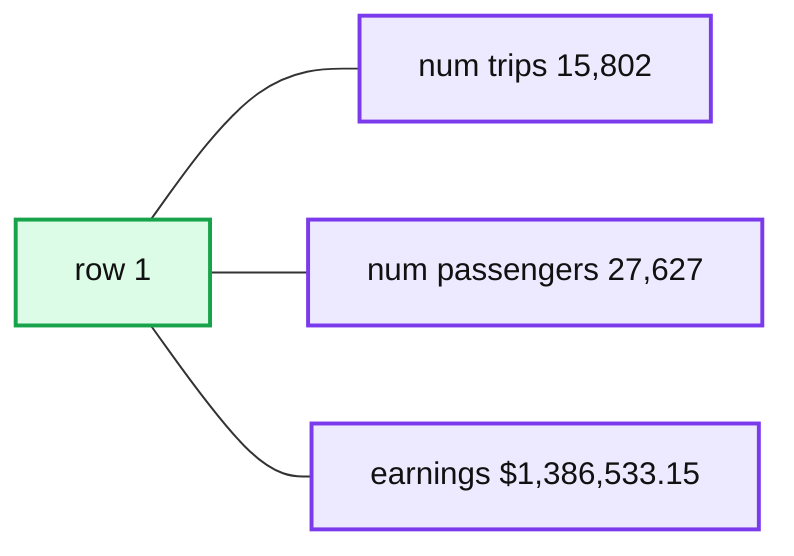

# Announcing Built-in H3 Expressions for Geospatial Processing and Analytics

- Source: https://www.databricks.com/blog/announcing-built-h3-expressions-geospatial-processing-and-analytics
- Published: 2022-09-14
- Authors: Kent Marten, Menelaos Karavelas, Michael Johns
- Categories: engineering, data-engineering
- Images: 8 total, 2 extracted as architecture

For working with geospatial data, see this post from Databricks announcing support for Spatial SQL: [Introducing Spatial SQL in Databricks: 80+ Functions for High-Performance Geospatial Analytics](https://www.databricks.com/blog/introducing-spatial-sql-databricks-80-functions-high-performance-geospatial-analytics)

The 11.2 Databricks Runtime is a milestone release for Databricks and for customers processing and analyzing geospatial data. The 11.2 release introduces 28 built-in H3 expressions for efficient geospatial processing and analytics that are generally available (GA). This blog covers what H3 is, what advantages it offers over traditional geospatial data processing, and how to get started using H3 on Databricks. Ultimately, with H3, you can easily convert spatial data from common formats like WKT, WKB, Lat/Lon, and GeoJSON to H3 cell IDs that allow you to spatially aggregate, spatially join, and visualize data in an efficient manner.

## What is H3?

For those of you that are new to H3, here is a brief description.

H3 is a global grid indexing system and a library of the same name. It was originally developed by Uber for the purpose of visualizing and exploring spatial data patterns. Grid systems use a shape, like rectangles or triangles, to tessellate a surface (in this case, the Earth's surface). Hierarchical grid systems provide these tessellations at different resolutions (the basic shapes come in different sizes). The H3 system was designed to use hexagons (and a few pentagons), and as a hierarchical system, allows you to work with 16 different resolutions. Indexing your data at a given resolution, will generate one or more H3 cell IDs that are used for analysis. For example, an H3 cell at resolution 15 covers approximately 1m2 (see [here](https://h3geo.org/docs/core-library/restable) for details about the different H3 resolutions).

For detailed expositions on the H3 global grid indexing system and library, read [here](https://www.uber.com/blog/h3/) and [here](https://h3geo.org/docs/).

## H3 Is Commonly Used

H3 is used for geospatial data processing across a wide range of industries because the pattern of use is broadly applicable and highly-scalable. Not surprisingly, a system built by Uber, is widely used in the development of autonomous vehicle systems, and anywhere IoT devices are generating massive amounts of spatio-temporal data. H3 is also commonly used to build location-based data products or uncover insights based on mobility (human, fleet, etc.) supporting operations in retail planning, transportation and delivery, agriculture, telecom, and insurance. This is not an exhaustive list of how H3 is used.

## Why Use H3?

H3 is a system that allows you to make sense of vast amounts of data. For example, with a large NYC taxi pick-up and drop-off dataset, you can spatially aggregate the data to better understand spatial patterns. Look at over 1B overlapping data points and there is no way to determine a pattern, use H3 and patterns are immediately revealed and spur further exploration.

Comparing raw data (left) with aggregated data by H3 cell ID (right) to reveal spatial patterns.

H3 cell IDs are also perfect for joining disparate datasets. That is, you can perform a spatial join semantically, without the need of a potentially expensive spatial predicate. It is straightforward to join datasets by cell ID and start answering location-driven questions. Let's continue to use the NYC taxi dataset to further demonstrate solving spatial problems with H3.

First, let us assume that we have ingested the NYC dataset and converted pick-up and drop-off locations to H3 cells at resolution 15 as *trips_h3_15*. Similarly, we have the airport boundaries for LaGuardia and Newark converted to resolution 12 and then compacted them (using our [h3_compact](https://docs.databricks.com/spark/latest/spark-sql/language-manual/functions/h3_compact.html) function) as *airports_h3_c*, which contains an exploded view of the cells for each airport. It is worth noticing that for this data set, the resolution of the H3 compacted cells is 8 or larger, a fact that we exploit below. Now we can answer a question like "where do most taxi pick-ups occur at LaGuardia Airport (LGA)?"

[Analyzing taxi pick-ups at LaGuardia Airport.](https://www.databricks.com/sites/default/files/inline-images/db-304-blog-img-2.png)

We generated the view `*src_airport_trips_h3_c*` for that answer and rendered it with [Kepler.gl](https://kepler.gl/) above with color defined by `*trip_cnt*` and height by `*passenger_sum*`. We used `*h3_toparent*` and `*h3_ischildof*` to associate pick-up and drop-off location cells with the H3 cells defining our airports.

Then we summed and counted attribute values of interest relating to pick-ups for those compacted cells in view `*src_airport_trips_h3_c*` which is the view used to render in Kepler.gl.

H3 cell IDs in Databricks can be stored as big integers or strings. Querying H3 indexed data is most performant when using the big integer representation of cell IDs. These representations can help you further optimize how you store geospatial data. You can leverage Delta Lake's [OPTIMIZE](https://docs.databricks.com/spark/latest/spark-sql/language-manual/delta-optimize.html) operation with Z-ordering to effectively *spatially co-locate* data. Delta Lake, which is fully open-sourced, includes data skipping algorithms that will use co-locality to intelligently reduce the amount of data that needs to be read.

Visualizing H3 cells is also simple. Some of the most common and popular libraries support built-in display of H3 data. Customers might use a [cluster](https://docs.databricks.com/libraries/cluster-libraries.html#cluster-libraries) or [notebook](https://docs.databricks.com/libraries/notebooks-python-libraries.html) attached library such as Kepler.gl (also bundled through [Mosaic](https://databrickslabs.github.io/mosaic/usage/installation.html)) as well as use spatial analytics and visualization integrations such as available through [CARTO](https://carto.com/databricks/spatial-extension/?utm_source=databricks&utm_medium=referral&utm_campaign=H3_launch_blog) using Databricks [ODBC and JDBC Drivers](https://docs.databricks.com/integrations/bi/jdbc-odbc-bi.html#configure-the-databricks-odbc-and-jdbc-drivers). With CARTO, you can connect directly to your Databricks cluster to access and query your data. CARTO's Location Intelligence platform allows for massive scale data visualization and analytics, takes advantage of H3's hierarchical structure to allow dynamic aggregation, and includes a [spatial data catalog](https://carto.com/spatial-data-catalog/?utm_source=databricks&utm_medium=referral&utm_campaign=H3_launch_blog) with H3-indexed datasets. Learn more about using CARTO [here](https://youtu.be/DRnGZkUGRRc?t=738).

*Explore your H3 indexed data from Databricks using CARTO.*

## Get started with H3

In the following walkthrough example, we will be using the NYC Taxi dataset and the boundaries of the Newark and LaGuardia airports. Along the way, we will answer several questions about pick-ups, drop-offs, number of passengers, and fare revenue between the airports.

Let's get started using Databricks' H3 expressions. First, to use H3 expressions, you will need to create a cluster with Photon acceleration. This is simple, just check the box.

[With Use Photon Acceleration turned on, you can use the built-in H3 expressions.](https://www.databricks.com/sites/default/files/inline-images/db-304-blog-img-3.png)

If your Notebook will use the Scala or Python bindings for the H3 SQL expressions, you will need to import the corresponding Databricks SQL function bindings.

To import the Databricks SQL function bindings for Scala do:

To use Databricks SQL function bindings for Python do:

With your data already prepared, index the data you want to work with at a chosen resolution. For areal geographies (polygons and multipolygons) you can use the function `*h3_polyfillash3*`. For indexing locations from latitude and longitude, use the function `*h3_longlatash3*`. In our example, we want our locations and airport boundaries indexed at resolution 12.

You can easily combine your `*airport*` and `*trips*` h3 tables to answer a series of questions about the trip data – using the H3 cell IDs. How many trips happened between the airports? How many passengers were transported? How much fare revenue was generated?

**Summary:** A single-row results table showing trip count, passenger count, and earnings.

**Components:**

- num_trips
- num_passengers
- earnings
- Row 1

**Flows:**

- none

**Numbers:** 1, 15,802, 27,627, $1,386,533.15

source image: https://www.databricks.com/sites/default/files/inline-images/db-304-blog-img-4.png

There are endless questions you could ask and explore with this dataset. H3 allows you to explore geographic data in a new way. What airport sees the most pick-up traffic volume? We find that LaGuardia (LGA) significantly dwarfs Newark (EWR) for pick-ups going between those two specific airports, with over 99% of trips originating from LGA headed to EWR.

source image: https://www.databricks.com/sites/default/files/inline-images/db-304-blog-img-6.png

What are the most common destinations when leaving from LaGuardia (LGA)? We find that there were 25M drop-offs originating from this airport, covering 260 taxi zones in the NYC area. Of those, there were 838K unique H3 cells at resolution 12 involved in the trips; however, through the power of aggregation, we were able to easily calculate the total number of drop-off events per zone and render that back with Kelper.gl with areas in yellow having the highest density.

[Pick-ups from LGA were destined for JFK airport over 250K times, as shown in the tooltip.](https://www.databricks.com/sites/default/files/inline-images/db-304-blog-img-7.png)

Along the way to getting this answer, we joined the `*airports_h3*` table on the `*trips_h3*` table filtered by `*locationid = 132*` which represents LGA and also limited our join to pick-up cells from LGA. This gave us the initial set of 25M trips.

From there, we aggregated trip counts by the unique 838K drop-off H3 cells as the `*lga_agg_dropoffs*` view.

The next main step (shown in notebook [part-2](https://www.databricks.com/wp-content/uploads/notebooks/nb-02_h3_data_analysis_dbr-11.html)) was to join an ingested GeoJSON of the NYC taxi zones on the `lga_agg_dropoffs` view to identify the zone information. A final step (also shown in notebook [part-2](https://www.databricks.com/wp-content/uploads/notebooks/nb-02_h3_data_analysis_dbr-11.html)) was to get a final sum of all `dropoff_cnt` per zone (from each unique H3 cell) for our rendered analysis shown above.

This example blends geospatial processing using the newly available H3 API with powerful existing features of the Databricks Lakehouse to load initial data as well as generate various tables and views with additional columns including aggregates. We were also able to include external libraries such as Kepler.gl for rendering our spatial layers and some convenience functions from Databricks Labs project [Mosaic](https://databrickslabs.github.io/mosaic/index.html), an extension to the Apache Spark framework, offering easy and fast processing of very large geospatial datasets.

## What is available in Databricks?

Let's dive into what is currently available in Databricks for using H3. There are 28 H3-related expressions, covering a number of categorical functions. Here is the full set of expressions available in Databricks Runtime 11.2 by category:

| **Import** | **Conversions** | **Distance related** |
|---|---|---|
| h3_longlatash3 | h3_h3tostring | h3_distance |
| h3_longlatash3string | h3_stringtoh3 | h3_hexring |
| h3_polyfillash3 |  | h3_kring |
| h3_polyfillash3string |  | h3_kringdistances |
| h3_try_polyfillash3 | **Predicates** |  |
| h3_try_polyfillash3string | h3_ischildof | **Traversal** |
|  | h3_ispentagon | h3_resolution |
| **Export** |  | h3_tochildren |
| h3_boundaryasgeojson |  | h3_toparent |
| h3_boundaryaswkb | **Validity** |  |
| h3_boundaryaswkt | h3_isvalid | **Compaction** |
| h3_centerasgeojson | h3_try_validate | h3_compact |
| h3_centeraswkb | h3_validate | h3_uncompact |
| h3_centeraswkt |  |  |

You can use both big integer and string representations for cell IDs, and the representations are the same used by the H3 library. So if you have already indexed your data with H3, you can continue to use your existing cell IDs. We highly recommend that you use the big integer representation for the H3 cell IDs, or, in the case of existing H3 cell string data, convert them to the big integer representation. Converting between the big integer and string representations can be done using the [h3_stringtoh3](https://docs.databricks.com/spark/latest/spark-sql/language-manual/functions/h3_stringtoh3.html) and [h3_h3tostring](https://docs.databricks.com/spark/latest/spark-sql/language-manual/functions/h3_h3tostring.html) expressions. Databricks Runtime 11.2+ includes the H3 library v.3.7.0 as an external dependency. The Databricks implementation of H3 expressions uses the underlying library in many cases, but not exclusively.

All H3 SQL expressions will be available in Databricks SQL in the near future.

To learn more about the H3 SQL expressions in Databricks, refer to the documentation [here](https://docs.databricks.com/spark/latest/spark-sql/language-manual/sql-ref-functions-builtin.html#h3-geospatial-functions) and the notebook series used in this blog – [**part 1 - Data Engineering**](https://www.databricks.com/wp-content/uploads/notebooks/db-304-geospatial-h3/nb-01_h3_data_engineering_dbr11-2.html) **|** [**part 2 - Analysis**](https://www.databricks.com/wp-content/uploads/notebooks/nb-02_h3_data_analysis_dbr-11.html) **|** [**Helper**](https://www.databricks.com/wp-content/uploads/notebooks/mosaic_helpers.py.html).
