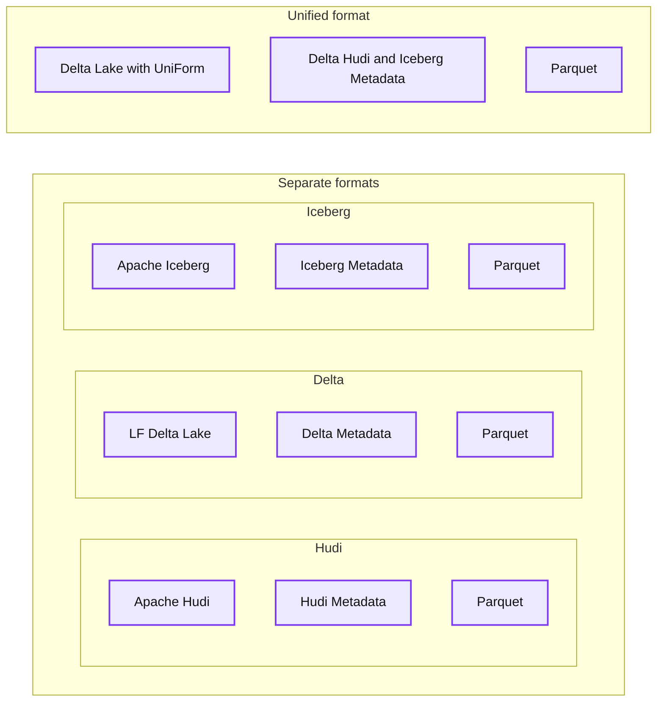
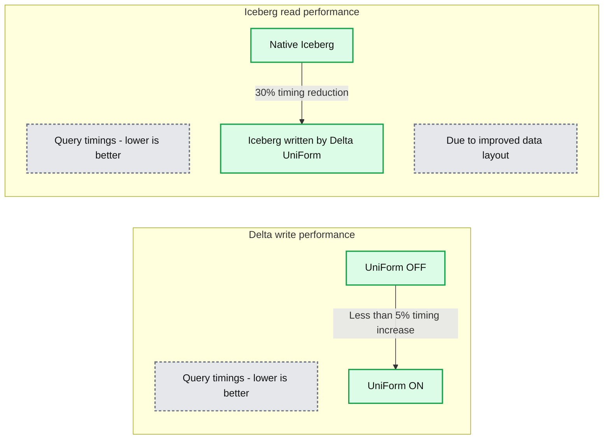
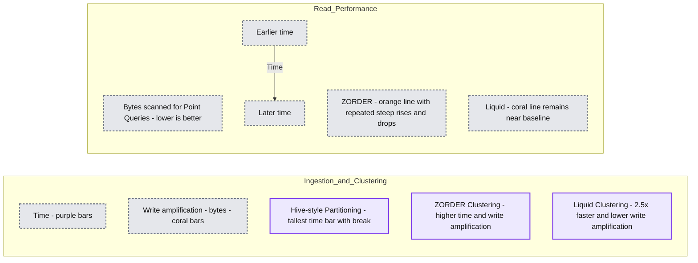
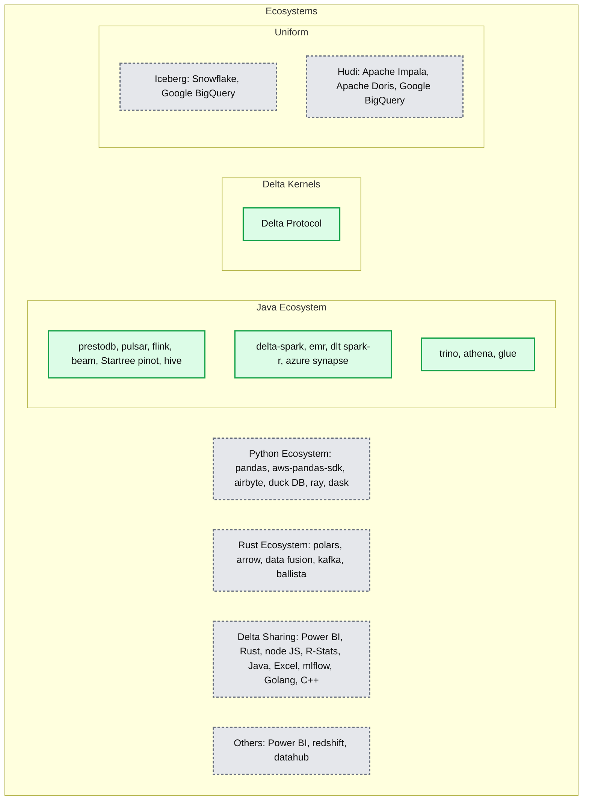

# Announcing Delta Lake 3.0 with New Universal Format and Liquid Clustering

*Delta Lake is the universal storage format that unifies analytics and AI on all your data  *

- Source: https://www.databricks.com/blog/announcing-delta-lake-30-new-universal-format-and-liquid-clustering
- Published: 2023-06-29
- Authors: Ryan Johnson, Michael Armbrust, Reynold Xin, Denny Lee, Tathagata Das, Bart Samwel, Terry Kim, Sirui Sun, Himanshu Raja, Rahul Potharaju, Juan Yu, Susan Pierce
- Categories: engineering
- Images: 4 total, 4 extracted as architecture

We are excited to announce Delta Lake 3.0, the next major release of the [Linux Foundation](https://www.linuxfoundation.org/) open source [Delta Lake Project,](https://delta.io/) available in [preview](https://github.com/delta-io/delta/releases/tag/v3.0.0rc1) now. We extend our sincere appreciation to the Delta Lake community for their invaluable contributions to this release. Delta Lake 3.0 introduces the following powerful features:

- **Delta Universal Format (UniForm) **enables reading Delta in the format needed by the application, improving compatibility and expanding the ecosystem. Delta will automatically generate metadata needed for Apache Iceberg or Apache Hudi, so users don’t have to choose or do manual conversions between formats. With UniForm, Delta is the universal format that works across ecosystems.
- **[Delta Kernel](https://github.com/delta-io/delta/tree/master/kernel)** simplifies building Delta connectors by providing simple, narrow programmatic APIs that hide all the complex details of the Delta protocol specification.
- **Liquid Clustering (coming soon) **simplifies getting the best query performance with cost-efficient clustering as the data grows.

In this blog, we’re going to dive into the details of the Delta Lake 3.0 capabilities, through the lens of customer challenges that they solve.

 

**Challenge #1: I like the idea of a data lakehouse but which storage format should I choose?**

Companies are interested in combining their data warehouses and data lakes into an open data lakehouse. This move avoids locking data into proprietary formats, and it enables using the right tool for the right job against a single copy of data. However, they struggle with the decision of whether to standardize on a single open lakehouse format and which one to use. They may have a number of existing data warehouses and data lakes being used by different teams, each with its own preferred data connectors. Customers are concerned that picking a single storage format will lead to its own form of lock-in, and they worry about going through one-way doors. Migration is costly and difficult, so they want to make the right decision up front and only have to do it once. They ultimately want the best performance at the cheapest price for all of their data workloads including ETL, BI, and AI, and the flexibility to consume that data anywhere.

**Solution: Delta UniForm automatically and instantly translates Delta Lake to Iceberg and Hudi.**

Delta Universal Format (UniForm) automatically unifies table formats, without creating additional copies of data or more data silos. Teams that use query engines designed to work with Iceberg or Hudi data will be able to read Delta tables seamlessly, without having to copy data over or convert it. Customers don’t have to choose a single format, because tables written by Delta will be universally accessible by Iceberg and Hudi readers.

**Summary:** Apache Hudi, LF Delta Lake, and Apache Iceberg each layer their own metadata over Parquet, while Delta Lake with UniForm combines metadata for all three formats over one Parquet layer.

**Components:**
- Apache Hudi: Hudi table format with Hudi metadata and Parquet storage.
- LF Delta Lake: Delta Lake table format with Delta metadata and Parquet storage.
- Apache Iceberg: Iceberg table format with Iceberg metadata and Parquet storage.
- Delta Lake with UniForm: Delta Lake with a combined Delta, Hudi, and Iceberg metadata layer.
- Shared Parquet: Parquet storage beneath the UniForm metadata layer.

**Flows:**
- none. No data flow arrows are shown; arrows within the Hudi logos are logo elements.

**Numbers:** none

source image: https://www.databricks.com/sites/default/files/inline-images/image1_5.png?v=1688040865

UniForm takes advantage of the fact that all three open lakehouse formats are thin layers of metadata atop [Parquet](https://parquet.apache.org/) data files. As writes are made, UniForm will incrementally generate this layer of metadata to spec for Hudi, Iceberg and Delta.

**Summary:** UniForm adds less than 5% to Delta write timings and reduces Iceberg read timings by 30% through improved data layout.

**Components:**
- Delta write performance: Delta query timings, with lower being better.
- UniForm OFF: Delta writes with UniForm disabled.
- UniForm ON: Delta writes with UniForm enabled.
- Iceberg read performance: Iceberg query timings, with lower being better.
- Native Iceberg: baseline Iceberg reads.
- Iceberg written by Delta UniForm: reads of Iceberg data written using Delta UniForm.
- Due to improved data layout: explanation for the read performance improvement.

**Flows:**
- UniForm OFF -> UniForm ON: less than 5% increase in write query timing.
- Native Iceberg -> Iceberg written by Delta UniForm: 30% reduction in read query timing, attributed to improved data layout.

**Numbers:**
- <5% write timing increase.
- 30% read timing reduction.
- No absolute timing values or units are shown.

source image: https://www.databricks.com/sites/default/files/inline-images/image3_2.png?v=1688040865

In benchmarking, we’ve seen that UniForm introduces negligible performance and resource overhead. We also saw improved read performance on UniForm-enabled tables relative to native Iceberg tables, thanks to Delta’s improved data layout capabilities like Z-order.

With UniForm, customers can choose Delta with confidence, knowing that by choosing Delta, they’ll have broad support from any tool that supports lakehouse formats.

“Collaboration and innovation in the financial services industry are fueled by the open source community and projects like Legend, Goldman Sachs’ open source data platform that we maintain in partnership with FINOS,” said Neema Raphael, Chief Data Officer and Head of Data Engineering at Goldman Sachs. “We’ve long believed in the importance of open source to technology’s future and are thrilled to see Databricks continue to invest in Delta Lake. Organizations shouldn’t be limited by their choice of an open table format and Universal Format support in Delta Lake will continue to move the entire community forward.”

 

**Challenge #2: Figuring out the right partitioning keys for optimal performance is a Goldilocks Problem**

When building a data lakehouse, it’s hard to come up with a one-size-fits-all partitioning strategy that not only fits the current data query patterns but also adapts to the new workloads over time. Because of the fixed data layout, choosing the right partitioning strategy means teams have to put a lot of careful thought and planning upfront into the partitioning strategy. And despite best efforts, with time, query patterns change, and the initial partitioning strategy becomes inefficient and expensive. Features such as Partition Evolution are somewhat useful in making Hive-style partitioning more flexible but it requires table owners to continuously monitor their tables and “evolve” the partitioning columns. All of these steps add engineering work and are not easy to do for a large segment of users who just want to get insights from their data. And despite best efforts, the distribution of data across partitions can become uneven over time directly impacting read/write performance.

**Solution: Liquid's flexible data layout technique can self-tune to fit your data now and as it grows.**

Liquid Clustering is a smart data management technique for Delta tables. It is flexible and automatically adjusts the data layout based on clustering keys. Liquid Clustering dynamically clusters data based on data patterns, which helps to avoid the over- or under-partitioning problems that can occur with Hive partitioning.

- Liquid is simple: You set Liquid clustering keys on the columns that are most often queried - no more worrying about traditional considerations like column cardinality, partition ordering, or creating artificial columns that act as perfect partitioning keys.
- Liquid is efficient: It incrementally clusters new data, so you don't need to trade off between improving performance with reducing cost/write amplification.
- Liquid is flexible: You can quickly change which columns are clustered by Liquid without rewriting existing data.

**Summary:** Liquid Clustering delivers 2.5x faster clustering than ZORDER with lower write amplification and consistently low bytes scanned for point queries over time.

**Components:**
- Ingestion and Clustering: compares Hive-style Partitioning, ZORDER Clustering, and Liquid Clustering.
- Time: purple bars represent ingestion and clustering time.
- Write amplification in bytes: coral bars compare ZORDER and Liquid.
- Hive-style Partitioning: tallest time bar, shown with an axis break.
- ZORDER Clustering: higher time and write amplification than Liquid.
- Liquid Clustering: shorter time and write amplification bars.
- Read Performance: bytes scanned for point queries, with lower values being better.
- ZORDER: orange line repeatedly rises sharply and drops.
- Liquid: coral line stays near the baseline with small fluctuations.
- Time: horizontal axis for read performance.

**Flows:**
- Earlier time -> Later time: the right-pointing horizontal axis indicates elapsed time in the read performance chart. No component-to-component flows are shown.

**Numbers:** 2.5x faster; bytes for write amplification and bytes scanned. No numeric axis values are visible.

source image: https://www.databricks.com/sites/default/files/inline-images/image2_3.png?v=1688040865

To test the performance of Liquid, we ran a benchmark of a typical 1 TB data warehouse workload. Liquid Clustering resulted in **2.5x faster clustering** relative to Z-order. In the same trial, traditional Hive-style partitioning was an order of magnitude slower due to the expensive shuffle required for writing out many partitions. Liquid also incrementally clusters new data as it is ingested, paving the way for consistently fast read performance.

 

**Challenge #3: Deciding which connector to prioritize is tricky for integrators.**

The connector ecosystem for Delta is large and growing to meet the rapid adoption of the format. As engine integrators and developers build connectors for open source storage formats, they have a decision to make about which format to prioritize first. They have to balance the maintenance time and costs against engineering resources because every new protocol specification requires new code.

**Solution: Kernel unifies the connector ecosystem.**

[Delta Kernel](https://github.com/delta-io/delta/tree/master/kernel) is a new initiative that will provide simplified, narrow and stable programmatic APIs that hide all the complex Delta protocol details. With Kernel, connector developers will have access to all new Delta features by updating the Kernel version itself, not a single line of code. For end users, this means faster access to the latest Delta innovations across the ecosystem.

Together with UniForm, Kernel further unifies the connector ecosystem, because Delta will write out metadata for Iceberg and Hudi automatically. For engine integrators, this means that when you build once for Delta, you build for everyone.

**Summary:** Delta Protocol sits inside Delta Kernels, surrounded by Java, Python, Rust, Delta Sharing, and other integrations, with UniForm connecting the Iceberg and Hudi ecosystem sectors.

**Components:**
- Delta Protocol: central Delta technology.
- Delta Kernels: surrounding integration layer.
- Java Ecosystem: prestodb, pulsar, flink, beam, Startree using pinot, and hive.
- Java connector group: delta-spark, emr, dlt using spark-r, and azure synapse.
- Java query connector group: trino, athena, and glue.
- Python Ecosystem: pandas, aws-pandas-sdk, airbyte, duck DB, ray, and dask.
- Rust Ecosystem: polars, arrow, data fusion, kafka, and ballista.
- Uniform: sector adjoining Delta Protocol and the Iceberg and Hudi sectors.
- Iceberg: Snowflake and Google BigQuery integrations.
- Hudi: Apache Impala, Apache Doris, and Google BigQuery integrations.
- Delta Sharing: Power BI, Rust, node JS, R-Stats, Java, Excel, mlflow, Golang, and C++.
- Others: Power BI, redshift, and datahub.

**Flows:**
- none. The image uses nested regions and sectors without directional arrows.

**Numbers:** none

source image: https://www.databricks.com/sites/default/files/inline-images/image4_2.png?v=1688040865

The [preview](https://github.com/delta-io/delta/releases/tag/v3.0.0rc1) release candidate for Delta Lake 3.0 is available today. Databricks customers can also preview these features in Delta Lake with DBR version 13.2 or the next preview channel of DBSQL coming soon.

 

**Interested in participating in the open source Delta Lake community?**

Visit [Delta Lake](https://github.com/delta-io/delta) to learn more; you can join the Delta Lake community via [Slack](https://go.delta.io/slack) and [Google Group.](https://groups.google.com/forum/#!forum/delta-users) If you’re interested in contributing to the project, see the list of open issues [here.](https://github.com/delta-io/delta/issues?q=is%3Aissue+is%3Aopen+)

A big thank you to the following contributors for making this release available to the community:

Ahir Reddy, Ala Luszczak, Alex, Allen Reese, Allison Portis, Antoine Amend, Bart Samwel, Boyang Jerry Peng, CabbageCollector, Carmen Kwan, Christos Stavrakakis, Denny Lee, Desmond Cheong, Eric Ogren, Felipe Pessoto, Fred Liu, Fredrik Klauss, Gerhard Brueckl, Gopi Krishna Madabhushi, Grzegorz Kołakowski, Herivelton Andreassa, Jackie Zhang, Jiaheng Tang, Johan Lasperas, Junyong Lee, K.I. (Dennis) Jung, Kam Cheung Ting, Krzysztof Chmielewski, Lars Kroll, Lin Ma, Luca Menichetti, Lukas Rupprecht, Ming DAI, Mohamed Zait, Ole Sasse, Olivier Nouguier, Pablo Flores, Paddy Xu, Patrick Pichler, Paweł Kubit, Prakhar Jain, Ryan Johnson, Sabir Akhadov, Satya Valluri, Scott Sandre, Shixiong Zhu, Siying Dong, Son, Tathagata Das, Terry Kim, Tom van Bussel, Venki Korukanti, Wenchen Fan, Yann Byron, Yaohua Zhao, Yuhong Chen, Yuming Wang, Yuya Ebihara, aokolnychyi, gurunath, jintao shen, maryannxue, noelo, panbingkun, windpiger, wwang-talend
