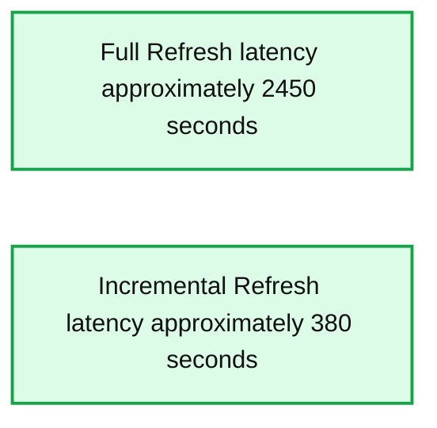
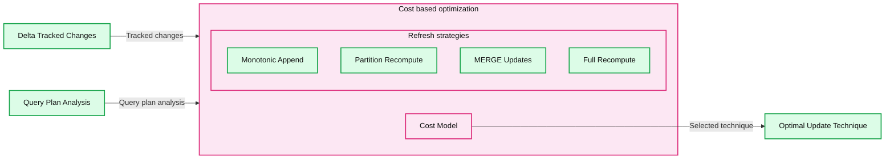

# Announcing the General Availability of Materialized Views and Streaming Tables for Databricks SQL

*Simple, fast and efficient ingestion and transformation for Databricks SQL, now GA on AWS and Azure*

- Source: https://www.databricks.com/blog/announcing-general-availability-materialized-views-and-streaming-tables-databricks-sql
- Published: 2024-11-05
- Authors: Paul Lappas, Michael Armbrust, Md Enzam Hossain, Meixian Li, Michael Lu, Eun-Gyu Kim, Ritwik Yadav
- Categories: engineering
- Images: 3 total, 2 extracted as architecture

We’re excited to announce that [materialized views](https://docs.databricks.com/en/views/materialized.html) (MVs) and [streaming tables](https://docs.databricks.com/en/tables/streaming.html) (STs) are now Generally Available in Databricks SQL on AWS and Azure. Streaming tables offer simple, incremental ingestion from sources like cloud storage and message buses with just a few lines of SQL. Materialized views precompute and incrementally update the results of queries so your dashboards and queries can run significantly faster than before. Together, they allow you to create efficient and scalable data pipelines from ingestion to transformation using just SQL.

In this blog, we’ll dive into how these tools empower analysts and analytics engineers to deliver data and analytics applications more effectively within the DBSQL warehouse. Plus, we’ll cover new capabilities of MVs and STs that enhance monitoring, error troubleshooting, and cost tracking.

## Challenges faced by data warehouse users

Data warehouses are the primary location for analytics and internal reporting through business intelligence (BI) applications. SQL analysts must efficiently ingest and transform large data sets, ensure fast query performance for real-time analytics, and manage the balance between quick data access and cost controls. They face several challenges in achieving these goals:

- **Slow end-user queries and dashboards:** Large BI dashboards process complex views of big datasets, leading to slow queries that hinder interactivity and increase costs due to repeated data reprocessing.
- **Improving data freshness while keeping costs down:** Precomputing results can reduce query latency but often leads to stale data and high costs, requiring complex incremental processing to maintain fresh data at a reasonable cost.
- **Self-service:** Traditional SQL pipelines rely on complex manual coding, slowing down responses to business needs.

## Materialized views and streaming tables give you fast, fresh data

MVs and STs solve these challenges by combining the ease of views with the speed of precomputed data, thanks to the power of automatic end-to-end incremental processing. This lets engineers deliver fast queries without needing to write complex code, while ensuring the data is as up-to-date as the business requires.

**Fast queries and dashboards with MVs**
 Materialized Views (MVs) enhance the performance of SQL analytics and BI dashboards by pre-computing and storing query results in advance, significantly reducing query latency. Instead of repeatedly querying the base tables, MVs allow dashboards and end-user queries to retrieve pre-aggregated or pre-joined data, making them much faster. Additionally, querying MVs is more cost-effective compared to views, as only the data stored in the MV is accessed, avoiding the overhead of reprocessing the underlying base tables for every query.

**Move to real-time use cases while keeping costs low**
 STs and MVs work together to create fully incremental data pipelines, ideal for real-time use cases. STs continuously ingest and process streaming data, ensuring BI dashboards, machine learning models, and operational systems always have the most up-to-date information. MVs, on the other hand, automatically refresh incrementally as new data arrives, keeping data fresh for users without manual input, while also reducing processing costs by avoiding full view rebuilds. Combining STs and MVs provides the best cost-performance balance for real-time analytics and reporting.

MVs with incremental refresh can also save significant time and money. In our [internal benchmarks](https://github.com/databricks/delta-live-tables-notebooks/tree/main/dlt-serverless-benchmarks) on a 200 billion-row table, MV refreshes were 98% cheaper and 85% faster than refreshing the whole table, resulting in ~7x better data freshness at 1/50th of the cost of a similar CREATE TABLE AS statement.

*MVs can be updated 85% faster than a similar CREATE TABLE AS statement*

**Summary:** Full Refresh has a refresh latency of approximately 2,450 seconds versus approximately 380 seconds for Incremental Refresh, with lower latency being better.

**Components:**
- Refresh Latency: measured in seconds; lower is better.
- Full Refresh: benchmark category; technology unspecified.
- Incremental Refresh: benchmark category; technology unspecified.

**Flows:**
- none

**Numbers:**
- Vertical axis in seconds: 0, 500, 1000, 1500, 2000, 2500, 3000.
- Approximate bar heights: Full Refresh 2,450 seconds; Incremental Refresh 380 seconds. Exact values are not labeled.

source image: https://www.databricks.com/sites/default/files/inline-images/streaming-tables-sql-blog-img-1.png

MVs can be updated 85% faster than a similar CREATE TABLE AS statement

**Empower your analysts to build data pipelines in DBSQL**
 Using MVs and STs to develop data pipelines automates much of the manual work involved in managing tables and DML code, freeing analytics engineers to focus on business logic and delivering greater value to the organization with a simple SQL syntax. STs further simplify data ingestion from various sources, like cloud storage and message buses, by eliminating the need for complex configurations.

> Utilizing Materialized Views effectively on top of transaction tables has resulted in a drastic improvement in query performance on analytical layer, with the query time decreasing up to 85% on a 500 million fact table. This enables our Business team to consume analytical dashboards more efficiently and make quicker decisions based on the insights gained from the data. —Shiv Nayak / Head of Data and AI Architecture, EasyJet

> We've significantly reduced the time needed to handle large volumes using Databricks materialized views. This enhancement has cut our runtime by 85%, enabling our team to work more efficiently and focus on machine learning and business intelligence insights. The simplified process supports more significant data volumes and contributes to overall cost savings and increased project agility. —Sam Adams, Senior Machine Learning Engineer, Paylocity

> “The conversion to Materialized Views has resulted in a drastic improvement in query performance… Plus, the added cost savings have really helped.” —Karthik Venkatesan, Security Software Engineering Sr. Manager, Adobe

> “We’ve seen query performances improve by 98% with some of our tables that have several terabytes of data.” —Gal Doron, Head of Data, AnyClip

> “Utilizing Materialized Views on top of Transaction tables has drastically improved query performance on our analytical layer, with the execution time decreasing up to 85% on a 500 million fact table.” —Nikita Raje, Director Data Engineering, DigiCert

### Example: Ingest and transform data from a volume in Databricks

A common use case for STs and MVs is ingesting and transforming data continuously as it arrives in a cloud storage bucket. The following example shows how you can do this entirely in SQL without the need for any external configuration or orchestration. We will create one streaming table to land data into the lakehouse, and then create a materialized view to count the number of rows ingested.

1. Create ST to ingest data from a volume once an hour. The streaming table ensures exactly-once delivery of new data. And because STs use serverless background compute for data processing, they will automatically scale to handle spikes in data volume.

1. Create MV to transform data every hour. The MV will always reflect the results of the query it is defined with, and will be incrementally refreshed when possible.

## New capabilities

Since the preview launch, we’ve enhanced the Catalog Explorer for MVs and STs, enabling you to access real-time status and refresh schedules. Additionally, MVs now support the CREATE OR REPLACE functionality, allowing in-place updates. MVs also offer expanded incremental refresh capabilities across a broader range of queries, including new support for inner joins, left joins, UNION ALL, and window functions. Let’s dive deeper into these new features:

### Observability

We have enhanced the catalog explorer with contextual, real-time information about the status and schedule of MVs and STs.

1. **Current refresh status:** Shows the exact time that the MV or ST was last refreshed. This is a good signal for how fresh the data is.
2. **Refresh schedule:** If your materialized view is configured to refresh automatically on a [time-based schedule](https://docs.databricks.com/en/sql/language-manual/sql-ref-syntax-ddl-create-materialized-view.html), the catalog explorer now shows the schedule in an easy-to-read format. This lets your end users easily see the freshness of the MV.

## Easier scheduling and management

We’ve introduced EVERY syntax for scheduling MV and ST refreshes using DDL,. EVERY simplifies the configuration of time-based schedules without needing to write CRON syntax. We will continue to support CRON scheduling for users that require the expressiveness of that syntax.

Example:

Additionally, we've added support for **CREATE OR REPLACE** for materialized views, enabling easier updates to their definitions in-place without the need to drop and recreate while preserving existing permissions and ACLs.

## Incrementally refresh left joins, inner joins, and window functions

*MVs will automatically pick the best refresh strategy based on the query plan.*

**Summary:** Materialized view refresh uses Delta tracked changes and query plan analysis to select an optimal update technique through cost based optimization.

**Components:**
- Incremental Refresh for MVs: materialized view refresh with cost based optimization.
- Delta Tracked Changes: Delta change tracking.
- Query Plan Analysis: query plan analysis for refresh selection.
- Monotonic Append: candidate refresh technique.
- Partition Recompute: candidate refresh technique.
- MERGE Updates: candidate refresh technique using MERGE.
- Full Recompute: candidate refresh technique.
- Cost Model: evaluates refresh strategies.
- Optimal Update Technique: selected refresh technique.

**Flows:**
- Delta Tracked Changes -> Refresh strategies and Cost Model: tracked changes feed the shared selection path.
- Query Plan Analysis -> Refresh strategies and Cost Model: query analysis feeds the shared selection path.
- Cost Model -> Optimal Update Technique: selected update technique.

**Numbers:** none

source image: https://www.databricks.com/sites/default/files/inline-images/streaming-tables-sql-blog-img-3.png

MVs will automatically pick the best refresh strategy based on the query plan.

Recomputing large MVs can be costly and slow. MVs solve this by incrementally computing updates, leading to lower costs and quicker refreshes. This gives you improved data freshness at a fraction of the cost, while allowing your end users to query pre-computed data. MVs are incrementally refreshed in DBSQL Pro and serverless warehouses, or Delta Live Tables (DLT) pipelines.

MVs are automatically incrementally refreshed if their queries support it. If a query includes unsupported expressions, a full refresh will be done instead. An incremental refresh processes only the changes since the last update, then adds or updates the data in the table.

MVs support incremental refresh for inner joins, left joins, UNION ALL and window functions (OVER). You can specify any number of tables in the join, and updates to all tables in the join are reflected in the results of the query. We are continuously adding support for more query types; please see the [documentation](https://docs.databricks.com/en/optimizations/incremental-refresh.html) for the latest capabilities.

## Cost attribution

You are now able to see identity information for refreshes in the billable usage system table. To get this information, simply submit a query to the billable usage system table for records where usage_metadata.dlt_pipeline_id is set to the ID of the pipeline associated with the materialized view or streaming table. You can find the pipeline ID in the Details tab in Catalog Explorer when viewing the materialized view or streaming table. For more information, see our [documentation](https://docs.databricks.com/en/admin/system-tables/billing.html#what-is-the-dbu-consumption-of-a-materialized-view-or-streaming-table).

The following query provides an example:

## What’s coming for MVs and STs

MVs and STs are powerful data warehousing capabilities that build on the best of data warehousing in DBSQL. Over 1,400 customers are already using them to power incremental ingestion and refresh. We are also very excited about how we’ll be making MVs and STs even better in the near future. Here’s a preview of some of those upcoming features:

- **Refresh based on upstream data changes.** You will be able to configure automatic refreshes based on upstream data changes, while being able to manage costs by controlling how quickly a refresh happens after an update.
- Modify **owner** and run as a **service principal**
- Ability to modify MV and ST **comments** directly in the Catalog Explorer.
- **MV/ST consolidated monitoring in the UI.** See all of your MVs and STs in the Databricks UI, so you can easily monitor health and operational information for the entire workspace.
- **Cost monitoring.** The MV and ST name will be included in the billing systems table so you can more easily monitor DBU usage, identify data, and refresh history without needing to lookup the pipeline ID.
- **Delta Sharing:** [Available now in private preview](https://www.databricks.com/resources/other/request-access-databricks-delta-sharing-materialized-views-and-streaming-tables)
- **Google Cloud support:** Coming soon!

## Get started with MVs and STs today

To get started today:

- Enable serverless compute in your account on [AWS](https://docs.databricks.com/en/admin/workspace-settings/serverless.html) or [Azure](https://learn.microsoft.com/en-us/azure/databricks/admin/workspace-settings/serverless)
- Make sure your workspace is [enabled to use Unity Catalog](https://docs.databricks.com/en/data-governance/unity-catalog/enable-workspaces.html) and in a [supported region](https://docs.databricks.com/en/resources/supported-regions.html)
- Follow the specific instructions to get started with [materialized views](https://docs.databricks.com/en/sql/language-manual/sql-ref-syntax-ddl-create-materialized-view.html) and [streaming tables](https://docs.databricks.com/en/sql/language-manual/sql-ref-syntax-ddl-create-streaming-table.html)
