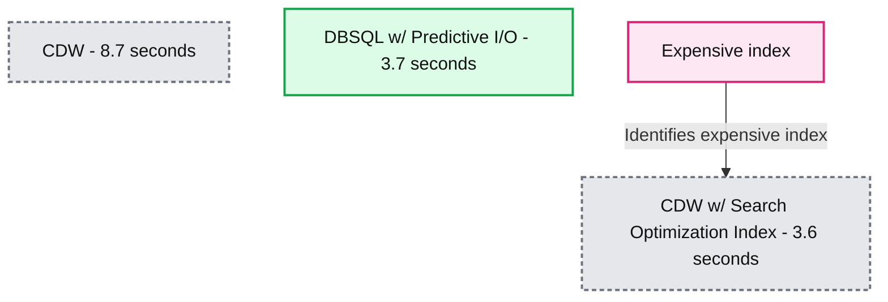
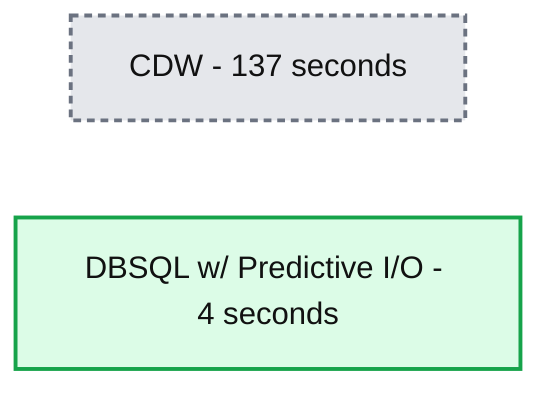

# Announcing the General Availability of Predictive I/O for Reads

*Databricks Lakehouse uses ML to power faster and cheaper point queries*

- Source: https://www.databricks.com/blog/announcing-general-availability-predictive-io-reads.html
- Published: 2023-04-25
- Authors: Shoumik Palkar, Justin Breese, Shant Hovsepian, Kent Marten, Cyrielle Simeone
- Categories: platform, product, data-warehousing
- Images: 2 total, 2 extracted as architecture

Today, we are excited to announce the general availability of Predictive I/O for [Databricks SQL (DB SQL)](https://www.databricks.com/product/databricks-sql): a machine learning powered feature to make your point lookups faster and cheaper. Predictive I/O leverages the years of experience Databricks has in building large AI/ML systems to make the Lakehouse the smartest data warehouse with no additional indexes and no expensive background services. In fact, for point lookups, Predictive I/O gives you all the benefits of indexes and optimization services, but without the complexity and cost of maintaining them. **Predictive I/O is on by default in DB SQL Pro and Serverless and works with no added cost.**

## What are point lookups and why are they so expensive?

A selective query or a point lookup, seeks to return a small or single result from a large dataset, common in BI and Analytics use cases. Sometimes referred to as a "needle-in-the-haystack" query, making these queries **fast *while keeping costs low* is hard**.

It's hard because in order to make your point lookups fast on a cloud data warehouse (CDW), you'll have to create an *index* or use an additional *optimization service*. Further, these options are knobs, meaning that each approach requires understanding how and when to use, before enabling.

Indexes are time-consuming and expensive because:

- You need to figure out which column(s) to index on
- You have to maintain the index, deciding when to rebuild and paying for each rebuild
- You need to think this process for each table, for each use case
- You have to beware write amplification
- If the usage pattern changes, you will need to rebuild the index

Optimization services are expensive because:

- You need to determine which tables you need to enable it on
- You need to pay for running the service in the background as the table changes
- You need to think through this process for each table

In summary, CDW's indexes and optimization services for point lookups are expensive. Given all the considerations required, these options are complex knobs that take time and money to tune. There has to be a better way.

## The Benefits of Predictive I/O

Now imagine this… What if you didn't have to make a copy of the data? What if there was no need for expensive indexes or search optimization services? What if the system could learn which data is needed for your queries and anticipate what you'll need next? What if your queries were simply fast without knobs?

What if Databricks can stop the never-ending loop of DBA grief and replace it with an intelligent system that allows you to get back to simplicity? This is where Predictive I/O enters the chat. Let's look at two examples of Predictive I/O performance out-of-the-box.

First, let's compare Databricks SQL Serverless performance against a Cloud Data Warehouse (CDW) for a point lookup. In the case below, after loading a dataset into the CDW, it takes 8.7 seconds to query. If that's not fast enough for you, you can use an expensive optimization service and get the time down to 3.6 seconds. But remember: you're paying for this. Every time your table changes, the optimization service will have to run maintenance operations. Or, as a much easier and less expensive alternative, just load and query your data in the Lakehouse in 3.7 seconds thanks to Predictive I/O!

*Selective query performance comparison between a cloud data warehouse (CDW), a CDW with expensive Search Optimization Index, and Databricks SQL Serverless with Predictive I/O*

**Summary:** Selective queries take 8.7 seconds on CDW, 3.6 seconds on CDW with Search Optimization Index, and 3.7 seconds on DBSQL with Predictive I/O, with lower times being better.

**Components:**
- CDW: cloud data warehouse.
- CDW w/ Search Optimization Index: cloud data warehouse using Search Optimization Index.
- DBSQL w/ Predictive I/O: Databricks SQL using Predictive I/O.
- Expensive index: cost annotation pointing to CDW with Search Optimization Index.

**Flows:**
- Expensive index -> CDW w/ Search Optimization Index: annotation identifying the expensive index.

**Numbers:**
- CDW: 8.7 seconds.
- CDW w/ Search Optimization Index: 3.6 seconds.
- DBSQL w/ Predictive I/O: 3.7 seconds.

source image: https://www.databricks.com/sites/default/files/inline-images/db-413-blog-image-1_0.png

Selective query performance comparison between a cloud data warehouse (CDW), a CDW with expensive Search Optimization Index, and Databricks SQL Serverless with Predictive I/O

Next, let's look at a real world workload from an early customer of Predictive I/O. The process was simple - load the data into Databricks and then run a selective query. Predictive I/O was 35x faster than the CDW for this customer's use case. Again, no knobs needed for great performance.

*A customer saw 35x faster performance with Predictive I/O on Databricks SQL compared to their Cloud Data Warehouse*

**Summary:** Selective query performance compares CDW at 137 seconds with DBSQL using Predictive I/O at 4 seconds, with lower times being better.

**Components:**
- CDW: Cloud Data Warehouse.
- DBSQL w/ Predictive I/O: Databricks SQL using Predictive I/O.

**Flows:**
- None. No arrows are shown.

**Numbers:**
- CDW: 137 seconds.
- DBSQL w/ Predictive I/O: 4 seconds.

source image: https://www.databricks.com/sites/default/files/inline-images/db-413-blog-image-2_1.png

A customer saw 35x faster performance with Predictive I/O on Databricks SQL compared to their Cloud Data Warehouse

### That sounds great! But how does Predictive I/O work?

For Delta Lake and Parquet tables, Predictive I/O uses various forms of machine learning and machine intelligence such as heuristics, modeling, and predicting scan performance based on file properties to enable and disable various optimizations intelligently. The overall goal was simple: accelerate the performance of selective queries and save our customers time and money.

Using the characteristics of the query, we decide how many resources need to be allocated in order to optimally execute the query.

## What's next?

Predictive I/O represents a performance improvement milestone for our customers. Given how common selective queries are in analytics, we are excited to keep innovating in this space. Stay tuned (no pun intended) for the next wave of performance features coming soon, ensuring our customers continue to have best-in-class price-performance and making the Lakehouse the best data warehouse.

If you're an existing customer, you can get started with Predictive I/O today. Simply setup a [Databricks SQL Serverless warehouse](https://docs.databricks.com/sql/admin/serverless.html) for the best experience, and just start querying your data.
