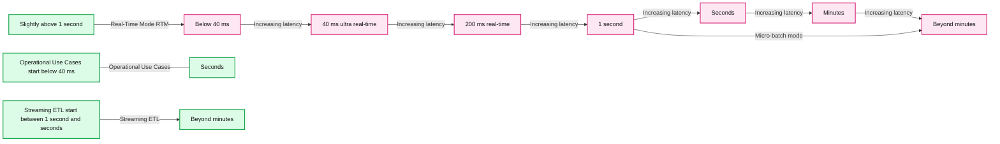
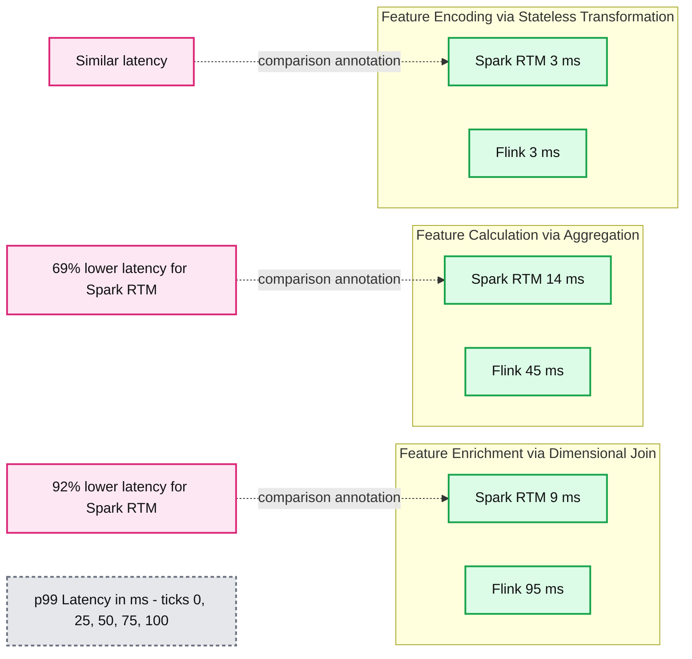

# Announcing General Availability of Real-Time Mode for Apache Spark Structured Streaming on Databricks

*Power your most time-critical workloads, from fraud detection to personalization, with sub-second latency*

- Source: https://www.databricks.com/blog/announcing-general-availability-real-time-mode-apache-spark-structured-streaming-databricks
- Published: 2026-03-19
- Authors: Navneeth Nair, Giselle Goicochea
- Categories: announcements, data-engineering, customers
- Images: 2 total, 2 extracted as architecture

**Key takeaways**

- Sub-second latency on Spark: Real-Time Mode (RTM) in Apache Spark Structured Streaming is now Generally Available, bringing end-to-end millisecond performance to familiar Spark APIs and eliminating the need for another specialized engine, such as Apache Flink.
- Architectural innovation: RTM achieves sub-100ms processing speeds through three innovations: continuous data flow, pipeline scheduling, and streaming shuffle.
- Proven at scale: Industry leaders like Coinbase, DraftKings, and MakeMyTrip are using RTM to power mission-critical operational use cases, with some achieving an 80%+ reduction in latency.

For years, Apache Spark Structured Streaming has powered some of the world’s most demanding streaming workloads. However, for ultra-low latency use cases, teams needed to maintain separate, specialized engines — most commonly Apache Flink, alongside Spark, duplicating codebases, governance models, and operational overhead. Now, Databricks removes this burden for customers. 

Today, we are excited to announce the **General Availability of Real-Time Mode (RTM) in Spark Structured Streaming**, bringing millisecond-level latency to the Spark APIs you already use. Be it detecting fraud in real-time, or generating fresh, real-time context to steer your AI agents, you can now use Spark to power all of these use cases.

## Powering industry-leading customers and use cases

RTM has already been adopted by teams at industry-leading organizations across financial services, e-commerce, media, and ad tech to power fraud detection, live personalization, ML feature computation, and ad attribution.

**Coinbase**, one of the world’s leading cryptocurrency exchanges, uses RTM to scale their high-frequency risk management and fraud detection engines—processing massive volumes of blockchain and exchange events with the sub-100ms latency necessary to secure millions of digital asset transactions.

> By leveraging Real-Time Mode in Spark Structured Streaming, we’ve achieved an 80%+ reduction in end-to-end latencies, hitting sub-100ms P99s, and streamlining our real-time ML strategy at massive scale. This performance allows us to compute over 250 ML features all powered by a unified Spark engine.”—Daniel Zhou, Senior Staff Machine Learning Platform Engineer, Coinbase

**DraftKings**, one of North America's largest sportsbook and fantasy sports platforms, uses real-time mode to power feature computation for their fraud detection models — processing high-throughput betting event streams with the latency and reliability required for real-money wagering decisions.

> ​​In live sports betting, fraud detection demands extreme velocity. The introduction of Real-Time Mode together with the transformWithState API in Spark Structured Streaming has been a game changer for us. We achieved substantial improvements in both latency and pipeline design, and for the first time, built unified feature pipelines for ML training and online inference, achieving ultra-low latencies that were simply not possible earlier.”—Maria Marinova, Sr. Lead Software Engineer, DraftKings

**MakeMyTrip**, one of India’s leading online travel platform for hotels, flights, and experiences, adopted Real-Time Mode to power personalized search experiences. RTM processed high-volume traveler searches to deliver real-time recommendations.

> In travel search, every millisecond counts. By leveraging Spark Real-Time Mode (RTM), we delivered personalized experiences with sub-50ms P50 latencies, driving a 7% uplift in click-through rates. RTM has also transformed our data operations, enabling a unified architecture where Spark handles everything from high-throughput ETL to ultra-low-latency pipelines. As we move into the era of AI agents, steering them effectively requires building real-time context from data streams. We are experimenting with Spark RTM to supply our agents with the richest, most recent context necessary to take the best possible decisions.” —Aditya Kumar, Associate Director of Engineering, MakeMyTrip

RTM can support any workload that benefits from turning data into decisions in milliseconds. Some example use cases include:

- **Personalized experiences in retail and media: **An OTT streaming provider updates content recommendations immediately after a user finishes watching a show. A leading e-commerce platform recalculates product offers as customers browse - keeping engagement high with sub-second feedback loops.
- **IoT monitoring: **A transport and logistics company ingests live telemetry to drive anomaly detection, moving from reactive to proactive decision-making in milliseconds.
- **Fraud detection: **A global bank processes credit card transactions from Kafka in real time and flags suspicious activity, all within 200 milliseconds - reducing risk and response time without replatforming.

## What Is Real-Time Mode (RTM)?

RTM is an evolution of the Spark Structured Streaming engine that enables it to achieve sub-second performance in benchmarking demanding feature engineering customer workloads. 

Structured Streaming’s default microbatch mode (MBM) is like an airport shuttle bus that waits for a certain number of passengers to board before departing. On the other hand, RTM operates like a high-speed moving walkway, eliminating the limitation to wait for the shuttle bus to fill up. RTM processes each event as it arrives, providing end-to-end millisecond latency without leaving the Spark ecosystem. 

**Summary:** The latency spectrum positions Real-Time Mode at millisecond latencies and micro-batch mode from one second onward, alongside operational use cases and streaming ETL.

**Components:**

- Latency Spectrum: latency axis from ultra real-time through minutes.
- Operational Use Cases: green range extending from below 40 ms to seconds; technology unspecified.
- Streaming ETL: green range starting between one second and seconds, extending beyond minutes; technology unspecified.
- Micro-batch mode: red range starting at one second and extending beyond minutes.
- Real-Time Mode (RTM): red range extending from slightly above one second toward latencies below 40 ms.

**Flows:**

- Lower latency -> Higher latency: axis points toward increasing latency.
- Streaming ETL start -> Beyond minutes: supported latency range points right.
- One second -> Beyond minutes: micro-batch mode latency range points right.
- Slightly above one second -> Below 40 ms: RTM latency range points left.
- Operational use cases has circular endpoints rather than arrowheads, spanning below 40 ms through seconds.

**Numbers:** 40 ms ultra real-time; 200 ms real-time; 1 second; Seconds; Minutes.

source image: https://www.databricks.com/sites/default/files/inline-images/blog-RTM-GA-latency-spectrum.png

**From seconds to milliseconds:** RTM transforms the Spark engine by replacing periodic batching with a continuous data flow, eliminating the latency bottlenecks of traditional ETL.

RTM’s performance gains come from three key architectural innovations:

- **Continuous data flow: **Data is processed as it arrives instead of discretized, periodic chunks.
- **Pipeline scheduling:** Stages run simultaneously without blocking, allowing downstream tasks to process data immediately without waiting for upstream stages to finish.
- **Streaming shuffle: **Data is passed between tasks immediately, bypassing the latency bottlenecks of traditional disk-based shuffles.

Together, they transform Spark into a high-performance, low-latency engine capable of handling the most demanding operational use cases.

## Spark RTM: Up to 92% faster than Flink, enabling teams to operate less infrastructure, move faster

In order to validate the performance of Spark RTM, we benchmarked the performance against a popular specialized engine, Apache Flink based on actual customer workloads performing feature computation. These feature computation patterns are representative of most low-latency ETL use cases, such as fraud detection, personalization, and operational analytics.When comparing Spark RTM with Flink, the results demonstrate that Spark's evolved architecture provides a latency profile comparable to specialized streaming frameworks. For more information, on the data sets and queries referenced, [see this GitHub repository](https://github.com/databricks-solutions/latency-benchmarks).

**Summary:** Apache Spark Real-Time Mode and Apache Flink are compared on p99 latency for feature enrichment, calculation, and encoding.

**Components:**
- Spark RTM: Apache Spark Real-Time Mode, represented by green bars.
- Flink: Apache Flink, represented by dark teal bars.
- Feature Enrichment: dimensional join, compared across Spark RTM and Flink.
- Feature Calculation: aggregation, compared across Spark RTM and Flink.
- Feature Encoding: stateless transformation, compared across Spark RTM and Flink.
- Latency callouts: two percentage reductions and one similar-latency comparison.
- Horizontal axis: p99 latency in milliseconds.

**Flows:**
- 92% lower latency callout -> Spark RTM feature enrichment bar: dashed comparison annotation.
- 69% lower latency callout -> Spark RTM feature calculation bar: dashed comparison annotation.
- Similar latency callout -> Spark RTM feature encoding bar: dashed comparison annotation.

**Numbers:**
- Feature enrichment: Spark RTM 9 ms; Flink 95 ms; callout states 92% lower latency for Spark RTM.
- Feature calculation: Spark RTM 14 ms; Flink 45 ms; callout states 69% lower latency for Spark RTM.
- Feature encoding: Spark RTM 3 ms; Flink 3 ms.
- Axis: p99 latency in ms; ticks at 0, 25, 50, 75, and 100.

source image: https://www.databricks.com/sites/default/files/inline-images/2026-02-RTM-blog-1200x628_1.png

**One engine, up to 92% faster:** RTM outpaces specialized engines like Flink, proving that millisecond-level operational analytics no longer requires a separate streaming engine. *Source: Internal benchmarks based on customer feature computation patterns. Full queries available on GitHub.*

While raw speed matters, Spark RTM’s greatest advantage over engines like Flink is the simplicity it offers builders. It allows teams to use the same Spark API for both batch training and real-time inference, effectively eliminating "logic drift" and codebase duplication. Spark RTM enables seamless scalability, where a single-line code change can shift a pipeline from hourly batches to sub-second streaming without manual infrastructure tuning. Ultimately, by reducing operational complexity and the need for multiple specialized systems, teams can develop and deploy real-time applications significantly faster with Spark RTM.

## Getting started with Spark RTM

Getting up and running with RTM is straightforward. If you’re already using Structured Streaming, you can enable it with a single configuration update - no rewrites required.

### Step 1: Configure your cluster

RTM is currently available on Classic compute, across both Dedicated and Standard access modes. RTM is supported on Databricks Runtime (DBR) 16.4 and above; however,we recommend DBR 18.1 for the latest features and optimizations. During cluster creation, add the following Spark configuration:

### Step 2: Use the new Real-Time Trigger in your streaming query

## What’s New with Spark RTM

Since launching in [Public Preview in August 2025](https://www.databricks.com/blog/introducing-real-time-mode-apache-sparktm-structured-streaming), Databricks has continued to expand RTM’s capabilities, based on customer feedback. 

Here is what's new with this GA release:

- **OSS support in **[**Apache Spark 4.1**](https://spark.apache.org/releases/spark-release-4.1.0.html#other-notable-changes)** (stateless transformations):** RTM for stateless transformations is now available in open-source Apache Spark 4.1. Teams building on OSS Spark can take advantage of real-time mode for projection, filtering, and UDF-based pipelines.
- **Standard access mode support**: RTM now works on both [dedicated and standard access modes](https://docs.databricks.com/aws/en/compute/use-compute#what-are-compute-access-modes) in classic compute in Python, giving teams more flexibility in how they utilize compute resources across streaming workloads.
- **Async state checkpointing and progress tracking:** State and query progress checkpointing are now performed asynchronously, decoupled from the event processing critical path. This improves the latency of real-time mode for stateless and stateful pipelines.
- **Initial state load in ****transformWithState****:** transformWithState is a powerful Spark Structured Streaming operator for building custom stateful logic. Users can now load the initial state from the checkpoint of a pre-existing query or from a delta table when using transformWithState with Real-Time Mode. This capability is critical for stateful feature engineering, allowing you to pre-populate online queries with historical context without "starting from zero."
- **Enhanced metrics and observability for UDFs**: More accurate latency metrics for Python UDF execution surfaced through StreamingQueryProgress listener.
- **Performance enhancements for Python Stateful UDFs:** Added optimizations to improve the performance of stateful operations in Python transformWithState, specifically for RTM queries. 

## Conclusion

RTM extends Apache Spark Structured Streaming into a new class of workloads — operational, latency-sensitive applications that demand immediate response to streaming data. By bringing sub-second latency to the Spark APIs your team already uses, it eliminates the need to operate a separate specialized engine for your most time-critical pipelines Whether you're building fraud detection pipelines, personalization engines, or ML feature computation systems, real-time mode gives you the latency your application demands with the simplicity and ecosystem breadth of Spark.

## Technical Resources

Check out the following resources to get started with RTM today:

- [Documentation: Real-time mode in Structured Streaming](https://docs.databricks.com/aws/en/structured-streaming/real-time)
- On-demand video: [Getting started with Real-Time Mode](https://vimeo.com/1174513082/6c07e6cb46)
- Blog: [How to Achieve Real-Time Fraud Detection: Configuring Spark RTM with Databricks Lakebase](https://community.databricks.com/t5/technical-blog/fraud-detection-feature-engineering-with-structured-streaming/ba-p/151308)
- Code examples: [Real-time mode examples](https://docs.databricks.com/gcp/en/structured-streaming/real-time-examples)
- On-demand Webinar: [Real-Time Mode Technical Deep Dive](https://www.databricks.com/dataaisummit/session/real-time-mode-technical-deep-dive-how-we-built-sub-300-millisecond)
