# Announcing Hybrid Search General Availability in Databricks AI Search

- Source: https://www.databricks.com/blog/announcing-hybrid-search-general-availability-mosaic-ai-vector-search
- Published: 2024-08-26
- Authors: Sergei Tsarev, Erik Lindgren
- Categories: product, data-science-machine-learning, databricks-ai
- Images: 1 total, 1 extracted as architecture

We're excited to announce the general availability of hybrid search in Databricks AI Search. Hybrid search is a powerful feature that combines the strengths of pre-trained embedding models with the flexibility of keyword search. In this blog post, we'll explain why hybrid search is important, how it works, and how you can use it to improve your search results.

### Why Hybrid Search?

Pre-trained embedding models are a powerful way to represent unstructured data, capturing semantic meaning in a compressed and easily searchable format. However it was trained using external data and doesn’t have explicit knowledge of your data. Hybrid search adds a learned keyword search index on top of your vector search index. The keyword search index is trained on your data, and thus has knowledge of the names, product keys, and other identifiers that are important for your retrieval situation.

### When to Choose Hybrid Search

Hybrid search can perform better when there are critical keywords in your dataset that would not be present in publicly available embedding model training datasets. For example, if the question refers to specific product codes or other terms that you want to match exactly, hybrid search may be the better choice. We encourage you to try both options to see what works best for your problem set.

### Using Hybrid Search in Databricks AI Search

It is easy to get started with hybrid search. All indices have access to hybrid search now with no additional setup required.

The keyword index is trained on all text fields in your corpus, so it automatically has access to both the text chunk as well as all text metadata fields.

For fully-managed Delta Sync indices you can simply add `query_type=’hybrid’` to your similarity search queries. This also works for Direct Vector Access indices with a model serving endpoint attached.

For self-managed Delta Sync indices and Direct Vector Access indices without a model serving endpoint attach, you will need to make sure both `query_vector` and `query_text` are specified.

### Quality Improvements

In Retrieval-Augmented Generator (RAG) applications, one critical metric is recall, the fraction of time we retrieve the chunk containing the answer to the input query in the top `num_results` retrieved chunks. We see that hybrid search is able to improve recall, and thus reduce the number of chunks needed to be processed by the LLM to answer the user’s question.

On an internal dataset designed to represent the types of datasets we see from our customers, we see significant improvements in recall. In particular, the number of documents needed to achieve a recall of 0.9 is 50 for pure dense retrieval and 40 for hybrid search, a 20% improvement. This reduces the latency and processing cost for RAG applications.

We include a plot below of recall at various values of the number of results retrieved. We see that hybrid search does as good or better than pure dense retrieval on all choices for the number of retrieved results.

**Summary:** Hybrid search achieves higher recall than vector search and keyword search across the displayed result counts.

**Components:**
- Vector Search: blue dotted series representing vector retrieval.
- Keyword Search: red dotted series representing keyword retrieval.
- Hybrid Search: yellow dotted series representing hybrid retrieval.
- Recall: vertical axis measuring correct-answer retrieval.
- Num Results: horizontal axis measuring retrieved result count.

**Flows:**
- none. Dotted lines connect measurements, with no arrows.

**Numbers:**
- Horizontal axis ticks: 10, 20, 30, 40, 50 results.
- Vertical axis ticks: 0.75, 0.80, 0.85, 0.90, 0.95 recall.
- Approximate plotted values, read from marker positions:

| Num Results | Vector Search | Keyword Search | Hybrid Search |
|---|---|---|---|
| 5 | 0.771 | Below visible range | 0.783 |
| 10 | 0.821 | 0.771 | 0.840 |
| 20 | 0.864 | 0.818 | 0.878 |
| 30 | 0.882 | 0.838 | 0.893 |
| 40 | 0.892 | 0.853 | 0.906 |
| 50 | 0.901 | 0.864 | 0.914 |

```mermaid
%% Recall retrieving correct answer by search method and result count
flowchart TD
    T[Recall Retrieving Correct Answer]
    X[Num Results ticks 10 20 30 40 50]
    Y[Recall ticks 0.75 0.80 0.85 0.90 0.95]
    V[Vector Search blue dotted series<br/>Approximate recall at 5 10 20 30 40 50 results<br/>0.771 0.821 0.864 0.882 0.892 0.901]
    K[Keyword Search red dotted series<br/>Approximate recall at 10 20 30 40 50 results<br/>0.771 0.818 0.838 0.853 0.864]
    H[Hybrid Search yellow dotted series<br/>Approximate recall at 5 10 20 30 40 50 results<br/>0.783 0.840 0.878 0.893 0.906 0.914]

    classDef client fill:#dbeafe,stroke:#2563eb,stroke-width:2px,color:#111
    classDef service fill:#dcfce7,stroke:#16a34a,stroke-width:2px,color:#111
    classDef store fill:#ede9fe,stroke:#7c3aed,stroke-width:2px,color:#111
    classDef cache fill:#fef3c7,stroke:#d97706,stroke-width:2px,color:#111
    classDef queue fill:#cffafe,stroke:#0891b2,stroke-width:2px,color:#111
    classDef critical fill:#fee2e2,stroke:#dc2626,stroke-width:4px,color:#111
    classDef external fill:#e5e7eb,stroke:#6b7280,stroke-width:2px,color:#111,stroke-dasharray:4 3
    classDef decision fill:#fce7f3,stroke:#db2777,stroke-width:2px,color:#111
    class T,X,Y external
    class V client
    class K critical
    class H cache
```

source image: https://www.databricks.com/sites/default/files/inline-images/image1_32.png?v=1724696369

### Method Used

Our implementation of hybrid search is based on [Rank Reciprocal Fusion (RRF)](https://dl.acm.org/doi/abs/10.1145/1571941.1572114) of the vector search and keyword search results. The parameters of RRF are tuned to values that should return high quality results for most datasets.

Scores are normalized so the highest score possible is 1.0. This makes it easy to identify when documents are believed to be high value by both the vector searcher and keyword searcher. Scores close to 1.0 mean that both retrievers found the document to be of high relevance. Scores close to 0.5 and below mean one or both of the retrievers believe the document has low relevance.

### Next Steps

Get started today with hybrid search! For fully-managed Delta Sync (DSYNC) indices and direct vector access indices with a model serving endpoint:

For self-managed DSYNC indices and direct vector access indices without a model serving endpoint:

Note that the keyword index automatically uses all text fields in your index, so these need to be provided when constructing the index.

For more information, see our documentation on Hybrid Search:

- [Similarity Search calculation details with hybrid search](https://docs.databricks.com/en/generative-ai/vector-search.html#similarity-search-calculation)
- [Python SDK for similarity_search](https://docs.databricks.com/en/generative-ai/vector-search.html#similarity-search-calculation)
