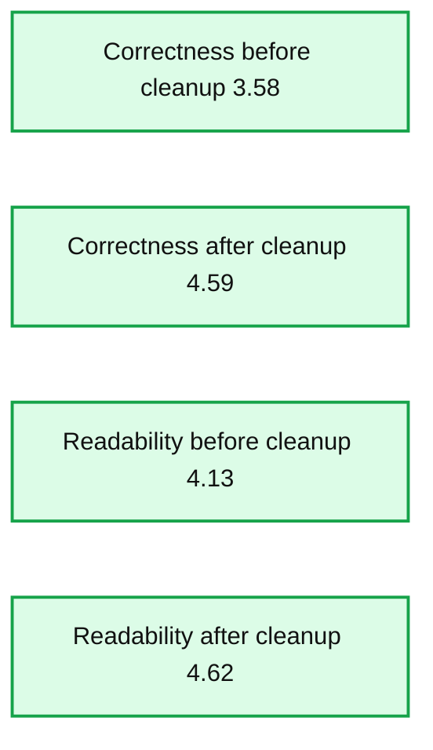
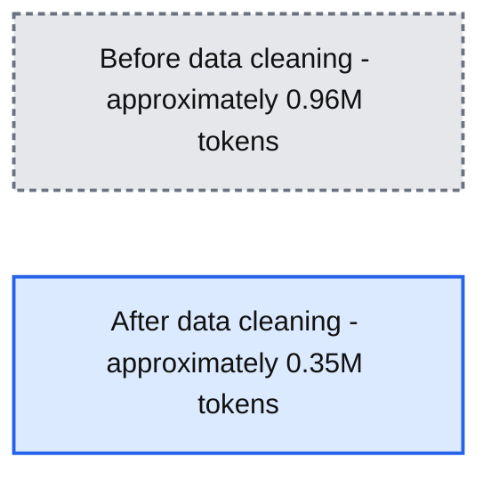

# Announcing MLflow 2.8 LLM-as-a-judge metrics and Best Practices for LLM Evaluation of RAG Applications, Part 2

- Source: https://www.databricks.com/blog/announcing-mlflow-28-llm-judge-metrics-and-best-practices-llm-evaluation-rag-applications-part
- Published: 2023-10-31
- Authors: Quinn Leng, Kasey Uhlenhuth, Alkis Polyzotis, Abe Omorogbe, Sunish Sheth
- Categories: engineering, data-science-machine-learning
- Images: 7 total, 2 extracted as architecture

Today we're excited to announce [MLflow 2.8](https://www.mlflow.org/docs/2.8.0/index.html) supports our LLM-as-a-judge metrics which can help save time and costs while providing an approximation of human-judged metrics. In our [previous report](https://www.databricks.com/blog/LLM-auto-eval-best-practices-RAG), we discussed a case study of how the LLM-as-a-judge technique helped us boost efficiency, cut costs, and maintain over 80% consistency with human scores in the [Databricks Documentation AI Assistant](https://docs.databricks.com/), resulting in significant savings in time (from 2 weeks with human workforce to 30 minutes with LLM judges) and costs (from $20 per task to $0.20 per task). We have also followed up our [previous report](https://www.databricks.com/blog/LLM-auto-eval-best-practices-RAG) on best practices for LLM-as-a-judge evaluation of RAG (Retrieval Augmented Generation) applications with a Part 2 below. We will walk through how you can apply a similar methodology, in combination with data cleaning, to evaluate and tune the performance of your own RAG applications. As with the previous report, LLM-as-a-judge is one promising tool in the suite of evaluation techniques necessary to measure the efficacy of LLM-based applications. In many situations, we think it represents a sweet-spot: it can evaluate unstructured outputs (like a response from a chat-bot) automatically, rapidly, and at low-cost. In this sense, we consider it a worthy companion to human evaluation, which is slower and more expensive but represents the gold standard of model evaluation.

Your use of a third party LLM service (e.g., OpenAI) for evaluation may be subject to and governed by the LLM service's terms of use.

## MLflow 2.8: Automated Evaluation

The LLM community has been exploring the use of "LLMs as a judge" for automated evaluation and we applied their [theory](https://arxiv.org/abs/2306.05685) to [production projects](https://www.databricks.com/blog/LLM-auto-eval-best-practices-RAG). We found you can save significant costs and time if you use automated evaluation with state-of-the-art LLMs, like the GPT, MPT, and Llama2 model families, with a single evaluation example for each criterion. MLflow 2.8 introduces a powerful and customizable framework for LLM evaluation. We've extended the [MLflow Evaluation API](https://mlflow.org/docs/latest/models.html#evaluating-with-llms) to support GenAI metrics and evaluation examples. You get out-of-the-box metrics like toxicity, latency, tokens and more, alongside some GenAI metrics that use GPT-4 as the default judge, like faithfulness, answer_correctness, and answer_similarity. Custom metrics can always be added in MLflow, even for GenAI metrics. Let's see MLflow 2.8 in practice with some examples!

When creating a custom GenAI metric with the LLM-as-a-judge technique, you have to choose which LLM you want as a judge, provide a grading scale, and give an example for each grade in the scale. Here is an example of how to define a GenAI metric for `Professionalism` in MLflow 2.8:

Similar to what we saw in our previous report, evaluation examples (the `examples` list in the snippet above) can help with the accuracy of the LLM-judged metric. MLflow 2.8 makes it easy to define an EvaluationExample:

We know there are common metrics that you need so MLflow 2.8 supports some GenAI metrics out-of-the-box. By telling us what `model_type` your application is, e.g., "question-answering", the MLflow Evaluate API will automatically generate common GenAI metrics for you. You can add "extra" metrics as well, like we do with "Answer Relevance" in the following example:

To further refine performance, you can also alter the judge model and prompt for these out-of-the-box GenAI metrics. Below is a screenshot of the MLflow UI that helps you quickly compare GenAI metrics visually in the Evaluation tab:

You can also view results in the corresponding eval_results_table.json or load them as a Pandas dataframe for further analysis.

## Applying LLM Evaluation to RAG Applications: Part 2

In the next round of our investigations, we revisited our production application of the [Databricks Documentation AI Assistant](https://docs.databricks.com/) to see if we could improve performance by improving the quality of the input data. From this investigation, we developed a workflow to automatically cleanup data that achieved higher correctness and readability of chatbot answers as well as reduced the number of tokens to reduce cost and and improve speed.

### Data cleaning for effective auto-evaluation for RAG Applications

We explored the impact of data quality on chatbot response performance as well as various data cleaning techniques to improve performance. We believe these finding generalize and can help your team effectively evaluate RAG-based chatbots:

- Data cleaning improved the correctness of the LLM generated answers by up to **+20%** (from 3.58 to 4.59 for grading scale 1~5)
- An unexpected benefit of data cleaning is that it can lower costs by needing fewer tokens. Data cleaning reduced the number of tokens for the context by up to **-64%** (from 965538 tokens in the indexed data to 348542 tokens after cleaning)
- Different LLMs behave better with different data cleaning code

**Summary:** MPT 7B Chat Model scores improve after cleanup, with correctness increasing from 3.58 to 4.59 and readability from 4.13 to 4.62.

**Components:**
- Correctness Before Cleanup: MPT 7B Chat Model, gray bar.
- Correctness After Cleanup: MPT 7B Chat Model, blue bar.
- Readability Before Cleanup: MPT 7B Chat Model, gray bar.
- Readability After Cleanup: MPT 7B Chat Model, blue bar.

**Flows:**
- none. No arrows are visible.

**Numbers:**
- Model designation: MPT 7B.
- Correctness before cleanup: 3.58.
- Correctness after cleanup: 4.59.
- Readability before cleanup: 4.13.
- Readability after cleanup: 4.62.
- Vertical axis ticks: 0, 1, 2, 3, 4.



<sub>source image: https://www.databricks.com/sites/default/files/inline-images/db-791-blog-img-3.png</sub>

**Summary:** Data cleaning reduces the token count from approximately 0.96 million to 0.35 million.

**Components:**
- Before data cleaning: gray bar labeled before cleanup; technology unspecified.
- After data cleaning: blue bar labeled after cleanup; technology unspecified.

**Flows:**
- none; no arrows are visible.

**Numbers:** Vertical axis token counts: 0, 0.2M, 0.4M, 0.6M, 0.8M, 1M. Bar heights are approximately 0.96M before cleanup and 0.35M after cleanup; exact values are not printed.



<sub>source image: https://www.databricks.com/sites/default/files/inline-images/db-791-blog-img-4.png</sub>

### Data challenges with RAG applications

There are [various input data types](https://gpt-index.readthedocs.io/en/v0.6.3/reference/readers.html) for RAG applications: website pages, PDF, Google Doc, Wiki pages etc. The most frequently used data types we've seen from industry and from our customers are websites and PDFs. Our Databricks Document AI Assistant uses the official Databricks documentation, Knowledge Base, and Spark documentation pages as its data sources. While documentation websites are human-readable, the format may be hard for an LLM to understand. Below is an example:

 

| Rendered for Human | Rendered for LLM |
|---|---|
|  |  |

Here the Markdown format and code snippet language options provide an easy-to-understand UI for presenting corresponding examples for each language. However, once this UI is converted into solely Markdown format for an LLM, the content gets converted into multiple repeating code blocks making it hard to understand. As a result, when we asked mpt-7b-chat the question "How do you configure a different default catalog name?" given the context, it provides answer as "``` ``` ``` ``` ``` ``` ``` ``` ``` ``` ``` ``` ``` ``` ``` ``` ``` ``` ``` ``` ``` ``` ``` ``` ``` ``` ``` ``` ``` ``` ``` ``` ``` ``` ``` ``` ``` ``` ``` ```", which is the repetition of the code block symbol. In other cases, the LLM fails to follow the instructions and starts to repeat the questions. Similarly, a webpage might contain various icons, images, and special symbols to be utilized by the browser for rendering a better UI, which also confuses LLMs. Note, an alternative approach is to change the prompt to ignore the formatting markup. However, we expect to further tune the prompt for the particular application, and we'd rather avoid making it overly complicated and introducing instability.

### Data cleaning improves performance

We wrote a quick workflow that leveraged LLM-as-judge and iteratively figured out [the cleanup code](https://gist.github.com/suanmiao/7b1d82dfb94d457a8d521f3cc35613f5) to remove extraneous formatting tokens from Markdown files and webpages. Below is an example of what a single document looks like before and after cleanup, illustrating that the document retains both its structure and meaning:

You can also clearly see that document cleanup can dramatically reduce the number of tokens used in an LLM context window, saving costs and time. After data cleaning, we saw improvements in the answer from MPT-7B-Chat:

| Question | Answer before cleaning | Answer after cleaning |
|---|---|---|
| What is the syntax to create a schema using Spark SQL? | ``` ``` ``` ``` ``` ``` ``` ``` ``` ``` ``` ``` ``` ``` ``` ``` ``` ``` ``` ``` ``` ``` ``` ``` ``` ``` ``` ``` ``` ``` ``` ``` ``` ``` ``` ``` ``` ``` ``` ``` | To create a schema using Spark SQL, you can use the following syntax: CREATE SCHEMA [schema_name] You can specify the location of the schema using the LOCATION clause, and you can also provide a de… |
| What are the common Results per Object for S3, ADLS Gen2, and GCS storage? | What are the common Results per Object for S3, ADLS Gen2, and GCS storage? ``` ``` ``` ``` ``` ``` ``` ``` ``` ``` ``` ``` ``` ``` ``` ``` ``` ``` ``` ``` ``` ``` ``` ``` ``` | The common Results per Object for S3, ADLS Gen2, and GCS storage are: 1 (base directory) 365 (per day) 24 hours) 8761 This is the total number of API calls object storage that will be made per day, ba… |
| How do you pin a persona to the sidebar? | Thank you for your help! | To pin a persona to the sidebar, you can click on the persona icon below the Databricks logo, select the desired persona, and click the "Pin persona" button. This will ensure that the selected person… |
| What APIs are available in Databricks? | answer answer: There are three SQL warehouse types available in Databricks: Serverless, Pro, and Classic. The default SQL warehouse type is Pro, but it can be set to Serverless or Classic using | There are several APIs available in Databricks for data warehousing, including the SQL warehouse API, the queries API, the visualizations API, and the dashboards API. These APIs provide a range of fu… |

## Try MLflow 2.8 today for auto-evaluation

In Part 2 of our analysis, we used MLflow 2.8 to evaluate RAG applications with LLM-as-a-judge. Now with data cleaning and auto-evaluation, you can quickly and efficiently compare and contrast various LLMs to navigate through your RAG application requirements. Some resources to help you get started:

- [MLflow 2.8 Documentation](https://www.mlflow.org/docs/2.8.0/index.html)
- [Tutorial for MLflow Evaluation for RAG](https://www.mlflow.org/docs/2.8.0/llms/llm-evaluate/notebooks/rag-evaluation.html)
- [Tutorial for MLflow Evaluation for Q&A](https://www.mlflow.org/docs/2.8.0/llms/llm-evaluate/notebooks/question-answering-evaluation.html)
- [Evaluating RAG applications with LLM-as-a-judge metrics, Part 1](https://www.databricks.com/blog/LLM-auto-eval-best-practices-RAG)
- [Data cleaning code sample (gist)](https://gist.github.com/suanmiao/7b1d82dfb94d457a8d521f3cc35613f5)
