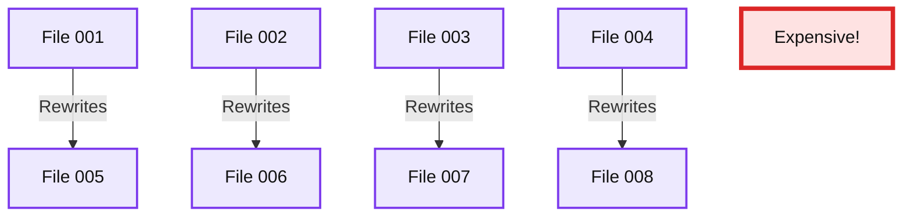
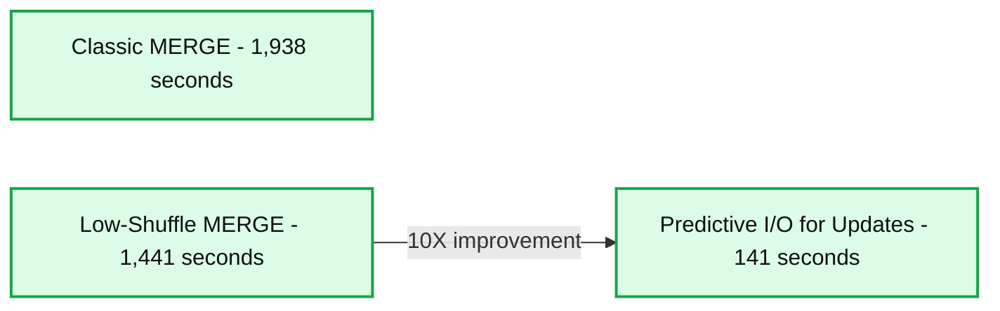

# Announcing the Public Preview of Predictive I/O for Updates

*Up to 10x Performance Gains for MERGE, UPDATE, and DELETE*

- Source: https://www.databricks.com/blog/announcing-public-preview-predictive-io-updates
- Published: 2023-04-25
- Authors: Piyush Revuri, Bart Samwel, Ala Luszczak, Lars Kroll, Polo-François Poli, Frank Munz, Himanshu Raja
- Categories: platform, product, data-warehousing
- Images: 2 total, 2 extracted as architecture

Previously, we’ve shown you how a new technology called [Predictive I/O](https://www.databricks.com/blog/announcing-general-availability-predictive-io-reads.html) could improve selective reads by up to 35x for CDW customers without any knobs. Today, we are excited to announce the public preview of another innovative leap, Predictive I/O for Updates, providing you with up to 10x faster MERGE, UPDATE, and DELETE query performance.

Databricks customers process over 1 exabyte of data daily, with more than 50% of tables utilizing Data Manipulation Language (DML) operations like MERGE, UPDATE, and DELETE. In this blog, we explain how Predictive I/O achieved this massive performance improvement using machine learning. But, if you want to skip to the good part and opt-in your tables to Predictive I/O for Updates, refer to our [documentation](https://docs.databricks.com/optimizations/predictive-io.html#updates).

## Challenges with updating data lakes

Today, when users run a MERGE, UPDATE, or DELETE operation in the Lakehouse, the queries are processed by the query engine in the following manner:

1. Find the files that contain the rows needing modification.
2. Copy and rewrite all unmodified rows to a new file while filtering out deleted rows and adding updated ones.

This process, especially the rewrite step, can get particularly expensive when operations make small updates distributed across many files in the table. For example, a single product ID gets updated across an entire orders table. In the illustrated example below, a table is stored as four files with a million rows each, and a user runs an UPDATE query against this table, only updating a single row in each file. Without Predictive I/O, the update query rewrites all four files, copying all four million unmodified rows to a new file to update four rows in the table. This unnecessary rewriting of old data can become expensive and slow for medium to large tables.

*Figure 1: UPDATE operation resulting in the expensive rewrite of unaffected data in new files.*

**Summary:** Updating highlighted portions of four files causes expensive rewrites into four new files, including unaffected data.

**Components:**
- File 001: Original data file with a highlighted update region; storage technology unspecified.
- File 002: Original data file with a highlighted update region; storage technology unspecified.
- File 003: Original data file with a highlighted update region; storage technology unspecified.
- File 004: Original data file with a highlighted update region; storage technology unspecified.
- File 005: Rewritten data file; storage technology unspecified.
- File 006: Rewritten data file; storage technology unspecified.
- File 007: Rewritten data file; storage technology unspecified.
- File 008: Rewritten data file; storage technology unspecified.
- Rewrites: Label identifying the file rewrite operation.
- Expensive!: Label identifying the cost of rewriting files.

**Flows:**
- File 001 -> File 005: Rewrite data into a new file.
- File 002 -> File 006: Rewrite data into a new file.
- File 003 -> File 007: Rewrite data into a new file.
- File 004 -> File 008: Rewrite data into a new file.

**Numbers:** File identifiers 001, 002, 003, 004, 005, 006, 007, 008. No quantities or units shown.

source image: https://www.databricks.com/sites/default/files/inline-images/db-505-blog-img-1.png

Figure 1: UPDATE operation resulting in the expensive rewrite of unaffected data in new files.

### Introducing Predictive I/O for Updates

To address these challenges, we are introducing Predictive I/O for Updates.

Last year, we [announced Low-Shuffle MERGE](https://www.databricks.com/blog/2022/10/17/faster-merge-performance-low-shuffle-merge-and-photon.html), a Photon feature that speeds up typical MERGE workloads by 1.5x. Low-Shuffle MERGE is enabled by default for all MERGEs in Databricks Runtime 10.4+ and Databricks SQL. Now let's see how Predictive I/O for Updates stacks up against Low-Shuffle MERGE. Using a MERGE UPSERT workload that updates a 3 TB TPC-DS dataset, we measured the classic Photon MERGE implementation, Low-Shuffle MERGE, and Predictive I/O for Updates in a benchmark. The results were amazing! Predictive I/O for Updates took just over 141 seconds to complete the MERGE workload, 10x faster than Low-Shuffle MERGE, which took over 1441 seconds to complete the same operation.

*Figure 2: Predictive I/O for Updates makes MERGE up to 10x faster than LSM*

**Summary:** Predictive I/O for Updates reduces MERGE duration to 141 seconds compared with 1,441 seconds for Low-Shuffle MERGE and 1,938 seconds for Classic MERGE.

**Components:**
- Classic MERGE: baseline MERGE implementation.
- Low-Shuffle MERGE: MERGE implementation using low-shuffle processing.
- Predictive I/O for Updates: MERGE implementation using Predictive I/O.
- Merge duration performance: duration in seconds; lower is better.
- 10X: highlighted performance improvement.

**Flows:**
- Low-Shuffle MERGE -> Predictive I/O for Updates: arrow highlights a 10X improvement in MERGE duration.

**Numbers:**
- Classic MERGE: 1,938 seconds.
- Low-Shuffle MERGE: 1,441 seconds.
- Predictive I/O for Updates: 141 seconds.
- Performance improvement: 10X.

source image: https://www.databricks.com/sites/default/files/inline-images/db-505-blog-img-2.png

Figure 2: Predictive I/O for Updates makes MERGE up to 10x faster than LSM

### That's amazing! How does Predictive I/O for Updates work?

Predictive I/O for Updates makes use of [Deletion Vectors](https://github.com/delta-io/delta/blob/master/PROTOCOL.md#deletion-vector-files) to track deleted rows using compressed bitmap files. Tracking deleted files, rather than removing them on write, adds some overhead when reading the table, as attaining an accurate table representation requires filtering deleted rows at read time. This is where Predictive I/O's intelligence comes into play. Predictive I/O uses various forms of learning and heuristics to intelligently apply Deletion Vectors as needed to your MERGE, UPDATE, and DELETE queries to minimize read overhead while optimizing write performance. This intelligence, paired with the optimized nature of Deletion Vector files gives you the best write performance without any compromises on read query performance.

## Getting Started with Predictive I/O for Updates

Are your ETL pipelines or CDC ingestion jobs taking a long time to execute? Do you have updates spread across your data? Predictive I/O can now significantly speed up those MERGE, UPDATE, and DELETE queries and is available today in public preview for Databricks SQL Pro and Serverless!

We want your feedback as part of this public preview. Check out the [Predictive I/O for Updates documentation](https://docs.databricks.com/optimizations/predictive-io.html#updates\) to learn how to speed up your MERGE, UPDATE, and DELETE queries.
