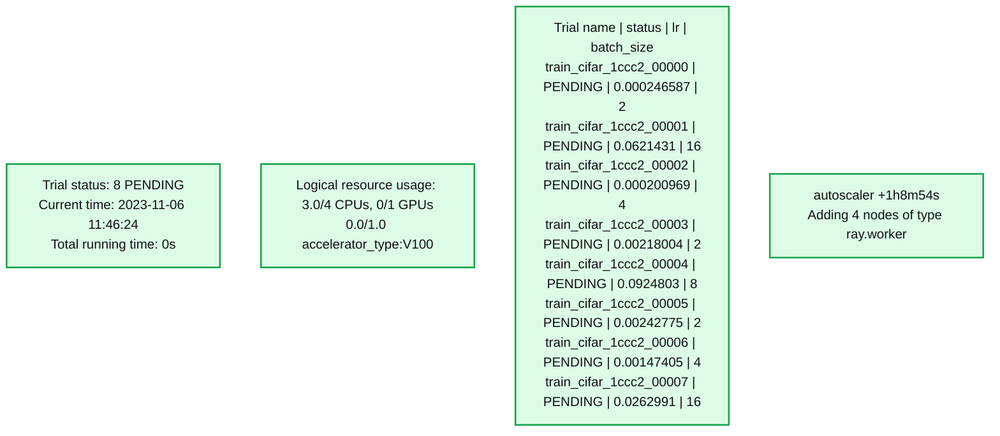

# Announcing Ray Autoscaling support on Databricks and Apache Spark™

*Automatically scale Ray workloads by leveraging Databricks Auto Scaling*

- Source: https://www.databricks.com/blog/announcing-ray-autoscaling-support-databricks-and-apache-sparktm
- Published: 2024-01-09
- Authors: Weichen Xu, Puneet Jain, Ben Wilson
- Categories: engineering
- Images: 5 total, 2 extracted as architecture

[Ray](https://github.com/ray-project/ray) is an open-source unified compute framework that simplifies scaling AI and Python workloads in a distributed environment. Since we introduced support for running [Ray on Databricks](https://www.databricks.com/blog/2023/02/28/announcing-ray-support-databricks-and-apache-spark-clusters.html), we've witnessed numerous customers successfully deploying their machine learning use cases, which range from forecasting and deep reinforcement learning to fine-tuning LLMs.

With the release of [**Ray version 2.8.0**](https://github.com/ray-project/ray/releases/tag/ray-2.8.0), we are delighted to announce the addition of autoscaling support for Ray on Databricks. [Autoscaling](https://docs.databricks.com/en/clusters/configure.html#enable-autoscaling) is essential because it allows resources to dynamically adjust to fluctuating demands. This ensures optimal performance and cost-efficiency, as processing needs can vary significantly over time, and it helps maintain a balance between computational power and expenses without requiring manual intervention.

Ray autoscaling on Databricks can add or remove worker nodes as needed, leveraging the Spark framework to enhance scalability, cost-effectiveness, and responsiveness in distributed computing environments. This integrated approach is far simpler than the alternative of implementing OSS autoscaling by eliminating the need for defining complex permissions, cloud initialization scripts, and logging configurations. With a fully-managed, production-capable, and integrated autoscaling solution, you can greatly reduce the complexity and cost of your Ray workloads.

## Create Ray cluster on Databricks with autoscaling enabled

To get started, simply install the latest version of Ray

The next step is to establish the configuration for the Ray cluster that we're going to be starting by using the **`ray.util.spark.setup_ray_cluster() `** function. In order to leverage autoscaling functionality, specify the maximum number of worker nodes that the Ray cluster can use, define the allocated compute resources, and set the Autoscale flag to True. Additionally, it is critical to ensure that the Databricks cluster has been started with autoscaling enabled. For more details, please refer to the [documentation](https://docs.databricks.com/en/clusters/cluster-config-best-practices.html#autoscaling).

Once these parameters have been set, when you initialize the Ray cluster, autoscaling will function exactly as Databricks autoscaling does. Below is an example of setting up a Ray cluster with the ability to autoscale.

This feature is compatible with any Databricks cluster running **Databricks Runtime version 14.0** or above.

To learn more about the parameters that are available for configuring a Ray cluster on Spark, please refer to the [setup_ray_cluster](https://docs.ray.io/en/latest/cluster/vms/user-guides/community/spark.html?highlight=ray.util.spark#ray-on-spark-apis) documentation. Once the Ray cluster is initialized, the Ray head node will show up on the Ray Dashboard.

When a job is submitted to the Ray cluster, the Ray Autoscaler API requests resources from the Spark cluster by submitting tasks with the necessary CPU and GPU compute requirements. The Spark scheduler scales up worker nodes if the current cluster resources cannot meet the task's compute demands and scales down the cluster when tasks are completed and no additional tasks are pending. You can control the scale-up and scale-down velocity by adjusting the **autoscale_upscaling_speed** and **autoscale_idle_timeout_minutes** parameters. For additional details about these control parameters, please refer to the [documentation](https://docs.ray.io/en/latest/cluster/vms/user-guides/community/spark.html?highlight=ray.util.spark#ray-on-spark-apis). Once the process is completed, Ray releases all of the allocated resources back to the Spark cluster for other tasks or for downscaling, ensuring efficient utilization of resources.

Let's walk through a hyperparameter tuning example to demonstrate the autoscaling process. In this example, we'll train a [PyTorch](https://pytorch.org/) model on the [CIFAR10](https://www.cs.toronto.edu/~kriz/cifar.html) dataset. We've adapted the code from the Ray documentation, which you can find [here](https://docs.ray.io/en/latest/tune/examples/tune-pytorch-cifar.html#tune-pytorch-cifar-ref).

We'll begin by defining the PyTorch model we want to tune.

We wrap the data loaders in their own function and pass a global data directory. This way we can share a data directory between different trials.

Next, we can define a function that will ingest a config and run a single training loop for the torch model. At the conclusion of each trial, we checkpoint the weights and report the evaluated loss using the `train, report` API. This is done so that the scheduler can stop ineffectual trials that do not improve the model's loss characteristics.

Next, we define the training loop which runs for the total epochs specified in the config file, Each epoch consists of two main parts:

- The Train Loop - iterates over the training dataset and tries to converge to optimal parameters.
- The Validation/Test Loop - iterates over the test dataset to check if model performance is improving.

Finally, we first save a checkpoint and then report some metrics back to Ray Tune. Specifically, we send the validation loss and accuracy back to Ray Tune. Ray Tune can then use these metrics to decide which hyperparameter configuration leads to the best results.

Next, we define the main components to start the tuning job by specifying the search space that the optimizer will select from for given hyperparameters.

## Define the search space

The configuration below expresses the hyperparameters and their search selection ranges as a dictionary. For each of the given parameter types, we use the appropriate selector algorithm (i.e., sample_from, loguniform, or choice, depending on the nature of the parameter being defined).

At each trial, [Ray Tune](https://docs.ray.io/en/latest/tune/index.html) will randomly sample a combination of parameters from these search spaces. After selecting a value for each of the parameters within the confines of our configuration that we defined above, it will then train a number of models in parallel in order to find the best-performing one among the group. In order to short-circuit an iteration of parameter selection that isn't working well, we use the ASHAScheduler, which will terminate ineffective trials early i.e. trials whose loss metrics are significantly degraded compared to the current best-performing set of parameters from the run's history.

## Tune API

Finally, we call the Tuner API to initiate the run. When calling the training initiating method, we pass some additional configuration options that define the resources that we permit Ray Tune to use per trial, the default storage location of checkpoints, and the target metric to optimize during the iterative optimization. Refer [here](https://docs.ray.io/en/latest/tune/index.html) for more details on the various parameters that are available for Ray Tune.

In order to see what happens when we run this code with a specific declared resource constraint, let's trigger the run with CPU only, using **cpus_per_trial = 3** and **gpu = 0** with total_epochs = 20 for the run configuration.

**Summary:** Ray Tune shows eight pending CIFAR training trials, current resource usage, and an autoscaler message adding four worker nodes.

**Components:**

- Trial status: Ray Tune reports eight pending trials.
- Logical resource usage: Ray reports CPU, GPU, and V100 accelerator usage.
- Trial table: Ray Tune lists trial names, statuses, learning rates, and batch sizes.
- Autoscaler: Ray autoscaler reports adding nodes of type `ray.worker`.

**Flows:**

- none. No arrows are visible.

**Numbers:**

- Trial status: 8 PENDING.
- Current time: 2023-11-06 11:46:24.
- Total running time: 0s.
- CPUs: 3.0/4.
- GPUs: 0/1.
- Accelerator usage: 0.0/1.0, type V100.
- Autoscaler timestamp: +1h8m54s.
- Nodes being added: 4.

| Trial name | Status | lr | batch_size |
|---|---|---:|---:|
| train_cifar_1ccc2_00000 | PENDING | 0.000246587 | 2 |
| train_cifar_1ccc2_00001 | PENDING | 0.0621431 | 16 |
| train_cifar_1ccc2_00002 | PENDING | 0.000200969 | 4 |
| train_cifar_1ccc2_00003 | PENDING | 0.00218004 | 2 |
| train_cifar_1ccc2_00004 | PENDING | 0.0924803 | 8 |
| train_cifar_1ccc2_00005 | PENDING | 0.00242775 | 2 |
| train_cifar_1ccc2_00006 | PENDING | 0.00147405 | 4 |
| train_cifar_1ccc2_00007 | PENDING | 0.0262991 | 16 |

source image: https://www.databricks.com/sites/default/files/inline-images/db-835-blog-img-2.png

We see the autoscaler start requesting resources as shown above and the pending resource logged in the UI shown below.

If the current demand for resources by the Ray cluster cannot be met, it initiates autoscaling of the databricks cluster as well.

Finally, we can see the run finishes the output of the Job shows that some of the bad trials were terminated early leading to compute savings

**Summary:** Eight terminated training trials show different learning rates, batch sizes, iteration counts, runtimes, losses, and accuracies, followed by the best trial configuration and validation loss.

**Components:**

- Trial name: training trial identifiers; framework not specified.
- status: all trials marked TERMINATED.
- lr: learning rate for each trial.
- batch_size: batch size for each trial.
- iter: completed iterations.
- total time (s): trial runtime in seconds.
- loss: reported trial loss.
- accuracy: reported trial accuracy.
- Best trial config: selected values for l1, l2, lr, batch_size, and max_epoch.
- Best trial final validation loss: selected trial's validation loss.

**Flows:**

- none; no arrows are visible.

**Numbers:**

| Trial name | lr | batch_size | iter | total time (s) | loss | accuracy |
|---|---:|---:|---:|---:|---:|---:|
| train_cifar_1ccc2_00000 | 0.000246587 | 2 | 20 | 1634.17 | 1.10675 | 0.6193 |
| train_cifar_1ccc2_00001 | 0.0621431 | 16 | 20 | 298.409 | 2.30869 | 0.0996 |
| train_cifar_1ccc2_00002 | 0.000200969 | 4 | 20 | 826.33 | 1.0769 | 0.6423 |
| train_cifar_1ccc2_00003 | 0.00218004 | 2 | 10 | 738.938 | 1.76097 | 0.3372 |
| train_cifar_1ccc2_00004 | 0.0924803 | 8 | 5 | 120.862 | 2.33713 | 0.1003 |
| train_cifar_1ccc2_00005 | 0.00242775 | 2 | 5 | 370.4 | 1.84557 | 0.3034 |
| train_cifar_1ccc2_00006 | 0.00147405 | 4 | 20 | 810.024 | 1.3066 | 0.5682 |
| train_cifar_1ccc2_00007 | 0.0262991 | 16 | 5 | 69.7483 | 2.11121 | 0.2082 |

Best trial config: l1 = 64, l2 = 256, lr = 0.000200968579493813, batch_size = 4, max_epoch = 20.

Best trial final validation loss: 1.076897452309262.

```mermaid
%% Training trial results and best trial configuration
flowchart TD
    A[train_cifar_1ccc2_00000<br/>TERMINATED<br/>lr 0.000246587 · batch_size 2 · iter 20<br/>total time 1634.17 s · loss 1.10675 · accuracy 0.6193]
    B[train_cifar_1ccc2_00001<br/>TERMINATED<br/>lr 0.0621431 · batch_size 16 · iter 20<br/>total time 298.409 s · loss 2.30869 · accuracy 0.0996]
    C[train_cifar_1ccc2_00002<br/>TERMINATED<br/>lr 0.000200969 · batch_size 4 · iter 20<br/>total time 826.33 s · loss 1.0769 · accuracy 0.6423]
    D[train_cifar_1ccc2_00003<br/>TERMINATED<br/>lr 0.00218004 · batch_size 2 · iter 10<br/>total time 738.938 s · loss 1.76097 · accuracy 0.3372]
    E[train_cifar_1ccc2_00004<br/>TERMINATED<br/>lr 0.0924803 · batch_size 8 · iter 5<br/>total time 120.862 s · loss 2.33713 · accuracy 0.1003]
    F[train_cifar_1ccc2_00005<br/>TERMINATED<br/>lr 0.00242775 · batch_size 2 · iter 5<br/>total time 370.4 s · loss 1.84557 · accuracy 0.3034]
    G[train_cifar_1ccc2_00006<br/>TERMINATED<br/>lr 0.00147405 · batch_size 4 · iter 20<br/>total time 810.024 s · loss 1.3066 · accuracy 0.5682]
    H[train_cifar_1ccc2_00007<br/>TERMINATED<br/>lr 0.0262991 · batch_size 16 · iter 5<br/>total time 69.7483 s · loss 2.11121 · accuracy 0.2082]
    I[Best trial config<br/>l1 64 · l2 256 · lr 0.000200968579493813<br/>batch_size 4 · max_epoch 20]
    J[Best trial final validation loss<br/>1.076897452309262]

    classDef client fill:#dbeafe,stroke:#2563eb,stroke-width:2px,color:#111
    classDef service fill:#dcfce7,stroke:#16a34a,stroke-width:2px,color:#111
    classDef store fill:#ede9fe,stroke:#7c3aed,stroke-width:2px,color:#111
    classDef cache fill:#fef3c7,stroke:#d97706,stroke-width:2px,color:#111
    classDef queue fill:#cffafe,stroke:#0891b2,stroke-width:2px,color:#111
    classDef critical fill:#fee2e2,stroke:#dc2626,stroke-width:4px,color:#111
    classDef external fill:#e5e7eb,stroke:#6b7280,stroke-width:2px,color:#111,stroke-dasharray:4 3
    classDef decision fill:#fce7f3,stroke:#db2777,stroke-width:2px,color:#111
    class A,B,C,D,E,F,G,H service
    class I,J decision
```

source image: https://www.databricks.com/sites/default/files/inline-images/db-835-blog-img-5.png

The same process works without any code change with GPU resources as well without any code change. Feel free to clone the [notebook](https://github.com/puneet-jain159/introducing_ray_on_spark_autoscaling/blob/main/ray_autoscaling_example.ipynb) and run it in your environment:

## What's next

With the support for autoscaling Ray workload, we take one step further to tighten the integration between Ray and Databricks and help scale your dynamic workloads. Our roadmap for this integration promises even more exciting developments. Stay tuned for further updates!
