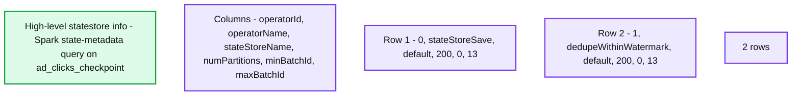
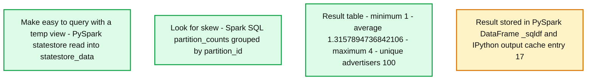

# Announcing the State Reader API: The New "Statestore" Data Source

- Source: https://www.databricks.com/blog/announcing-state-reader-api-new-statestore-data-source
- Published: 2024-03-28
- Authors: Craig Lukasik, Jungtaek Lim
- Categories: engineering, data-engineering
- Images: 8 total, 2 extracted as architecture

Databricks Runtime 14.3 includes a new capability that allows users to access and analyze [Structured Streaming](https://spark.apache.org/docs/latest/structured-streaming-programming-guide.html)'s internal state data: the [State Reader API](https://docs.databricks.com/en/structured-streaming/read-state.html). The State Reader API sets itself apart from well-known [Spark data formats](https://spark.apache.org/docs/latest/sql-data-sources.html) such as JSON, CSV, Avro, and Protobuf. Its primary purpose is facilitating the development, debugging, and troubleshooting of stateful Structured Streaming workloads. Apache Spark 4.0.0 – expected to be released later this year – will include the State Reader API.

## What challenges does the new API address?

Apache Spark™'s Structured Streaming provides various stateful capabilities. If you'd like to learn more about these, you should start by reading ["Multiple Stateful Operators in Structured Streaming,"](https://www.databricks.com/blog/multiple-stateful-operators-structured-streaming) which explains stateful operators, watermarks, and state management.

The State Reader API enables you to query the state data and metadata. This API solves several problems for developers. Developers often resort to excessive logging for debugging due to difficulties in understanding the state store during development, leading to slower project progress. Testing challenges arise from the complexity of handling event time and unreliable tests, prompting some to bypass crucial unit tests. In production, analysts struggle with data inconsistencies and access limitations, with time-consuming coding workarounds sometimes needed to resolve urgent issues.

## A two-part API

Two new DataFrame format options make up the State Reader API: `state-metadata` and `statestore`. The `state-metadata` data format provides high-level information about what is stored in the state store, whereas the `statestore` data format permits a granular look at the key-value data itself. When investigating a production issue, you might start with the `state-metadata` format to gain a high-level understanding of the stateful operators in use, what batch IDs are involved, and how the data is partitioned. Then, you can use the `statestore` format to inspect the actual state keys and values or to perform analytics on the state data.

Using the State Reader API is straightforward and should feel familiar. For both formats, you must provide a path to the checkpoint location where state store data is persisted. Here's how to use the new data formats:

- State store overview: `spark.read.format("state-metadata").load("<checkpointLocation>")`
- Detailed state data: `spark.read.format("statestore").load("<checkpointLocation>")`

For more information on optional configurations and the complete schema of the returned data, see the Databricks documentation on [reading Structured Streaming state information](https://docs.databricks.com/en/structured-streaming/read-state.html). Note that you can read state metadata information for Structured Streaming queries run on Databricks Runtime 14.2 or above.

Before we get into the details of using the State Reader API, we need to set up an example stream that includes stateful operations.

## Example: Real-time ad billing

Suppose your job is to build a pipeline to help with the billing process related to a streaming media company's advertisers. Let's assume that viewers using the service are shown advertisements periodically from various advertisers. If the user clicks on an ad, the media company needs to collect this fact so that it can charge the advertiser and get the appropriate credit for the ad click. Some other assumptions:

1. For a viewing session, multiple clicks within a 1-minute period should be "deduplicated" and counted as one click.
2. A 5-minute window defines how often the aggregate counts should be output to a target [Delta](https://docs.databricks.com/en/delta/index.html) table for an advertiser.
3. Assume that a user of the streaming media application is uniquely identified by a `profile_id` included in the event data.

At the end of this post we'll provide the source code for generating the fake event stream. For now, we'll focus on the source code that:

1. Consumes the stream
2. Deduplicates the event clicks
3. Aggregates the number of ad clicks (by unique `profile_ids`) for each `advertiser_id`
4. Outputs the results to a Delta table

## The source data

First, let's look at the event data. The code used to generate this data can be found in the Appendix of this article.

Think of a `profile_id` as representing a unique human user streaming from the media app. The event data conveys what ad was shown to the user `(profile_id)` at a given timestamp and whether or not they clicked the ad.

## Deduplicating records

The second step in the process is to drop duplicates, a best practice with streaming pipelines. This makes sense, for example, to ensure that a quick click-click is not counted twice.

The [`withWatermark`](https://www.databricks.com/blog/feature-deep-dive-watermarking-apache-spark-structured-streaming) method specifies the window of time between which duplicate records (for the same `profile_id` and `advertiser_id`) are dropped so they don't move any further along in the stream.

## Aggregating records and writing results

The last step to track ad billing is to persist the total number of clicks per advertiser for each 5-minute window.

In summary, the code is aggregating data in nonoverlapping 5-minute intervals (tumbling windows), and counting the clicks per advertiser within each of these windows.

In the screenshot, you may notice that the "Write to Delta Lake" cell shows some useful information about the stream on the Raw Data tab. This includes watermark details, state details, and statistics like `numFilesOutstanding` and `numBytesOutstanding`. Those [streaming metrics](https://docs.databricks.com/en/structured-streaming/stream-monitoring.html) are very useful for development, debugging, and troubleshooting.

Finally, the destination Delta table is populated with an `advertiser_id`, the number of ad clicks (`click_count`), and the time frame (`window`) during which the events took place.

## Using the State Reader API

Now that we've walked through a real-world stateful streaming job, let's see how the State Reader API can help. First, let's explore the `state-metadata` data format to get a high-level picture of the state data. Then, we'll see how to get more granular details with the `statestore` data format.

### High-level details with state-metadata

**Summary:** The state-metadata query shows two stateful operators, each with 200 partitions and batch IDs ranging from 0 to 13.

**Components:**
- High-level statestore info: Spark query using `display(spark.read.format("state-metadata").load(ad_clicks_checkpoint))`.
- `stateStoreSave`: operator ID 0 using the default state store.
- `dedupeWithinWatermark`: operator ID 1 using the default state store.
- Result table: columns `operatorId`, `operatorName`, `stateStoreName`, `numPartitions`, `minBatchId`, and `maxBatchId`.

**Flows:**
- none. No arrows are visible.

**Numbers:**
- Row numbers: 1 and 2.
- Operator IDs: 0 and 1.
- Number of partitions: 200 for each operator.
- Minimum batch ID: 0 for each operator.
- Maximum batch ID: 13 for each operator.
- Result count: 2 rows.
- Numeric column icons display 1, 2, and 3.

source image: https://www.databricks.com/sites/default/files/inline-images/db-915-blog-img-5.png

The information from `state-metadata` in this example can help us spot some potential issues:

1. **Business logic.** You will notice that this stream has two stateful operators. This information can help developers understand how their streams are using the state store. For example, some developers might not be aware that [`dedupeWithinWatermark`](https://docs.databricks.com/en/structured-streaming/watermarks.html) (the underlying operator for the PySpark method `dropDuplicatesWithinWatermark`) leverages the state store.
2. **State retention.** Ideally, as a stream progresses over time, state data is getting cleaned up. This should happen automatically with some stateful operators. However, arbitrary stateful operations (e.g., `FlatMapGroupsWithState`) require that the developer be mindful of and code the logic for dropping or expiring state data. If the `minBatchId` does not increase over time, this could be a red flag indicating that the state data footprint could grow unbounded, leading to eventual job degradation and failure.
3. **Parallelism.** The default value for `spark.sql.shuffle.partitions` is `200`. This configuration value dictates the number of state store instances that are created across the cluster. For some stateful workloads, 200 may be unsuitable.

### Granular details with statestore

The `statestore` data format provides a way to inspect and analyze granular state data, including the contents of the keys and values used for each stateful operation in the state store database. These are represented as `Structs` in the DataFrame's output:

Having access to this granular state data helps accelerate the development of your stateful streaming pipeline by removing the need to include debugging messages throughout your code. It can also be crucial for investigating production issues. For instance, if you receive a report of a greatly inflated number of clicks for a particular advertiser, inspecting the state store information can direct your investigation while you're debugging the code.

If you have multiple stateful operators, you can use the `operatorId` option to inspect the granular details for each operator. As you saw in the previous section, the `operatorId` is one of the values included in the `state-metadata` output. For example, here we query specifically for `dedupeWithinWatermark`'s state data:

### Performing analytics (detecting skew)

You can use familiar techniques to perform analytics on the DataFrames surfaced by the State Reader API. In our example, we can check for skew as follows:

**Summary:** A Spark SQL query analyzes state distribution across partitions and reports minimum, average, and maximum keys per partition alongside unique advertiser counts.

**Components:**

- Make easy to query with a temp view: PySpark reads the `statestore` data source from `ad_clicks_checkpoint` and creates the `statestore_data` temporary view.
- Look for skew: Spark SQL groups `statestore_data` by `partition_id`, computing `keys_for_partition` and distinct `key.advertiser_id` counts as `uniq_advertisers` in `partition_counts`.
- Result table: Spark SQL aggregates partition counts into minimum, average, and maximum keys per partition and summed unique advertisers.
- `_sqldf`: A PySpark DataFrame holds the result, also available in the IPython output cache as `Out[17]`.

**Flows:**

- none. No arrows are visible.

**Numbers:**

- `min_keys_for_partition`: 1.
- `avg_keys_for_partition`: 1.3157894736842106.
- `max_keys_for_partition`: 4.
- `uniq_advertisers`: 100.
- Spark Jobs: 1.
- DataFrame schema preview: 2 more fields.
- Result row index: 1.
- Result count: 1 row.
- IPython output cache index: 17.
- Column type icons: `1²3` for integer columns and `1.2` for the average column.

source image: https://www.databricks.com/sites/default/files/inline-images/db-915-blog-img-8.png

Combined with the insights from our use of the `state-metadata` API, we know that there are 200 partitions. However, we see here that there are some partitions where just 3 of the 100 unique advertisers have state maintained. For this toy example, we don't need to worry, but in large workloads evidence of skew should be investigated as it may lead to performance and resource issues.

## When to use the State Reader API

### Development and debugging

The new API greatly simplifies the development of stateful streaming applications. Previously, developers had to rely on debug print messages and comb through executor logs to verify business logic. With the State Reader API, they can now directly view the state, input new records, query the state again, and refine their code through iterative testing.

Take, for example, a Databricks customer who uses the `flatMapGroupsWithState` operator in a stateful application to track diagnostics for millions of set-top cable boxes. The business logic for this task is complex and must account for various events. The cable box ID serves as the key for the stateful operator. By employing the new API, developers can input test data into the stream and check the state after each event, ensuring the business logic functions correctly.

The API also allows developers to include more robust unit tests and test cases that verify the contents of the state store as part of their expectations.

### Looking at parallelism and skew

Both data formats offer insights to developers and operators regarding the distribution of keys across state store instances. The `state-metadata` format reveals the number of partitions in the state store. Developers often stick with the default setting of `spark.sql.shuffle.partitions` (`200`), even in large clusters. However, the number of state store instances is determined by this setting, and for larger workloads, 200 partitions might not be sufficient.

The `statestore` format is useful for detecting skew, as shown earlier in this article.

### Investigating production issues

Investigations in data analytics pipelines happen for a variety of reasons. Analysts may seek to trace the origin and history of a record, while production streams may encounter bugs requiring detailed forensic analysis, including of state store data.

The State Reader API is not intended to be used in an always-on context (it is not a streaming source). However, developers can proactively package a notebook as a Workflow to help automate the retrieval of state metadata and analysis of the state, through techniques like those shown earlier.

## Conclusion

The State Reader API introduces much-needed transparency, accessibility, and ease of use to stateful streaming processes. As demonstrated in this article, the API's usage and output are straightforward and user-friendly, simplifying complex investigative tasks.

*The State Reader API is included in Apache Spark 4.0.0 as part of SPARK-45511. The Databricks doc [Read Structured Streaming state information](https://docs.databricks.com/en/structured-streaming/read-state.html) explains the API's options and usage.*

## Appendix

### Source code

Below is the source code for the example use case explained in this article. You can save this as a ".py" file and import it into Databricks.
