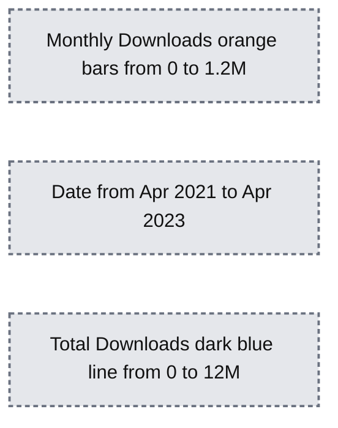

# Announcing Terraform Databricks modules

*30+ reusable Terraform modules to provision your Databricks Lakehouse platform*

- Source: https://www.databricks.com/blog/announcing-terraform-databricks-modules
- Published: 2023-05-04
- Authors: Yassine Essawabi, Hao Wang, Alex Ott
- Categories: engineering, data-engineering
- Images: 4 total, 1 extracted as architecture

The [Databricks Terraform provider](https://registry.terraform.io/providers/databricks/databricks/latest) reached more than 10 million installations, significantly increasing adoption since it became [generally available](https://www.databricks.com/blog/2022/06/22/databricks-terraform-provider-is-now-generally-available.html) less than one year ago.

This significant milestone showcases that Terraform and the Databricks provider are widely used by many customers to automate infrastructure deployment and management of their Lakehouse Platform.

*Figure: Monthly downloads of Databricks Terraform provider*

**Summary:** Databricks Terraform provider monthly downloads and cumulative total downloads increase from spring 2021 to spring 2023.

**Components:**
- Monthly Downloads: orange bars showing Databricks Terraform provider downloads, measured on the left axis.
- Total Downloads: dark blue line showing cumulative downloads, measured on the right axis.
- Date: horizontal time axis.

**Flows:**
- none. No arrows are shown.

**Numbers:**
- Monthly Downloads axis: 0, 0.2M, 0.4M, 0.6M, 0.8M, 1M, 1.2M downloads.
- Total Downloads axis: 0, 2M, 4M, 6M, 8M, 10M, 12M downloads.
- Date axis: Apr 2021, Jul 2021, Oct 2021, Jan 2022, Apr 2022, Jul 2022, Oct 2022, Jan 2023, Apr 2023.
- Individual bars and line points have no numeric labels.

source image: https://www.databricks.com/sites/default/files/inline-images/db-594-blog-img-1.png

Figure: Monthly downloads of Databricks Terraform provider

To easily maintain, manage and scale their infrastructure, DevOps teams build their infrastructure using modular and reusable components called Terraform [modules](https://developer.hashicorp.com/terraform/language/modules). Terraform modules allow you to easily reuse the same components across multiple use cases and environments. It also helps enforce a standardized approach of defining resources and adopting best practices across your organization. Not only does consistency ensure best practices are followed, it also helps to enforce compliant deployment and avoid accidental misconfigurations, which could lead to costly errors.

## Introducing Terraform Databricks modules

To help customers test and deploy their Lakehouse environments, we're releasing the experimental [Terraform Registry modules for Databricks](https://registry.terraform.io/modules/databricks/examples/databricks/latest), a set of more than 30 reusable Terraform modules and examples to provision your Databricks Lakehouse platform on Azure, AWS, and GCP using [Databricks Terraform provider](https://registry.terraform.io/providers/databricks/databricks/latest/docs). It is using the content in [terraform-databricks-examples](https://github.com/databricks/terraform-databricks-examples) github repository.

Figure: Databricks Terraform modules available on Terraform Registry

There are two ways to use these modules:

1. Use examples as a reference for your own Terraform code.
2. Directly reference the submodule in your Terraform configuration.

The full set of available modules and examples can be found in [Terraform Registry modules for Databricks](https://registry.terraform.io/modules/databricks/examples/databricks/latest).

## Getting started with Terraform Databricks examples

To use one of the different available Terraform Databricks modules, you should follow these steps:

1. Reference this module using one of the different [module source types](https://developer.hashicorp.com/terraform/language/modules/sources)
2. Add a `variables.tf` file with the required inputs for the module
3. Add a `terraform.tfvars` file and provide values to each defined variable
4. Add an `output.tf` file with the module outputs
5. (Strongly recommended) Configure your [remote backend](https://developer.hashicorp.com/terraform/language/settings/backends/azurerm)
6. Run `terraform init` to initialize terraform and to download the needed providers.
7. Run `terraform validate` to validate the configuration files in your directory.
8. Run `terraform plan` to preview the resources that Terraform plans to create.
9. Run `terraform apply` to create the resources.

### Example walkthrough

In this section we demonstrate how to use the examples provided in the [Databricks Terraform registry modules](https://registry.terraform.io/modules/databricks/examples/databricks/latest) page. Each example is independent of each other and has a dedicated README.md. We now use this Azure Databricks example [adb-vnet-injection](https://github.com/databricks/terraform-databricks-examples/tree/main/examples/adb-vnet-injection) to deploy a VNet-injected Databricks Workspace with an auto scaling cluster.

#### Step 1: Authenticate to the providers.

Navigate to providers.tf to check for providers used in the example, here we need to configure authentication to [Azure provider](https://registry.terraform.io/providers/hashicorp/azurerm/latest/docs) and Databricks providers. Read the following docs for extensive information on how to configure authentication to providers:

- [Azurerm provider authentication methods](https://learn.microsoft.com/en-us/azure/developer/terraform/authenticate-to-azure?tabs=bash)
- [Databricks provider authentication methods](https://registry.terraform.io/providers/databricks/databricks/latest/docs#authentication) and [Azure documentation](https://learn.microsoft.com/en-us/azure/databricks/dev-tools/terraform/#requirements)

#### Step 2: Read through the readme of the example, prepare input values.

The identity that you use in `az login` to deploy this template should have a contributor role in your azure subscription, or the minimum required permissions to deploy resources in this template.

Then do following steps:

1. Run `terraform init` to initialize terraform and download required providers.
2. Run `terraform plan` to see what resources will be deployed.
3. Run `terraform apply` to deploy resources to your Azure environment.
 Since we used `az login` method to authenticate to providers, you will be prompted to login to Azure via browser. Enter `yes` when prompted to deploy resources.

#### Step 3: Verify that resources were deployed successfully in your environment.

Navigate to Azure Portal and verify that all resources were deployed successfully. You should now have a vnet-injected workspace with one cluster deployed.

You can find more examples and their requirements, provider authentications in this repository under /examples.

## How to contribute

[Terraform-databricks-examples](https://github.com/databricks/terraform-databricks-examples) content will be continuously updated with new modules covering different architectures and also more features of the Databricks platform.

Note that it is a community project, developed by Databricks Field Engineering and is provided as-is. Databricks does not offer official support. In order to add new examples or new modules, you can contribute to the project by opening a new pull-request. For any issue, please open an issue under the [terraform-databricks-examples](https://github.com/databricks/terraform-databricks-examples) repository.

Please look into the current list of available modules and examples and try them to deploy your Databricks infrastructure!
