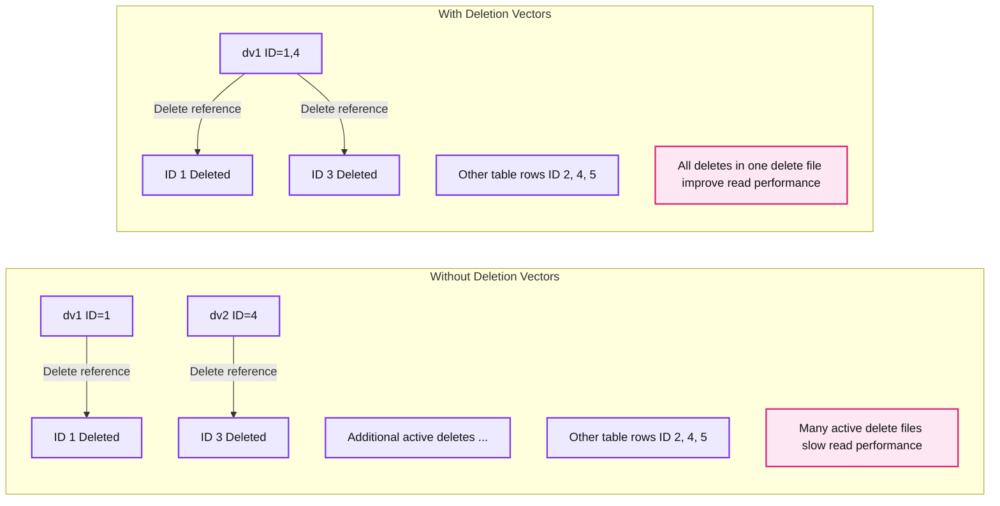
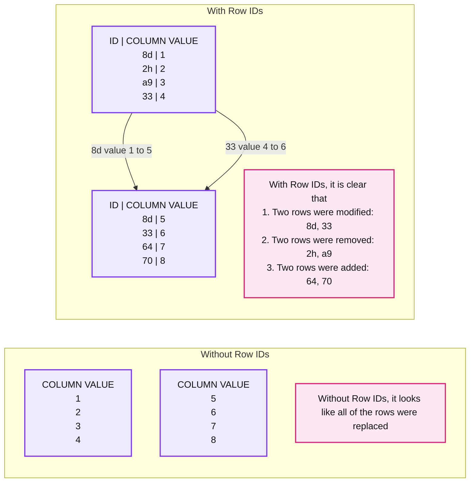
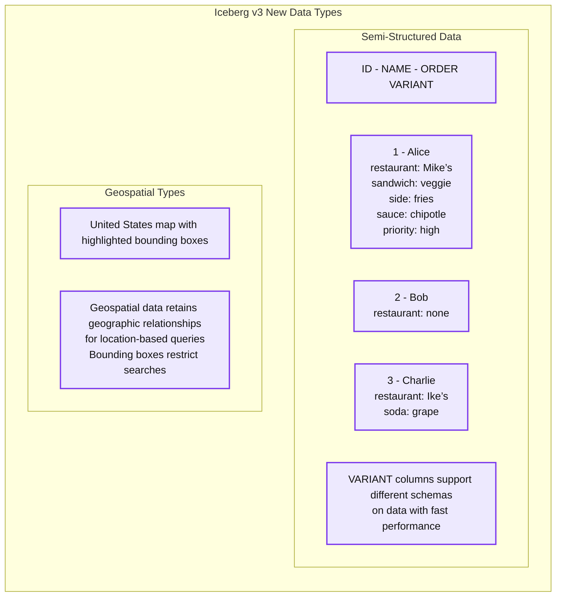

# Apache Iceberg™ v3: Moving the Ecosystem Towards Unification

*Apache Iceberg™ v3 contains major new features (deletion vectors, row lineage, semi-structured data, geospatial types) and unifies the data layer across formats*

- Source: https://www.databricks.com/blog/apache-icebergtm-v3-moving-ecosystem-towards-unification
- Published: 2025-06-02
- Authors: Ryan Blue, Daniel Weeks, Aniruth Narayanan
- Categories: engineering, open-source
- Images: 3 total, 3 extracted as architecture

**Key takeaways**

- Apache Iceberg™ v3 contains new features and improvements: Deletion Vectors, Row Level Lineage, Semi-Structured Data, and Geospatial Types
- With these features, Iceberg v3 unifies the data layer across Apache Iceberg™, Delta Lake, Apache Parquet, and Apache Spark™
- Databricks is integrating Iceberg v3 into the Data + AI Platform and is excited for the industry to adopt Iceberg v3

Apache Iceberg™ v3, now approved by the Apache Iceberg™ community, introduces advanced new features and data types. [Iceberg v3](https://iceberg.apache.org/spec/#version-3-extended-types-and-capabilities) includes major improvements such as deletion vectors, row lineage, and new types for semi-structured data and geospatial use cases. These features allow customers to efficiently process and query data. Additionally, these improvements are consistent across Delta Lake, Apache Parquet, and Apache Spark™, so customers can interoperate between Delta and Apache Iceberg™ without rewriting data or row-level delete files.

In this blog post, we cover the newest developments in Iceberg v3:

- Deletion Vectors
- Row Lineage
- Semi-Structured Data and Geospatial Types
- Interoperability across Delta Lake, Apache Parquet, and Apache Spark

## Deletion Vectors

Iceberg v3 introduces a new format for row-level deletes to improve read performance: deletion vectors. Row-level deletes significantly reduce write amplification by optimizing how deleted rows are stored and tracked — leading to faster ETL and ingestion. In Iceberg v2, engines were not required to compact delete files together during writes. The intent was for customers to use asynchronous maintenance. However, many customers did not schedule maintenance services, so their tables had too many unmaintained delete files. That led to slow read performance when engines had to merge many row-level delete files on read.

**Summary:** Iceberg v3 deletion vectors consolidate active deletes into one delete file to improve read performance.

**Components:**

- Iceberg v3: Apache Iceberg deletion vector feature.
- Without Deletion Vectors: active delete files labeled `dv1 (ID=1)` and `dv2 (ID=4)`, followed by an ellipsis indicating additional files.
- Left ID table: rows 1 through 5, with rows 1 and 3 marked Deleted. Storage technology is unspecified.
- With Deletion Vectors: one active delete file labeled `dv1 (ID=1,4)`.
- Right ID table: rows 1 through 5, with rows 1 and 3 marked Deleted. Storage technology is unspecified.
- Left explanation: many active delete files slow read performance.
- Right explanation: all deletes must be in one delete file, improving read performance.

**Flows:**

- Left dv1 -> Left table row 1: delete reference.
- Left dv2 -> Left table row 3: delete reference, despite the source label specifying ID=4.
- Right dv1 -> Right table row 1: delete reference.
- Right dv1 -> Right table row 3: delete reference, despite the source label specifying IDs 1 and 4.

**Numbers:** Version 3; delete labels `dv1` and `dv2`; left delete IDs 1 and 4; right delete IDs 1,4; table row IDs 1, 2, 3, 4, 5 on both sides; one delete file specified on the right.

source image: https://www.databricks.com/sites/default/files/inline-images/iceberg-ecosystem-towards-unification-blog-img-1.png

Iceberg v3 introduces a new deletion vector format and new compaction requirements for delete files. This new format avoids translation between Parquet files and in-memory representations used to apply the deletes. Additionally, engines must maintain a single deletion vector per file at write time. This requirement improves performance and statistics on data files. This also makes it easy to compare previous and current deletes, which simplifies processing a table's row-level changes as a stream.

## Row Lineage

Another major Iceberg v3 feature is row lineage, used to simplify incremental processing. With row lineage, engines find row-level changes by matching versions of rows across commits.

**Summary:** Iceberg v3 row lineage uses row IDs to distinguish modified, removed, and added rows across table versions.

**Components:**
- Without Row IDs, initial table: column values 1, 2, 3, 4 without Iceberg row identifiers.
- Without Row IDs, later table: column values 5, 6, 7, 8, making all rows appear replaced.
- With Row IDs, initial table: Iceberg ID/value pairs 8d/1, 2h/2, a9/3, 33/4.
- With Row IDs, later table: Iceberg ID/value pairs 8d/5, 33/6, 64/7, 70/8.
- Change explanation: two rows modified, two removed, and two added.

**Flows:**
- Initial row 8d -> Later row 8d: identity persists as its value changes from 1 to 5.
- Initial row 33 -> Later row 33: identity persists as its value changes from 4 to 6.

**Numbers:**
- Version: v3.
- Column values: 1, 2, 3, 4, 5, 6, 7, 8.
- Row IDs: 8d, 2h, a9, 33, 64, 70.
- List numbering: 1, 2, 3.
- Change counts: two modified rows, two removed rows, two added rows.

source image: https://www.databricks.com/sites/default/files/inline-images/iceberg-ecosystem-towards-unification-blog-img-2.png

Iceberg v3 introduces row lineage using row-level metadata: a row ID and the sequence number when the row was last modified or added. The IDs identify the same row across versions. Sequence numbers annotate when rows were last changed - not just relocated between files. This allows engines to process changes selectively, simplifying downstream updates with faster and cheaper workflows.

Row ID information is especially beneficial when combined with incremental processing objects like materialized views. These objects are optimized to compute only new or changed data since the last processing cycle.

## Semi-Structured Data and Geospatial Types

Iceberg v3 also adds new data types for semi-structured data and geospatial data.

Semi-structured data is hard to store because it has varying schemas, which do not fit into structured table columns. One workaround is to extract individual fields from this data into a structured format. However, this creates extremely wide tables with many columns and NULL values due to inconsistent schemas. Another alternative is to store JSON in string columns. Unfortunately, this results in [poor read performance](https://www.databricks.com/blog/introducing-open-variant-data-type-delta-lake-and-apache-spark) because engines must parse data from these strings. Without semi-structured data types, engines cannot push down filters, so they need to read every row in every data file. Iceberg v3 introduces `VARIANT` to represent semi-structured data efficiently. `VARIANT` encodes the structure of the data to improve performance while maintaining schema flexibility.

Similarly, geospatial data — information associated with locations on the Earth’s surface like roads, parks, or city boundaries — is also hard to work with and query efficiently. Without geospatial types, customers had to use binary columns to store geodata locations. However, this representation did not support geographic searching, since binary columns cannot be filtered to find objects within a given area. Iceberg v3 solves this problem by introducing new geometry and geography data types. Geometry types are for planar spatial data, whereas geography types are for global data accounting for the curvature of the earth. With these types, customers easily find data using bounding boxes that represent geographic regions and efficiently locate geospatial objects.

**Summary:** Iceberg v3 introduces VARIANT columns for semi-structured data and geospatial types for geographic relationships and location-based queries.

**Components:**

- Iceberg v3 New Data Types: Apache Iceberg data type extensions.
- Semi-Structured Data: A table with ID, NAME, and ORDER VARIANT columns.
- Alice: VARIANT order containing restaurant Mike’s, sandwich veggie, side fries, sauce chipotle, and priority high.
- Bob: VARIANT order containing restaurant none.
- Charlie: VARIANT order containing restaurant Ike’s and soda grape.
- VARIANT columns: Support different schemas on data with fast performance.
- Geospatial Types: A United States map with highlighted bounding boxes.
- Geospatial data: Retains geographic relationships for location-based queries, including bounding boxes to restrict searches.

**Flows:**

- None. No arrows are visible.

**Numbers:** Iceberg v3; row IDs 1, 2, and 3.

source image: https://www.databricks.com/sites/default/files/inline-images/iceberg-ecosystem-towards-unification-blog-img-3.png

## Interoperability with Delta Lake, Apache Parquet, and Apache Spark™

Iceberg v3's new features and data types expand functionality and improve performance. These Apache Iceberg features are also important because they push interoperability among lakehouse formats.

Historically, customers have been forced to choose between two of the most popular lakehouse formats: Delta Lake and Apache Iceberg. This is because most platforms support only one format. Rewriting data can be costly and impractical at scale, making this choice long-term. The formats are very similar: both are metadata layers on top of Parquet data files to provide table semantics. However, small differences in the table formats cause issues for customers.

Iceberg v3 unifies the data layer across formats. With data unification, customers can interoperate across Delta and Iceberg without needing to rewrite data or delete files. This is because Iceberg v3’s features have compatible implementations across Delta Lake, Apache Parquet, and Apache Spark:

- [Deletion vectors](https://www.youtube.com/watch?list=PLkifVhhWtccxMcqWlXXFvjJybisFF7ESh&v=WqViqjpLsnE&feature=youtu.be) use the same binary encodings across table formats
- Row-level lineage in Iceberg v3 is compatible with row tracking in Delta Lake
- [`VARIANT`](https://www.youtube.com/watch?v=lbAzqgBcLso&list=PLkifVhhWtccxMcqWlXXFvjJybisFF7ESh) and [geodata](https://www.youtube.com/watch?v=I_L5IiteJ5w&list=PLkifVhhWtccxMcqWlXXFvjJybisFF7ESh) types are being developed in the upstream Apache Parquet and Apache Spark™ communities, which extends to Apache Iceberg and Delta Lake

By having compatible features across open-source projects, Iceberg v3 avoids forcing customers into choosing a format. Instead, [customers can interoperate freely between formats on one copy of their data](https://www.youtube.com/watch?v=3N2KEUs7224&list=PLkifVhhWtccxMcqWlXXFvjJybisFF7ESh).

## Learn More About Iceberg v3

Iceberg v3 moves the entire industry forward to a more performant, capable, and interoperable world. We are integrating Iceberg v3 into the Databricks Data + AI Platform and look forward to other vendors adopting Iceberg v3. Open-source is a core value at Databricks, where we actively contribute features such as deletion vectors to Iceberg v3. To foster a thriving open source community, we support and [encourage contributions](https://github.com/apache/iceberg/issues) to Apache Iceberg. For new contributors, we recommend starting with a “[good first issue](https://github.com/apache/iceberg/contribute)”.

To learn about how we plan to integrate [Iceberg v3 features](https://dataaisummit.databricks.com/flow/db/dais2025/scheduler/login) into our managed table offering and the [future of open table formats](https://dataaisummit.databricks.com/flow/db/dais2025/scheduler/login), [register for the Data and AI Summit](https://www.databricks.com/dataaisummit) on June 9-12, 2025.
