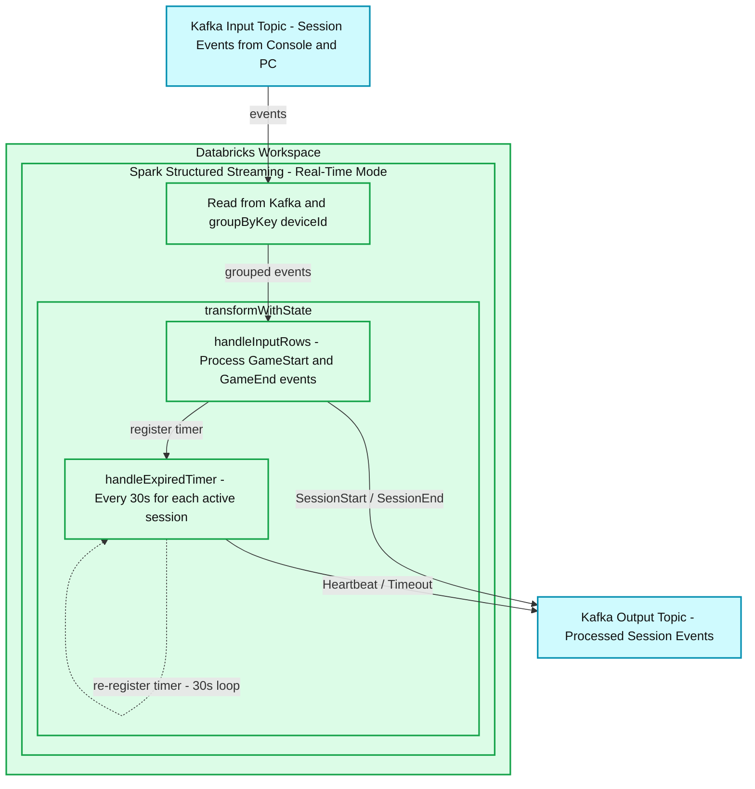
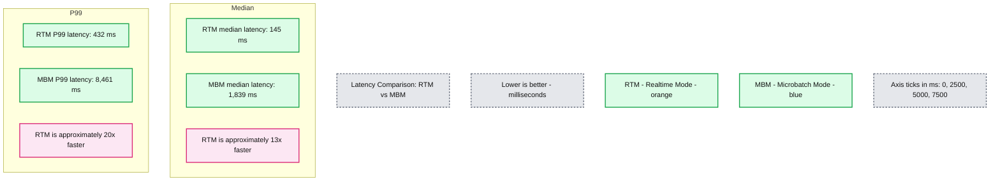

# Apache Spark Real-Time Mode for Gaming: A Better Way to Do Real-Time Sessionization

*Build stateful streaming pipelines that track millions of active gaming device sessions, producing real-time heartbeats with sub-second latency in Apache Spark*

- Source: https://www.databricks.com/blog/apache-spark-real-time-mode-gaming-better-way-do-real-time-sessionization
- Published: 2026-06-03
- Authors: Neha Prabhu, Murali Talluri
- Categories: data-engineering, industries, media-and-entertainment
- Images: 2 total, 2 extracted as architecture

**Key takeaways**

- Explore how Apache Spark™ Real-Time Mode enables real-time gaming sessionization for millions of active device sessions
- Learn how transformWithState timers power proactive, timer-driven heartbeats — generating output on a schedule, independent of incoming data
- See how Real-Time Mode paired with transformWithState replaces custom in-house applications and external streaming engines — delivering sub-second precision for both input processing and timer driven output.

In the gaming industry, every millisecond counts. To drive in-game personalization, fuel recommendation engines, and make dynamic content scheduling decisions, platforms must process session data for millions of global players with sub-second latency.

Today, meeting these ultra-low latency requirements no longer requires a disjointed architecture with multiple engines. In this blog, we explore a real-world implementation of [Apache Spark Real-Time Mode](https://www.databricks.com/blog/introducing-real-time-mode-apache-sparktm-structured-streaming). By leveraging the new [transformWithState](https://www.databricks.com/blog/introducing-transformwithstate-apache-sparktm-structured-streaming) operator for complex stateful logic, we demonstrate how Spark delivers end-to-end millisecond performance. Discover how your team can accelerate development and build mission-critical operational applications using the familiar Structured Streaming ecosystem.

## Use Case Overview 

### From Game Start to Game End - Why Session Tracking Matters

For gaming platforms, knowing which devices are active and for how long isn't just an infrastructure concern — it drives the business. Real-time session data powers personalized in-game experiences, fuels recommendation engines, informs content scheduling decisions, and provides device health signals across millions of consoles and PCs. Operations teams use it to enforce parental controls and detect abnormal session patterns.

### Session Event Fundamentals

Session events from both consoles and PCs flow into Kafka topics. Each event carries a device ID and a session ID. The device ID identifies the console or PC; the session ID identifies the gaming session. Only one session can be active per device at any time.

The pipeline handles four scenarios:

- Session Start (GameStart): A start event arrives. The pipeline stores the session ID and start time, emits a SessionActive event, and registers a 30-second processing-time timer. If another session was already active for that device, it ends the old one first.
- Session Heartbeat (Active): The timer fires every 30 seconds. The pipeline calculates now - start_time, emits a SessionActive heartbeat with the current duration, and re-registers the timer.
- Session End (GameEnd): An end event arrives matching the active session. The pipeline emits a SessionEnd with the final duration and clears the state.
- Session Timeout (GameSessionTimeout): The timer fires and the calculated duration exceeds a configurable maximum. Instead of emitting a heartbeat, the pipeline emits a SessionEnd with a timeout reason and cleans up the state.

### Why Spark with Real-Time Mode is a game changer

Spark Structured Streaming in micro-batch mode can handle stateful sessionization, but when the use case demands sub-second precision for both input processing and timer-driven output, micro-batch falls short. In the past, that gap pushed teams toward managing an additional specialized engines or building custom solutions.

**With Apache Flink: **State management and timers can be implemented, but adopting Flink means adopting an entire parallel ecosystem: a separate cluster, state backend, deployment model, monitoring stack, and codebase, all alongside the Databricks Data + AI Platform. The result is infrastructure fragmentation, operational complexity, and the cost of operating and staffing a second streaming engine.

**With custom in-house solutions: **Some teams build their own sessionization service — for example, an Akka-based actor system where each device gets an actor that manages session state, timers, and heartbeat emission. These carry the same infrastructure and operational overhead as Flink, with an additional challenge: they don't scale. Distributing millions of stateful actors across nodes is something you have to engineer yourself. These systems work initially, but over time end up in maintenance mode — stable enough to run, but not easily extendable.

Today, Real-Time Mode closes this gap for customers — delivering sub-second precision with the same Spark APIs teams already use, all in a single unified engine.

## Real-Time Mode with transformWithState

[transformWithState](https://www.databricks.com/blog/introducing-transformwithstate-apache-sparktm-structured-streaming) is a next-generation operator in Spark Structured Streaming that makes complex stateful processing flexible and scalable. Key features include object-oriented state management, composite data types, timer-driven logic, automatic TTL support, and schema evolution. Combined with Real-Time Mode, it delivers sub-second precision for both input processing and timer-driven output.

The gaming sessionization use case demands two things:

- **Reactive processing:** handling session starts and ends as they arrive.
- **Proactive output: **producing a heartbeat for every active session on a schedule, independent of incoming data

transformWithState delivers both in a single StatefulProcessor class with two dedicated methods.
handleInputRows() reacts to incoming Kafka events — processing session starts and session ends, maintaining sessionization state as events arrive. 

handleExpiredTimer() handles everything that happens in between — firing to produce proactive output like heartbeats and timeouts, independent of whether any new data has arrived.

## How It Works: Building a Real-Time Gaming Sessionization Pipeline

### Pipeline Architecture Overview

**Summary:** Kafka gaming session events flow through Spark Structured Streaming Real-Time Mode in Databricks, where stateful processing emits session events and timer-driven heartbeats or timeouts to Kafka.

**Components:**
- Kafka Input Topic: Apache Kafka topic containing session events from consoles and PCs.
- Databricks Workspace: Databricks environment enclosing stream processing.
- Spark Structured Streaming - Real-Time Mode: Spark streaming execution layer.
- Read from Kafka & groupByKey deviceId: Spark ingestion and grouping by device identifier.
- transformWithState: Spark stateful processing operator.
- handleInputRows(): Processes GameStart and GameEnd events.
- handleExpiredTimer(): Timer handler firing every 30 seconds for each active session.
- Kafka Output Topic: Apache Kafka topic containing processed session events.

**Flows:**
- Kafka Input Topic -> Read from Kafka & groupByKey deviceId: Session events.
- Read from Kafka & groupByKey deviceId -> handleInputRows(): Grouped events entering transformWithState.
- handleInputRows() -> handleExpiredTimer(): Register timer.
- handleInputRows() -> Kafka Output Topic: SessionStart / SessionEnd.
- handleExpiredTimer() -> Kafka Output Topic: Heartbeat / Timeout.
- handleExpiredTimer() -> handleExpiredTimer(): Re-register timer in a 30-second loop.

**Numbers:**
- 30s: Timer fires every 30 seconds for each active session.
- 30s loop: Timer re-registration interval.

source image: https://www.databricks.com/sites/default/files/inline-images/Kakfa-diagram-blog.png?v=1780304887

- Event Ingestion: Session events (starts and ends) from consoles and PCs arrive on Kafka topics. Each event is parsed, and a deviceId is derived from the device-specific identifier.
- Stateful Grouping: The stream is grouped by deviceId — ensuring all events for a given device are routed to the same stateful processor instance.
- Process: transformWithState applies the Sessionization processor, which uses a MapState keyed by session ID to track the active session per device. When a session start arrives, handleInputRows() stores the session state, emits a SessionActive event, and registers the first 30-second timer. From that point on, handleExpiredTimer() takes over — emitting heartbeats every 30 seconds and checking for timeouts. When a session end event arrives, handleInputRows() picks it back up — emitting a SessionEnd with the final duration, clearing the state, and stopping the timer loop.
- Output: Processed session events — starts, heartbeats, ends, and timeouts — are written as JSON to an output Kafka topic, ready for downstream consumption.

### Implementation Deep-Dive

For a detailed walkthrough of the architecture, code implementation, and production considerations, see this [companion blog](https://community.databricks.com/t5/technical-blog/apache-spark-s-real-time-mode-use-case-deep-dive-gaming/ba-p/157947)** **— where we walkthrough the StatefulProcessor code, timer lifecycle, state management patterns, and monitoring with StreamingQueryListener. The following results illustrate the throughput and latency characteristics of the pipeline, highlighting the significant latency differences between micro-batch mode (MBM) and Real-Time Mode (RTM):

#### Throughput

To validate the pipeline under realistic load, we tested with the following sustained throughput:

| **Metric (per minute)** | **Value** |
|---|---|
| Input events (session starts + ends) | ~500K |
| Number of Active sessions | ~4M |
| Heartbeat records emitted | ~8M |
| Input-to-output amplification | ~16x |

The vast majority of output is not triggered by incoming data — it's generated entirely by handleExpiredTimer(), proactively emitting heartbeats on a schedule.

#### Latency

Latency is measured end-to-end — from Kafka input topic timestamp to output topic timestamp. With Real-Time mode, the pipeline achieves 432ms p99 latency — 20x faster than micro-batch mode. 

**Summary:** Real-Time Mode has lower median and P99 latency than Microbatch Mode, with approximately 13x and 20x faster performance respectively.

**Components:**
- RTM: Realtime Mode, represented by orange bars.
- MBM: Microbatch Mode, represented by blue bars.
- Median Latency: comparison of median latency in milliseconds.
- P99 Latency: comparison of 99th-percentile latency in milliseconds.

**Flows:**
- none. No arrows are shown.

**Numbers:**
- Median latency: RTM 145 ms; MBM 1,839 ms.
- Median comparison: RTM is ~13x faster.
- P99 latency: RTM 432 ms; MBM 8,461 ms.
- P99 comparison: RTM is ~20x faster.
- Horizontal axis ticks: 0, 2500, 5000, 7500 milliseconds.
- Lower latency is better.

source image: https://www.databricks.com/sites/default/files/inline-images/Chart-Latency-Comparison-RTM-vs-MBM.png?v=1780304887

## Conclusion

Use cases like gaming sessionization require pipelines that go beyond processing incoming events — proactively emitting heartbeats on a schedule, tracking millions of concurrent sessions and managing state efficiently. The pattern isn't limited to gaming. Any workload that needs timer-driven output — IoT heartbeats, session tracking, real-time alerting, equipment monitoring — can be built the same way.

Timers in transformWithState make this possible. A single StatefulProcessor class handles the entire session lifecycle — reactive input processing and proactive timer-driven output. Paired with Real-Time Mode, input records are processed and timers fire with sub-second precision — not at the next batch interval, but now. All within Databricks, without a second engine.

If you're already running Structured Streaming pipelines in micro-batch mode and reaching for a second engine to hit lower latency, try [Real-Time Mode](https://docs.databricks.com/aws/en/structured-streaming/real-time/concepts) first. Switching is a single trigger change — no rewrites, no replatforming:

Try it yourself:

- [Companion notebook with data generator](https://github.com/databricks-solutions/databricks-blogposts/tree/main/2026-04-rtm-transformWithState-GamingSessionization): run the full gaming sessionization pipeline and compare MBM vs RTM latency yourself. 
- [transformWithState API guide](https://docs.databricks.com/aws/en/stateful-applications/): state variables, timers, TTL, and schema evolution
- [Real-Time Mode reference](https://docs.databricks.com/aws/en/structured-streaming/real-time/reference): supported operators, execution modes, sources, sinks, and language support

Real-Time mode is now Generally Available.
