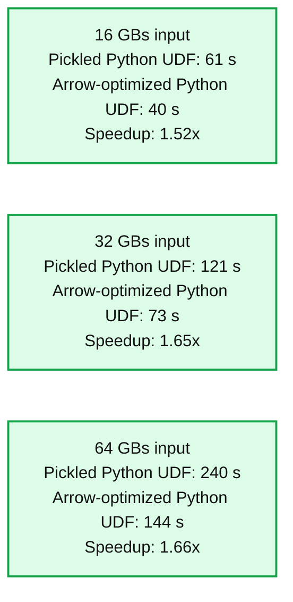
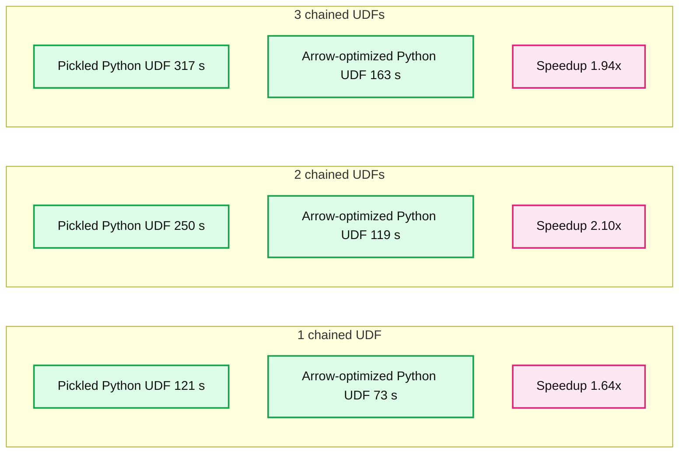

# Arrow-optimized Python UDFs in Apache Spark™ 3.5

- Source: https://www.databricks.com/blog/arrow-optimized-python-udfs-apache-sparktm-35
- Published: 2023-11-06
- Authors: Xinrong Meng, Hyukjin Kwon, Takuya Ueshin, Allan Folting
- Categories: engineering, data-engineering
- Images: 2 total, 2 extracted as architecture

In Apache Spark™, Python User-Defined Functions (UDFs) are among the most popular features. They empower users to craft custom code tailored to their unique data processing needs. However, the current Python UDFs, which rely on cloudpickle for serialization and deserialization, encounter performance bottlenecks, particularly when dealing with large data inputs and outputs.

In Apache Spark 3.5 and [Databricks Runtime 14.0](https://docs.databricks.com/en/release-notes/runtime/14.0.html), we introduce Arrow-optimized Python UDFs to significantly improve performance. At the core of this optimization lies [Apache Arrow](https://arrow.apache.org/), a standardized cross-language columnar in-memory data representation. By harnessing Arrow, these UDFs bypass the traditional, slower methods of data (de)serialization, leading to swift data exchange between JVM and Python processes. With Apache Arrow's rich type system, these optimized UDFs offer a more consistent and standardized way to handle type coercion.

Arrow optimization for Python UDFs is optional, and users can control whether or not to enable Arrow optimization for individual UDFs by using the `"useArrow"` boolean parameter of `"functions.udf"`. An example is as shown below:

In addition, users can enable Arrow optimization for all UDFs of an entire SparkSession via a Spark configuration: `"spark.sql.execution.pythonUDF.arrow.enabled"`, as shown below:

## Faster (De)serialization

Apache Arrow is a columnar in-memory data format that provides efficient data interchange between different systems and programming languages. Unlike Pickle, which serializes an entire Row as an object, Arrow stores data in a column-oriented format, allowing for better compression and memory locality, which is more suitable for analytical workloads.

The chart below shows the performance of an Arrow-optimized Python UDF performing a single transformation with a different-sized input dataset. The cluster consists of 3 workers and 1 driver, and each machine in the cluster has 16 vCPUs and 122 GiBs memory. The Arrow-optimized Python UDF is **~1.6** times faster than the pickled Python UDF.

**Summary:** Arrow-optimized Python UDFs execute faster than pickled Python UDFs across three input dataset sizes, with labeled speedups of 1.52x to 1.66x.

**Components:**
- Pickled Python UDF: Python UDF using pickle serialization, shown in blue.
- Arrow-optimized Python UDF: Python UDF using Arrow, shown in orange.
- Input dataset sizes: 16 GBs, 32 GBs, and 64 GBs.
- Execution time/s: vertical axis measuring execution time in seconds.

**Flows:**
- none. No arrows are shown.

**Numbers:**

| Input size | Pickled Python UDF | Arrow-optimized Python UDF | Labeled speedup |
|---|---:|---:|---:|
| 16 GBs | 61 s | 40 s | 1.52x |
| 32 GBs | 121 s | 73 s | 1.65x |
| 64 GBs | 240 s | 144 s | 1.66x |

Vertical axis ticks in seconds: 0, 50, 100, 150, 200, 250, 300.

source image: https://www.databricks.com/sites/default/files/inline-images/db-785-blog-img-1.png

Arrow-optimized Python UDF has a significant advantage in chaining UDFs. As shown below, in the same cluster, an Arrow-optimized Python UDF can execute **~1.9** times faster than a pickled Python UDF on a 32 GBs dataset.

**Summary:** Arrow-optimized Python UDFs execute faster than pickled Python UDFs across one, two, and three chained UDFs.

**Components:**
- Pickled Python UDF: Python UDF using pickle serialization, shown in blue.
- Arrow-optimized Python UDF: Python UDF using Arrow, shown in orange.
- Count of chained UDFs: horizontal axis.
- Execution time/s: vertical axis.

**Flows:**
- none. No arrows are shown.

**Numbers:**
- Chained UDF counts: 1, 2, 3.
- Execution time axis in seconds: 0, 50, 100, 150, 200, 250, 300, 350.
- 1 chained UDF: pickled 121 s, Arrow-optimized 73 s, labeled speedup 1.64x.
- 2 chained UDFs: pickled 250 s, Arrow-optimized 119 s, labeled speedup 2.10x.
- 3 chained UDFs: pickled 317 s, Arrow-optimized 163 s, labeled speedup 1.94x.

source image: https://www.databricks.com/sites/default/files/inline-images/db-785-blog-img-2.png

See [here](https://www.databricks.com/wp-content/uploads/notebooks/python-udf-benchmark.html) for a complete benchmark and results.

## Standardized Type Coercion

UDF type coercion poses challenges when the Python values returned by the UDF do not align with the user-specified return type. Unfortunately, the default, pickled Python UDF's type coercion has certain limitations, such as relying on None as a fallback for type mismatches, leading to potential ambiguity and data loss. Additionally, converting date, datetime, and tuples to strings can yield ambiguous results. Arrow-optimized Python UDFs address these issues by leveraging Arrow's well-defined set of rules for type coercion.

As shown below, an Arrow-optimized Python UDF`(useArrow=True)` successfully coerces integers stored as a string back to "int" as specified, but a pickled Python UDF `(useArrow=False)` falls back to "NULL".

Another example is shown below, where an Arrow-optimized Python UDF `(useArrow=True)` coerced a date to a string correctly whereas a pickled Python UDF `(useArrow=False)` returns ambiguous results by exposing the underlying Java objects.

Compared to Pickle, Arrow's type coercion aims to maintain as much information and precision as possible during the conversion process.

See [here](https://www.databricks.com/wp-content/uploads/notebooks/python-udf-type-coercion.html) for a comprehensive comparison between Pickled Python UDFs and Arrow-optimized Python UDFs regarding type coercion.

## Conclusion

Arrow-optimized Python UDFs utilize Apache Arrow for (de)serialization of UDF input and output, resulting in significantly faster (de)serialization compared to the default, pickled Python UDF. Additionally, it standardizes type coercion rules according to the Apache Arrow specifications. Arrow-optimized Python UDFs are available starting from Spark 3.5; see [SPARK-40307](https://issues.apache.org/jira/browse/SPARK-40307) for more information.
