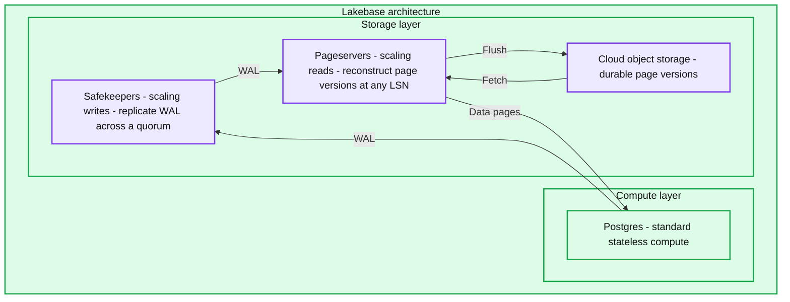
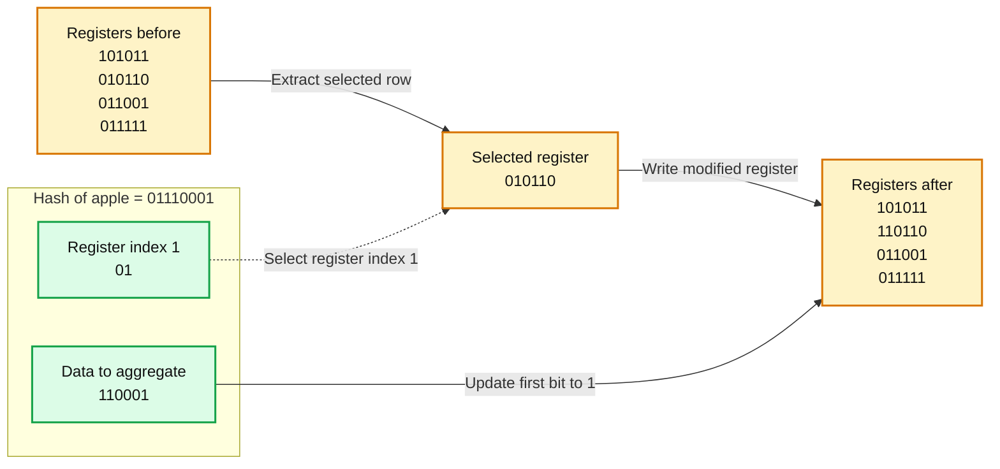
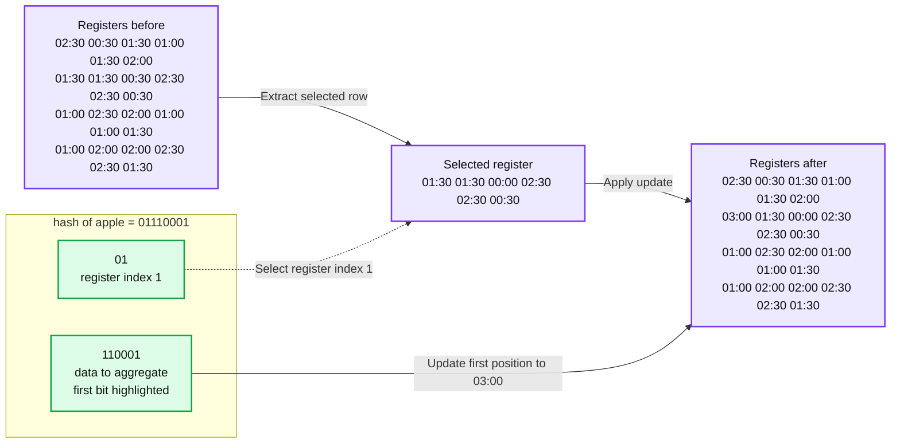
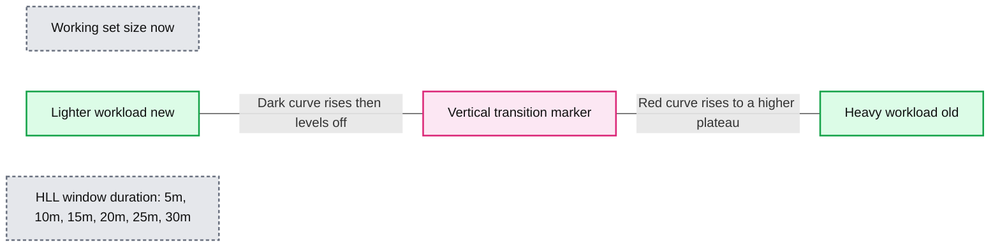
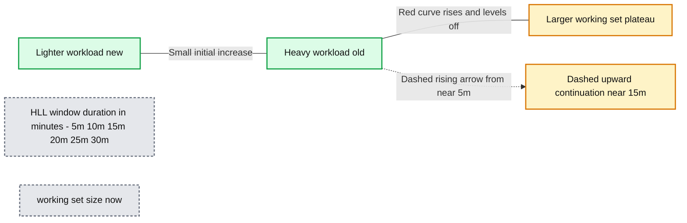
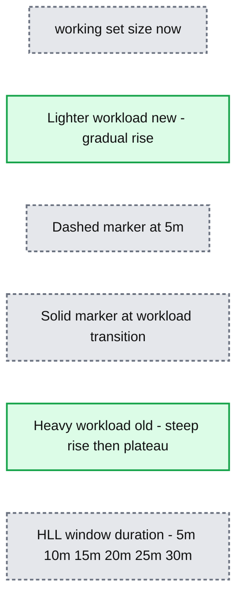
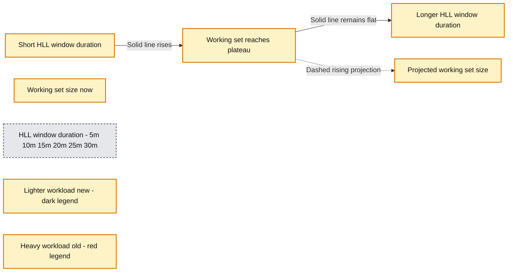
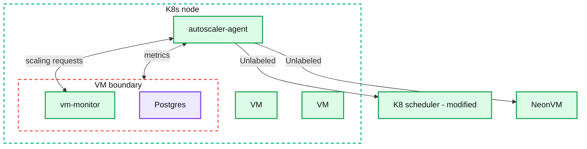
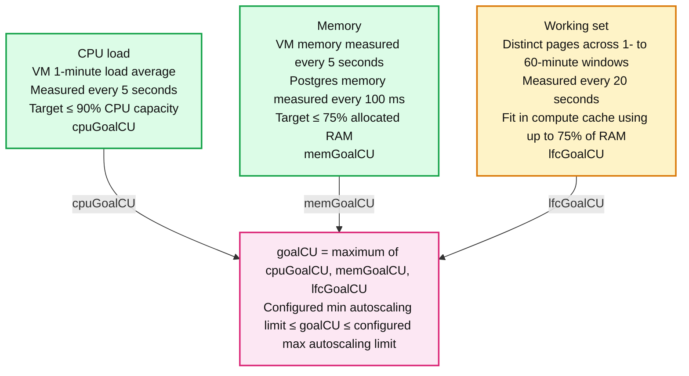

# Autoscaling Lakebase Postgres

*A deep dive into how we scale Postgres in real time*

- Source: https://www.databricks.com/blog/autoscaling-lakebase-postgres
- Published: 2026-08-31
- Authors: Carlota Soto
- Categories: engineering, data-engineering
- Images: 10 total, 10 extracted as architecture

**Key takeaways**

- Autoscaling architectural requirement
- When to adjust capacity up and down
- How to adjust capacity without stopping PostgreSQL

Choosing a database instance size before you know the workload is an old building pattern. The process is generally wonky and feels very wasteful of compute, especially [now that compute is becoming a luxury](https://www.reuters.com/business/retail-consumer/ai-chipflation-spreading-data-centers-wider-economy-morgan-stanley-warns-2026-06-03/).

Lakebase Postgres omits the sizing experience altogether thanks to autoscaling. Autoscaling responsiveness comes from in-place VM resizing and an algorithm that tracks CPU, memory, and the database’s working set.

**Summary:** Six unlabeled traces show compute capacity in CU changing over roughly one hour, with frequent adjustments and occasional spikes.

**Components:**
- Horizontal axis: time of day.
- Vertical axis: compute capacity in CU.
- Pale gray trace: upper capacity series, with stepped changes.
- Gray trace: middle capacity series, with stepped changes and spikes.
- Light gray trace: jagged capacity series, generally declining.
- Red trace: fluctuating capacity series with occasional spikes.
- Orange trace: lower capacity series with frequent spikes.
- Dark gray trace: lowest capacity series.
- No legend identifies the individual series or their technologies.

**Flows:**
- None. No arrows are visible.

**Numbers:**
- Vertical axis: 0 CU, 1 CU, 2 CU, 3 CU, 4 CU, 5 CU, 6 CU, 7 CU, 8 CU.
- Horizontal axis: 13:30, 13:35, 13:40, 13:45, 13:50, 13:55, 14:00, 14:05, 14:10, 14:15, 14:20, 14:25, 14:30.

```mermaid
%% Compute capacity over time with six unlabeled traces and no directional flows
flowchart TD
    Y[Compute capacity from 0 CU to 8 CU]
    A[Pale gray stepped trace]
    B[Gray stepped trace with spikes]
    C[Light gray jagged trace]
    D[Red fluctuating trace]
    E[Orange fluctuating trace]
    F[Dark gray low trace]
    X[Time from 13:30 to 14:30]

    classDef client fill:#dbeafe,stroke:#2563eb,stroke-width:2px,color:#111
    classDef service fill:#dcfce7,stroke:#16a34a,stroke-width:2px,color:#111
    classDef store fill:#ede9fe,stroke:#7c3aed,stroke-width:2px,color:#111
    classDef cache fill:#fef3c7,stroke:#d97706,stroke-width:2px,color:#111
    classDef queue fill:#cffafe,stroke:#0891b2,stroke-width:2px,color:#111
    classDef critical fill:#fee2e2,stroke:#dc2626,stroke-width:4px,color:#111
    classDef external fill:#e5e7eb,stroke:#6b7280,stroke-width:2px,color:#111,stroke-dasharray:4 3
    classDef decision fill:#fce7f3,stroke:#db2777,stroke-width:2px,color:#111
    class X,Y external
    class A,B,C,D,E,F service
```

source image: https://www.databricks.com/sites/default/files/blog_images/autoscaling-lakebase-postgres-blog-img-1.png

*How autoscaling looks like for an arbitrary sample of Lakebase Postgres databases. Note how this is only one hour.*

## The architectural requirement

Traditional Postgres runs as a stateful process tied to a machine and its disks; replacing or resizing that machine is a database operation because the machine owns both execution and durable state. But the [Lakebase Postgres architecture](https://docs.databricks.com/aws/en/oltp/projects/architecture) separates those responsibilities:

- The compute layer runs Postgres and executes queries. It uses RAM and local NVMe for low-latency access, and owns no durable state.
- The storage layer owns durability and history. WAL is replicated by safekeepers running on SSDs, pageservers (also SSDs) reconstruct page versions, and object storage keeps the long-term immutable record. *(This blog post focuses on compute, but *[*we wrote a deep dive on the storage piece*](https://www.databricks.com/blog/object-storage-wal-lakebase-postgres-agentic-era)* if you are also interested.)*

A compute node can therefore start, stop, move, or change size without moving the database underneath it. This is an essential foundation.

**Summary:** Lakebase separates stateless Postgres compute from storage, with Safekeepers replicating WAL, Pageservers reconstructing data pages, and cloud object storage retaining durable page versions.

**Components:**

- Lakebase architecture: enclosing system.
- Compute layer: stateless compute tier.
- Postgres: standard, stateless Postgres compute.
- Storage layer: tier containing Safekeepers, Pageservers, and cloud object storage.
- Safekeepers: WAL replication across a quorum for scaling writes.
- Pageservers: page reconstruction at any LSN for scaling reads.
- Cloud object storage: durable page versions.

**Flows:**

- Postgres -> Safekeepers: WAL.
- Safekeepers -> Pageservers: WAL.
- Pageservers -> Postgres: data pages.
- Pageservers -> Cloud object storage: flush.
- Cloud object storage -> Pageservers: fetch.

**Numbers:** none

source image: https://www.databricks.com/sites/default/files/blog_images/autoscaling-lakebase-postgres-blog-img-2.png

Now, when it comes to implementing autoscaling, there are two parts to the story: first, one has to determine *when* to adjust capacity up and down, and second, *how* to do it without stopping Postgres.

Let's cover both in order.

## Part I: The algorithm

### The three autoscaling signals

To deduce when to resize, the Lakebase Postgres autoscaling algorithm tracks three signals, with each signal producing its own target compute size:

1. CPU load: `cpuGoalCU`
2. Memory use: `memGoalCU`
3. Compute-cache working set size: `lfcGoalCU`

The final scaling target is the largest of the three, [constrained to the minimum and maximum compute sizes that the user has configured for that database (the autoscaling limits)](https://docs.databricks.com/aws/en/oltp/projects/autoscaling):

### CPU (cpuGoalCU)

CPU is the most straightforward of the three signals. The algorithm keeps a close watch on how hard the processor is working:

- Every **five seconds**, the autoscaler-agent reads the **VM’s one-minute CPU load average.**
- The CPU goal aims to keep that load at or below 90% of available CPU capacity.
- When the load rises above that target, `cpuGoalCU` increases. When sustained load falls, the goal falls with it.

Using a one-minute average filters very short fluctuations while still responding to meaningful changes in demand. The five-second polling interval lets the system update the target as that average moves.

CPU alone, however, is not enough to autoscale Postgres properly. A query waiting for data to arrive over the network can show low CPU use while performing poorly. The algorithm also needs to account for memory and cache pressure.

### Memory (memGoalCU)

Memory has a different failure mode from CPU. If demand briefly exceeds the available CPU, queries become slower; but if Postgres allocates more memory than the VM has, the kernel can terminate processes. The autoscaler therefore needs a much faster signal than CPU for memory exhaustion.

So the system watches memory at two frequencies:

- **Every five seconds**, the autoscaler-agent reads **overall memory metrics from the VM.**
- **Every 100 milliseconds**, the vm-monitor checks **memory used by Postgres**.

The memory goal keeps use below 75% of allocated RAM. That headroom gives the system space to respond to new allocations and leaves memory for the guest operating system and other processes.

The vm-monitor also checks every proposed downscale. Memory cannot be removed if doing so would leave the running processes without enough space.

**A bit of history:** This polling approach replaced an earlier design based on the cgroup `memory.high` event. Crossing `memory.high` caused Linux to reclaim memory and throttle the processes inside the cgroup. Polling proved more predictable and stable while still giving the system a 100-millisecond view of Postgres memory.

### The compute cache (lfcGoalCU)

The third signal measures whether the workload’s active data fits close to Postgres. The high level story is this:

Lakebase Postgres separates storage and compute; when a page is not available locally, the compute requests it from the pageserver; the returned page is cached for subsequent reads. The compute cache, which we originally called the Local File Cache or (LFC), is a disk-backed cache sized to fit in the kernel page cache. It acts as a resizable extension of Postgres shared buffers. When a compute grows, the vm-monitor expands the cache to use part of the added memory.

For many OLTP workloads, performance changes sharply once the working set fits in local memory. This exposes a blind spot in CPU-only autoscaling: cache misses leave queries waiting on network requests, which reduces CPU use. The system may therefore see low CPU pressure at the exact moment when a larger cache would improve performance. So in Lakebase Postgres, there’s a third autoscaling signal that estimates the Postgres working set directly.

This is the most interesting part of the algorithm, so let’s look at how that estimate works.

### Zooming in: how we estimate the Postgres working set

A workload’s working set is the set of database and index pages it accesses repeatedly over a given period. To exactly count every page for the purpose of autoscaling would require too much memory, so the classic way to solve for this is to rely on [HyperLogLog](https://en.wikipedia.org/wiki/HyperLogLog), a probabilistic cardinality estimator that can estimate the number of distinct items in a set using a small, fixed amount of state.

For each Postgres page access, a standard HyperLogLog implementation,

1. Hashes the page identifier.
2. Uses the first bits of the hash to select a register.
3. Counts the leading zeroes in the remaining bits.
4. Updates the selected register if this observation exceeds its previous value.

The distribution of those register values would provide an estimate of how many distinct pages have been observed.

**Summary:** A hash is split into register-selection bits and data to aggregate, updating one bit in the selected register.

**Components:**

- Registers, left: initial binary register array.
- hash("apple"): binary hash value split into register index and aggregation data.
- register index 1: first two hash bits, `01`, select the second register.
- Selected register: intermediate binary row `010110`.
- data to aggregate: remaining hash bits `110001`.
- Registers, right: updated binary register array with the selected row’s first bit highlighted as `1`.

**Flows:**

- Initial registers -> Selected register: extract row `010110`.
- Register index -> Register selection: dashed arrow identifies register index `1`.
- Selected register -> Updated registers: write the modified register.
- Data to aggregate -> Register update: solid arrow directs aggregation data to the update.

**Numbers:**

- Hash: `01110001`, split into `01` and `110001`; the first bit of `110001` is highlighted.
- Register index: `1`.
- Initial rows: `101011`, `010110`, `011001`, `011111`.
- Selected row: `010110`.
- Updated rows: `101011`, `110110`, `011001`, `011111`.
- Highlighted register bit changes from `0` to `1`.

source image: https://www.databricks.com/sites/default/files/blog_images/autoscaling-lakebase-postgres-blog-img-3.png

However, there’s an issue with simply using HyerLogLog for autoscaling: a standard HyperLogLog only grows. Once a register has observed a value, it cannot tell which item produced it or when that item was last seen.

That makes it good at answering, “How many distinct pages has this compute accessed since Postgres started?” But autoscaling needs a different answer, closer to “How many distinct pages belong to the workload running now?”

Without a time boundary, an old import or analytical query would remain in the estimate and keep the compute oversized long after that work ended. So we changed what the HyperLogLog registers store.

### Adding time to HyperLogLog

This is how things actually work in Lakebase Postgres:

Instead of setting a bit when a hash is observed, the estimator stores the current timestamp at that position. To estimate cardinality since time `T`, it treats positions updated after `T` as set and older positions as unset.

**Summary:** A timestamp-based register update uses the hash of apple to select register index 1 and update its first position to 03:00.

**Components:**
- Left Registers: a 4-by-6 timestamp register array.
- hash of apple: the binary value 01110001, divided into register-selection bits and data to aggregate.
- register index 1: the first two hash bits, 01, select a register row.
- Middle register: six timestamp positions from the selected row.
- data to aggregate: the remaining six hash bits, 110001, with the first bit highlighted.
- Right Registers: the resulting timestamp register array, with 03:00 highlighted.

**Flows:**
- Left Registers -> Middle register: extract the selected register row.
- register index 1 -> Register extraction: the prefix 01 identifies row 1.
- Middle register -> Right Registers: apply the register update.
- data to aggregate -> Right Registers: the hash suffix identifies the position updated to 03:00.

**Numbers:**
- Hash bits: 0 1 1 1 0 0 0 1.
- Register index: 1.
- Left register array, by row:
  - 02:30, 00:30, 01:30, 01:00, 01:30, 02:00
  - 01:30, 01:30, 00:30, 02:30, 02:30, 00:30
  - 01:00, 02:30, 02:00, 01:00, 01:00, 01:30
  - 01:00, 02:00, 02:00, 02:30, 02:30, 01:30
- Middle register: 01:30, 01:30, 00:00, 02:30, 02:30, 00:30.
- Right register array, by row:
  - 02:30, 00:30, 01:30, 01:00, 01:30, 02:00
  - 03:00, 01:30, 00:00, 02:30, 02:30, 00:30
  - 01:00, 02:30, 02:00, 01:00, 01:00, 01:30
  - 01:00, 02:00, 02:00, 02:30, 02:30, 01:30
- Timestamp units are not explicitly labeled.

source image: https://www.databricks.com/sites/default/files/blog_images/autoscaling-lakebase-postgres-blog-img-4.png

*Modified HyperLogLog in Lakebase Postgres autoscaling.*

This produces an estimate for any window ending at the present, including

- Distinct pages accessed in the last minute
- Distinct pages accessed in the last five minutes
- Distinct pages accessed in the last hour

So, going back to the algorithm, this is how the granularity actually works: **every 20 seconds**, the autoscaler-agent collects **working-set estimates for windows from one to 60 minutes**.

But the story does not end here. As surely you’re noticing, this is a wide time window. How do we actually choose it?

### Choosing the working set time window

The problem is this: there is no universal window that describes a database’s current working set. If we pick a short window, the autoscaling engine responds quickly when a workload ends, but it would discard cache too aggressively between bursts. If we pick a long window, the algorithm would protect the cache, but it would also keep memory allocated for work that is no longer running.

The algorithm solves this by looking at how the working set changes overtime. For example: for a steady workload, the estimated number of pages initially grows, and then levels off. Extending the window adds time, but few new pages are added, because the same working set is being accessed repeatedly.

**Summary:** Working set size levels off for the current lighter workload, then rises to a higher plateau when the HLL window includes the older heavy workload.

**Components:**
- Working set size (now): vertical axis showing estimated working set size.
- HLL window duration: horizontal axis showing the HyperLogLog window length.
- Lighter workload (new): dark curve rising toward the lower plateau.
- Heavy workload (old): red curve rising toward the higher plateau.
- Vertical marker: marks the transition between the two curves.

**Flows:**
- none. The curves show working set estimates, with no directional arrows.

**Numbers:** 5m, 10m, 15m, 20m, 25m, 30m.

source image: https://www.databricks.com/sites/default/files/blog_images/autoscaling-lakebase-postgres-blog-img-5.png

Now, consider a heavy workload that ended recently. Short windows contain only the current, lighter workload; but once the window reaches far enough into the past to include the previous workload, the estimate jumps. The algorithm searches for that jump, which marks the end of the current plateau.

**Summary:** Working set size increases with HLL window duration, transitioning from a small contribution from the new lighter workload to a larger plateau from the old heavy workload.

**Components:**
- working set size (now): vertical axis showing the current working set estimate.
- HLL window duration: horizontal axis showing the HyperLogLog measurement window.
- Lighter workload (new): dark line covering the shortest windows.
- Heavy workload (old): red curve rising and then leveling off for longer windows.

**Flows:**
- Red curve near 5m -> dashed arrow near 15m: upward continuation toward a larger working set estimate.

**Numbers:** 5m, 10m, 15m, 20m, 25m, 30m.

source image: https://www.databricks.com/sites/default/files/blog_images/autoscaling-lakebase-postgres-blog-img-6.png

In short:

The implementation starts its search after five minutes. This prevents the compute from shrinking immediately during a short pause and then regrowing for the next burst. But if the algorithm finds no sharp increase, it uses the 60-minute estimate - that is the expected result for a stable workload whose working set remains active throughout the hour.

**Summary:** Working set size increases with HLL window duration, rising slowly for the new lighter workload and steeply for the old heavy workload before reaching a plateau.

**Components:**
- working set size (now): vertical axis; no numeric scale shown.
- HLL window duration: horizontal axis using HLL windows.
- Lighter workload (new): dark line with a gradual increase.
- Heavy workload (old): red curve with a steep increase followed by a plateau.
- Dashed vertical marker: positioned at 5 minutes.
- Solid vertical marker: positioned at the transition between the two workloads.

**Flows:**
- none; the lines represent plotted trends and markers, with no arrows.

**Numbers:** 5m, 10m, 15m, 20m, 25m, 30m.

source image: https://www.databricks.com/sites/default/files/blog_images/autoscaling-lakebase-postgres-blog-img-7.png

### Projecting cache growth

There’s one last piece to it. Measuring the current working set lands slightly too late: suppose a workload begins scanning a new set of pages. If the compute cache grows only after those pages have been read, early pages may already have been evicted to make room for later ones. The cache then has to fetch some of the same data again.

So the algorithm also *projects working-set growth forward*. It examines how the estimate increases from one duration to the next and allocates enough cache for the working set expected by the next control interval.

Because cache metrics are fetched every 20 seconds, the projection covers only a fraction of a minute. Longer projections would react earlier, but they would also amplify brief spikes and make the compute oscillate.

**Summary:** Working set size rises with HLL window duration before plateauing, while a dashed extension projects continued growth.

**Components:**
- working set size (now): vertical axis showing current working set size.
- HLL window duration: horizontal axis showing the HyperLogLog measurement window.
- projected working set size: dashed extrapolation ending at a short horizontal marker.
- Lighter workload (new): dark series rising and then remaining flat.
- Heavy workload (old): red legend entry with no visible plotted series.

**Flows:**
- No arrows are visible. The solid line shows growth followed by a plateau; the dashed line extends the rising trend.

**Numbers:** 5m, 10m, 15m, 20m, 25m, 30m.

source image: https://www.databricks.com/sites/default/files/blog_images/autoscaling-lakebase-postgres-blog-img-8.png

The projected size (finally!) becomes `lfcGoalCU`. And the algorithmic goal is to fit the working set within the portion of memory available to the compute cache, up to 75% of the compute’s RAM.

## Part II: Resizing the running compute

To recap: the scaling target was,

Those three signals tell the system what size to aim for. Applying that size means changing CPU and memory on a running VM without interrupting Postgres.

Each Postgres instance in Lakebase Postgres runs inside its own virtual machine in a Kubernetes cluster. We use VMs because they provide a strong isolation boundary and, unlike a conventional container allocation, allow CPU and memory to be added to or removed from a running guest.

Four components coordinate each compute resize:

1. **The autoscaler-agent** runs on every Kubernetes node. It collects metrics from the Postgres VMs on that node, calculates target sizes, and initiates scaling.
2. **The vm-monitor** runs inside each VM. It watches Postgres memory closely, validates downscaling requests, and resizes the compute cache.
3. **A modified Kubernetes scheduler** maintains the global view of available resources. Every upscale must be approved by the scheduler before memory is committed.
4. **NeonVM** applies the change. It is a custom Kubernetes resource and controller, built with QEMU and KVM, that can add or remove CPU and memory from a running VM. (Disclaimer: Lakebase Postgres architecture started in Neon and the resource/controller name remains the same).

**Summary:** A Kubernetes node hosts an autoscaler-agent and VMs, with connections to a modified scheduler and NeonVM and exchanges of metrics and scaling requests.

**Components:**

- K8s node: Kubernetes node enclosing the agent and VMs.
- K8 scheduler, modified: Modified Kubernetes scheduler.
- autoscaler-agent: Autoscaling component running on the node.
- NeonVM: External component labeled NeonVM.
- Large dashed VM boundary: Contains vm-monitor and Postgres.
- vm-monitor: VM monitoring component.
- Postgres: PostgreSQL database inside the VM.
- VM, left: Additional virtual machine.
- VM, right: Additional virtual machine.

**Flows:**

- autoscaler-agent -> K8 scheduler: Unlabeled connection.
- autoscaler-agent -> NeonVM: Unlabeled connection.
- autoscaler-agent -> VM boundary: Metrics.
- VM boundary -> autoscaler-agent: Metrics.
- autoscaler-agent -> vm-monitor: Scaling requests.
- vm-monitor -> autoscaler-agent: Scaling requests.

**Numbers:** none

source image: https://www.databricks.com/sites/default/files/blog_images/autoscaling-lakebase-postgres-blog-img-9.png

### Scaling up

As we just saw, scaling up happens when one of the three goals calls for more compute than the VM currently has. An upscale follows this sequence:

1. The autoscaler-agent calculates the new target from the CPU, memory, and working-set goals.
2. The Kubernetes scheduler checks whether the node can satisfy the request without overcommitting memory.
3. Once approved, the autoscaler-agent updates the NeonVM resource.
4. The NeonVM controller adds CPU and memory to the running VM.
5. The vm-monitor expands the compute cache to use the new capacity.

The scheduler is the single source of truth for allocation. It sees both ordinary Kubernetes scheduling and autoscaling requests. Without that coordination, the scheduler could place a new workload on a node at the same moment the autoscaler committed the remaining memory to a Postgres VM.

If a node is too full to grow in place, NeonVM can live-migrate the VM to another node. The VM keeps its IP address, so existing connections stay open. Lakebase Postgres computes have little durable local state to move, so migration is mostly VM memory and runtime state.

### Scaling down

A downscale uses the exact same components, with one extra check inside the VM. The vm-monitor confirms that removing memory will still leave enough for Postgres and the rest of the guest. If it would not, the downscale does not proceed.

**Admonition: Scaling down counts as much as scaling up. **Some autoscaling systems are quick to add capacity but slow to give it back, leaving databases oversized long after a spike has passed. Lakebase Postgres treats both directions the same way. The goal is to track the workload as closely as possible moment to moment, so you stop paying for capacity as soon as you stop needing it.

## Wrap up

Lakebase Postgres watches the workload as it runs and resizes compute to match in real time. The lakebase architecture makes this possible: since storage is decoupled and durable on its own, compute is free to move without worrying about the data.

The resulting system scales in both directions, on a live database, without dropping connections. Most importantly, it looks past the obvious signal: tracking CPU alone would miss a workload stalled on cache misses, so the algorithm also tracks memory pressure and a time-aware estimate of the working set.

The final loop runs at three timescales:

- 100 milliseconds: the vm-monitor checks Postgres memory to catch rapid allocation
- 5 seconds: the autoscaler-agent reads CPU and overall memory
- 20 seconds: the autoscaler-agent evaluates working-set estimates across windows from one to 60 minutes

That is how a production database can change size more than [32,000 times per month](https://neon.com/autoscaling-report).

**Summary:** Lakebase Postgres chooses the largest compute target derived from CPU load, memory usage, and working-set size, subject to configured autoscaling limits.

**Components:**
- CPU load: VM 1-minute load average produces `cpuGoalCU`, targeting at most 90% CPU capacity.
- Memory: Overall VM memory and Postgres memory produce `memGoalCU`, targeting at most 75% allocated RAM.
- Working set: Distinct pages accessed across time windows produce `lfcGoalCU`, targeting a fit in the compute cache using up to 75% of RAM.
- Compute target: `goalCU = max(cpuGoalCU, memGoalCU, lfcGoalCU)`.
- Autoscaling limits: Configured minimum and maximum constrain `goalCU`.

**Flows:**
- CPU load -> Compute target: `cpuGoalCU`.
- Memory -> Compute target: `memGoalCU`.
- Working set -> Compute target: `lfcGoalCU`.

**Numbers:**
- CPU load: 1-minute load average, measured every 5 seconds; target ≤ 90% CPU capacity.
- Memory: Overall VM memory measured every 5 seconds; Postgres memory measured every 100 ms; target ≤ 75% allocated RAM.
- Working set: 1- to 60-minute windows, measured every 20 seconds; compute cache uses up to 75% of RAM.
- Bounds: configured minimum autoscaling limit ≤ `goalCU` ≤ configured maximum autoscaling limit; no numeric limits shown.

source image: https://www.databricks.com/sites/default/files/blog_images/autoscaling-lakebase-postgres-blog-img-10.png

As compute gets more expensive and more contested, paying for a peak you rarely reach is a building pattern that might not be possible very soon. Autoscaling prepares Postgres for workloads where wasted compute is not an option.

## Run it

Ask your agent to deploy Lakebase Postgres and put it autoscaling to the test. [Get started here](https://login.databricks.com/signup?itm_source=www&itm_category=product&itm_page=lakebase&itm_location=body&itm_component=centered-hero-text&itm_offer=signup&tuuid=c233e6b3-eaed-4f75-b8b5-4761defb1d81&intent=SIGN_UP&dbx_source=www&rl_aid=50d67422-d812-4b7b-afe6-9bf2c7264fb2&sisu_state=eyJsZWdhbFRleHRTZWVuIjp7Ii9zaWdudXAiOnsicHJpdmFjeSI6dHJ1ZSwiY29ycG9yYXRlRW1haWxTaGFyaW5nIjp0cnVlfX19).

*Lakebase Postgres can be used as a standalone database, and you can also integrate it with the rest of the Databricks Data + AI Platform: Unity Catalog governance, lakehouse analytics, notebooks, and AI workflows.*
