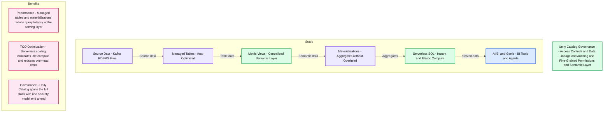
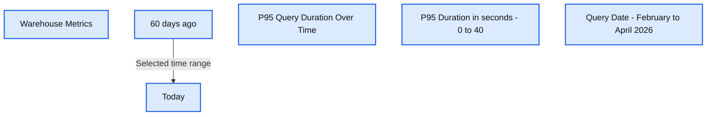
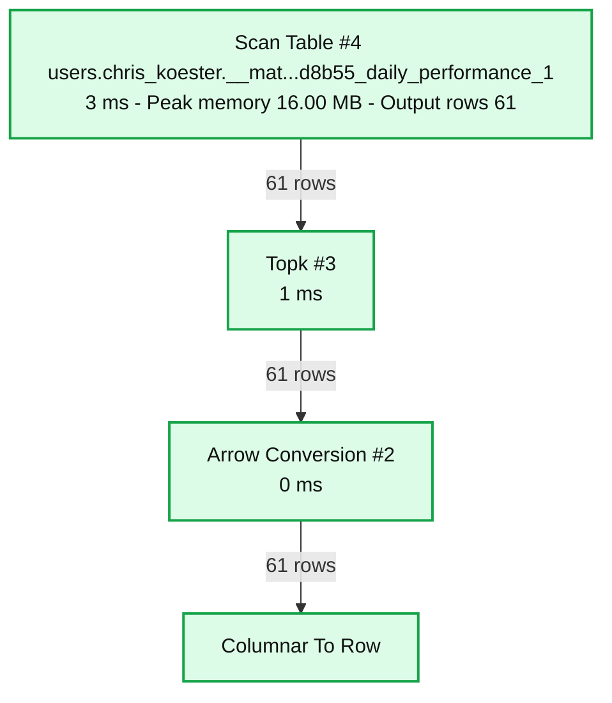

# BI Serving Pointers; Maximizing for Performance and TCO

*A bottom-up guide to the Databricks BI serving stack — from physical layout to governed metrics to aggregate-aware materialization*

- Source: https://www.databricks.com/blog/bi-serving-pointers-maximizing-performance-and-tco
- Published: 2026-05-27
- Authors: Chris Koester
- Categories: platform, data-warehousing
- Images: 4 total, 4 extracted as architecture

**Key takeaways**

- Structure your physical layer with star schemas, liquid clustering, and Predictive Optimization to accelerate BI queries.
- Define governed business metrics once with Unity Catalog Metric Views — a headless semantic layer that serves every BI tool, Genie space, and AI agent from a single source of truth.
- Enable aggregate-aware materialization to get OLAP-style pre-aggregated performance without building and maintaining separate aggregate tables.

Your BI dashboards are slow, and tuning them is costing too much time and money.

It's a familiar pattern. A dashboard query takes 30 seconds, so someone builds an aggregate table to speed it up. That table needs a refresh pipeline. The pipeline needs monitoring. Then a second BI tool needs the same data in a slightly different shape, so someone builds another aggregate table using a separate pipeline. Before long, you're managing a sprawl of aggregates, extracts, and tool-specific semantic layers — each with its own staleness window, its own governance gaps, and its own line item on the compute bill.

BI workloads are different from other analytical workloads. They're highly concurrent, latency-sensitive, and repetitive in their query patterns. That combination demands a deliberate approach to modeling, storing, optimizing, and serving data. The good news: Databricks provides a full stack for BI serving — from physical data layout to a governed semantic layer — and each layer compounds the performance gains of the layer below it.

This post walks through that stack bottom-up, with practical guidance on where to focus for the biggest improvements in query performance and cost.

## The BI Serving Stack

Before diving into each layer, here's the full picture:

**Summary:** The BI serving stack connects source data to AI/BI consumption through managed tables, metric views, materializations, and Serverless SQL, with Unity Catalog governance spanning the stack.

**Components:**
- Source Data: Kafka, RDBMS, and files.
- Managed Tables: auto-optimized tables.
- Metric Views: centralized semantic layer.
- Materializations: aggregates without overhead.
- Serverless SQL: instant and elastic compute.
- AI/BI | Genie: BI tools and agents.
- Unity Catalog Governance: access controls, data lineage, auditing, fine-grained permissions, and semantic layer.
- Performance: managed tables and materializations reduce query latency at the serving layer.
- TCO Optimization: serverless scaling eliminates idle compute and reduces overhead costs.
- Governance: Unity Catalog spans the full stack with one security model end to end.

**Flows:**
- Source Data -> Managed Tables: source data enters managed tables.
- Managed Tables -> Metric Views: table data feeds the semantic layer.
- Metric Views -> Materializations: semantic data feeds aggregates.
- Materializations -> Serverless SQL: aggregates feed serving compute.
- Serverless SQL -> AI/BI | Genie: served data reaches BI tools and agents.

**Numbers:** none

source image: https://www.databricks.com/sites/default/files/inline-images/unity-catalog-governance1.png

Unity Catalog provides governance throughout — lineage and access control from raw data through semantics to consumption. Each layer addresses a different aspect of performance and cost. Let's walk through them.

## Optimize the Physical Layer

The physical layer is where most BI performance is won or lost. Get this right and every query benefits — before you've touched the semantic layer.

### Start with Dimensional Modeling

Star schemas remain the gold standard for BI query performance. Wide, denormalized dimension tables joined to fact tables via surrogate keys give the query optimizer clean, predictable join paths.

Databricks fully supports the relational modeling constructs you need: primary and foreign key constraints (with `RELY` for optimizer hints), identity columns for surrogate keys, and `CHECK` and `NOT NULL` constraints. If you're following a medallion architecture, keep your normalized or Data Vault models in Silver and build denormalized star schemas in Gold for BI consumption.

For detailed implementation patterns — SCD Type-1 and Type-2 handling, fact table ETL with `MERGE`, late-arriving dimensions — see the [Implementing a Dimensional Data Warehouse in Databricks SQL](https://www.databricks.com/blog/implementing-dimensional-data-warehouse-databricks-sql-part-1) blog series.

### Use Managed Tables

Unity Catalog [managed tables](https://docs.databricks.com/aws/en/tables/managed) are the foundation for everything else in this stack. Unity Catalog manages all read, write, storage, and optimization responsibilities for managed tables. This unlocks automatic features you don't get with external tables: **Predictive Optimization** (covered below) is enabled by default. **Automatic liquid clustering** selects clustering keys that adapt as query patterns change. **Metadata caching** is always on, reducing cloud storage requests and speeding up query planning.

Use managed tables throughout the platform — not just for BI-serving, but across Bronze, Silver, and Gold layers. They're the default table type in Unity Catalog, and the performance and governance benefits compound with every other optimization in this stack.

### Apply Liquid Clustering

[Liquid clustering](https://docs.databricks.com/aws/en/delta/clustering) replaces static partitioning and manual `Z-ORDER` — and unlike those approaches, you can redefine clustering keys without rewriting existing data. Add CLUSTER BY `(col1, col2)` at table creation or use `ALTER TABLE` on existing tables. If you're not sure which columns to choose, `CLUSTER BY AUTO` lets Predictive Optimization select keys based on observed query patterns.

For BI workloads, cluster on your most common filter and join columns — date keys, region, product category. You can select up to four columns, and if two columns are highly correlated, include only one. When dashboards filter on cluster columns, liquid clustering improves query performance through data skipping.

### Let Predictive Optimization Handle the Rest

Predictive Optimization automatically runs `OPTIMIZE`, `VACUUM`, and statistics collection on tables that would benefit from these operations — so you don't need to schedule these jobs yourself. It collects both Delta data-skipping statistics and query optimizer statistics during Photon writes, and back-fills stats for existing tables. In observed workloads, this delivered an [average 22% performance improvement](https://www.databricks.com/blog/introducing-predictive-optimization-statistics). For BI workloads with repetitive filter patterns, the impact is especially significant — better statistics mean better data skipping and more efficient query plans.

Enable Predictive Optimization at the catalog level and let it run. Using Predictive Optimization is one of the highest-return, lowest-effort optimizations you can make.

**The result:** BI queries scan less data, join more efficiently, and cost less to run — and you haven't touched the semantic layer yet.

## Metric Views: Define Your Metrics Once

Here's where things get interesting. Most organizations have the same business metrics defined in multiple places — a revenue calculation in one BI tool, a slightly different one in another, a third variant in a SQL notebook someone wrote last quarter. Each definition drifts independently. Nobody's sure which one is right.

[Metric Views](https://www.databricks.com/blog/redefining-semantics-data-layer-future-bi-and-ai) in Unity Catalog solve this by providing a headless BI layer — a single, governed semantic layer where you define your data model and KPIs once, independent of any specific BI tool. You define them centrally in SQL or the point-and-click UI in Unity Catalog Explorer. AI/BI Dashboards, Genie, SQL notebooks, and third-party BI tools all resolve metrics from the same definitions. Define a metric once, and every consumer — human or AI — gets the same answer.

Metric Views go beyond centralized metric definitions — the semantic metadata is what sets them apart. Fields like `display_name`, `comment`, and `synonyms` give AI systems the context they need to interpret business questions correctly. When a user asks Genie "what was our revenue last week?", those annotations are how Genie maps natural language to the right measure and dimensions. No custom prompts, no separate glossary. The same applies to AI agents built on Databricks — any agent with access to Unity Catalog can discover and query governed metrics through the semantic layer instead of hard-coded SQL. The richer your metadata, the more accurately AI serves the right answer.

Here's an example using a system table, since every Databricks customer has access — but the same pattern applies to business KPIs like revenue, order volume, or customer retention. This Metric View calculates DBSQL warehouse metrics:

Consumers query the Metric View using `MEASURE()` to reference the governed metric definitions:

The metrics are defined once in the Metric View. Every dashboard, Genie space, or notebook that queries `metv_dbsql_metrics` gets the same result. Below is a dashboard using the metric view as a source.

**Summary:** Warehouse Metrics tracks P95 query duration in seconds over the last 60 days, with the largest visible peak near 33 seconds in late March.

**Components:**
- Warehouse Metrics: dashboard; underlying technology is not identified in the image.
- Time Range: dashboard date filter, from 60 days ago to Today.
- P95 Query Duration Over Time: line chart of query latency.
- P95 Duration in seconds: vertical axis.
- Query Date: horizontal axis.
- Dashboard controls: Edit draft, Schedule, Share, and Reset all to default.

**Flows:**
- 60 days ago -> Today: selected time interval. No system or data-flow arrows are shown.

**Numbers:**
- Time Range: Last 60 days; 60 days ago.
- Refresh indicator: 1m ago.
- Metric: P95 query duration.
- Vertical axis: 0, 10, 20, 30, 40 seconds.
- Horizontal axis: Feb 22, 2026; Mar 01, 2026; Mar 08, 2026; Mar 15, 2026; Mar 22, 2026; Mar 29, 2026; Apr 05, 2026; Apr 12, 2026; Apr 19, 2026.
- Line values are not individually labeled; the highest point is approximately 33 seconds.

source image: https://www.databricks.com/sites/default/files/inline-images/warehouse-metrics2.png

Here's Genie using the same metric view.

**Summary:** Daily query counts for warehouse `4b9b953939869799` range from approximately 17,500 to 488,000 over the last 60 days, with prominent peaks on March 31 and April 7.

**Components:**
- Warehouse `4b9b953939869799`: processes the queries; technology is not explicitly labeled.
- Daily Query Count Over Last 60 Days: line chart showing query volume.
- Date: horizontal axis.
- Query Count: vertical axis.

**Flows:**
- none. The line connects daily observations; no arrows are shown.

**Numbers:**
- Period: last 60 days.
- Warehouse identifier: `4b9b953939869799`.
- Daily range: approximately 17,500 to 488,000 queries.
- March 31: approximately 317K queries.
- April 7: approximately 488K queries.
- Vertical ticks: 0, 200K, 400K, 600K queries.
- Horizontal ticks: Feb 22, 2026; Mar 01, 2026; Mar 08, 2026; Mar 15, 2026; Mar 22, 2026; Mar 29, 2026; Apr 05, 2026; Apr 12, 2026; Apr 19, 2026.
- Citation marker: 1.

source image: https://www.databricks.com/sites/default/files/inline-images/daily-query-count3.png

For teams with metric definitions scattered across multiple BI tools, Metric Views provide a path to consolidate the semantic layer into Databricks. Instead of maintaining separate metric logic in each tool, you define it once in Unity Catalog and connect your BI tools to that governed source.

The core implementation is open-sourced in Apache Spark™ ([SPARK-54119](https://issues.apache.org/jira/browse/SPARK-54119)), with Unity Catalog OSS support coming — so you're building on an open standard with no vendor lock-in. That openness matters more as AI takes on more of the BI workload. Agents querying your data need a consistent, machine-readable definition of what each metric means, and an open standard lets any tool or agent — not just vendor-specific ones — reason over the same governed metrics.

## Metric View Materialization: OLAP Performance Without the Overhead

Traditionally, when BI dashboards were too slow, the answer was to build aggregate tables. You'd create materialized views or custom pre-aggregation tables on top of your star schema, set up refresh pipelines, and re-point your BI tools at the new tables. It worked, but it added a whole layer of objects and pipelines to maintain — and every time the aggregation logic changed, you had to update the BI tool queries to match.

Metric View materialization offers a simpler alternative. When you enable materialization on a Metric View, the platform automatically maintains pre-aggregated results behind the same metric definitions your BI tools already query — no separate aggregate tables to build, no BI tool queries to refactor. Here's what happens under the hood:

- **Automatic pre-aggregation:** Metric results are pre-computed and stored
- **Incremental refresh:** Metrics stay current without full recomputation
- **Intelligent query rewriting:** The engine routes queries to the best available materialization
- **Transparent routing:** Users query metrics the same way — the system serves the fastest path

Dashboard queries that previously scanned full fact tables now hit pre-aggregated materializations — with lower latency and lower compute cost. The dashboard and Genie examples above both queried the same Metric View, and both had their queries transparently routed to a materialization. The query plan below from Genie shows this in action.

**Summary:** A Databricks SQL query plan scans a materialized table and passes 61 rows through Topk, Arrow Conversion, and Columnar To Row operators.

**Components:**

- Query text: SQL selecting `query_date`, `warehouse_id`, and `MEASURE(query_count)` from `users.chris_koester.metv_warehouse_performance`, filtering dates, grouping, and ordering by `query_date`.
- Scan Table: Databricks scan operator reading the table displayed as `users.chris_koester.__mat...d8b55_daily_performance_1`.
- Topk: Query execution operator with a truncated sort description ending in `...SC NULLS FIRST`.
- Arrow Conversion: Query execution operator for Arrow conversion.
- Columnar To Row: Query execution operator converting columnar data to rows.
- Scan Table metrics: Aggregated execution metrics across all parallel tasks for the scan operation.

**Flows:**

- Scan Table -> Topk: 61 rows.
- Topk -> Arrow Conversion: 61 rows.
- Arrow Conversion -> Columnar To Row: 61 rows.

**Numbers:**

- SQL editor line numbers: 1 through 13.
- Date filter: `DATE_SUB(CURRENT_DATE(), 60)`, a 60-day lookback.
- Operator identifiers: Arrow Conversion #2, Topk #3, Scan Table #4.
- Arrow Conversion execution time: 0 ms.
- Topk execution time: 1 ms.
- Scan Table execution time: 3 ms, also repeated in the metrics tooltip.
- Scan peak memory: 16.00 MB.
- Scan output rows: 61.
- Row counts between operators: 61 rows on each of three connections.
- Visible table-name suffix: `d8b55_daily_performance_1`.

source image: https://www.databricks.com/sites/default/files/inline-images/query-plan4.png

## Practical TCO Pointers

Faster queries and lower cost aren't competing goals — every optimization that reduces data scanned also reduces the compute you pay for. And each optimization in the stack compounds. Liquid clustering and better statistics improve data skipping and query plans. Materializations can be refreshed incrementally, reducing the compute SQL warehouses need to serve dashboards. Here are a few more ways to lower cost:

- **Right-size your SQL warehouse.** Use serverless SQL warehouses with auto-scaling for BI concurrency bursts. You pay for what you use, not peak capacity.
- **Lean on DBSQL's caching tiers.** Disk cache keeps hot data local to the warehouse, and query result cache (QRC) serves repeated queries without re-execution. For dashboards with consistent query patterns, caching turns many requests into millisecond-latency responses at near-zero compute cost.
- **Eliminate redundant data movement.** Serve BI directly from the lakehouse via DirectQuery or live connections, rather than using extracts or imports.
- **Monitor with system tables.** System tables such as `system.billing.usage` and `system.query.history` can be used to track BI usage by dashboard, user, and warehouse. Build Metric Views and an AI/BI Dashboard on system tables to gain visibility into your BI usage.

## Get Started

You don't need to implement the entire stack at once. Start where you'll see the most impact:

1. **Build (or validate) your Gold-layer star schema** with managed tables, primary/foreign keys, and liquid clustering
2. **Enable Predictive Optimization** on your catalog to auto-manage `OPTIMIZE`, `VACUUM`, and statistics collection
3. **Define Metric Views** for your core business KPIs — start with SQL or the UC Explorer UI
4. **Enable Metric View materialization** for your highest-traffic metrics
5. **Monitor the results** — point dashboards at Metric Views and track query performance via system tables

Databricks provides optimizations at every layer of the BI serving stack. Managed tables, liquid clustering, and Predictive Optimization minimize data scanned and compute spent. Metric Views centralize your business logic in a governed semantic layer that serves dashboards, Genie, and AI agents consistently. Materialization delivers sub-second query performance without manual pre-aggregation pipelines. Together, these layers compound — driving down both query latency and total cost of ownership.

Start by defining your first Metric View on an existing Gold-layer table and enabling materialization. See the resources below to get started.

- [Unity Catalog Metric Views Overview](https://www.databricks.com/resources/demos/videos/unity-catalog-metric-views-overview)
- [Surfacing Metric Views in AI/BI](https://www.databricks.com/resources/demos/videos/unity-catalog-metric-views-ai-bi)
- [Querying Metric Views from a SQL Editor](https://www.databricks.com/resources/demos/videos/unity-catalog-metric-views-dbsql)
- [Implementing a Dimensional Data Warehouse in Databricks SQL](https://www.databricks.com/blog/implementing-dimensional-data-warehouse-databricks-sql-part-1)
