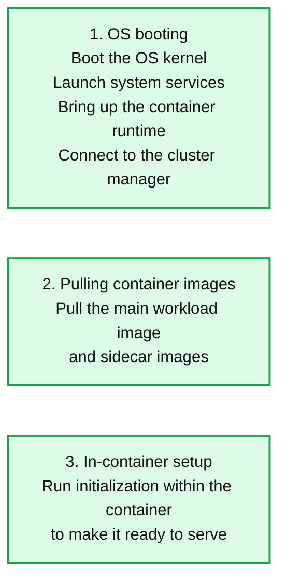
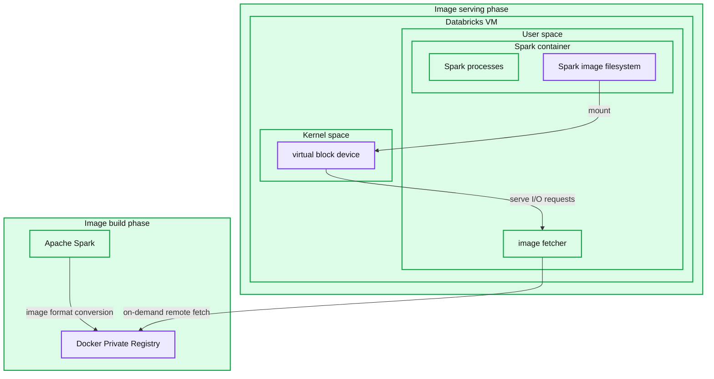
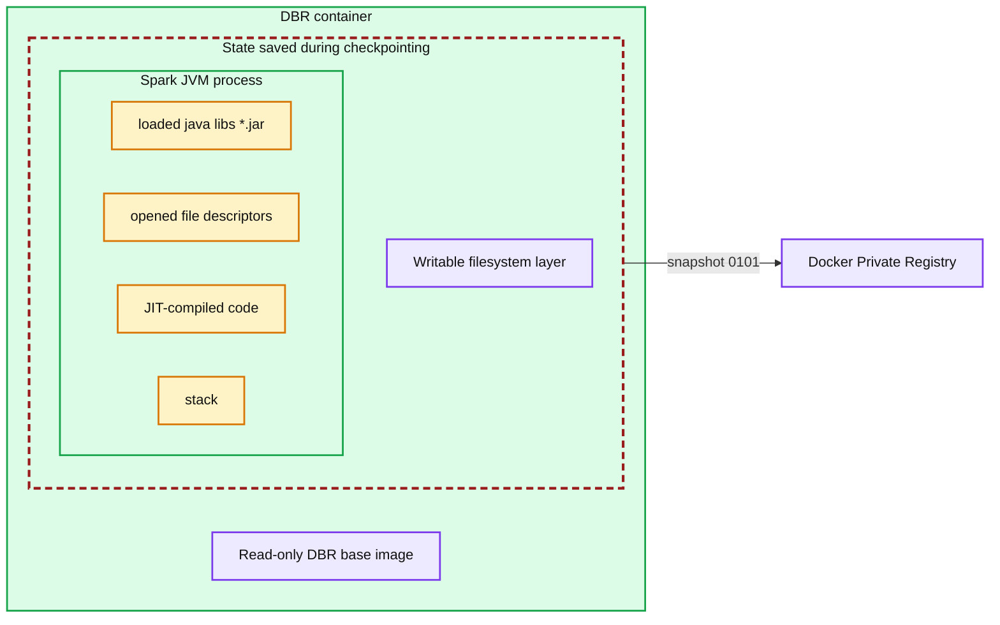

# Booting Databricks VMs 7x faster for serverless compute

- Source: https://www.databricks.com/blog/booting-databricks-vms-7x-faster-serverless-compute
- Published: 2024-11-26
- Authors: Xinyang Ge, Shuo Chen, Shuai Chang, Simha Venkataramaiah, Anders Liu, Rohit Jnagal
- Categories: engineering, data-engineering
- Images: 3 total, 3 extracted as architecture

**Key takeaways**

- Databricks Serverless launches millions of virtual machines (VMs) every day powering virtually all of our data and AI products, and it is a substantial challenge running the infrastructure at this scale with efficiency
- This blog post presents a set of systematic optimizations for reducing the VM boot time by 7x which saves tens of millions of minutes in compute every day
- These optimizations enable Databricks to deliver a much better latency and performance Serverless experience at the lowest possible price

The Databricks Serverless compute infrastructure launches and manages millions of virtual machines (VMs) each day across three major cloud providers, and it is a substantial challenge in operating the infrastructure at this scale with efficiency. Today, we want to share with you some of the work that we have recently done to enable a true Serverless experience: having not just the compute resources but also all the underlying systems ready to take on data and AI workloads (e.g., full blown Apache Spark clusters or LLM serving) within seconds at scale.

As far as we are aware, no other Serverless platform is capable of running the diverse sets of data and AI workloads at scale within seconds. The key challenge lies in the time and cost required to set up the VM environment for optimal performance, which involves not only installing various software packages but also thoroughly warming up the runtime environment. Take Databricks Runtime (DBR) as an example: it requires warming up the JVM’s JIT compiler to offer the peak performance to customers right from the start.

In this blog, we present the system-level optimizations we have developed to reduce the boot time of VMs preloaded with the Databricks software (or simply Databricks VMs) from minutes to seconds — a 7x improvement since the launch of our Serverless platform which now powers virtually all Databricks products. These optimizations span the entire software stack, from the OS and container runtime all the way to the hosted applications, and enable us to save tens of millions of minutes in compute every day and deliver the best price performance to Databricks Serverless customers.

## Booting a Databricks VM

*Figure 1: The boot sequence of a Databricks VM on Serverless Platform*

**Summary:** The Databricks VM boot sequence has three stages: OS booting, pulling container images, and in-container setup.

**Components:**
- OS booting: OS kernel, system services, container runtime, and connection to the cluster manager.
- Pulling container images: Main workload image and sidecar images.
- In-container setup: Initialization process within the container to make it ready to serve.

**Flows:**
- none. No arrows are visible.

**Numbers:** 1, 2, 3 identify the boot stages.

source image: https://www.databricks.com/sites/default/files/inline-images/booting-databricks-vm.png

Figure 1: The boot sequence of a Databricks VM on Serverless Platform

We describe the three main boot stages from Figure 1 and briefly explain why they take time below:

1. **OS booting.** A Databricks VM starts with the general OS boot sequence: it boots the kernel, starts the system services, brings up the container runtime, and finally connects to the cluster manager which manages all the VMs in the fleet.
2. **Pulling container images.** At Databricks, we package applications as container images to simplify runtime resource management and streamline deployment. Once the VM connects to the cluster manager, it receives a list of container specs and begins downloading several gigabytes of images from the container registry. These images include not only the latest Databricks Runtime but also utility applications for log processing, VM health monitoring, and metric emission, among other essential functions.
3. **In-container setup.** Finally, the VM brings up the workload container, initializes the environment and makes it ready to serve. Take Databricks Runtime as an example — its initialization process involves loading thousands of Java libraries and warming up the JVM by executing a series of carefully selected queries. We run the warm-up queries to force the JVM to just-in-time (JIT) compile bytecode to native machine instructions for common code paths, and this ensures users can enjoy the peak runtime performance right from their very first query. Running a large number of warm-up queries can ensure that the system will provide a low-latency experience for all kinds of queries and data processing needs. However, a larger number of queries can result in the initialization process taking minutes to finish.

For each of these stages we improved the latency by developing the optimizations below.

## A purpose-built Serverless OS

For Databricks Serverless, we manage the entire software stack, so we can build a specialized Serverless OS that meets our need to run ephemeral VMs. Our guiding principle is to make the Serverless OS nimble. Specifically, we include only essential software required for running containers and adapt their boot sequence to bring up critical services earlier than in a generic OS. We tune the OS to favor buffered I/O writes and reduce disk bottlenecks during boot.

Removing unnecessary OS components speeds up the boot process not only by minimizing what needs to be initialized (for example, disabling the USB subsystem, which is completely unnecessary for a cloud VM), but also by making the boot process more amenable to a cloud setup. In VMs, the OS boots from a remote disk where the disk content is fetched to the physical host during the boot, and cloud providers optimize the process via various caching layers of the disk content based on the prediction of block sectors that are more likely to be accessed. A smaller OS image allows cloud providers to cache the disk content more effectively.

Additionally, we customize the Serverless OS to reduce I/O contention during the boot process, which often involves significant file writes. For instance, we tune the system settings to buffer more file writes in memory before the kernel has to flush them to disks. We also modify the container runtime to reduce blocking, synchronous writes during image pulls and container creations. We design these optimizations specifically for short-lived, ephemeral VMs where data loss from power outages and system crashes are of little concern.

## A lazy container filesystem

After a Databricks VM connects to the cluster manager, it must download gigabytes of container images before initializing the Databricks Runtime and other utility applications, such as those for log processing and metrics emission. The downloading process can take several minutes to finish even when utilizing the full network bandwidth and/or disk throughput. On the other hand, [prior research](https://www.usenix.org/conference/fast16/technical-sessions/presentation/harter) has shown that while downloading container images accounts for 76% of container startup time, only **6.4%** of the data is needed for containers to begin useful work initially.

*Figure 2: A lazy container filesystem based on overlaybd*

**Summary:** A lazy Spark container filesystem separates image conversion and registry storage from on-demand image fetching through a virtual block device inside a Databricks VM.

**Components:**
- Image build phase: Apache Spark image conversion and Docker registry storage.
- Apache Spark: source for image format conversion.
- Docker Private Registry: stores the converted container image.
- Image serving phase: runs the container and image-fetching components.
- Databricks VM: hosts user-space and kernel-space components.
- Spark container: contains Spark processes and the Spark image filesystem.
- Spark processes: Apache Spark workloads.
- Spark image filesystem: container filesystem mounted through the virtual block device.
- Image fetcher: handles I/O requests and on-demand remote fetching.
- Virtual block device: kernel-space block device.
- User space: contains the Spark container and image fetcher.
- Kernel space: contains the virtual block device.

**Flows:**
- Apache Spark -> Docker Private Registry: image format conversion.
- Spark image filesystem -> Virtual block device: mount.
- Virtual block device -> Image fetcher: serve I/O requests.
- Image fetcher -> Docker Private Registry: on-demand remote fetch.

**Numbers:** none

source image: https://www.databricks.com/sites/default/files/inline-images/booting-databricks-vms-compute-blog-img-2.png

Figure 2: A lazy container filesystem based on overlaybd

To exploit this observation, we enable a lazy container filesystem as shown in Figure 2. When building a container image, we add an extra step to convert the standard, gzip-based image format to the block-device-based format that is suitable for lazy loading. This allows the container image to be represented as a seekable block device with 4MB sectors in production.

When pulling container images, our customized container runtime retrieves only the metadata required to set up the container's root directory, including directory structure, file names, and permissions, and creates a virtual block device accordingly. It then mounts the virtual block device into the container so that the application can start running right away. When the application reads a file for the first time, the I/O request against the virtual block device will issue a callback to the image fetcher process, which retrieves the actual block content from the remote container registry. The retrieved block content is also cached locally to prevent repeated network round trips to the container registry, reducing the impact of variable network latency on future reads.

The lazy container filesystem eliminates the need to download the entire container image before starting the application, reducing image pull latency from several minutes to just a few seconds. By spreading the image download over a longer period of time, it alleviates the pressure on the blob storage bandwidth and avoids throttling.

## Checkpointing/Restoring a pre-initialized container

In the final step, we initialize the container by executing a long in-container setup sequence before marking the VM as ready to serve. For Databricks Runtime, we pre-load all necessary Java classes and run an extensive procedure to warm up the Spark JVM process. While this approach provides peak performance for users' initial queries, it significantly increases boot time. Moreover, the same setup process is repeated for every VM launched by Databricks.

We address the costly startup process by caching the fully warmed-up state. Specifically, we take a process-tree checkpoint of a pre-initialized container and use it as a template to launch future instances of the same workload type. In this setup, the containers are "restored" directly into a consistent, initialized state, bypassing the repeated and costly setup process entirely.

*Figure 3: Checkpointing a Databricks Runtime (DBR) container. The red rectangles represent the state being saved during checkpointing.*

**Summary:** A DBR container saves its Spark JVM process state and writable filesystem layer as a checkpoint snapshot to a Docker Private Registry, excluding the read-only DBR base image.

**Components:**

- DBR container: Databricks Runtime container enclosing the process and filesystem layers.
- Spark JVM process: Spark running on the Java Virtual Machine.
- loaded java libs (*.jar): Loaded Java library archives.
- opened file descriptors: Open file handles within the JVM process.
- JIT-compiled code: Just-in-time compiled JVM code.
- stack: JVM process stack.
- Writable filesystem layer: Container filesystem changes included in the checkpoint.
- Read-only DBR base image: Base container image outside the checkpoint boundary.
- snapshot: Saved checkpoint state, illustrated with a file icon.
- Docker Private Registry: Docker registry receiving the checkpoint snapshot.

**Flows:**

- Checkpointed container state -> Docker Private Registry: Snapshot of the Spark JVM process and writable filesystem layer.

**Numbers:** `0101` appears on the snapshot icon as a binary illustration.

source image: https://www.databricks.com/sites/default/files/inline-images/booting-databricks-vms-compute-blog-img-3.png

Figure 3: Checkpointing a Databricks Runtime (DBR) container. The red rectangles represent the state being saved during checkpointing.

We implement and integrate the checkpoint/restore capability into our customized container runtime. We show how it works in Figure 3. During checkpointing, the container runtime first freezes the whole process tree of the container to ensure state consistency. It then dumps the process states, including the loaded libraries, the opened file descriptors, the entire heap state (including the JIT-compiled native code), and the stack memory to the disk. It additionally saves the writable layer of the container filesystem to preserve the files created/modified during the container initialization process. This allows us to restore both the in-memory process state and the on-disk filesystem state at a later time. We package the checkpoint into an OCI/Docker-compatible image, then store and distribute it using the container registry as if it were a standard container image.

While this approach is conceptually simple, it does come with its own challenges:

- **Databricks Runtime must be checkpoint/restore compatible.** It was not the case initially because (1) Databricks Runtime may access non-generic information (such as hostname, IP address or even pod name) for various use cases while we may restore the same checkpoint on many different VMs, and (2) Databricks Runtime was unable to handle the sudden shift of the wall clock time as the restore may happen days or even weeks after when the checkpoint was taken. To address this, we introduced a checkpoint/restore-compatible mode in the Databricks Runtime. This mode defers the binding of host-specific information until after restoration. It also adds the pre-checkpoint and post-restore hooks to enable custom logic during checkpoint/restore. For example, Databricks Runtime can utilize the hooks to manage the time shift by pausing and resuming heartbeats, re-establish external network connections, and more.
- **Checkpoints are not only about Databricks Runtime versions.** A checkpoint captures the final process state of the container, so it is determined by many factors such as the Databricks Runtime version, application configurations, heap size, the instruction set architecture (ISA) of the CPU, etc. This is intuitive, as restoring a checkpoint taken on a 64GB VM to a 32GB VM will likely result in an out-of-memory (OOM) error while restoring a checkpoint taken on an Intel CPU to an AMD CPU could lead to illegal instructions due to the JVM's JIT compiler generating optimal native code based on the ISA. It presents a significant challenge in designing a checkpoint CI/CD pipeline that can keep pace with the fast-evolving Databricks Runtime development and compute infrastructure. Rather than enumerating all possible signatures across all these dimensions, we create checkpoints on-demand whenever a new signature appears in production. The created checkpoints are then uploaded and distributed using the container registry, so that future launches of workloads with matching signatures can be directly restored from them across the fleet. This approach not only simplifies the design of the checkpoint generation pipeline but also ensures all created checkpoints are actually useful in production.
- **Restoring uniqueness.** Launching multiple containers from the same checkpoint can break the uniqueness guarantee. For example, the random number generators (RNGs) will share the same seed and start to output the same sequence of random numbers after restoration. We track the RNG objects created during initialization and utilize the post-restore hook to reseed the RNG objects to restore their uniqueness.

Our evaluation shows that this optimization has reduced the initialization and warm-up time of Databricks Runtime from several minutes to around 10 seconds. This capability also allows for a deeper JVM warm-up without concern for time as it is no longer on the critical path.

## Conclusion

At Databricks, we are committed to delivering the best price performance to our customers by continuously innovating and maximizing value on their behalf. This blog describes a series of deep, system-level optimizations that reduce the boot time of Databricks VMs by 7x. This not only enables a much better latency and performance experience for Serverless customers, but also allows us to deliver this level of user experience at the lowest possible price. Meanwhile, we will factor in the reduced VM boot-up time when sizing the warm pool to further drive down the Serverless costs (stay tuned for more details!). Finally, we would like to thank the open-source communities as we benefited tremendously from them in bringing these optimizations into reality. Start your free trial today, and get a firsthand experience with Databricks Serverless!
