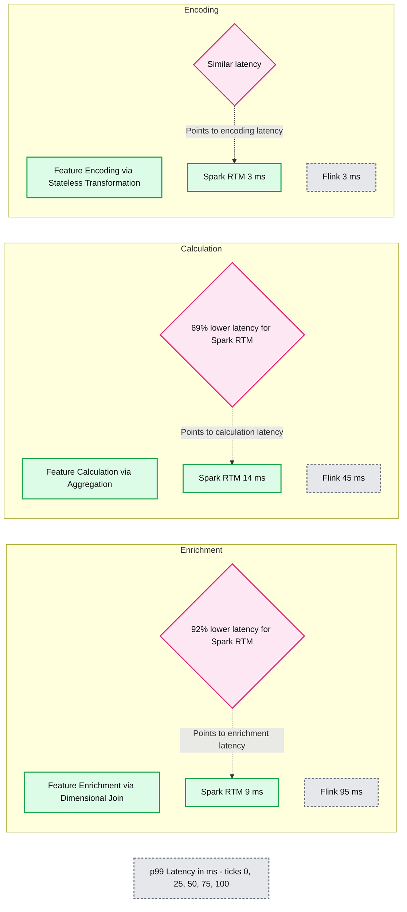
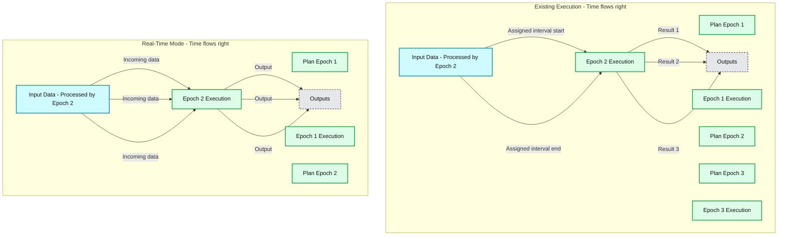
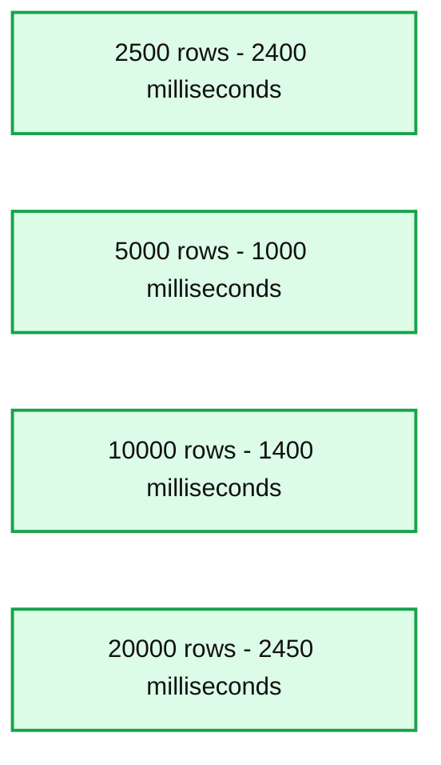
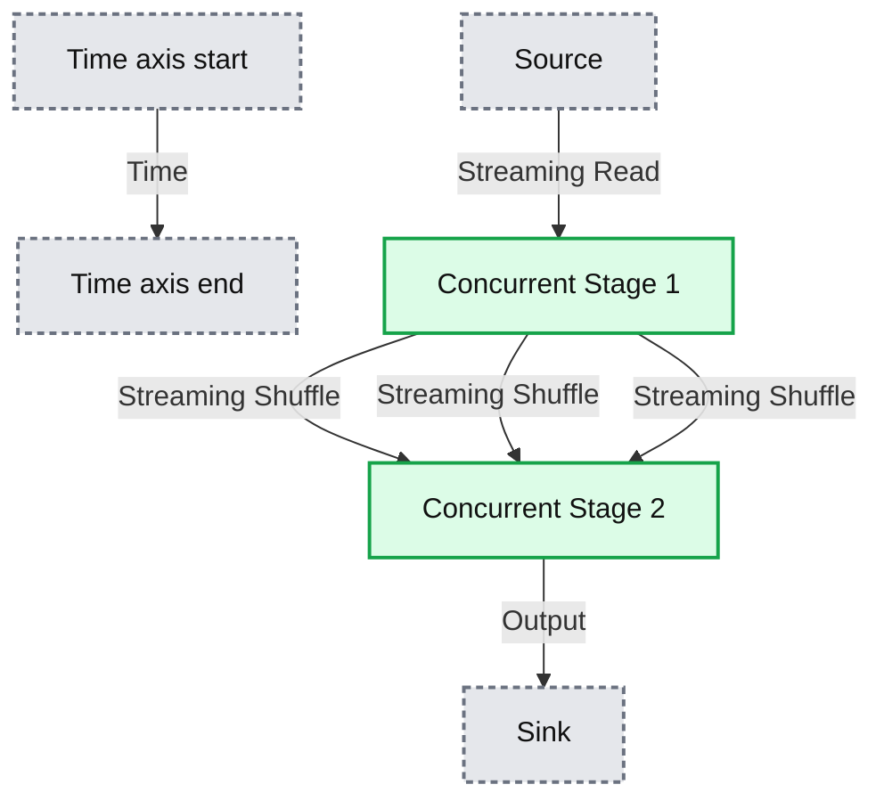

# Breaking the microbatch barrier: The architecture of Apache Spark Real-Time Mode

*How we evolved Spark to handle high-throughput ETL and ultra low-latency streaming workloads*

- Source: https://www.databricks.com/blog/breaking-microbatch-barrier-architecture-apache-spark-real-time-mode
- Published: 2026-03-16
- Authors: Jerry Peng, Siying Dong, Indrajit Roy
- Categories: data-engineering
- Images: 4 total, 4 extracted as architecture

**Key takeaways**

- Apache Structured Streaming's Real-Time Mode unifies high-throughput ETL and millisecond-latency operational workloads in a single engine.
- Dive deep into the hybrid execution model, detailing concurrent processing stages and non-blocking operators that deliver millisecond latencies.
- Customers can now achieve sub-100ms responsiveness for ultra-low latency applications, such as real-time fraud detection.

With the launch of real-time mode (RTM) in Apache Spark 4.1, Structured Streaming now delivers millisecond-level latency. In a [recent blog post,](https://www.databricks.com/blog/real-time-mode-ultra-low-latency-streaming-spark-apis-without-second-engine) we showed how RTM can outperform Flink for many low latency feature engineering workloads (see below).

In this blog, we will discuss the architectural changes that enabled Structured Streaming to support both high-throughput ETL workloads as well as ultra low-latency workloads.

**Summary:** Apache Spark Real-Time Mode and Apache Flink are compared by p99 latency for three feature engineering workloads.

**Components:**
- Spark RTM: Apache Spark Real-Time Mode, represented by green bars.
- Flink: Apache Flink, represented by dark teal bars.
- Feature Enrichment: dimensional join measured for both engines.
- Feature Calculation: aggregation measured for both engines.
- Feature Encoding: stateless transformation measured for both engines.
- Enrichment callout: 92% lower latency for Spark RTM.
- Calculation callout: 69% lower latency for Spark RTM.
- Encoding callout: similar latency.
- Horizontal axis: p99 latency in milliseconds.

**Flows:**
- Enrichment callout -> Spark RTM enrichment bar: dashed annotation pointing to 9 ms.
- Calculation callout -> Spark RTM calculation bar: dashed annotation pointing to 14 ms.
- Encoding callout -> Spark RTM encoding bar: dashed annotation pointing to 3 ms.

**Numbers:**
- Feature Enrichment: Spark RTM 9 ms; Flink 95 ms; callout states 92% lower latency.
- Feature Calculation: Spark RTM 14 ms; Flink 45 ms; callout states 69% lower latency.
- Feature Encoding: Spark RTM 3 ms; Flink 3 ms.
- Metric: p99 latency in ms.
- Axis ticks: 0, 25, 50, 75, 100.

source image: https://www.databricks.com/sites/default/files/inline-images/2026-02-RTM-blog-1200x628_0.png?v=1773680226

**Apache Spark RTM is faster than Flink for feature engineering use cases.**

## The throughput vs. latency dilemma

Up until now, choosing a streaming engine meant making a trade-off by picking systems like Apache Spark for high throughput ETL workloads, or systems like Apache Flink for low latency workloads. The two systems have very different semantics and performance characteristics. That changes with RTM in Structured Streaming. With the introduction of RTM, Apache Spark can now handle both high throughput and ultra low-latency use cases. This means it’s now possible to pick a single engine with no new learning curve and avoid managing two completely different systems.

## Microbatch architecture delivers high throughput

Spark Structured Streaming uses a microbatch architecture: the streaming system receives input data and divides it into discrete batches called epochs based on data availability and maximum batch size configurations. The Spark engine applies the business logic through transformations like project, filter, and aggregation. The results are output as a continuous stream of batches. Structured Streaming excels in high-throughput processing because of this microbatch architecture: since multiple records are processed together, the fixed overheads are amortized and vectorized execution can further improve throughput. These batches are executed in parallel while keeping hardware utilization high. Microbatch mode dynamically allocates task slots across multiple streams which additionally helps with high utilization and throughput. Spark’s foundational innovation of [lineage based fault tolerance](https://spark.apache.org/docs/latest/rdd-programming-guide.html#resilient-distributed-datasets-rdds) ensures that these streams are processed with strong exactly-once guarantees.  

**Summary:** Existing execution processes an earlier input interval in Epoch 2, while Real-Time Mode processes incoming data and produces outputs during Epoch 2 execution.

**Components:**
- Existing Execution: microbatch execution with alternating planning and execution phases.
- Input Data: stream of input records; source technology unspecified.
- Processed by Epoch 2: input interval assigned to Epoch 2 in each mode.
- Plan Epoch 1, Plan Epoch 2, Plan Epoch 3: existing execution planning phases.
- Epoch 1 Execution, Epoch 2 Execution, Epoch 3 Execution: existing execution processing phases.
- Real-Time Mode: RTM execution with alternating planning and longer execution phases.
- Plan Epoch 1, Plan Epoch 2: RTM planning phases.
- Epoch 1 Execution, Epoch 2 Execution: RTM processing phases.
- Outputs: results produced by Epoch 2 in each mode; destination technology unspecified.
- Time: rightward progression in each mode.

**Flows:**
- Existing execution time -> Right: time advances.
- Earlier input interval start -> Epoch 2 execution start: connector marks the beginning of the assigned input interval.
- Earlier input interval end -> Epoch 2 execution end: connector marks the end of the assigned input interval.
- Existing Epoch 2 Execution -> Outputs: three downward arrows represent results.
- RTM time -> Right: time advances.
- RTM Input Data -> Epoch 2 Execution: three downward arrows represent incoming data processed during execution.
- RTM Epoch 2 Execution -> Outputs: three downward arrows represent emitted results.

**Numbers:** Epoch identifiers 1, 2, and 3; no quantitative measurements or units.

source image: https://www.databricks.com/sites/default/files/inline-images/2026-03-blog-apache-spark-structured-streaming-one-engine-for-high-throughput-and-millisecond-latency-inline-960x1042-v3.png?v=1773614419

**RTM processes data in a non-blocking manner compared to microbatch mode.**

## Threading the low-latency needle

While Structured Streaming is very good at handling seconds-level ETL and ingestion workloads, many operational use cases demand millisecond-level latency. Fraud detection in financial transactions, real-time insights in the travel industry, or analyzing telemetry data from connected vehicles are all examples where customers need answers in milliseconds.

### Architectural challenge: Why smaller batches don't work

The obvious solution might seem simple: just make the batches smaller. If we process one record at a time, we should get real-time performance. Unfortunately, it's not that straightforward.

Each microbatch in Structured Streaming carries fixed costs that dominate execution time when processing small amounts of data. The system writes log files to durable object storage before and after each micro-batch execution. On top of that, state updates for each stateful query needs to be uploaded to object storage at the end of a microbatch as well.These are critical steps for guaranteeing consistency semantics but can add hundreds of milliseconds if not seconds to the execution time. Even if we hide some of these latencies, the latency of planning each batch, logical and physical planning overhead, task serialization, and scheduling are hard to reduce. As you can imagine, shrinking batch sizes quickly hits a wall. The figure below shows when microbatches become too small (leftmost bar), fixed microbatch processing costs dominate execution and increase end to end latency.

**Summary:** Latency falls from 2,400 milliseconds at 2,500 rows to 1,000 milliseconds at 5,000 rows, then rises with larger batches.

**Components:**
- Batch Size / Latency: chart title; no technology specified.
- Batch Size # rows: horizontal axis with four batch sizes.
- Latency milliseconds: vertical axis measuring latency.
- Four bars: latency measurements for each batch size; no technology specified.

**Flows:**
- none. No arrows are visible.

**Numbers:**
- 2,500 rows: 2,400 milliseconds.
- 5,000 rows: 1,000 milliseconds.
- 10,000 rows: 1,400 milliseconds.
- 20,000 rows: 2,450 milliseconds.
- Latency axis ticks: 0, 500, 1,000, 1,500, 2,000, 2,500 milliseconds.

source image: https://www.databricks.com/sites/default/files/inline-images/2026-03-blog-apache-spark-structured-streaming-one-engine-for-high-throughput-and-millisecond-latency-inline-960x755-2.png?v=1773463629

**Beyond a threshold, lower batch sizes can increase latency due to fixed overheads**

This presented us with an architectural challenge: we want to retain the cost and fault tolerance advantages of the micro-batch architecture while achieving low latency that one expects from models that process record-at-a-time (such as Apache Storm and Apache Flink). Our key insight is that we can evolve the microbatch architecture to support real-time workloads. We continued using many of the core microbatch architecture features such as checkpointing for fault tolerance. However, we eliminated the steps where data used to wait and was resulting in high latency. We discuss these changes below.

### Our solution: a hybrid execution model

Here is how we improved Structured Streaming’s latency:

#### 1. Longer duration epochs with continuous data flow

Microbatch mode processes batches of data called epochs. Epoch boundaries are decided upfront using start and end offsets. Real-time mode instead processes longer duration epochs but modifies how data flows within each epoch. Data now streams continuously through different stages and operators without blocking. Since epochs are of longer duration, the overheads of checkpointing and barriers is amortized. At epoch boundaries, we still use barriers for recovery bookkeeping and task rescheduling—maintaining the benefits that make micro-batch architectures resilient and efficient. We essentially evolved the micro-batch in Structured Streaming into a checkpoint interval.

#### 2. Concurrent processing stages

In the Structured Streaming architecture, processing stages executed sequentially—reducers waited for mappers to complete, creating unnecessary delays. We made these stages concurrent in the real-time mode. Now the Spark driver requests source offsets and schedules mappers, but reducers can start processing shuffle files as soon as they become available, rather than waiting for all mappers to finish. This change dramatically reduces end-to-end latency. The RTM figure below shows that the two stages run concurrently, and stage 2 starts processing rows as soon as they are processed by stage 1.

**Summary:** Source, two concurrent processing stages, and sink overlap in time, with streaming reads and streaming shuffle reducing overall latency.

**Components:**
- Source: input source; technology unspecified.
- Concurrent Stage 1: processing stage in Real-Time Mode.
- Concurrent Stage 2: processing stage in Real-Time Mode.
- Sink: output destination; technology unspecified.
- Streaming Read: source-to-stage data transfer.
- Streaming Shuffle: data transfer between concurrent stages.
- Time: rightward axis indicating time progression.

**Flows:**
- Time axis start -> Time axis end: time progresses rightward.
- Source -> Concurrent Stage 1: streaming read.
- Concurrent Stage 1 -> Concurrent Stage 2: streaming shuffle through three downward arrows.
- Concurrent Stage 2 -> Sink: output data; transfer mechanism unspecified.

**Numbers:** 1 and 2 are stage identifiers. No quantitative measurements are visible.

source image: https://www.databricks.com/sites/default/files/inline-images/2026-03-blog-apache-spark-structured-streaming-one-engine-for-high-throughput-and-millisecond-latency-inline-960x841-4.png?v=1773463629

**Real-time mode uses concurrent stages which decreases latency**

3. Non-blocking operators

We restructured key operators like shuffle, which were designed for batch execution with substantial buffering. In batch mode, a group-by aggregation would buffer all records, perform pre-aggregation, and emit results only at the end. For real-time processing, we modified these operators to minimize buffering and produce results continuously, allowing data to flow through the pipeline without unnecessary waits.
 

## Summary

By using longer duration epochs with continuous data flow, concurrent processing stages, and non-blocking operators, we have generalized Apache Spark Structured Streaming engine to handle both high throughput and ultra low-latency streaming use cases. This hybrid approach now removes the need to choose between streaming engines. Users only need to learn Apache Spark and there’s no need to learn another framework dedicated for ultra low-latency streaming.

Real-time mode is already in production at Databricks and used by multiple customers from cutting edge finance companies to travel sites. Our customers are able to achieve millisecond latency for their use cases.

While this is an important leap in Spark’s capabilities, we are continuing to add new streaming features. If your organization is looking for solutions for real-time workloads, take Apache Spark Structured Streaming for a spin!

 

## Explore technical resources

To go deeper into the engineering behind RTM, watch this[on-demand session](https://www.databricks.com/dataaisummit/session/real-time-mode-technical-deep-dive-how-we-built-sub-300-millisecond) led by our subject matter experts. They will walkthrough the design and implementation of Real-Time Mode.

Or review the [Real-Time Mode technical guide](https://docs.databricks.com/aws/en/structured-streaming/real-time) on how to get started. You’ll find everything you need to enable real-time processing for your streaming workloads.
