# Bringing Declarative Pipelines to the Apache Spark™ Open Source Project

*A Battle-Tested, Open Standard for Data Transformation*

- Source: https://www.databricks.com/blog/bringing-declarative-pipelines-apache-spark-open-source-project
- Published: 2025-06-12
- Authors: Michael Armbrust, Sandy Ryza, Denny Lee, James Malone, Matt Jones
- Categories: engineering, open-source
- Images: 4 total, 1 extracted as architecture

**Key takeaways**

- We’re donating Declarative Pipelines - a proven declarative API for building robust data pipelines with a fraction of the work - to Apache Spark™.
- This standard simplifies pipeline development across batch and streaming workloads.
- Years of real-world experience have shaped this flexible, Spark-native approach for both batch and streaming pipelines.

Apache Spark™ has become the de facto engine for big data processing, powering workloads at some of the largest organizations in the world. Over the past decade, we’ve seen Apache Spark evolve from a powerful general-purpose compute engine into a critical layer of the [Open Lakehouse Architecture](https://www.databricks.com/product/data-lakehouse) - with Spark SQL, Structured Streaming, open table formats, and unified governance serving as pillars for modern data platforms.

With the recent release of Apache Spark 4.0, that evolution continues with major advances in streaming, Python, SQL, and semi-structured data. You can read more about the release [here](https://spark.apache.org/releases/spark-release-4-0-0.html).

Building upon the strong foundation of Apache Spark, we are excited to announce a new addition to open source:

**We’re donating Declarative Pipelines - a proven standard for building reliable, scalable data pipelines - to Apache Spark.**

This contribution extends Apache Spark’s declarative power from individual queries to full pipelines - allowing users to define **what** their pipeline should do, and letting Apache Spark figure out **how** to do it. The design draws on years of observing real-world Apache Spark workloads, codifying what we’ve learned into a declarative API that covers the most common patterns - including both batch and streaming flows.

*Sample Dataflow Graph*

**Summary:** A streaming query populates a table that feeds two parallel batch queries, whose materialized views feed a final batch query producing another materialized view.

**Components:**

- Streaming query: streaming computation; technology unspecified.
- Table: stored dataset; technology unspecified.
- Upper batch query: batch computation; technology unspecified.
- Upper materialized view: persisted query result; technology unspecified.
- Lower batch query: batch computation; technology unspecified.
- Lower materialized view: persisted query result; technology unspecified.
- Final batch query: batch computation; technology unspecified.
- Final materialized view: persisted query result; technology unspecified.

**Flows:**

- Streaming query -> Table: streaming query results.
- Table -> Upper batch query: input data.
- Table -> Lower batch query: input data.
- Upper batch query -> Upper materialized view: batch query results.
- Lower batch query -> Lower materialized view: batch query results.
- Upper materialized view -> Final batch query: input data.
- Lower materialized view -> Final batch query: input data.
- Final batch query -> Final materialized view: batch query results.

**Numbers:** none

```mermaid
%% Streaming ingestion followed by branching and converging batch queries
flowchart LR
    S[Streaming query] -->|Streaming results| T[Table]
    T -->|Input data| B1[Batch query]
    T -->|Input data| B2[Batch query]
    B1 -->|Batch results| V1[Materialized view]
    B2 -->|Batch results| V2[Materialized view]
    V1 -->|Input data| B3[Batch query]
    V2 -->|Input data| B3
    B3 -->|Batch results| V3[Materialized view]

    classDef client fill:#dbeafe,stroke:#2563eb,stroke-width:2px,color:#111
    classDef service fill:#dcfce7,stroke:#16a34a,stroke-width:2px,color:#111
    classDef store fill:#ede9fe,stroke:#7c3aed,stroke-width:2px,color:#111
    classDef cache fill:#fef3c7,stroke:#d97706,stroke-width:2px,color:#111
    classDef queue fill:#cffafe,stroke:#0891b2,stroke-width:2px,color:#111
    classDef critical fill:#fee2e2,stroke:#dc2626,stroke-width:4px,color:#111
    classDef external fill:#e5e7eb,stroke:#6b7280,stroke-width:2px,color:#111,stroke-dasharray:4 3
    classDef decision fill:#fce7f3,stroke:#db2777,stroke-width:2px,color:#111
    class S,B1,B2,B3 service
    class T,V1,V2,V3 store
```

source image: https://www.databricks.com/sites/default/files/inline-images/dais25-oss-spark-declarative-pipelines-blog-img-1.png

Sample Dataflow Graph

## Declarative APIs make ETL simpler and more maintainable

Through years of working with real-world Spark users, we’ve seen common challenges emerge when building production pipelines:

- Too much time spent wiring together pipelines with “glue code” to handle incremental ingestion or deciding when to materialize datasets. This is undifferentiated heavy lifting that every team ends up maintaining instead of focusing on core business logic
- Reimplementing the same patterns across teams, leading to inconsistency and operational overhead
- Lacking a standardized framework for testing, lineage, CI/CD, and monitoring at scale

At Databricks, we began addressing these challenges by codifying common engineering best practices into a product called **DLT**. DLT took a **declarative approach**: instead of wiring up all the logic yourself, you specify the final state of your tables, and the engine takes care of things like dependency mapping, error handling, checkpointing, failures, and retries for you.

The result was a big leap forward in productivity, reliability, and maintainability - especially for teams managing complex production pipelines.

Since launching DLT, we’ve learned a lot.

We’ve seen where the declarative approach can make an outsized impact; and where teams needed more flexibility and control. We’ve seen the value of automating complex logic and streaming orchestration; and the importance of building on open Spark APIs to ensure portability and developer freedom.

That experience informed a new direction: A **first-class, open-source, Spark-native framework** for declarative pipeline development.

## From Queries to End-to-End Pipelines: The Next Step in Spark’s Declarative Evolution

Apache Spark SQL made query execution declarative: instead of implementing joins and aggregations with low-level RDD code, developers could simply write SQL to describe the result they wanted, and Spark handled the rest.

Spark Declarative Pipelines builds on that foundation and takes it a step further - extending the declarative model beyond individual queries to full pipelines spanning multiple tables. Now, developers can define what datasets should exist and how they're derived, while Spark determines the optimal execution plan, manages dependencies, and handles incremental processing automatically.

Spark Declarative Pipelines in action

Built with openness and composability in mind, Spark Declarative Pipelines offers:

- Declarative APIs for defining tables and transformations
- Native support for both batch and streaming data flows
- Data-aware orchestration with automatic dependency tracking, execution ordering, and backfill handling
- Automatic checkpointing, retries, and incremental processing for streaming data
- Support for both SQL and Python
- Execution transparency with full access to underlying Spark plans

And most importantly, it’s Apache Spark all the way down - no wrappers or black boxes.

## A New Standard, Now in the Open

This contribution represents years of work across Apache Spark, Delta Lake, and the broader open data community. It’s inspired by what we’ve learned from building DLT - but designed to be more flexible, more extensible, and fully open source.

And we’re just getting started. We’re contributing this as a common layer the entire Apache Spark ecosystem can build upon - whether you’re orchestrating pipelines in your own platform, building domain-specific abstractions, or contributing directly to Spark itself. This framework is here to support you.

> “Declarative pipelines hide the complexity of modern data engineering under a simple, intuitive programming model. As an engineering manager, I love the fact that my engineers can focus on what matters most to the business. It’s exciting to see this level of innovation now being open sourced-making it accessible to even more teams.” —Jian (Miracle) Zhou, Senior Engineering Manager, Navy Federal Credit Union

> “At 84.51 we’re always looking for ways to make our data pipelines easier to build and maintain, especially as we move toward more open and flexible tools. The declarative approach has been a big help in reducing the amount of code we have to manage, and it’s made it easier to support both batch and streaming without stitching together separate systems. Open-sourcing this framework as Spark Declarative Pipelines is a great step for the Spark community.” —Brad Turnbaugh, Sr. Data Engineer, 84.51°

## What’s Next

Stay tuned for more details in the [Apache Spark documentation](https://spark.apache.org/documentation.html). In the meantime, you can review the [Jira](https://issues.apache.org/jira/browse/SPARK-51727) and [community discussion](https://issues.apache.org/jira/browse/SPARK-51727) for the proposal.

If you’re building pipelines with Apache Spark today, we invite you to explore the declarative model. Our goal is to make pipeline development simpler, more reliable, and more collaborative for everyone.

The Lakehouse is about more than just open storage. It’s about open formats, open engines - and now, open patterns for building on top of them.

We believe declarative pipelines will become a new standard for Apache Spark development. And we’re excited to build that future together, with the community, in the open.
