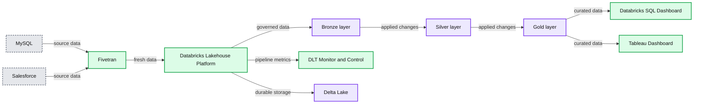

# Build a Customer 360 Solution with Fivetran and Delta Live Tables

*Integration of Fivetran with DLT pipelines, ETL on the Databricks Lakehouse Platform*

- Source: https://www.databricks.com/blog/build-customer-360-solution-fivetran-and-delta-live-tables
- Published: 2022-11-09
- Authors: Mojgan Mazouchi, Shivam Panicker, Prasad Kona, Bilal Aslam
- Categories: engineering, data-engineering
- Images: 16 total, 1 extracted as architecture

The Databricks [Lakehouse Platform](https://www.databricks.com/blog/2020/01/30/what-is-a-data-lakehouse.html) is an open architecture that combines the best elements of data lakes and data warehouses. In this blog post, we'll show you how to build a Customer 360 solution on the lakehouse, delivering data and insights that would typically take months of effort on legacy platforms. We will use Fivetran to ingest data from Salesforce and MySQL, then transform it using Delta Live Tables (DLT), a declarative ETL framework for building reliable, maintainable, and testable data processing pipelines. To implement a Customer 360 solution, you will need to track changes over time. We will show you how DLT seamlessly processes Change Data Capture (CDC) data, keeping the Customer 360 solution up to date.

All the code is available in [this GitHub repository](https://github.com/databricks/delta-live-tables-notebooks).

Recommended reading: [Getting Started with Delta Live Tables](https://www.databricks.com/discover/pages/getting-started-with-delta-live-tables) and [Simplifying Change Data Capture With Databricks Delta Live Tables (DLT)](https://www.databricks.com/blog/2022/04/25/simplifying-change-data-capture-with-databricks-delta-live-tables.html). These articles explain how to create scalable, reliable data pipelines and to process updates using DLT's change data capture feature and its declarative API.

### Our task: Build a unified view of multichannel customer interactions

Businesses frequently seek to comprehend the various ways in which their customers interact with their products. A clothing retailer, for example, wants to know when a customer browses their website, visits one of their store locations in person, or completes a transaction. This unified view of customer interactions, known as Customer 360, powers a slew of use cases ranging from personalized recommendations to customer segmentation. Let's look at how the Databricks Lakehouse Platform provides tools and patterns that make this task much easier.

The [medallion architecture](https://docs.databricks.com/lakehouse/medallion.html) logically organizes data in a lakehouse, aiming to incrementally and progressively improve the structure and quality of data as it flows through each layer of the architecture (from Bronze ⇒ Silver ⇒ Gold layer tables). To support a Customer 360 initiative, the data typically resides in a variety of source systems, from databases to marketing applications such as Adobe Analytics. The first step is to ingest these data types into the bronze layer using Fivetran. Once the data has landed in the lakehouse, Delta Live Tables will be used to transform and cleanse the data in the silver and gold layers. The simplicity of this solution allows you to get value fast without writing complicated code to build the ETL pipeline using familiar SQL or Python. The Databricks Lakehouse Platform handles all the operations, infrastructure and scale.

The following diagram shows how fresh data and insights will be ready for downstream consumers such as analysts and data scientists.

*Reference architecture for Customer 360 Solution with Fivetran, Databricks and Delta Live Tables*

**Summary:** Reference architecture showing Fivetran ingestion into Databricks Delta Live Tables, with governed lakehouse data powering BI dashboards and pipeline monitoring.

**Components:**

- Data ingestion using Fivetran
- MySQL source database
- Salesforce source
- Databricks Lakehouse Platform
- Data warehousing
- Data engineering
- Data streaming
- Data science and ML
- Unity Catalog
- Delta Live Table pipeline
- Bronze layer
- Silver layer
- Gold layer
- Delta Lake
- Cloud data lake on Microsoft Azure, AWS and Google Cloud
- Databricks SQL Dashboard
- Tableau Dashboard
- DLT Monitor and Control

**Flows:**

- MySQL -> Fivetran: Source data ingestion
- Salesforce -> Fivetran: Source data ingestion
- Fivetran -> Databricks Lakehouse Platform: Fresh application and database data
- Bronze layer -> Silver layer: Applied changes
- Silver layer -> Gold layer: Applied changes
- Databricks Lakehouse Platform -> Databricks SQL Dashboard: Curated Customer 360 and DLT log data
- Databricks Lakehouse Platform -> Tableau Dashboard: Curated Customer 360 data
- Delta Live Table pipeline -> DLT Monitor and Control: Pipeline status and operational metrics

**Numbers:** none

source image: https://www.databricks.com/sites/default/files/inline-images/db-349-blog-img-1.png

Reference architecture for Customer 360 Solution with Fivetran, Databricks and Delta Live Tables

## Fivetran: Automatic Data Ingestion into the Lakehouse

Extracting data from various applications, databases, and other legacy systems is challenging: you must deal with APIs and protocols, changing schemas, retries, and more. Fivetran's managed connectors enable users to fully automate data ingestion into the Databricks Lakehouse Platform from more than 200 sources:

- A user-friendly UI for configuring and testing connectors.
- Automatic schema management, including handling schema drift.
- Dealing with API outages, rate limits, etc.
- Full and incremental loads.

### Securely connect to Fivetran with Databricks Partner Connect

Databricks Partner Connect lets administrators set up a connection to partners with a few clicks. Click Partner Connect in the left navigation bar and click on the Fivetran logo. Databricks will configure a trial account in Fivetran, [set up authentication with Fivetran](https://docs.databricks.com/integrations/partner-connect/walkthrough-fivetran.html) and create a SQL warehouse which Fivetran will use to ingest data into the lakehouse.

In Databricks Partner Connect, select Fivetran and enter the credentials.

### Incrementally ingest data from Azure MySQL

Databases commonly hold transactional information such as customer orders and billing information, which we need for our task. We will use Fivetran's MySQL connector to retrieve this data and ingest it into Delta Lake tables. Fivetran's connector handles the [initial sync](https://fivetran.com/docs/databases/mysql#initialsync) and can be used to [incrementally sync](https://fivetran.com/docs/databases/mysql#updatingdata) only updated rows, a must-have for large-scale database deployments.

Sign in to Fivetran through Databricks Partner Connect and Destinations in the left navigation bar. Select the Databricks SQL Warehouse Partner Connect created for us and click *Add Connector*.

Select Azure MySQL from the data sources, and click Add Connector.

Connect to the database by providing connection details, which you can find in the Azure Portal. We will use Fivetran to sync incremental changes to Databricks by reading the MySQL binary log:

Enter credentials to connect Azure MySQL to Fivetran.

Next, let's select the tables we want to sync to Databricks - in this case, we will sync transactions:

Select the tables to sync to Databricks.

*Click Sync Now to start the sync:*

View of Sync History chart on the status page of Fivetran dashboard.

### Ingest customer data from Salesforce

Salesforce is a very popular Customer Relationship Management (CRM) platform. CRMs typically contain non-transactional customer data such as marketing touchpoints, sales opportunities, etc. This data will be very valuable to us as we build out our Customer 360 solution. Fivetran's Salesforce connector makes it easy to load this data.

In Fivetran, select the SQL warehouse we created earlier as the destination and click *Add Connector*. Choose the Salesforce connector:

Select Salesforce from the list of data sources.

Fivetran lets us authenticate to Salesforce with a few clicks:

Enter credentials to connect Salesforce to Fivetran.

Next, choose the Salesforce objects you want to sync to Databricks. In this example, the Contact object holds information about the customer contacts associated with an account, so let's sync that to Databricks:

Select the tables to sync to Databricks.

Click *Sync Now* to initiate the first sync of the data. Fivetran can also automatically schedule the sync. This fully managed connector automatically handles the initial load as well as incremental changes:

View of Sync History chart on the status page of Fivetran dashboard.

## Review tables and columns in Databricks

We are almost ready to start transforming the incoming data. However, let's review the schema first:

**transactions:** These are all the transactions a customer made and shall be processed incrementally. Records received from Fivetran will finally be persisted into the bronze layer. The "transactions" table has 10 columns:

| customer_id | transaction_date | id | amount | item_count | category |
|---|---|---|---|---|---|
| 0033l00002iewZBAAY | 08-01-2022 04:12:55 | 6294 | 813 | 10 | utilities |
| 0031N00001MZua7QAD | 08-01-2022 01:32:10 | 0 | 738 | 4 | entertainment |

We can also see two [change data capture](https://fivetran.com/docs/databases/sql-server) fields that Fivetran generates and maintains:

| _fivetran_id | _fivetran_index | _fivetran_deleted | _fivetran_synced |
|---|---|---|---|
| d0twKAz5aoLiRjoV5kvlk2rHCeo | 51 | false | 2022-08-08T06:02:09.896+0000 |
| 6J3sh+TBrLnLgxRPotIzf8dfqPo= | 45 | true | 2022-08-08T06:02:09.846+0000 |

**contact_info:** This is the dimensional information of a customer, with 90+ fields (e.g., name, phone, email, title, etc.), which will also be ingested into the bronze layer:

| id | name | phone | email | title | … |
|---|---|---|---|---|---|
| 0033l00002iewZ4AAI | John Tsai | null | kskarkova@example.com | CEO | … |

## Transform data using Delta Live Tables

Now that you have the data, Delta Live Tables is used to transform and clean the data for the Customer 360 solution. We will use DLT's declarative APIs to express data transformations. DLT will automatically track the flow of data and lineage between tables and views in our ETL pipeline. DLT tracks data quality using Delta expectations, taking remedial action such as quarantining or dropping bad records, preventing bad data from flowing downstream. We will use DLT to create a Slowly Changing Dimension (SCD) [Type 2](https://en.wikipedia.org/wiki/Slowly_changing_dimension#Type_2:_add_new_row) table. Lastly, we will let DLT take care of intelligently scaling our ETL infrastructure up or down - no need to tune clusters manually.

### Define a Delta Live Table in a notebook

DLT pipelines can be defined in one or more notebooks. Login to Databricks and create a notebook by clicking New in the left navigation bar and choose Notebook. Set the notebook language to SQL (we could define the same pipeline in Python as well if we wanted to).

Create DLT SQL logic in Databricks notebook.

Let's break the DLT SQL logic below. When defining a DLT table use the special LIVE keyword - which manages the dependencies, and automates the operations. Next is ensuring the correctness of the data with expectations e.g. mailing_country must be the United States. Rows that fail this quality check are dropped. We use a table property to set metadata. Finally, we simply select all the rows that pass data quality checks into the table.

Similarly, follow the same format to create the transactions_data table, and adding a data quality expectation for item_count to only keep the rows that have positive item_count, and drop the rows that don't meet this criteria.

### Historical change data tracking with APPLY CHANGES INTO

Now, let's do something more interesting. Customer contact information can change - for example, a customer mailing address would change every time the customer moves. Let's track the changes in an easy-to-query SCD type 2 table using the APPLY CHANGES INTO keyword. If you are unfamiliar with this concept, you can read more about it in an earlier [blog](https://www.databricks.com/blog/2022/04/25/simplifying-change-data-capture-with-databricks-delta-live-tables.html).

To track data changes, we will create a STREAMING LIVE TABLE. A [streaming live table](https://docs.databricks.com/workflows/delta-live-tables/delta-live-tables-concepts.html#datasets) only processes data that has been added only since the last pipeline update. The APPLY CHANGES INTO is where the CDC data processing magic happens. Since we are using a streaming live table, we select from the stream of changes to the contact_data table - note how we use LIVE as the special namespace for the contact_data since DLT is maintaining tables and the relationships between them. Lastly, we instruct DLT to apply deletion logic instead of an upsert when Fivetran indicates a record has been deleted. With SEQUENCE BY we can seamlessly handle change events that arrive out of order. SEQUENCE BY uses the column that specifies the logical order of CDC events in the source data. Finally, we tell DLT to store the data as an SCD Type 2 table.

### Analytics-ready gold tables

Creating the gold tables with DTL is pretty straightforward - simply select the columns needed with a few aggregations as seen below:

### Run DLT for the first time

Now DLT is ready to run for the first time. To create a DLT pipeline, you will need to navigate to Workflows. Click *Workflows* in the left navigation bar and click Delta Live Tables. Then, Click *Create Pipeline*.

To create a DLT pipeline click Workflows in the navigation bar and select Delta Live Tables.

We give our pipeline a name, "Customer 360" and choose the notebook we defined earlier under *Notebook libraries:*

Add configurations and parameters required for creating your pipeline.

We need to specify the target database name, in order to get tables published to the [Databricks Metastore](https://docs.databricks.com/data/metastores/index.html). Once the pipeline is created, click *Start* to run it for the first time. If you set up everything correctly, you should see the DAG of data transformations we defined in the notebook.

View of the completed run from the created DLT pipeline, demonstrating the lineage of published tables.

You can view these published tables by clicking Data in the left navigation bar, and search for the database name you added in the [Target field](https://docs.databricks.com/workflows/delta-live-tables/delta-live-tables-publish.html) under DLT pipeline settings.

On the left navigation bar in Azure Databricks, all the published tables are accessible from “Data”, which is highlighted in the red box.

## Data quality and data pipeline monitoring with Databricks SQL

DLT captures events of the pipeline run in logs. These events include data quality check, pipeline runtime statistics and overall pipeline progress. Now that we have successfully developed our data pipeline, let's use [Databricks SQL](https://www.databricks.com/product/databricks-sql) to build a data quality monitoring dashboard on top of this rich metadata. This screenshot shows the finished product:

Screenshot of the data quality monitoring dashboard built from the DLT pipeline metadata.

DLT stores metadata in the pipeline's storage location. We can create a table to query pipeline event logs that are stored in this location. Click *SQL* in the left navigation bar and paste the following query. Replace ${storage_location} with the storage location you set when you created your pipeline, or the default storage location `dbfs:/pipelines`.

To test if we can query the metadata, run this SQL query to find the version of Databricks Runtime (DBR) that DLT used:

As an example, we can query the quality of the data produced by our DLT with this SQL query:

## Conclusion

We built a Customer 360 solution in this blog post using transactional data from a MySQL database and customer information from Salesforce. First, we described how to use Fivetran to ingest data into the Lakehouse, followed by transforming and cleansing the data using Databricks Delta Live Table. Finally, with DLT, data teams have the ability to apply data quality and monitor quality. The Databricks Lakehouse Platform enables organizations to build powerful Customer 360 applications that are simple to create, manage, and scale.

To start building your data applications on Databricks, read more about [Fivetran](https://docs.databricks.com/integrations/ingestion/fivetran.html) and [Delta Live Tables](https://www.databricks.com/product/delta-live-tables) and check out the code and sample queries we used to produce the dashboard in this [Github repo](https://github.com/databricks/delta-live-tables-notebooks).
