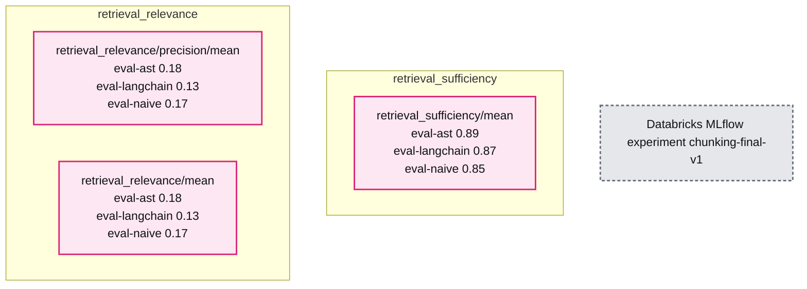

# Building a knowledge assistant over code

*Evaluating Chunking Strategies with MLflow*

- Source: https://www.databricks.com/blog/building-knowledge-assistant-over-code
- Published: 2026-03-23
- Authors: Daniel Liden
- Categories: engineering
- Images: 3 total, 1 extracted as architecture

**Key takeaways**

- RAG over code has unique chunking challenges: splitting functions mid-body or dropping structural context degrades retrieval even when you find the right file.
- We used MLflow's GenAI evaluation framework with built-in and custom LLM judges to systematically compare three chunking strategies used with Databricks Knowledge Assistant.
- The evaluation process itself was the main lesson: structured eval datasets, traceable results, and custom LLM judges aligned to what you actually care about are what make RAG iteration practical.

When developers join a new project or need to work across an unfamiliar codebase, knowledge assistants like [Databricks Knowledge Assistant](https://docs.databricks.com/aws/en/generative-ai/agent-bricks/knowledge-assistant) help them get up to speed by answering natural-language questions about the code. But answer quality depends heavily on how the source code and surrounding context were prepared and added. One key factor is *chunking*: how you split source files into pieces for indexing and retrieval. Code makes this tricky. If you break a function mid-body or strip its class context, even a capable assistant will struggle to answer questions about it.

We built three Knowledge Assistants over our [Casper’s Kitchens](https://github.com/databricks-solutions/caspers-kitchens) demo GitHub repository, each using a different chunking strategy, from a simple fixed-size baseline to a structure-aware approach that parses code into its syntactic components. The repository simulates a ghost kitchen business on Databricks, using a wide range of features including Lakeflow pipelines, DSPy agents, and Declarative Automation Bundles (DABs), with documentation in markdown files and notebook cells. The cross-file dependencies, mixed file formats, and domain-specific patterns make it the kind of project where a capable knowledge assistant would be a huge help.

This post walks through what makes working with code different from working with typical business documents, how we deployed each chunking strategy as a [Databricks Knowledge Assistant](https://docs.databricks.com/aws/en/generative-ai/agent-bricks/knowledge-assistant), and how we used [MLflow’s evaluation framework](https://mlflow.org/docs/latest/genai/eval-monitor/) to compare them. You can find all the code [here](https://github.com/databricks-solutions/caspers-kitchens/tree/main/demos/knowledge-assistant-codebase).

*Asking our Knowledge Assistant how to deploy the Casper’s Kitchens repo*

## How Knowledge Assistants Works (and Why Code Is Different)

Under the hood, knowledge assistants use various forms of retrieval-augmented generation (RAG). They retrieve relevant chunks of the source data, often from a [vector search index](https://docs.databricks.com/aws/en/vector-search/vector-search), and pass them to a large language model as context for generating an answer to a user query.

Databricks Knowledge Assistant builds on this foundation with sophisticated retrieval techniques including [Instructed Retriever](https://www.databricks.com/blog/instructed-retriever-unlocking-system-level-reasoning-search-agents), which incorporates query decomposition, context-informed re-ranking, and reasoning over document metadata. These capabilities go a long way toward handling the complexity of real-world codebases, and they work best when the underlying chunks preserve meaningful semantic boundaries.

Knowledge assistants are most commonly constructed and evaluated over collections of business documents, which tend to flow linearly, with paragraphs and sections. Code has nested hierarchies: files contain classes, classes contain methods, methods contain logic blocks. The semantic unit in code is often a complete function, not a paragraph.

This creates specific challenges, including:

- **Semantic boundaries:** Splitting a function mid-body loses the context needed to understand what it does. A chunk containing `deletion_order = ['experiments', 'jobs'...` is less useful if it doesn’t show that this variable is inside `UCState.clear_all()`.
- **Cross-file dependencies:** Code references other code. Understanding one function often requires context from its class, its imports, or related functions.
- **Mixed file types:** Our codebase has `.py` files, `.ipynb` notebooks (JSON with code/Markdown cells), `.md` documentation, and `.yaml` configuration, each requiring different parsing approaches.

Because Databricks Knowledge Assistant lets you use your own vector index, you can prepare chunks however you want and just point Knowledge Assistant at the result. This allowed us to compare different approaches to preparing our codebase for RAG and pick the best one.

## Chunking Strategies

To see how chunking strategies differ in practice, consider what happens when you ask: “In what order does resource cleanup occur?” The answer lives in a utility class that tracks experiments, jobs, and pipelines. Its logic spans initialization, a deletion order list, and cleanup methods. Here’s how each method works and how it affects the context retrieved about the resource cleanup class, `UCState`.

### Naive Baseline: Fixed-Size Character Chunks

The simplest approach is to split the source files at fixed character intervals with overlap, treating code as plain text. This is not what you would choose for a production-ready RAG system today. It ignores syntax and semantic boundaries, so it fails in exactly the ways code queries care about. But it’s also extremely easy to implement, often “good enough” for quick experiments or doc-heavy repos, and common as a first pass, so it’s a useful baseline.

Here's what naive chunking produces for a search of `deletion_order` in our codebase:

The variable name got cut in two (`eletion` instead of `deletion`), and the chunk doesn't include the method name. If someone searches for “`UCState` deletion order,” this chunk won’t match well. Furthermore, the `deletion_order` list in the method got cut off.

### Language-Aware: LangChain Heuristic Splitters

LangChain’s `RecursiveCharacterTextSplitter.from_language()` uses language-specific separators (like `\nclass` and `\ndef` for Python) to prefer splitting at logical boundaries. It tries to keep functions intact but still enforces strict size limits. Conceptually, this improves on naive chunking by prioritizing splits at likely semantic boundaries (like `def` and `class`) instead of arbitrary character counts, so chunks are more likely to contain complete units of logic.

Here’s what this approach produced for the same search:

The chunk starts at a more natural boundary, but it still lacks context showing which file or function it belongs to, and it cuts off right after the start of a `for` loop.

### AST-Based: Tree-Sitter with Metadata Headers

Abstract syntax tree–based chunking uses a parser like [Tree-sitter](https://tree-sitter.github.io/tree-sitter/) to understand actual code structure. An AST is a tree representation of code that captures its syntactic structure—how the code is organized according to a language’s grammar rules. Instead of splitting at character boundaries or using heuristic patterns, an AST-based chunking strategy parses the code into a syntax tree and chunks at semantic boundaries, such as functions, classes, or statement blocks. It can also exceed size limits when necessary to keep a complete unit together, rather than splitting mid-function.

We used the [ASTChunk](https://github.com/yilinjz/astchunk) Python library to handle the AST-based splitting. The library includes a **chunk expansion** option that causes each chunk to be prepended with a metadata header showing the file path and class/function hierarchy. This context becomes part of the embedding, helping retrieval match queries to relevant code even when the query terms don’t appear in the chunk body.

Here’s the chunk this approach produced for our query:

The header tells us exactly where this code lives: `utils/uc_state/state_manager.py` → `class UCState:` → `def clear_all(...)`. When embedded, this chunk has a stronger semantic connection to queries about “UCState,” “clear_all,” or “deletion order.”

At this stage, we had some intuitions about which methods would likely work best in our Knowledge Assistant. But to know for sure, we needed to perform a systematic evaluation.

## Evaluation Setup with MLflow

[MLflow’s GenAI evaluation framework](https://mlflow.org/docs/latest/genai/eval-monitor/) provides a complete toolkit for comparing LLMs, agents, and retrieval systems. You give it an evaluation dataset, a predict function, and LLM judges, and it runs each question through your pipeline and scores the results. Here’s how we used it to compare the three chunking methods.

### The Evaluation Dataset

We created 46 questions across a diverse set of categories, ranging from broad conceptual topics to detailed queries about the code.

| Category | Count | Example |
|---|---|---|
| Pinpointing specific values | 7 | "What is the exact deletion order in UCState.clear_all()?" |
| Retrieving complete definitions | 8 | "List all fields and validators in the ComplaintResponse model." |
| Understanding system flows | 6 | "How does the complaint pipeline work end-to-end, from generation to Lakebase sync?" |
| Comparing app implementations | 13 | "How does parse_agent_response differ between complaints-manager and refund-manager?" |
| Comparing frameworks & patterns | 12 | "What ML framework does each agent use? How do their error handling and streaming patterns differ?" |

We deliberately weighted the dataset toward disambiguation questions where the codebase has structurally similar code in different contexts, like two apps with overlapping function names, parallel database schemas, or configuration files that differ in subtle ways. These are the queries that expose chunking weaknesses most clearly. If your chunks lack metadata about where code lives, the retrieval system will struggle to tell the difference between similar classes and functions that exist in different contexts.

### The LLM Judges

We used three main LLM judges, each capturing a different aspect of quality:

- [`RetrievalSufficiency`](https://mlflow.org/docs/latest/api_reference/python_api/mlflow.genai.html#mlflow.genai.scorers.RetrievalSufficiency) (built-in): Do the retrieved chunks contain enough information to answer the question? This is the key metric for comparing chunking strategies because it measures retrieval quality independent of generation.
- `RetrievalGroundedness` (built-in): Is the response grounded in the retrieved context, or does it introduce information not present in the chunks?
- `answer_correctness` (custom): This custom scorer ranks each answer as correct, partially correct, or incorrect, making it a little more nuanced than a strict yes/no correctness judge. Given the possibility for fragmented or incomplete *context*, we want to look out for answers that might be missing details or have small inaccuracies.

### Running the Evaluation

To keep the comparison fair, all strategies used the same target chunk size (1,000 characters), overlap (200 characters), and embedding model (`databricks-gte-large-en`). In practice, the final chunk sizes still differ (for example, AST-based chunking may expand to preserve a full semantic unit, while very small files naturally produce small chunks).

For each chunking strategy, we wrote the chunks to a Delta table, created a AI Search index with managed embeddings (using the `databricks-gte-large-en` embedding model, as required by Databricks Knowledge Assistant), and attached the index to a Knowledge Assistant endpoint. The [docs](https://docs.databricks.com/aws/en/generative-ai/agent-bricks/knowledge-assistant?language=Vector%C2%A0Search%C2%A0Index#step-1-configure-your-agent) cover the full setup.

We evaluated each chunking strategy by querying its Knowledge Assistant endpoint directly. MLflow’s `to_predict_fn()` wraps a serving endpoint as a predict function, and because Knowledge Assistants produce full MLflow traces, including retrieval spans, the built-in judges can inspect both the retrieved chunks and the final response.

The LLM judges call an LLM judge through Databricks Model Serving. We used `databricks-claude-opus-4-6`:

Once evaluation runs complete, MLflow's experiment UI lets you compare results across all three strategies side by side:

*Comparing chunking approaches in the MLflow evaluation UI*

**Summary:** MLflow compares three chunking strategies, with AST achieving the highest displayed retrieval sufficiency and relevance scores.

**Components:**

- `chunking-final-v1`: Databricks MLflow experiment in GenAI apps & agents.
- `eval-naive`: Naive chunking evaluation run.
- `eval-langchain`: LangChain chunking evaluation run.
- `eval-ast`: AST chunking evaluation run.
- `retrieval_sufficiency/mean`: MLflow chart comparing retrieval sufficiency.
- `retrieval_relevance/precision/mean`: MLflow chart comparing retrieval precision.
- `retrieval_relevance/mean`: MLflow chart comparing retrieval relevance.

**Flows:**

- none. No arrows are visible.

**Numbers:**

- Experiment name: `chunking-final-v1`.
- Retrieval sufficiency section count: 1.
- Retrieval sufficiency means: AST 0.89, LangChain 0.87, naive 0.85.
- Sufficiency axis ticks: 0, 0.2, 0.4, 0.6, 0.8.
- Retrieval relevance section count: 2.
- Retrieval precision means: AST 0.18, LangChain 0.13, naive 0.17.
- Retrieval relevance means: AST 0.18, LangChain 0.13, naive 0.17.
- Both relevance chart axes: 0, 0.05, 0.1, 0.15.
- Run ages: AST shows a truncated “23 hours a”; LangChain and naive each show “1 day ago”.

source image: https://www.databricks.com/sites/default/files/inline-images/building-knowledge-assistant-over-code-blog-img-2_1.png

*Comparing chunking approaches in the MLflow evaluation UI*

## Results and Lessons Learned

We ran all 46 questions through each Knowledge Assistant and scored the results with our three judges. Here’s what we found:

| Judge | Naive | Language-Aware Splitter | AST |
|---|---|---|---|
| Retrieval Sufficiency | 85% | 87% | **89%** |
| Retrieval Groundedness | **76%** | 72% | **76%** |
| Answer Correctness (custom) | 59% fully correct (37% partial) | 61% fully correct (37% partial) | **70% fully correct (28% partial)** |

All three strategies achieve 85%+ retrieval sufficiency, meaning Knowledge Assistant's retrieval techniques find relevant context regardless of how the code was chunked. The differences at the retrieval level are modest.

The custom correctness results tell the more interesting story. AST-based chunking produces a fully correct answer 70% of the time, compared to 59% for Naive and 61% for Language-Aware. All three strategies produce at least a partially correct answer in almost all cases. Better chunks help the knowledge assistant answer questions more completely.

The advantage is concentrated in specific question types. AST-based chunking excelled on disambiguation questions, where structurally similar code exists across modules, due to the prepended metadata (file path, class, function name) providing necessary context. All three strategies were comparable for value lookups and complete definition retrieval.

MLflow traces make it easy to dig into individual questions and see exactly which chunks were retrieved and where answers diverged:

*MLflow traces let you investigate evaluation results*

This investigation did leave some questions unanswered: were the improvements we saw using AST-based chunking mostly a consequence of the larger average chunk sizes? How dependent were the results on the choice of model powering the LLM judges? Did our evaluation questions miss major categories real users would ask about?

## Lessons Learned

**Databricks Knowledge Assistant is highly capable out of the box.** Retrieval sufficiency was high across all three strategies, and nearly every question got at least a partially correct answer.

**Data prep still matters.** AST-based chunking improved groundedness and correctness in this evaluation, particularly for questions that involved disambiguating similar code. Even marginal improvements in retrieval and answer quality compound across a team of developers asking dozens of questions a day.

**Custom LLM judges help measure what we really care about.** MLflow’s `make_judge()` API makes it easy to build use case-specific LLM judges. Our custom `answer_correctness` judge was able to give a more nuanced view on correctness than a simple pass/fail correctness judge.

**MLflow traces simplify the evaluation loop.** You can investigate individual questions to see exactly which chunks were retrieved and where the answer went wrong. Because traces persist, you can re-score with different judges without re-querying the endpoint.

## References

- [Databricks Agent Bricks: Knowledge Assistant](https://docs.databricks.com/aws/en/generative-ai/agent-bricks/knowledge-assistant)—Setup guide for creating a Knowledge Assistant with custom vector search indexes.
- [MLflow GenAI evaluation framework](https://mlflow.org/docs/latest/genai/eval-monitor/index.html)—Docs for `mlflow.genai.evaluate()`, built-in LLM judges, and custom scorer API.
- [cAST: Enhancing Code Retrieval-Augmented Generation with Structural Chunking via Abstract Syntax Tree](https://arxiv.org/abs/2506.15655)—The paper that motivated our AST chunking approach, with benchmarks across multiple code RAG tasks. We used the [ASTChunk](https://github.com/yilinjz/astchunk) Python library implementation.
- [LangChain](https://docs.langchain.com/oss/python/integrations/splitters/code_splitter)[`RecursiveCharacterTextSplitter`](https://docs.langchain.com/oss/python/integrations/splitters/code_splitter)—API reference for the language-aware text splitter we used in the comparison.

## Try It Yourself

You can follow along with this demo in the [Casper’s Kitchens repo](https://github.com/databricks-solutions/caspers-kitchens/tree/main/demos/knowledge-assistant-codebase). Whether you’re evaluating chunking strategies for your own codebase or exploring other RAG improvements, this evaluation framework gives you a reproducible way to compare approaches.

1. Create an evaluation dataset with questions and expected answers.
2. Implement chunking strategies (or use ours as starting points).
3. Set up MLflow LLM judges—start with the built-in options and add custom ones as you find gaps.
4. Run evaluations with fresh indexes for each strategy.
