# Building a near real-time application with Zerobus Ingest and Lakebase

*Learn how you can simplify data ingestion for IoT, clickstream and telemetry use cases on Databricks*

- Source: https://www.databricks.com/blog/building-near-real-time-application-zerobus-ingest-and-lakebase
- Published: 2026-03-06
- Authors: Grant Doyle, Benjamin Nwokeleme
- Categories: solutions, tutorials, solution-accelerators
- Images: 3 total, 1 extracted as architecture

**Key takeaways**

- Learn how Zerobus Ingest eliminates multi-hop architectures for IoT, clickstream and telemetry use cases
- See how Lakebase eliminates complex, custom ETL pipelines and integrates transactional data for operational use cases
- Build a near real-time dashboard using Zerobus Ingest, Lakebase and Databricks Apps

Event data from IoT, clickstream, and application telemetry powers critical real-time analytics and AI when combined with the Databricks Data + AI Platform. Traditionally, ingesting this data required several data hops (message bus, Spark jobs) between the data source and the lakehouse. This adds operational overhead, data duplication, requires specialized expertise, and it's generally inefficient when the lakehouse is the only destination for this data.

Once this data lands in the lakehouse, it is transformed and curated for downstream analytical use cases. However, teams often need to serve this analytical data for operational use cases, and building these custom applications can be a laborious process. They need to provision and maintain essential infrastructure components like a dedicated OLTP database instance (with networking, monitoring, backups, and more). Additionally, they need to manage the [reverse ETL](https://www.databricks.com/blog/reverse-etl-lakebase-activate-your-lakehouse-data-operational-analytics) process for the analytical data into the database to resurface it in the real-time application. This would require the team to build additional pipelines to push data from the lakehouse into the external operational database. These pipelines add to the infrastructure that developers need to set up and maintain, which altogether diverts their attention from the main goal: building the applications for their business.

So how does Databricks simplify both ingesting data into the lakehouse and serving gold data to support operational workloads?

**Enter Zerobus Ingest and Lakebase.**

## About Zerobus Ingest

[Zerobus Ingest](https://www.databricks.com/product/data-engineering/lakeflow-connect/zerobus-ingest), part of [Lakeflow Connect](https://www.databricks.com/product/data-engineering/lakeflow-connect), is a set of APIs that provide a streamlined way to push event data directly into the lakehouse. Eliminating the single-sink message bus layer entirely, Zerobus Ingest reduces infrastructure, simplifies operations, and delivers near real-time ingestion at scale. As such, Zerobus Ingest makes it easier than ever to unlock the value of your data.

The data-producing application must specify a target table to write data to, ensure that the messages map correctly to the table's schema, and then initiate a stream to send data to Databricks. On the Databricks side, the API validates the schemas of the message and the table, writes the data to the target table, and sends an acknowledgment to the client that the data has been persisted.

### Key benefits of Zerobus Ingest:

- **Streamlined architecture: **eliminates the need for complex workflows and data duplication.
- **Performance at scale: **supports near real-time ingestion (up to 5 secs) and allows thousands of clients writing to the same table (up to 100MB/sec throughput per client).
- **Integration with the Data + AI Platform: **accelerates time to value by enabling teams to apply analytics and AI tools, such as MLflow for fraud detection, directly on their data.

| **Zerobus Ingest Capability** | **Specifications** |
|---|---|
| Ingestion latency | Near real-time (≤5 seconds) |
| Max throughput per client | Up to 100 MB/sec |
| Concurrent clients | Thousands per table |
| Continuous sync lag (Delta → Lakebase) | 10–15 seconds |
| Real-time foreach writer latency | 200–300 milliseconds |

## About Lakebase

[Lakebase](https://www.databricks.com/product/lakebase) is a fully managed, serverless, scalable, Postgres database built into the Databricks Data + AI Platform, designed for low-latency operational and transactional workloads that run directly on the same data powering analytical and AI use cases. 

The complete separation of compute and storage delivers rapid provisioning and elastic autoscaling. Lakebase's integration with the Databricks Data + AI Platform is a major differentiator from traditional databases because Lakebase makes Lakehouse data directly available to both real-time applications and AI without the need for complex custom data pipelines. It is built to deliver database creation, query latency, and concurrency requirements to power enterprise applications and agentic workloads. Lastly, it allows developers to easily version control and branch databases like code.

### Key benefits of Lakebase:

- **Automatic data synchronization: **Ability to easily sync data from the Lakehouse (analytical layer) to Lakebase on a snapshot, scheduled, or continuous basis, without the need for complex external pipelines
- **Integration with the Databricks Data + AI Platform:** Lakebase integrates with Unity Catalog, Lakeflow Connect, Spark Declarative Pipelines, Databricks Apps, and more.
- **Integrated permissions and governance:** Consistent role and permissions management for operational and analytical data. Native Postgres permissions can still be maintained via the Postgres protocol.

Together, these tools allow customers to ingest data from several systems directly into Delta tables and implement reverse ETL use cases at scale. Next, we will explore how to use these technologies to implement a near real-time application!

## How to Build a Near Real-time Application

As a practical example, let's help ‘Data Diners,' a food delivery company, empower their management staff with an application to monitor driver activity and order deliveries in real-time. Currently, they lack this visibility, which limits their ability to mitigate issues as they arise during deliveries.

Why is a real-time application valuable? 

- **Operational awareness: **Management can instantly see where each driver is and how their current deliveries are progressing. That means fewer blind spots with late orders or when a driver needs assistance.
- **Issue mitigation: **Live location and status data enable dispatchers to reroute drivers, adjust priorities, or proactively contact customers in the event of delays, reducing failed or late deliveries.

Let's see how to build this with Zerobus Ingest, Lakebase, and Databricks Apps on the Data + AI Platform!

#### **Overview of Application Architecture**

**Summary:** Data flows from a Data Producer through Zerobus Ingest, Delta, and Lakebase to Databricks Apps.

**Components:**
- Data Producer: event-producing application; technology unspecified.
- Zerobus Ingest: Databricks ingestion service.
- Delta: Delta data storage.
- Lakebase: Lakebase database.
- Databricks Apps: application hosting platform.

**Flows:**
- Data Producer -> Zerobus Ingest: producer data.
- Zerobus Ingest -> Delta: ingested data.
- Delta -> Lakebase: data transfer.
- Lakebase -> Databricks Apps: application data.

**Numbers:** none

```mermaid
%% Data flow from producer through Databricks ingestion and storage to apps
flowchart LR
    A[Data Producer] -->|Producer data| B[Zerobus Ingest]
    B -->|Ingested data| C[Delta]
    C -->|Data transfer| D[Lakebase]
    D -->|Application data| E[Databricks Apps]

    classDef client fill:#dbeafe,stroke:#2563eb,stroke-width:2px,color:#111
    classDef service fill:#dcfce7,stroke:#16a34a,stroke-width:2px,color:#111
    classDef store fill:#ede9fe,stroke:#7c3aed,stroke-width:2px,color:#111
    classDef cache fill:#fef3c7,stroke:#d97706,stroke-width:2px,color:#111
    classDef queue fill:#cffafe,stroke:#0891b2,stroke-width:2px,color:#111
    classDef critical fill:#fee2e2,stroke:#dc2626,stroke-width:4px,color:#111
    classDef external fill:#e5e7eb,stroke:#6b7280,stroke-width:2px,color:#111,stroke-dasharray:4 3
    classDef decision fill:#fce7f3,stroke:#db2777,stroke-width:2px,color:#111

    class A client
    class B,E service
    class C,D store
```

source image: https://www.databricks.com/sites/default/files/inline-images/blog-zerobus-lakebase-arch.png

This end-to-end architecture follows four stages: (1) A data producer uses the Zerobus SDK to write events directly to a Delta table in Databricks Unity Catalog. (2) A continuous sync pipeline pushes updated records from the Delta table to a Lakebase Postgres instance. (3) A FastAPI backend connects to Lakebase via WebSockets to stream real-time updates. (4) A front-end application built on Databricks Apps visualizes the live data for end users.

Starting with our data producer, the data diner app on the driver's phone will emit GPS telemetry data about the driver's location (latitude and longitude coordinates) en route to deliver orders. This data will be sent to an API gateway, which ultimately sends the data to the next service in the ingestion architecture.

With the Zerobus SDK, we can quickly write a client to forward events from the API gateway to our target table. With the target table being updated in near real time, we can then create a continuous sync pipeline to update our lakebase tables. Finally, by leveraging Databricks Apps, we can deploy a FastAPI backend that uses WebSockets to stream real-time updates from Postgres, along with a front-end application to visualize the live data flow.

Before the introduction of the Zerobus SDK, the streaming architecture would have included multiple hops before it landed in the target table. Our API gateway would have needed to offload the data to a staging area like Kafka, and we would need Spark Structured Streaming to write the transactions into the target table. All of this adds unnecessary complexity, especially given that the sole destination is the lakehouse. The architecture above instead demonstrates how the Databricks Data + AI Platform simplifies end-to-end enterprise application development — from data ingestion to real-time analytics and implementation of interactive applications.

## Getting Started

**Prerequisites: What You Need**

- [Lakebase](https://docs.databricks.com/aws/en/oltp/): Generally Available on [AWS](https://www.databricks.com/blog/databricks-lakebase-generally-available) and [Azure](https://www.databricks.com/blog/azure-databricks-lakebase-generally-available).
- [Zerobus Ingest](https://docs.databricks.com/aws/en/ingestion/lakeflow-connect/zerobus-overview): Generally Available on AWS and Azure
- [Databricks Apps](https://docs.databricks.com/aws/en/dev-tools/databricks-apps/): Check that you have the [permissions](https://docs.databricks.com/aws/en/dev-tools/databricks-apps/permissions) to create Databricks Apps.

### Step 1: Create a target table in Databricks Unity Catalog

The event data produced by the client applications will live in a Delta table. Use the code below to create that target table in your desired catalog and schema.

### Step 2: Authenticate using OAUTH

### Step 3: Create the Zerobus client and ingest data into the target table

The code below pushes the telemetry events data into Databricks using the Zerobus API. 

#### Change Data Feed (CDF) limitation and workaround

As of today, Zerobus Ingest does not support CDF. CDF allows Databricks to record change events for new data written to a delta table. These change events could be inserts, deletes, or updates. These change events can then be used to update the synced tables in Lakebase. To sync data to Lakebase and continue with our project, we will write the data in the target table to a new table and enable CDF on that table.

### Step 4: Provision Lakebase and sync data to database instance

To power the app, we will sync data from this new, CDF-enabled table into a Lakebase instance. We will sync this table continuously to support our near real-time dashboard.

In the UI, we select:

- **Sync Mode: **Continuous for low-latency updates
- **Primary Key: **table_primary_key

This ensures the app reflects the latest data with minimal delay.

*Note: You can also create the sync pipeline programmatically using the Databricks SDK.*

#### Real-time mode via foreach writer

Continuous syncs from Delta to Lakebase has a 10-15-second lag, so if you need lower latency, consider using real-time mode via ForeachWriter writer to sync data directly from a DataFrame to a Lakebase table. This will sync the data within milliseconds.

Refer to the [Lakebase ForeachWriter code on Github](https://github.com/christophergrant/lakebase-foreachwriter).

### Step 5: Build the app with FastAPI or another framework of choice

With your data synced to Lakebase, you can now deploy your code to build your app. In this example, the app fetches events data from Lakebase and uses it to update a near real-time application to track a driver’s activity while en route to making food deliveries. Read the [Get Started with Databricks Apps docs](https://docs.databricks.com/aws/en/dev-tools/databricks-apps/get-started) to learn more about building apps on Databricks. 

## Additional Resources

Check out more tutorials, demos and solution accelerators to build your own applications for your specific needs. 

- **Build an End-to-End Application:** A real-time sailing simulator tracks a fleet of sailboats using Python SDK and the REST API, with Databricks Apps and Declarative Automation Bundles. [Read the blog](https://community.databricks.com/t5/technical-blog/data-drifter-charting-the-course-from-data-collection-to/ba-p/148397).
- **Build a Digital Twins Solution: **Learn how to maximize operational efficiency, accelerate real-time insight and predictive maintenance with Databricks Apps and Lakebase. [Read the blog](https://www.databricks.com/blog/how-build-digital-twins-operational-efficiency).

Learn more about [Zerobus Ingest](https://docs.databricks.com/aws/en/ingestion/lakeflow-connect/zerobus-overview), [Lakebase](https://docs.databricks.com/aws/en/oltp/), and [Databricks Apps](https://docs.databricks.com/aws/en/dev-tools/databricks-apps/) in the technical documentation. You can also take a look at the [Databricks Apps Cookbook](https://apps-cookbook.dev/) and [Cookbook Resource Collection](https://apps-cookbook.dev/resources).

## Conclusion

IoT, clickstream, telemetry, and similar applications generate billions of data points every day, which are used to power critical real-time applications across several industries. As such, simplifying ingestion from these systems is paramount. Zerobus Ingest provides a streamlined way to push event data directly from these systems into the lakehouse while ensuring high performance. It pairs nicely with Lakebase to simplify end-to-end enterprise application development.
