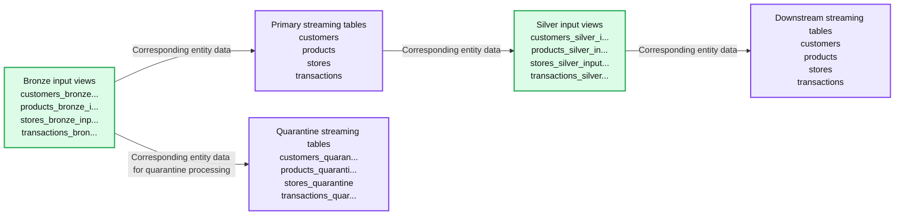

# From chaos to scale: Templatizing Spark Declarative Pipelines with DLT-META

*A metadata framework to build consistent, automated and governed pipelines at scale*

- Source: https://www.databricks.com/blog/chaos-scale-templatizing-spark-declarative-pipelines-dlt-meta
- Published: 2026-01-07
- Authors: Ravi Gawai, Phoebe Weiser
- Categories: engineering
- Images: 3 total, 1 extracted as architecture

**Key takeaways**

- Scaling data pipelines introduces overhead, drift, and inconsistent logic across teams.
- These gaps slow delivery, increase maintenance costs, and make it hard to enforce shared standards.
- This blog shows how metadata-driven metaprogramming removes duplication and builds consistent automated data pipelines at scale.

Declarative pipelines give teams an intent driven way to build batch and streaming workflows. You define what should happen and let the system manage execution. This reduces custom code and supports repeatable engineering patterns.

As organizations' data use grows, pipelines multiply. Standards evolve, new sources get added, and more teams participate in development. Even small schema updates ripple across dozens of notebooks and configurations. Metadata-driven metaprogramming addresses these issues by shifting pipeline logic into structured templates that generate at runtime.

This approach keeps development consistent, reduces maintenance, and scales with limited engineering effort.

In this blog, you will learn how to build metadata-driven pipelines for Spark Declarative Pipelines using DLT-META, a project from Databricks Labs, which applies metadata templates to automate pipeline creation.

As helpful as Declarative Pipelines are, the work needed to support them increases quickly when teams add more sources and expand usage across the organization.

## Why manual pipelines are hard to maintain at scale

Manual pipelines work at a small scale, but the maintenance effort grows faster than the data itself. Each new source adds complexity, leading to logic drift and rework. Teams end up patching pipelines instead of improving them. Data engineers consistently face these scaling challenges:

- **Too many artifacts per source:** Each dataset requires new notebooks, configs, and scripts. The operational overhead grows rapidly with each onboarded feed.
- **Logic updates do not propagate:** Business rule changes fail to be applied to pipelines, resulting in configuration drift and inconsistent outputs across pipelines.
- **Inconsistent quality and governance:** Teams build custom checks and lineage, making organization-wide standards difficult to enforce and results highly variable.
- **Limited safe contribution from domain teams:** Analysts and business teams want to add data; however, data engineering still reviews or rewrites logic, slowing delivery.
- **Maintenance multiplies with each change:** Simple schema tweaks or updates create a huge backlog of manual work across all dependent pipelines, stalling platform agility.

These issues show why a metadata-first approach matters. It reduces manual effort and keeps pipelines consistent as they scale.

## How DLT-META addresses scale and consistency

DLT-META solves pipeline scale and consistency problems. It is a metadata-driven metaprogramming framework for Spark Declarative Pipelines. Data teams use it to automate pipeline creation, standardize logic, and scale development with minimal code.

With metaprogramming, pipeline behavior is derived from configuration, rather than repeated notebooks. This gives teams clear benefits.

- Less code to write and maintain
- Faster onboarding of new data sources
- Production ready pipelines from the start
- Consistent patterns across the platform
- Scalable best practices with lean teams

Spark Declarative Pipelines and DLT-META work together. Spark Declarative Pipelines define intent and manage execution. DLT-META adds a configuration layer that generates and scales pipeline logic. Combined, they replace manual coding with repeatable patterns that support governance, efficiency, and growth at scale.

## How DLT-META addresses real data engineering needs

**1. Centralized and templated configuration**

DLT-META centralizes pipeline logic in shared templates to remove duplication and manual upkeep. Teams define ingestion, transformation, quality, and governance rules in shared metadata using JSON or YAML. When a new source is added or a rule changes, teams update the config once. The logic propagates automatically across pipelines.

**2. Instant scalability and faster onboarding**

Metadata driven updates make it easy to scale pipelines and onboard new sources. Teams add sources or adjust business rules by editing metadata files. Changes apply to all downstream workloads without manual intervention. New sources move to production in minutes instead of weeks.

**3. Domain team contribution with enforced standards**

DLT-META enables domain teams to contribute safely through configuration. Analysts and domain experts update metadata to accelerate delivery. Platform and engineering teams keep control over validation, data quality, transformations, and compliance rules.

**4. Enterprise-wide consistency and governance**

Organization-wide standards apply automatically across all pipelines and consumers. Central configuration enforces consistent logic for every new source. Built-in audit, lineage, and data quality rules support regulatory and operational requirements at scale.

## How teams use DLT-META in practice

Customers are using DLT-META to define ingestion and transformations once and apply them through configuration. This reduces custom code and speeds onboarding.

Cineplex saw immediate impact.

> We use DLT-META to minimize custom code. Engineers no longer write pipelines differently for simple tasks. Onboarding JSON files apply a consistent framework and handle the rest.—Aditya Singh, Data Engineer, Cineplex

PsiQuantum shows how small teams scale efficiently.

> DLT-META helps us manage bronze and silver workloads with low maintenance. It supports large data volumes without duplicated notebooks or source code.—Arthur Valadares, Principal Data Engineer, PsiQuantum

Across industries, teams apply the same pattern.

- **Retail** centralizes store and supply chain data from hundreds of sources
- **Logistics** standardizes batch and streaming ingestion for IoT and fleet data
- **Financial services** enforces audit and compliance while onboarding feeds faster
- **Healthcare** maintains quality and auditability across complex datasets
- **Manufacturing and telecom** scale ingestion using reusable, centrally governed metadata

This approach lets teams grow pipeline counts without growing complexity.

## How to get started with DLT-META in 5 simple steps

You do not need to redesign your platform to try DLT-META. Start small. Use a few sources. Let metadata drive the rest.

**1. Get the framework**

Start by cloning the DLT- META repository. This gives you the templates, examples, and tooling needed to define pipelines using metadata.

**2. Define your pipelines with metadata**

Next, define what your pipelines should do. You do this by editing a small set of configuration files.

- Use conf/onboarding.json to describe raw input tables.
- Use conf/silver_transformations.json to define transformations.
- Optionally, add conf/dq_rules.json if you want to enforce data quality rules.

At this point, you are describing intent. You are not writing pipeline code.

**3. Onboard metadata into the platform**

Before pipelines can run, DLT-META needs to register your metadata. This onboarding step converts your configs into Dataflowspec delta tables that pipelines read at runtime.

You can run onboarding from a notebook, a Lakeflow Job, or the DLT-META CLI.

**a. Manual onboarding via notebook e.g. **[**here**](https://github.com/databrickslabs/dlt-meta/blob/main/examples/manual_onboard.ipynb)

Use the provided onboarding notebook to process your metadata and provision your pipeline artifacts:

**b. Automate onboarding via Lakeflow Jobs with a Python wheel.**

The example below, show the Lakeflow Jobs UI to create and automate a DLT-META pipeline

**c. Onboard using the DLT-META CLI commands shown in the repo: **[**here**](https://github.com/databrickslabs/dlt-meta/tree/main?tab=readme-ov-file#onboard-using-dlt-meta-cli)**.**

The DLT-META CLI lets you run onboard and deploy in an interactive Python terminal

**4. Create a generic pipeline**

With metadata in place, you create a single generic pipeline. This pipeline reads from the Dataflowspec tables and generates logic dynamically.

Use pipelines/dlt_meta_pipeline.py as the entry point and configure it to reference your bronze and silver specs.

This pipeline remains unchanged as you add sources. Metadata controls behavior.

 

**5. Trigger and run**

You are now ready to run the pipeline. Trigger it like any other Spark Declarative Pipeline.

DLT-META builds and executes the pipeline logic at runtime.

The output is production-ready bronze and silver tables with consistent transformations, quality rules, and lineage applied automatically.

*Example Spark Declarative Pipeline, launched using DLT-META*

**Summary:** Four parallel Spark Declarative Pipeline flows route customers, products, stores, and transactions from bronze input views into primary and quarantine streaming tables, with primary tables feeding silver input views and downstream streaming tables.

**Components:**

- `customers_bronze...`: Spark view.
- `customers` at center: Spark streaming table.
- `customers_quaran...`: Spark streaming table for quarantine.
- `customers_silver_i...`: Spark view.
- `customers` at right: Spark streaming table.
- `products_bronze_i...`: Spark view.
- `products` at center: Spark streaming table.
- `products_quaranti...`: Spark streaming table for quarantine.
- `products_silver_in...`: Spark view.
- `products` at right: Spark streaming table.
- `stores_bronze_inp...`: Spark view.
- `stores` at center: Spark streaming table.
- `stores_quarantine`: Spark streaming table for quarantine.
- `stores_silver_input...`: Spark view.
- `stores` at right: Spark streaming table.
- `transactions_bron...`: Spark view.
- `transactions` at center: Spark streaming table.
- `transactions_quar...`: Spark streaming table for quarantine.
- `transactions_silver...`: Spark view.
- `transactions` at right: Spark streaming table.

**Flows:**

- `customers_bronze... -> customers at center`: customer data.
- `customers_bronze... -> customers_quaran...`: customer data for quarantine processing.
- `customers at center -> customers_silver_i...`: customer data.
- `customers_silver_i... -> customers at right`: customer data.
- `products_bronze_i... -> products at center`: product data.
- `products_bronze_i... -> products_quaranti...`: product data for quarantine processing.
- `products at center -> products_silver_in...`: product data.
- `products_silver_in... -> products at right`: product data.
- `stores_bronze_inp... -> stores at center`: store data.
- `stores_bronze_inp... -> stores_quarantine`: store data for quarantine processing.
- `stores at center -> stores_silver_input...`: store data.
- `stores_silver_input... -> stores at right`: store data.
- `transactions_bron... -> transactions at center`: transaction data.
- `transactions_bron... -> transactions_quar...`: transaction data for quarantine processing.
- `transactions at center -> transactions_silver...`: transaction data.
- `transactions_silver... -> transactions at right`: transaction data.

**Numbers:**

The metric dots have no visible legend; their values are reported in displayed order.

| Streaming table | Completion time | Metric values |
|---|---:|---|
| customers at center | 7s | 200, 0 |
| customers quarantine | 7s | 0, 200 |
| customers at right | 25s | 200, 0, 0 |
| products at center | 6s | 20, 0 |
| products quarantine | 9s | 0, 20 |
| products at right | 24s | 20, 0, 0 |
| stores at center | 8s | 4, 0 |
| stores quarantine | 5s | 0, 4 |
| stores at right | 26s | 4, 0, 0 |
| transactions at center | 6s | 2K, 0 |
| transactions quarantine | 9s | 0, 2K |
| transactions at right | 23s | 2K, 0, 0 |

The Mermaid groups corresponding components across the four independent flows to stay under 15 nodes. Each arrow applies separately to each listed entity.

source image: https://www.databricks.com/sites/default/files/inline-images/from-chaos-scale-templatizing-spark-declarative-pipelines-dlt-meta-image-3.png

[Example Spark Declarative Pipeline, launched using DLT-META](https://www.databricks.com/sites/default/files/inline-images/from-chaos-scale-templatizing-spark-declarative-pipelines-dlt-meta-image-3.png)

## Try it today

To begin, we recommend starting a proof of concept using your existing Spark Declarative Pipelines with a handful of sources, migrating pipeline logic to metadata, and letting DLT-META orchestrate at scale. Start with a small proof of concept, and watch as metadata-driven metaprogramming scales your data engineering capabilities beyond what you thought possible.

**Databricks resources**

- **Getting started:** [https://github.com/databrickslabs/DLT-META#getting-started](https://github.com/databrickslabs/dlt-meta#getting-started)
- **GitHub:** [github.com/databrickslabs/DLT-META](https://github.com/databrickslabs/dlt-meta)
- **GitHub Documentation:** [databrickslabs.github.io/DLT-META](http://databrickslabs.github.io/dlt-meta)
- **Databricks Documentation:** [https://docs.databricks.com/aws/en/dlt-ref/DLT-META](https://docs.databricks.com/aws/en/dlt-ref/dlt-meta)
- **Demos:** [databrickslabs.github.io/DLT-META/demo](http://databrickslabs.github.io/dlt-meta/demo)
- **Latest release:** [https://github.com/databrickslabs/DLT-META/releases](https://github.com/databrickslabs/dlt-meta/releases)
