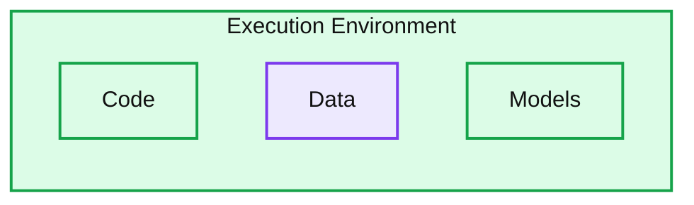

# Databricks ❤️ Hugging Face

*Up to 40% faster training and tuning of Large Language Models*

- Source: https://www.databricks.com/blog/contributing-spark-loader-for-hugging-face-datasets
- Published: 2023-04-26
- Authors: Ali Ghodsi, Patrick Wendell, Maddie Dawson, Lu Wang, Xiangrui Meng, Nicolas Pelaez
- Categories: open-source
- Images: 1 total, 1 extracted as architecture

Generative AI has been taking the world by storm. As the data and AI company, we have been on this journey with the release of the open source large language model [Dolly](https://huggingface.co/databricks/dolly-v2-12b), as well as the internally crowdsourced dataset licensed for research and commercial use that we used to fine-tune it, the [databricks-dolly-15k](https://huggingface.co/datasets/databricks/databricks-dolly-15k). Both the model and dataset are available on Hugging Face. We’ve learned a lot throughout this process, and today we’re excited to announce our first of many official commits to the Hugging Face codebase that allows users to easily create a Hugging Face Dataset from an Apache Spark™ dataframe. 

>  “It's been great to see Databricks release models and datasets to the community, and now we see them extending that work with direct open source commitment to Hugging Face. Spark is one of the most efficient engines for working with data at scale, and it's great to see that users can now benefit from that technology to more effectively fine tune models from Hugging Face.” —Clem Delange, Hugging Face CEO

### **Hugging Face gets first-class Spark support**

Over the past few weeks, we’ve gotten many requests from users asking for an easier way to load their Spark dataframe into a Hugging Face dataset that can be utilized for model training or tuning. Prior to today’s release, to get data from a Spark dataframe into a Hugging Face dataset, users had to write data into Parquet files and then point the Hugging Face dataset to these files to reload them. For example:

Not only was this cumbersome, but it also meant that data had to be written to disk and then read in again. On top of that, the data would get rematerialized once loaded back into the dataset, which eats up more resources and, therefore, more time and cost. Using this method, we saw that a relatively small (16GB) dataset took about 22 minutes to go from Spark dataframe to Parquet, and then back into the Hugging Face dataset.

With the latest Hugging Face release, we make it much simpler for users to accomplish the same task by simply calling the new “from_spark” function in Datasets:

This allows users to use Spark to efficiently load and transform data for training or fine-tuning a model, then easily map their Spark dataframe into a Hugging Face dataset for super simple integration into their training pipelines. This combines cost savings and speed from Spark and optimizations like memory-mapping and smart caching from Hugging Face datasets. These improvements cut down the processing time for our example 16GB dataset by more than 40%, going from 22 minutes down to only 12 minutes.

### **Why does this matter?**

As we transition to this new AI paradigm, organizations will need to use their extremely valuable data to augment their AI models if they want to get the best performance within their specific domain. This will almost certainly require work in the form of data transformations, and doing this efficiently over large datasets is something Spark was designed to do. Integrating Spark with Hugging Face gives you the cost-effectiveness and performance of Spark while retaining the pipeline integration that Hugging Face provides.

**Summary:** The execution environment contains code, data, and models.

**Components:**
- Execution Environment: container for the three components; technology unspecified.
- Code: represented by a code folder icon; technology unspecified.
- Data: represented by a database icon; technology unspecified.
- Models: represented by a brain and circuit icon; technology unspecified.

**Flows:**
- None visible.

**Numbers:** none

source image: https://www.databricks.com/sites/default/files/inline-images/image5_3.png

### **Continued Open-Source Support**

We see this release as a new avenue to further contribute to the open source community, something that we believe Hugging Face does extremely well, as it has become the de facto repository for open source models and datasets. This is only the first of many contributions. We already have plans to add streaming support through Spark to make the dataset loading even faster.

In order to become the best platform for users to jump into the world of AI, we’re working hard to provide the best tools to successfully train, tune, and deploy models. Not only will we continue contributing to Hugging Face, but we’ve also started releasing improvements to our other open source projects. A recent [MLflow release](https://www.databricks.com/blog/2023/04/18/introducing-mlflow-23-enhanced-native-llm-support-and-new-features.html) added support for the transformers library, OpenAI integration, and Langchain support. We also announced [AI Functions](https://www.databricks.com/blog/2023/04/18/introducing-ai-functions-integrating-large-language-models-databricks-sql.html) within Databricks SQL that lets users easily integrate OpenAI (or their own deployed models in the future) into their queries. To top it all off, we also released a [PyTorch distributor](https://www.databricks.com/blog/2023/04/20/pytorch-databricks-introducing-spark-pytorch-distributor.html) for Spark to simplify distributed PyTorch training on Databricks. 

We'll also be exploring the world of LLMs, including how you can build, train and deploy your own, at Data + AI Summit. [Register here](https://www.databricks.com/dataaisummit/?utm_source=databricks&utm_medium=blog&utm_campaign=7018Y000001RjAoQAK) to join us virtually or in-person! 

To learn more about generative AI and how you can harness LLMs for yourself, watch our on-demand webinar [here](https://www.databricks.com/resources/webinar/build-your-own-large-language-model-dolly).
