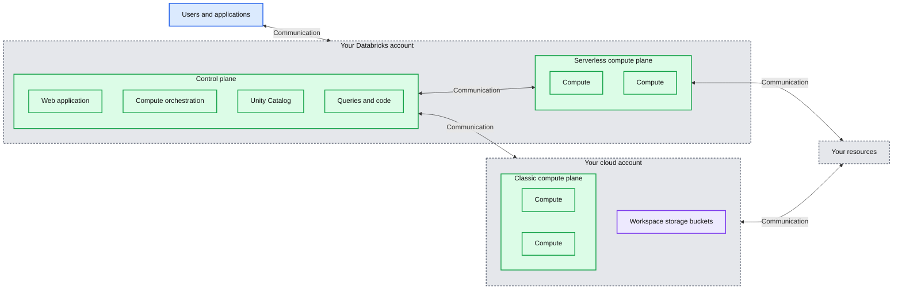
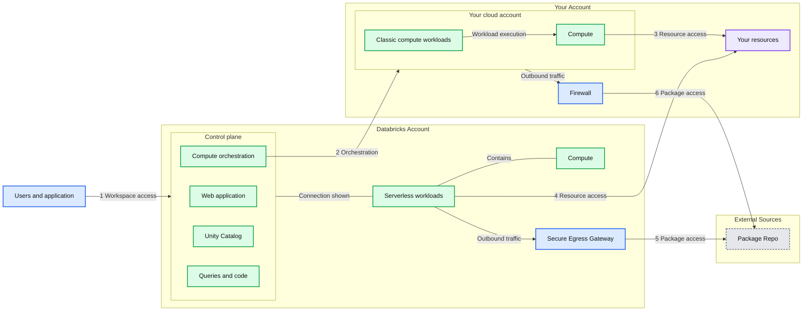
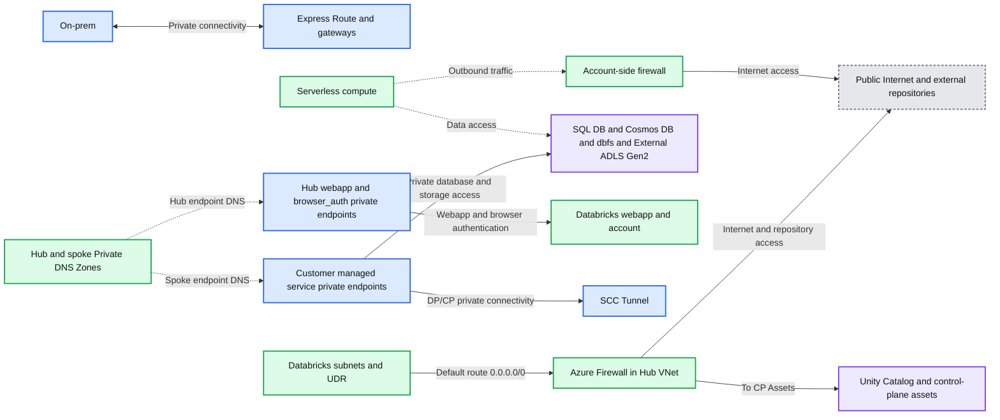

# Data Exfiltration Protection with Azure Databricks

*Learn details of how you could set up a secure Azure Databricks architecture to protect data exfiltration*

- Source: https://www.databricks.com/blog/data-exfiltration-protection-with-azure-databricks
- Published: 2024-03-21
- Authors: Ganesh Rajagopal, Bruce Nelson, Bhavin Kukadia
- Categories: platform, solutions, security-and-trust, engineering, data-science-machine-learning
- Images: 3 total, 3 extracted as architecture

*Last updated on: October 30, 2025*

### Essential Reading

Before you begin, please make sure that you are familiar with these topics

- Azure Databricks Serverless Compute [Architecture](https://learn.microsoft.com/en-us/azure/databricks/security/network/serverless-network-security/#serverless-compute-plane-networking-overview)
- Key Databricks [terminology](https://learn.microsoft.com/en-us/azure/databricks/security/network/)
- What is [Front and Backend](https://learn.microsoft.com/en-us/azure/databricks/security/network/classic/private-link) Azure Databricks Private Link (PL)?
- Private Link enabled workspace [requirements](https://learn.microsoft.com/en-us/azure/databricks/security/network/classic/private-link#enable-or-disable-azure-private-link-on-an-existing-workspace)
- What is [Service Endpoint Policies for Azure workspaces](https://learn.microsoft.com/en-us/azure/databricks/security/network/classic/service-endpoints)
- Ingress controller [IP Access List](https://learn.microsoft.com/en-us/azure/databricks/security/network/front-end/ip-access-list)
- [Secure Cluster](https://learn.microsoft.com/en-us/azure/databricks/security/network/classic/) Connectivity
- Databricks [Networking](https://learn.microsoft.com/en-us/azure/databricks/security/network/)
- [Unity Catalog](https://learn.microsoft.com/en-us/azure/databricks/data-governance/unity-catalog/)

The [Azure Databricks Lakehouse Platform](https://learn.microsoft.com/en-us/azure/databricks/getting-started/) provides a unified set of tools for building, deploying, sharing, and maintaining enterprise-grade data solutions at scale. Databricks integrates with cloud storage and security in your cloud account, and manages and deploys cloud infrastructure on your behalf.

The overarching goal of this article is to mitigate the following risks:

- Data access from a browser on the internet or an unauthorized network using the Databricks web application.
- Data access from a client on the internet or an unauthorized network using the Databricks API.
- Data access from a client on the internet or an unauthorized network using the Azure Private Link or Service Endpoints.
- A compromised workload on the Azure Databricks cluster writing data to an unauthorized storage resource on Azure or on the internet.

Azure Databricks is a first party service and supports Azure’s native tools and services that help protect data in transit and at rest. Azure Databricks supports network security controls, such as [user defined routes](https://learn.microsoft.com/en-us/azure/databricks/security/network/classic/udr), [firewall rules](https://learn.microsoft.com/en-us/azure/firewall/overview) and [Network Security Groups](https://learn.microsoft.com/en-us/azure/virtual-network/network-security-groups-overview).  

On top of the technical goals for this blog, we also want to be sure that the concepts we are presenting consider: 

- Simplicity, any security design should be well understood and maintainable, and fit within the skill sets of your organization. A security solution that gets implemented and not fully understood can be inadvertently compromised.
- Operational cost of the solution should always be taken into account. If a security design is abandoned because the cost is too high - then the solution was not effective. Security should be cost conscious and sustainable. 

We will point out areas for cost saving or cost concerns along with trying to clarify why and how things work whenever we can.

Before we begin, let’s have a quick look at the Azure Databricks deployment architecture [here](https://learn.microsoft.com/en-us/azure/databricks/getting-started/overview):

Azure Databricks is structured to facilitate secure collaboration across teams, while it handles the management of many backend services, allowing you to concentrate on data science, data analytics, and data engineering.

Azure Databricks is structured around two key components: the control plane and the compute plane.

**Control Plane:**

The Azure Databricks control plane, managed by Databricks within its own Azure account, acts as the platform's core intelligence. It provides backend services for user authentication, cluster and job orchestration, and workspace management, offering the web interface and API endpoints for service interaction.

While it orchestrates the lifecycle of compute resources, it does not directly process data. Instead, the control plane directs data processing to the separate compute plane, which operates either within the customer's Azure subscription or the Databricks tenant for serverless deployments. Notebook commands and many other workspace configurations are stored in the control plane and [encrypted](https://www.databricks.com/trust?itm_data=menu-item-securitytrustcenter) at rest.

**Compute Plane: **

The compute plane is responsible for processing your data. The specific type of compute used, serverless or classic, depends on your chosen compute resources and workspace configuration. Both serverless and classic compute share some resources such as default workspace storage ([dbfs](https://learn.microsoft.com/en-us/azure/databricks/dbfs/)) and managed identities that are tied to your Azure tenant.

**Serverless Compute**

For serverless compute, resources operate within a compute plane in Azure managed by Databricks. Azure Databricks handles almost all the entire underlying infrastructure, including provisioning, scaling, and maintenance. This approach offers:

- **Simplified Operations:** Users can focus on data engineering and data science tasks without the need to manage clusters or virtual machines.
- **Cost Efficiency:** Users are billed only for the compute resources actively consumed during workload execution, eliminating costs associated with idle clusters.

Serverless resources are available as needed, reducing idle time costs. They also run within a secure network boundary in the Azure Databricks account, with multiple layers of security and network controls.

**Classic Azure Databricks Compute**

With classic Azure Databricks compute, resources are situated within your Azure Cloud tenant. This provides customer-managed compute, where Databricks clusters run on resources within your Azure subscription, not the Databricks tenant. This offers:

- **Natural Isolation:** Operations occur within your own Azure subscription and virtual network.
- **Secure Connections:** Enables secure connections to other Azure services through service endpoints or private endpoints that you manage and control.

**Important Note:** Classic clusters, including classic SQL warehouses, may experience longer startup times compared to serverless options due to the requirement of provisioning resources from your Azure subscription.

**Serverless Only Databricks Workspace deployment (new):** Serverless only workspaces are workspaces that can only run serverless compute. There is no classic compute so all system resources are managed by Azure Databricks, which handles all the entire underlying infrastructure, including workspace default storage.

### High-level Architecture

**Summary:** Users and applications connect to a Databricks account containing control and serverless compute planes, which communicate with compute, storage, and resources in the cloud account.

**Components:**
- Users and applications: client technologies unspecified.
- Your Databricks account: Databricks-managed boundary.
- Control plane: Databricks services.
- Web application: workspace web interface.
- Compute orchestration: Databricks compute management.
- Unity Catalog: Databricks catalog service.
- Queries and code: query and code component; technology unspecified.
- Serverless compute plane: Databricks serverless compute containing two Compute boxes.
- Your cloud account: cloud boundary; provider not labeled.
- Classic compute plane: classic compute containing two Compute boxes.
- Workspace storage buckets: bucket storage; technology unspecified.
- Your resources: storage, building, and database symbols; technologies unspecified.

**Flows:**
- Users and applications -> Your Databricks account: bidirectional communication; payload unspecified.
- Control plane -> Your cloud account: bidirectional communication; payload unspecified.
- Control plane -> Serverless compute plane: bidirectional communication; payload unspecified.
- Serverless compute plane -> Your resources: bidirectional communication; payload unspecified.
- Your cloud account -> Your resources: bidirectional communication; payload unspecified.

**Numbers:** none

source image: https://www.databricks.com/sites/default/files/inline-images/default-deployment-architecture-network-communication-path.png

Network Communication Path

Let’s understand the communication path that we would like to secure. Azure Databricks could be consumed by users and applications in numerous ways as shown below:

**Summary:** Azure Databricks separates control plane and serverless workloads from customer cloud compute and resources, with distinct external access paths through a firewall and a Secure Egress Gateway.

**Components:**

- Databricks Account: boundary containing the control plane, serverless workloads, and Secure Egress Gateway.
- Your Account: customer boundary containing cloud compute, resources, and firewall.
- Your Databricks account: enclosing boundary spanning control plane, workloads, and customer resources.
- Users and application: clients accessing Databricks.
- Control plane: Databricks services containing Web application, Compute orchestration, Unity Catalog, and Queries and code.
- Your cloud account: customer cloud boundary containing Classic compute workloads and Compute.
- Classic compute workloads: Databricks classic compute.
- Compute: execution resources within classic and serverless workloads.
- Serverless workloads: Databricks serverless compute.
- Your resources: two database symbols and one server/storage symbol; technologies unspecified.
- Firewall: network filtering component; technology unspecified.
- Secure Egress Gateway: gateway for serverless external access.
- External Sources / Package Repo: external package repository; technology unspecified.

**Flows:**

- Users and application -> Your Databricks account: workspace access, marked 1.
- Compute orchestration -> Your cloud account: classic compute orchestration path, marked 2.
- Classic compute workloads -> Compute: workload execution.
- Compute -> Your resources: resource access, marked 3.
- Control plane -> Serverless workloads: visible connecting line without an arrowhead; traffic unspecified.
- Serverless workloads -> Your resources: resource access, marked 4.
- Serverless workloads -> Secure Egress Gateway: outbound traffic.
- Secure Egress Gateway -> Package Repo: external package access, marked 5.
- Your cloud account -> Firewall: classic compute outbound traffic.
- Firewall -> Package Repo: external package access, marked 6.

**Numbers:** 1, 2, 3, 4, 5, 6 are communication path identifiers. No units, percentages, or sizes are visible.

source image: https://www.databricks.com/sites/default/files/inline-images/communication-paths.png

A Databricks workspace deployment includes the following network paths that you could secure:

1. User or Applications to Azure Databricks web application aka workspace or Databricks REST APIs
2. Azure Databricks classic compute plane virtual network to the Azure Databricks control plane service. This includes the secure cluster connectivity relay and the workspace connection for the REST API endpoints.
3. Classic compute plane to your storage services (ex:ADLS gen2, SQL database)
4. Serverless compute plane to  to your storage services (ex:ADLS gen2, SQL database)
5. Secure egress from serverless compute plane via network policies (egress firewall) to external data sources e.g. package repositories like pypi or maven
6. Secure egress from classic compute plane via egress firewall to external data sources e.g. package repositories like pypi or maven (it could be any egress appliance running on Azure ex: Palo Alto)

From an end-user perspective, item 1 requires ingress controls, and items 2 to 6 require egress controls.

In this article our focus area is to **secure egress traffic** from your databricks workloads, provide the reader with a prescriptive guidance on the proposed deployment architecture and while we are at it, we’ll share best practices to secure ingress (user/client into Databricks) traffic as well.

### Workspace Deployment Options

There are multiple options available to create a secure Azure Databricks workspace that is accessible from on-premise or VPN connections (no internet access). As a best practice, we recommend securing access to the workspace [using private endpoints (Private Link)](https://learn.microsoft.com/en-us/azure/databricks/administration-guide/cloud-configurations/azure/private-link#--choose-standard-or-simplified-deployment) using either a [***standard***](https://learn.microsoft.com/en-us/azure/databricks/security/network/classic/private-link#choose-standard-or-simplified-deployment) or [***simplified***](https://learn.microsoft.com/en-us/azure/databricks/security/network/classic/private-link#choose-standard-or-simplified-deployment) deployment. The recommended option is ***standard*** deployment.  The workspace can be deployed via Azure Portal or [All in one ARM templates](https://learn.microsoft.com/en-us/samples/azure/azure-quickstart-templates/databricks-all-in-one-template-for-vnet-injection/) or using [Security Reference Architecture (SRA)](https://github.com/databricks/terraform-databricks-sra/blob/main/README.md) Terraform templates which enables deployment of Databricks workspaces and cloud infrastructure configured with security best practices

**Front End vs Back End private link:** Front-end Private Link, also known as user to workspace. Back-end Private Link, also known as compute plane to control plane:

**Standard deployment (recommended):** For improved security, Databricks recommends you use a separate private endpoint for your front-end (client) connections from a separate transit VNet. You can implement both front-end and back-end Private Link connections or just the back-end connection. Use a separate VNet to encapsulate user access, separate from the VNet that you use for your compute resources in the Classic data plane. Create separate Private Link endpoints for back-end and front-end access. Follow the instructions in [Enable Azure Private Link as a standard deployment](https://learn.microsoft.com/en-us/azure/databricks/administration-guide/cloud-configurations/azure/private-link-standard).

Additional consideration is needed for system storage, messaging and metadata access from the compute plane since these services cannot be accessed via the back-end private endpoint.

**System managed storage accounts (classic compute plane only):** These storage accounts are needed to boot and monitor Databricks clusters. These storage accounts are in the Databricks tenant and need to be allowed via [service endpoint policies](https://learn.microsoft.com/en-us/azure/virtual-network/virtual-network-service-endpoint-policies?tabs=portal) (recommended), alternatives would be using storage service tags which tend to be overbroad and make it easier to exfiltrate data, or [individual allowlisting of the FQDN or ip addresses](https://learn.microsoft.com/en-us/azure/databricks/resources/ip-domain-region) (not recommended):

- Artifact: Read only Databricks Runtime images > 11gb / cluster node
- Logging: Read / Write heavy weight messaging including audit logging.
- System Tables: Read only audit, UC and system data.  

**Workspace default storage (DBFS):** Common distributed file system used for scratch space, services, temporary SQL results (cloud fetch), drivers. Can be secured via private endpoints using the [private DBFS feature](https://learn.microsoft.com/en-us/azure/databricks/security/network/storage/firewall-support) for classic compute and service endpoint or private endpoint for serverless compute.

**Messaging:** (Event Hub, classic compute plane only) This is a publicly accessible resource used for lineage tracking and other light weight messaging. Can be allowed via EventHub service tag at the UDR and/or Firewall.

**Metadata:** (SQL, classic compute plane only): This is a publicly accessible resource used for legacy Hive metastore traffic. 

**User level storage account access:** ALDS and Blob Storage accounts used for customer data as opposed to system data. 

**First party resources:**  Cosmos DB, Azure SQL, DataFactory etc…

**External resources:** S3, BigQuery , Snowflake etc… 
 

## High-level Data Exfiltration Protection Architecture

We recommend a [hub and spoke](https://docs.microsoft.com/en-us/azure/architecture/reference-architectures/hybrid-networking/hub-spoke) reference architecture. In this model, the **hub** virtual network hosts the shared infrastructure necessary for connecting to validated sources and, optionally, to on-premises environments. The **spoke** virtual networks peer with the hub and contain isolated Azure Databricks workspaces for different business units or teams.

This hub-and-spoke architecture enables the creation of multiple-spoke VNETs tailored for various purposes and teams. Isolation can also be achieved by creating separate subnets for different teams within a single, large virtual network. In these cases, you can establish multiple isolated Azure Databricks workspaces, each within its own subnet pair, and deploy Azure Firewall in a separate subnet within the same virtual network.
 

## Pre-requisites

| Item | Details |
|---|---|
| Virtual Network | 1. Virtual network to deploy Azure Databricks Dataplane (a.k.a VNet Injection). Make sure to choose the right CIDR blocks. |
| Subnets | Three subnets Host (Public) , Container (Private) and Private endpoint Subnet (to hold private endpoints for the storage, DBFS and other azure services that you may use) |
| Route Tables | Channel Egress traffic from the Databricks Subnets to network appliance, Internet or On-prem data sources |
| Azure Firewall | Inspect any egress traffic and take actions according to allow / deny policies |
| Private DNS Zones | Provide reliable, secure DNS service to manage and resolve domain names in a virtual network (can be automatically created as part of the deployment if not available) |
| Service Endpoint Policies | Policies for allowing access to any non-private endpoint based storage accounts including system storage for workspace storage account (dbfs), artifact and logging storage, and system tables. |
| Azure Key Vault | Stores the CMK for encrypting DBFS, Managed Disk and Managed Services. |
| Azure Databricks Access Connector | Required if enabling Unity Catalog. To connect managed identities to an Azure Databricks account for the purpose of accessing data registered in Unity Catalog |
| List of Azure Databricks services to allow list on Firewall | Please follow this public doc and make a list of all the ip’s and domain names relevant to your databricks deployment |

### Deployment Architecture

**Summary:** Azure Databricks uses a hub-and-spoke network with Azure Firewall, private endpoints, private DNS, ExpressRoute, and secure cluster connectivity to connect on-premises users, compute, control-plane services, and data stores.

**Components:**

- Databricks Control Plane: resource group containing Unity Catalog and control-plane assets.
- Unity Catalog: Databricks data catalog.
- Artifact, Blob, EventHub, and Metastore: labeled control-plane assets.
- Your Azure Databricks Account: boundary containing webapp, SCC Tunnel, and serverless compute.
- webapp: Databricks web application.
- SCC Tunnel: Databricks secure cluster connectivity tunnel.
- serverless compute: Databricks serverless execution.
- Account-side firewall symbol: firewall between the account and public Internet.
- Public Internet: external connectivity shown beside the control plane and hub.
- External Repos: PyPI, Apache Maven, and R package sources.
- Hub/Transit: Azure resource group containing the hub network.
- Hub Vnet: Azure virtual network.
- f/w subnet and Firewalls: firewall subnet containing Azure Firewall.
- pe subnet: private endpoint subnet containing webapp and browser_auth endpoints.
- Private DNS Zones: hub DNS linked to the webapp and browser_auth endpoints.
- On-prem: on-premises environment.
- Express Route: private network connection.
- Express Route Gateways: Azure gateways connecting ExpressRoute to the hub.
- Databricks Spoke: Azure resource group containing the Databricks network.
- Databricks VNet: Azure virtual network.
- UDR: user-defined routing for Databricks subnets.
- Public/Host Subnet: Azure Databricks compute subnet with an NSG.
- Container Subnet: Azure Databricks compute subnet with an NSG.
- PE Subnet, Customer managed Services: NSG-protected private endpoint subnet.
- SQL DB, Cosmos DB, dbfs, External ADLS, and DP/CP: private endpoint labels inside the PE subnet.
- SQL DB: SQL database data destination.
- Cosmos DB: Azure Cosmos DB data destination.
- dbfs: Databricks file storage destination.
- External ADLS Gen2: external Azure Data Lake Storage destination.
- Private DNS Zones, DNS Resolution: spoke DNS linked to customer-managed service endpoints.

**Flows:**

- On-prem -> Express Route: private connectivity, shown bidirectionally.
- Express Route -> Express Route Gateways: private connectivity, shown bidirectionally.
- Public/Host Subnet -> UDR: outbound subnet routing.
- Container Subnet -> UDR: outbound subnet routing.
- Databricks Spoke -> Azure Firewall: default-route traffic through the hub, labeled “peer from 0.0.0.0/0 to Azure Firewall.”
- Azure Firewall -> Public Internet: outbound Internet access.
- Azure Firewall -> External Repos: access to package repositories.
- Azure Firewall -> control-plane assets: connectivity labeled “To CP Assets.”
- webapp private endpoint -> webapp: private web application connectivity.
- browser_auth private endpoint -> Azure Databricks account boundary: private authentication connectivity, annotated “One per region.”
- Hub Private DNS Zones -> webapp private endpoint: DNS association, shown with a green dashed line.
- Hub Private DNS Zones -> browser_auth private endpoint: DNS association, shown with a green dashed line.
- SQL DB private endpoint -> SQL DB: private database connectivity.
- Cosmos DB private endpoint -> Cosmos DB: private database connectivity.
- dbfs private endpoint -> dbfs: private storage connectivity.
- External ADLS private endpoint -> External ADLS Gen2: private storage connectivity.
- DP/CP private endpoint -> SCC Tunnel: private control-plane connectivity.
- Spoke Private DNS Zones -> SQL DB private endpoint: DNS resolution association.
- Spoke Private DNS Zones -> Cosmos DB private endpoint: DNS resolution association.
- Spoke Private DNS Zones -> dbfs private endpoint: DNS resolution association.
- Spoke Private DNS Zones -> External ADLS private endpoint: DNS resolution association.
- Spoke Private DNS Zones -> DP/CP private endpoint: DNS resolution association.
- serverless compute -> account-side firewall: outbound path toward the firewall.
- Account-side firewall -> Public Internet: outbound Internet connectivity.
- serverless compute -> data-store group: dashed access path terminating at the grouped data destinations.

**Numbers:**

- Deployment callouts: 1, 2, 3, 4, 5, 6, 7, 8, 9.
- Default route: 0.0.0.0/0.
- “One per region”: regional endpoint annotation.
- “Gen2”: generation identifier in External ADLS Gen2.

source image: https://www.databricks.com/sites/default/files/inline-images/proposed-deployment-architecture_0.png

1. Deploy Azure Databricks with [secure cluster connectivity](https://docs.microsoft.com/en-us/azure/databricks/security/secure-cluster-connectivity) (SCC) enabled in a spoke virtual network using [VNet injection](https://docs.microsoft.com/en-us/azure/databricks/administration-guide/cloud-configurations/azure/vnet-inject) and [Private link](https://learn.microsoft.com/en-us/azure/databricks/administration-guide/cloud-configurations/azure/private-link).
  - The virtual network must include two subnets dedicated to each Azure Databricks workspace: a private subnet and public subnet (feel free to use a different nomenclature).  Note that there is a one-to-one relationship between these subnets and an Azure Databricks workspace. You cannot share multiple workspaces across the same subnet pair, and must use a new subnet pair for each different workspace.
  - Azure Databricks creates a default blob storage (a.k.a root storage) during the deployment process which is used for storing logs and telemetry. Even though public access is enabled on this storage, the Deny Assignment created on this storage prohibits any direct external access to the storage; it can be accessed only via the Databricks workspace. Azure Databricks deployments now support private connectivity to the default workspace storage account (DBFS).
  - Important : As a best practice It is **NOT** recommended to store any application data in the root container (DBFS) storage.  Access to the DBFS root container can now be disabled and instead we recommend using Unity catalog volumes. Unity Catalog volumes offer modern governance and security over DBFS root storage.
2. Set up [Private Link endpoints](https://docs.microsoft.com/en-us/azure/private-link/private-endpoint-overview) for your Azure Data Services (Storage accounts, Eventhub, SQL databases etc) in a separate subnet within the Azure Databricks spoke virtual network. This would ensure that all workload data is being accessed securely over Azure network backbone with default data exfiltration protection in place (refer to [this](https://www.databricks.com/blog/2020/02/28/securely-accessing-azure-data-sources-from-azure-databricks.html) blog for more details). Also in general it’s completely fine to deploy these endpoints in another virtual network that’s peered to the one hosting the Azure Databricks workspace. Note that Private Endpoints incurs [additional cost](https://azure.microsoft.com/en-us/pricing/details/private-link/) and it is fine to leverage (based on your organization’s security policies) [Service Endpoints](https://learn.microsoft.com/en-us/azure/virtual-network/virtual-network-service-endpoints-overview) instead of Private Endpoints to access the Azure Data services, specifically using [Service Endpoint Policies](https://learn.microsoft.com/en-us/azure/virtual-network/virtual-network-service-endpoint-policies?tabs=portal) for secure storage account access
3. Leverage [Azure Databricks Unity Catalog](https://learn.microsoft.com/en-us/azure/databricks/data-governance/unity-catalog/) for unified governance solution.
4.

Deploy [Azure Firewall](https://docs.microsoft.com/en-us/azure/firewall/overview)(or other Network Virtual Appliance) in a hub virtual network. With Azure Firewall, you could configure:

  - **Application rules** that define fully qualified domain names (FQDNs) that are accessible through the firewall. It is highly recommended that you use **Application rules **for Azure Databricks [control plane](https://learn.microsoft.com/en-us/azure/databricks/resources/ip-domain-region#inbound) resources ex: control plane, web app and scc relay.
  - **Network rules **that define IP address, port and protocol for endpoints that can’t be configured using FQDNs. Some of the required Azure Databricks traffic needs to be whitelisted using the network rules.

If you happen to use a third-party firewall appliance instead of Azure Firewall, that works as well. Though please note that each product has its own nuances and it’s better to engage relevant product support and network security teams to troubleshoot any pertinent issues.

  - AzureDatabricks Service Tag is not required if [private endpoints](https://learn.microsoft.com/en-us/azure/databricks/security/network/classic/private-link-standard) are enabled for the workspace.  
  - When using Service Endpoint Policies, there is no need for network rules for Databricks service storage accounts (artifact, logging, and system tables) in the firewall. Also, no storage service tags are needed or recommended.
  - Azure Databricks also makes additional calls to NTP service, CDN, cloudflare, GPU drivers and  external storages for demo datasets which need to be whitelisted appropriately.
5.

Non-local network traffic from Databricks compute plane  subnets should be routed through an egress appliance like Azure Firewall using a user-defined route (for example a default route 0.0.0.0/0). This ensures all outbound traffic is inspected. However, egress to the control plane, utilizing private endpoints, will bypass these route tables and egress appliances. Other control plane components, such as SQL, Event Hubs, and storage, will, however, be routed through your egress appliance.

  - For Databricks service storage accounts (artifact, logging, and system tables), you might consider the option of bypassing your egress appliance (NVA or firewall) to avoid potential throttling and reduce data transfer costs. Access to artifact storage alone can account for up to 11GB downloaded per cluster node. We recommend using service endpoints for storage in conjunction with Service Endpoint Policies. These policies ensure that the workspace can only access the designated artifact, logging, and system tables storage accounts included in its attached policy via its subnet. Service Endpoint Policies are also compatible with other non-private link storage account access. With service endpoint policies, no storage service tags are needed or recommended.
  - Alternatively, egress traffic to Control Plane assets can be routed directly to the internet by adding Service tag rules to the route table, bypassing the firewall. This can help avoid throttling and additional data transfer costs associated with Network Virtual Appliances.

*Important Consideration: Please note that this will allow egress to storage accounts and services across the entire region, not just the ones you intend to reach. This is a critical factor to carefully consider when designing your security architecture.*

6. Configure [virtual network peering](https://docs.microsoft.com/en-us/azure/virtual-network/virtual-network-peering-overview) between the Azure Databricks spoke and Azure Firewall hub virtual networks.
7. Deploy Private endpoints for the Front end and [browser auth](https://learn.microsoft.com/en-us/azure/databricks/administration-guide/cloud-configurations/azure/private-link-standard#--step-4-create-a-private-endpoint-to-support-sso-required-for-ui-access) (for SSO) on the Hub Vnet (private end point subnet)
8. Configure serverless compute [network policies](https://learn.microsoft.com/en-us/azure/databricks/security/network/serverless-network-security/serverless-firewall) to govern egress network traffic. Note that [Serverless compute](https://learn.microsoft.com/en-us/azure/databricks/compute/serverless/) is tied to your Azure Databricks Account
9. Configure Azure Databricks [Network Connectivity Config (NCC)](https://learn.microsoft.com/en-us/azure/databricks/security/network/serverless-network-security/serverless-private-link)  to establish a secure connection between your serverless compute resources and your Azure storage services (such as ADLS Gen2 and SQL Database) using [Azure Private Link.](https://learn.microsoft.com/en-us/azure/databricks/security/network/serverless-network-security/serverless-private-link#create-endpoint-rules) 

## Common Questions with Data Exfiltration Protection Architecture

### Can I use service endpoints to secure data egress to Azure Data Services?

Yes, [Service Endpoints](https://docs.microsoft.com/en-us/azure/virtual-network/virtual-network-service-endpoints-overview) provide secure and direct connectivity to Azure services owned and managed by customers (ex: ADLS gen2, Azure KeyVault or eventhub) over an optimized route over the Azure backbone network. Service Endpoints can be used to secure connectivity to external Azure resources to only your virtual network. 

### Can I use service endpoint policies with Databricks managed storage services?

Yes  Service Endpoint Policies are available in public preview as of 10/1/2025. See: [Configure Azure virtual network service endpoint policies for storage access from classic compute](https://learn.microsoft.com/en-us/azure/databricks/security/network/classic/service-endpoints)

### Can I use a Network Virtual Appliance (NVA) other than Azure Firewall?

Yes, you could use a third-party NVA as long as network traffic rules are configured as discussed in this article. Please note that we have tested this setup with Azure Firewall only, though some of our customers use other third-party appliances. It’s ideal to deploy the appliance in the  cloud rather than have them be on-premises.

### Can I have a firewall subnet in the same virtual network as Azure Databricks?

Yes, you can. As per [Azure reference architecture](https://docs.microsoft.com/en-us/azure/architecture/reference-architectures/hybrid-networking/hub-spoke), it is advisable to use a hub-spoke virtual network topology to plan better for the future. Should you choose to create the Azure Firewall subnet in the same virtual network as Azure Databricks workspace subnets, you wouldn’t need to configure virtual network peering as discussed in **Step 6** above.

### Can I filter Azure Databricks control plane SCC Relay IP traffic through Azure Firewall?

Yes you can but we would  like you to keep these points in mind:

- When using private endpoints for the Databricks control plane, the traffic between Azure Databricks clusters (data plane) and the SCC Relay service stays private over Azure Network and does not flow over the public internet. This is primarily management traffic to make sure Azure Databricks workspace is functioning properly.
- When using non private link access to the Databricks control plane, SCC Relay and WebUI CIDR ranges are covered by the AzureDatabricks service tag. For other firewall / NVA types refer to the latest version of [IP addresses and domains for Azure Databricks services and assets](https://learn.microsoft.com/en-us/azure/databricks/resources/ip-domain-region). We highly recommend using an application rule FDQN for the SCC tunnel in your firewall rule configs.
- [SCC Relay service](https://learn.microsoft.com/en-us/azure/databricks/security/network/classic/secure-cluster-connectivity) and the data plane needs to have stable and reliable network communication in place, having a firewall or a virtual appliance between them introduces a single point of failure e.g. in case of any firewall rule misconfiguration or scheduled downtime which may result in excessive delays in cluster bootstrap (transient firewall issue) or won't be able to create new clusters or affect scheduling and running jobs.

### Can I analyze accepted or blocked traffic by Azure Firewall?

Yes, we recommend using [Azure Firewall Logs and Metrics](https://docs.microsoft.com/en-us/azure/firewall/logs-and-metrics) for that requirement.

### Can I upgrade an existing non-NPIP (managed Databricks deployment) to NPIP or PL Enabled workspace?  

Yes,  managed databricks deployment can be [upgraded](https://learn.microsoft.com/en-us/azure/databricks/security/network/classic/update-workspaces) to a VNet Injected workspace.

### Why do we need two subnets per workspace?

A workspace requires two subnets, popularly known as “host” (a.k.a “public”) and “container” (a.k.a “private”) subnets. Each subnet provides an ip-address to the host (Azure VM) and the container (Databricks [runtime](https://learn.microsoft.com/en-us/azure/databricks/runtime/) aka dbr) which runs inside the VM.

### Does the public or host subnet have public ips?

No, when you create a workspace using [secure cluster connectivity](https://learn.microsoft.com/en-us/azure/databricks/security/network/secure-cluster-connectivity) aka SCC, none of Databricks’ subnets have public IP addresses. It is just that the default name of the host subnet is public-subnet. SCC makes sure that no network traffic from outside of your network enters e.g. SSH into one of the Databricks workspace compute instances.

### Is it possible to resize/change the subnet sizes after the deployment?

Yes, it is possible to resize or change the subnet sizes after the deployment.  It is also possible to change the virtual network or change the subnet names. (gated public preview).  Please reach out to Azure support, and submit a support case for resizing the subnets.

### Is it possible to swap out / change Virtual Networks after the deployment?

Yes, please  refer to the [public docs](https://learn.microsoft.com/en-us/azure/databricks/security/network/classic/update-workspaces#move).
