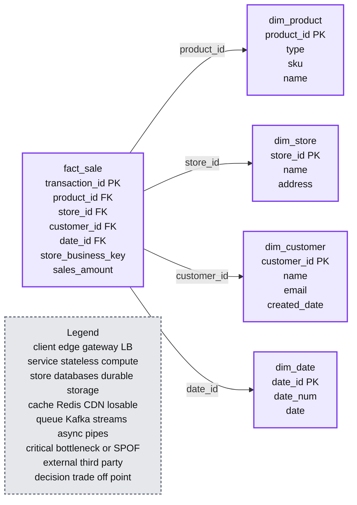
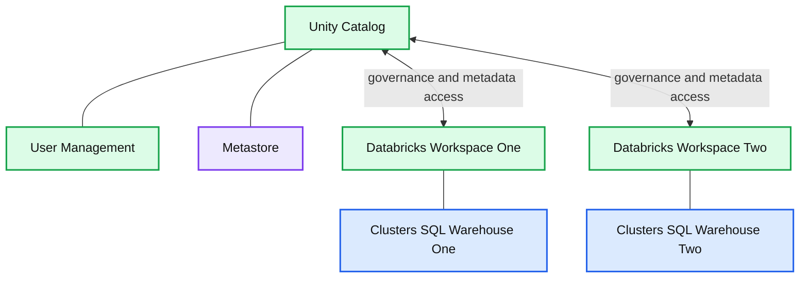
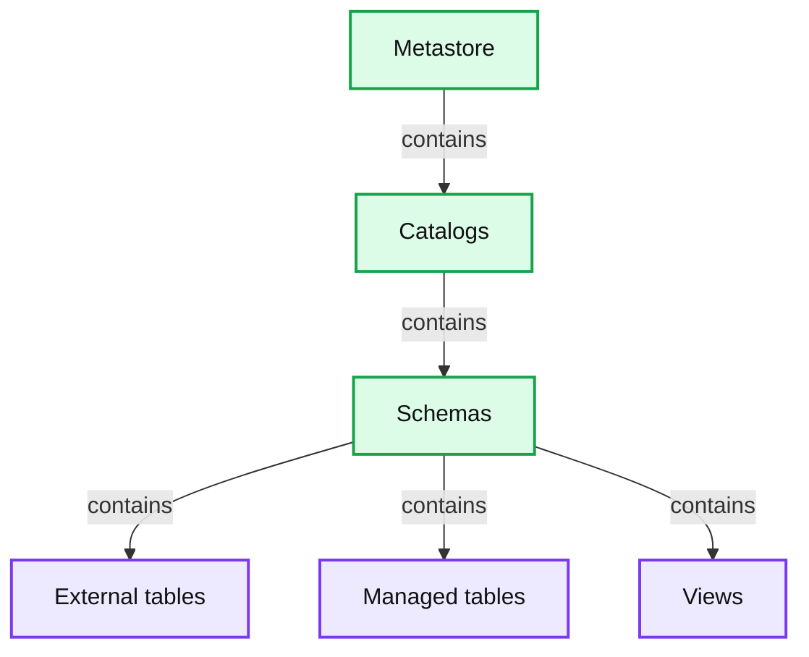
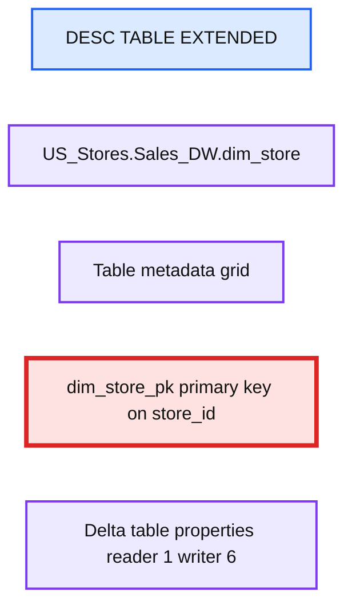
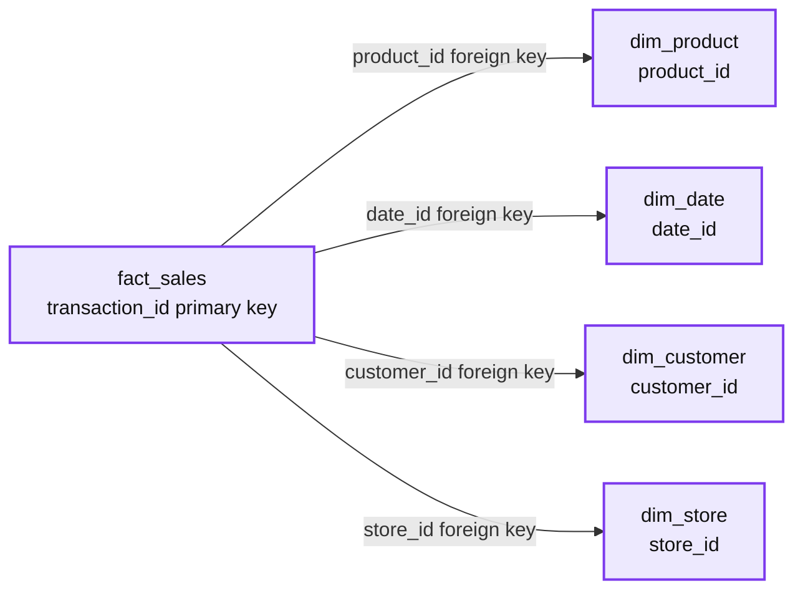

# Data Modeling Best Practices & Implementation on a Modern Lakehouse

- Source: https://www.databricks.com/blog/data-modeling-best-practices-implementation-modern-lakehouse
- Published: 2022-10-20
- Authors: Leo Mao, Abhishek Dey, Justin Breese, Soham Bhatt
- Categories: platform, solutions, data-warehousing
- Images: 6 total, 5 extracted as architecture

A Large number of our customers are migrating their legacy data warehouses to Databricks Lakehouse as it enables them to modernize not only their Data Warehouse but they also instantly get access to a mature Streaming and Advanced Analytics platform. Lakehouse can do it all as it is one platform for all your streaming, ETL, BI, and AI needs - and it helps your business and Data teams collaborate on one platform.

As we help customers in the field, we find that many are looking for best practices around proper data modeling and physical data model implementations in Databricks.

In this article, we aim to dive deeper into the best practice of dimensional modeling on the Databricks Lakehouse Platform and provide a live example of a physical data model implementation using our table creation and DDL best practices.

Here are the high-level topics we will cover in this blog:

1. The Importance of Data Modeling
2. Common Data Modeling Techniques
3. Data Warehouse Modeling DDL Implementation
4. Best practice & Recommendation for Data Modeling on the Databricks Lakehouse

## The importance of Data Modeling for Data Warehouse

Data Models are front and center of building a Data Warehouse. Typically the process starts with defending the Semantic Business Information Model, then a Logical data Model, and finally a Physical Data Model (PDM). It all starts with a proper Systems Analysis and Design phase where a Business Information model and process flows are created first and key business entities, attributes and their interactions are captured as per the business processes within the organization. The Logical Data Model is then created depicting how the entities are related to each other and this is a Technology agnostic model. Finally a PDM is created based on the underlying technology platform to ensure that the writes and reads can be performed efficiently. As we all know, for Data Warehousing, Analytics-friendly modeling styles like [Star-schema](https://en.wikipedia.org/wiki/Star_schema) and [Data Vault](https://en.wikipedia.org/wiki/Data_vault_modeling) are quite popular.

## Best practices for creating a Physical Data Model in Databricks

Based on the defined business problem, the aim of the data model design is to represent the data in an easy way for reusability, flexibility, and scalability. Here is a typical star-schema data model that shows a Sales fact table that holds each transaction and various dimension tables such as customers, products, stores, date etc. by which you slice-and-dice the data. The dimensions can be joined to the fact table to answer specific business questions such as what are the most popular products for a given month or which stores are best performing ones for the quarter. Let's see how to get it implemented in Databricks.

*Dimensional Model on the Lakehouse*

**Summary:** A Databricks lakehouse star schema connects the `fact_sale` table to product, store, customer, and date dimensions.

**Components:**

- `fact_sale` - Databricks lakehouse fact table
- `dim_product` - Databricks lakehouse dimension table
- `dim_store` - Databricks lakehouse dimension table
- `dim_customer` - Databricks lakehouse dimension table
- `dim_date` - Databricks lakehouse dimension table
- PK and FK markers - primary and foreign key definitions
- SCD Type 2 timestamps - dimension history tracking with `__START_AT` and `__END_AT`

**Flows:**

- `fact_sale -> dim_product`: product_id foreign-key relationship
- `fact_sale -> dim_store`: store_id foreign-key relationship
- `fact_sale -> dim_customer`: customer_id foreign-key relationship
- `fact_sale -> dim_date`: date_id foreign-key relationship

**Numbers:** 2

source image: https://www.databricks.com/sites/default/files/inline-images/db-387-blog-img-1.png

Dimensional Model on the Lakehouse

## Data Warehouse Modeling DDL Implementation on Databricks

In the following sections, we would demonstrate the below using our examples.

- Creating 3-level Catalog, Database and Table
- Primary Key, Foreign Key definitions
- Identity columns for Surrogate keys
- Column constraints for Data Quality
- Index, optimize and analyze
- Advanced techniques

### 1. Unity Catalog - 3 level namespace

Unity Catalog is a Databricks Governance layer which lets Databricks admins and data stewards manage users and their access to data centrally across all of the workspaces in a Databricks account using one Metastore. Users in different workspaces can share access to the same data, depending on privileges granted centrally in Unity Catalog. Unity Catalog has 3 level Namespace ( catalog.schema(database).table) that organizes your data. Learn more about Unity Catalog here.

**Summary:** Unity Catalog centrally manages users and metadata across multiple Databricks workspaces containing clusters or SQL warehouses.

**Components:**

- Unity Catalog: centralized governance and catalog service
- User Management: centralized access management
- Metastore: centralized metadata repository
- Databricks Workspace: workspace compute and analytics environment
- Clusters SQL Warehouse: Databricks compute resources

**Flows:**

- Unity Catalog -> Databricks Workspace: centralized user access and metadata
- Databricks Workspace -> Unity Catalog: workspace requests for governed data and metadata
- Unity Catalog -> Databricks Workspace: centralized user access and metadata
- Databricks Workspace -> Unity Catalog: workspace requests for governed data and metadata

**Numbers:** none

source image: https://www.databricks.com/sites/default/files/inline-images/db-387-blog-img-2.png

**Summary:** The diagram shows the Unity Catalog three-level namespace hierarchy from metastore to catalogs, schemas, and schema objects.

**Components:**

- Metastore - Unity Catalog governance container
- Catalogs - Unity Catalog organizational level
- Schemas - Database-level namespace
- External tables - Tables stored in external locations
- Managed tables - Tables managed by the platform
- Views - Logical query objects

**Flows:**

- Metastore -> Catalogs: contains
- Catalogs -> Schemas: contains
- Schemas -> External tables: contains
- Schemas -> Managed tables: contains
- Schemas -> Views: contains

**Numbers:** 3

source image: https://www.databricks.com/sites/default/files/inline-images/db-387-blog-img-3.png

Here is how to set up the catalog and schema before we create tables within the database. For our example, we create a catalog **US_Stores** and a schema (database) **Sales_DW** as below, and use them for the later part of the section.

Setting up the Catalog and Database

Here is an example on querying the **fact_sales** table with a 3 level namespace.

Example of querying table with catalog.database.tablename

### 2. Primary Key, Foreign Key definitions

Primary and Foreign Key definitions are very important when creating a data model. Having the ability to support the PK/FK definition makes defining the data model super easy in Databricks. It also helps analysts quickly figure out the join relationships in Databricks SQL Warehouse so that they can effectively write queries. Like most other Massively Parallel Processing (MPP), EDW, and Cloud Data Warehouses, the PK/FK constraints are informational only. Databricks does not support enforcement of the PK/FK relationship, but gives the ability to define it to make the designing of Semantic Data Model easy.

Here is an example of creating the **dim_store** table with **store_id** as an Identity Column and it's also defined as a Primary Key at the same time.

DDL Implementation for creating store dimension with Primary Key Definitions

After the table is created, we can see that the primary key (store_id) is created as a constraint in the table definition below.

*Primary Key store_id shows as table constraint*

**Summary:** Databricks displays extended metadata for the `US_Stores.Sales_DW.dim_store` table, including its primary key constraint.

**Components:**

- `DESC TABLE EXTENDED` command using Databricks SQL
- `US_Stores.Sales_DW.dim_store` table
- Table metadata grid
- `dim_store_pk` primary key constraint on `store_id`
- Table properties with Delta reader and writer versions

**Flows:**

- none

**Numbers:** 20, 21, 22, 23, 24, 25, 25 rows, Delta reader version 1, Delta writer version 6

source image: https://www.databricks.com/sites/default/files/inline-images/db-387-blog-img-7.png

Primary Key store_id shows as table constraint

Here is an example of creating the **fact_sales** table with **transaction_id** as a Primary Key, as well as foreigh keys that are referencing the dimension tables.

DDL Implementation for creating sales fact with Foreign Key definitions

After the fact table is created, we could see that the primary key **(transaction_id)** and foreign keys are created as constraints in the table definition below.

*Fact table definition with primary key and foreigh keys referencing dimensions*

**Summary:** The screenshot shows a Databricks SQL fact_sales table with a transaction_id primary key and foreign keys referencing four dimension tables.

**Components:**

- fact_sales: Databricks SQL fact table
- dim_product: Product dimension table
- dim_date: Date dimension table
- dim_customer: Customer dimension table
- dim_store: Store dimension table

**Flows:**

- fact_sales -> dim_product: product_id foreign key reference
- fact_sales -> dim_date: date_id foreign key reference
- fact_sales -> dim_customer: customer_id foreign key reference
- fact_sales -> dim_store: store_id foreign key reference

**Numbers:** 20, 21, 22, 23, 24, 25, 25 rows

source image: https://www.databricks.com/sites/default/files/inline-images/db-387-blog-img-9.png

Fact table definition with primary key and foreigh keys referencing dimensions

### 3. Identity columns for Surrogate keys

An **identity column** is a column in a database that automatically generates a unique ID number for each new row of data. These are commonly used to create surrogate keys in the data warehouses. Surrogate keys are system-generated, meaningless keys so that we don't have to rely on various Natural Primary Keys and concatenations on several fields to identify the uniqueness of the row. Typically these surrogate keys are used as Primary and Foreign keys in data warehouses. Details on Identity columns are discussed in [this blog](https://www.databricks.com/blog/2022/08/08/identity-columns-to-generate-surrogate-keys-are-now-available-in-a-lakehouse-near-you.html). Below is an example of creating an identity column customer_id, with automatically assigned values starting with 1 and increment by 1.

DDL Implementation for creating customer dimension with identity column

### 4. Column constraints for Data Quality

In addition to Primary and Foreign key informational constraints, Databricks also supports column-level Data Quality Check constraints which are enforced to ensure the quality and integrity of data added to a table. The constraints are automatically verified. Good examples of these are NOT NULL constraints and column value constraints. Unlike the other Cloud Data Warehouse, Databricks went further to provide column value check constraints, which are very useful to ensure the data quality of a given column. As we could see below, the **valid_sales_amount** check constraint will verify that all existing rows satisfy the constraint (i.e. **sales amount > 0**) before adding it to the table. More information can be found [here](https://docs.databricks.com/tables/constraints.html).

Here are examples to add constraints for **dim_store** and **fact_sales** respectively to make sure **store_id** and **sales_amount** have valid values.

Add column constraint to existing tables to ensure data quality

### 5. Index, Optimize, and Analyze

Traditional Databases have b-tree and bitmap indexes, Databricks has much advanced form of indexing - multi-dimensional Z-order clustered indexing and we also support Bloom filter indexing. First of all, the Delta file format uses Parquet file format, which is a columnar compressed file format so it's already very efficient in column pruning and on top of it using z-order indexing gives you the ability to sift through petabyte scale data in seconds. Both [Z-order](https://www.databricks.com/blog/2018/07/31/processing-petabytes-of-data-in-seconds-with-databricks-delta.html) and [Bloom filter indexing](https://docs.databricks.com/optimizations/bloom-filters.html) dramatically reduce the amount of data that needs to be scanned in order to answer highly selective queries against large Delta tables, which typically translates into orders-of-magnitude runtime improvements and cost savings. Use Z-order on your Primary Keys and foreign keys that are used for the most frequent joins. And use additional Bloom filter indexing as needed.

Optimize fact_sales on customer_id and product_id for better performance

Create a Bloomfilter Index to enable data skipping on a given column

And just like any other Data warehouse, you can [ANALYZE TABLE](https://docs.databricks.com/sql/language-manual/sql-ref-syntax-aux-analyze-table.html) to update statistics to ensure the Query optimizer has the best statistics to create the best query plan.

Collect stats for all the columns for better query execution plan

### 6. Advanced Techniques

While Databricks support advanced techniques like [Table Partitioning](https://docs.databricks.com/spark/latest/spark-sql/language-manual/sql-ref-partition.html), please use these feature sparingly, only when you have many Terabytes of compressed data - because most of the time our OPTIMIZE and Z-ORDER indexes will give you the best file and data pruning which makes partitioning a table by date or month almost a bad practice. It is however a good practice to make sure that your table DDLs are set for [auto optimization and auto compaction](https://docs.databricks.com/optimizations/auto-optimize.html). These will ensure your frequently written data in small files are compacted into bigger columnar compressed formats of Delta.

Are you looking to leverage a visual data modeling tool? Our partner [erwin Data Modeler by Quest](https://www.erwin.com/products/erwin-data-modeler/) can be used to reverse engineer, create and implement Star-schema, Data Vaults, and any Industry Data Models in Databricks with just a few clicks.

### Databricks Notebook Example

With Databricks platform, one can easily design & implement various data models with ease. To see all of the above examples in a complete workflow, please look at [this example](https://github.com/dbsys21/databricks-lakehouse/blob/main/lakehouse-buildout/dimensional-modeling/Dimensional-Model-DDL.sql).

Please also check out our related blog - [Five Simple Steps for Implementing a Star Schema in Databricks With Delta Lake](https://www.databricks.com/blog/2022/05/20/five-simple-steps-for-implementing-a-star-schema-in-databricks-with-delta-lake.html).

## Get started on building your Dimensional Models in the Lakehouse

[Try Databricks free for 14 days](https://www.databricks.com/try-databricks?itm_data=datavault-blog).
