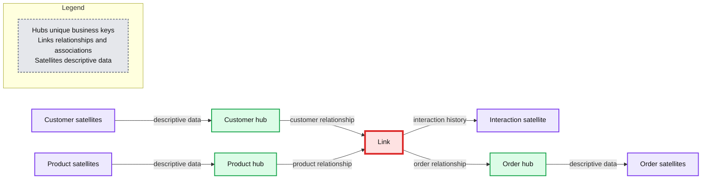
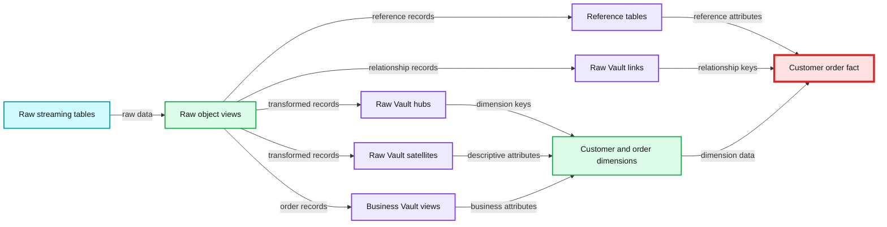

# Data Vault Best practice & Implementation on the Lakehouse

- Source: https://www.databricks.com/blog/data-vault-best-practice-implementation-lakehouse
- Published: 2023-02-24
- Authors: Leo Mao, Sumit Prakash, Soham Bhatt
- Categories: platform, solutions, data-warehousing
- Images: 3 total, 3 extracted as architecture

In the previous article [Prescriptive Guidance for Implementing a Data Vault Model on the Databricks Lakehouse Platform](https://www.databricks.com/blog/2022/06/24/prescriptive-guidance-for-implementing-a-data-vault-model-on-the-databricks-lakehouse-platform.html), we explained core concepts of data vault and provided guidance of using it on Databricks. We have many customers in the field looking for examples and easy implementation of data vault on Lakehouse.

In this article, we aim to dive deeper on how to implement a Data Vault on Databricks' Lakehouse Platform and provide a live example to load an EDW Data Vault model in real-time using [Delta Live Tables](https://www.databricks.com/product/delta-live-tables).

Here are the high-level topics we will cover in this blog:

1. Why Data Vault
2. Data Vault in Lakehouse
3. Implementing a Data Vault Model in Databricks Lakehouse
4. Conclusion

## 1. Why Data Vault

The main goal for [Data Vault](https://en.wikipedia.org/wiki/Data_vault_modeling) is to build a scalable modern data warehouse in today's world. At its core, it uses hubs, satellites and links to model the business world, which enables a stable (Hubs) yet flexible (Satellites) data model and architecture that are resilient to environmental changes. Hubs contain business keys that are unlikely to change unless core business changes and associations between the hubs make the skeleton of the Data Vault Model, while satellites contain contextual attributes of a hub that could be created and extended very easily.

Please refer to below for a high-level design of the Data Vault Model, with 3 key benefits by design:

1. Enables efficient parallel loading for the enterprise data warehouse as there is less dependency between the tables of the model, as we could see below, hubs or satellites for the customer, product, order could all be loaded in parallel.
2. Preserve a single version of the facts in the raw vault as it recommends insert only and keep the source metadata in the table.
3. New Hubs or Satellites could be easily added to the model incrementally, enabling fast to market for data asset delivery.

*Data Vault Model Core Components*

**Summary:** Data Vault core components connect customer, product, and order hubs through links and descriptive satellites.

**Components:**

- Customer hub - technology not specified
- Product hub - technology not specified
- Order hub - technology not specified
- Customer satellites - descriptive data
- Product satellites - descriptive data
- Order satellites - descriptive data
- Link - relationships and associations
- Interaction satellite - history of the interaction

**Flows:**

- Customer satellites -> Customer: descriptive data
- Customer -> Link: customer relationship
- Product satellites -> Product: descriptive data
- Product -> Link: product relationship
- Link -> Interaction satellite: interaction history
- Link -> Order: order relationship
- Order -> Order satellites: descriptive data

**Numbers:** none



<sub>source image: https://www.databricks.com/sites/default/files/inline-images/db-398-blog-img-1.png</sub>

Data Vault Model Core Components

## 2. Data Vault in Lakehouse

The [Databricks Lakehouse Platform](https://www.databricks.com/product/data-lakehouse) supports Data Vault Model very well, please refer to below for high level architecture of Data Vault Model on Lakehouse. The robust and scalable [Delta Lake](https://docs.databricks.com/delta/index.html) storage format enables customers to build a raw vault where unmodified data is stored, and a business vault where business rules and transformation are applied if required. Both will align to the design earlier hence get the benefits of a Data Vault Model.

*Data Vault Model on the Lakehouse*

**Summary:** The diagram shows data flowing from enterprise applications and OLTP databases through file staging, Bronze landing zones, Silver raw and business vaults, and Gold data marts serving AI/ML and reporting.

**Components:**

- Enterprise Applications
- OLTP Databases
- File Stage using CSV files
- Bronze using Databricks landing zones
- Silver using Databricks raw vault and business vault
- Gold using Databricks star schema data marts and PIT views
- AI/ML
- Reporting

**Flows:**

- Enterprise Applications -> File Stage: application data
- OLTP Databases -> File Stage: database data
- File Stage -> Bronze: CSV files
- Bronze -> Silver: ingestion and transformation
- Silver raw vault -> Silver business vault: business rules and transformations
- Silver -> Gold: curated vault data
- Gold -> AI/ML: analytical data
- Gold -> Reporting: reporting data

**Numbers:** none

```text
%% mermaid failed to render; kept as text
%% Data flow from source systems through Data Vault layers to consumers
flowchart LR
    A[Enterprise Applications] -->|application data| C[File Stage]
    B[OLTP Databases] -->|database data| C
    C -->|CSV files| D[Bronze Landing Zones]
    D -->|ingestion and transformation| E[Silver Raw Vault]
    E -->|business rules and transformations| F[Silver Business Vault]
    F -->|curated vault data| G[Gold Star Schema Data Marts and PIT Views]
    G -->|analytical data| H[AI ML]
    G -->|reporting data| I[Reporting]

    classDef client fill:#dbeafe,stroke:#2563eb,stroke-width:2px,color:#111
    classDef service fill:#dcfce7,stroke:#16a34a,stroke-width:2px,color:#111
    classDef store fill:#ede9fe,stroke:#7c3aed,stroke-width:2px,color:#111
    classDef cache fill:#fef3c7,stroke:#d97706,stroke-width:2px,color:#111
    classDef queue fill:#cffafe,stroke:#0891b2,stroke-width:2px,color:#111
    classDef critical fill:#fee2e2,stroke:#dc2626,stroke-width:4px,color:#111
    classDef external fill:#e5e7eb,stroke:#6b7280,stroke-width:2px,color:#111,stroke-dasharray:4 3
    classDef decision fill:#fce7f3,stroke:#db2777,stroke-width:2px,color:#111

    A,B,H,I client
    C,D,E,F,G store
```

<sub>source image: https://www.databricks.com/sites/default/files/inline-images/db-398-blog-img-2.png</sub>

Data Vault Model on the Lakehouse

## 3. Implementing a Data Vault Model in Databricks Lakehouse

Based on the design in the previous section, loading the hubs, satellites and links tables are straightforward. All ETL loads could happen in parallel as they don't depend on each other, for example, customer and product hub tables could be loaded as they both have their only business keys. And customer_product_link table, customer satellite and product satellite could be loaded in parallel as well since they have all the required attributes from the source.

### Overall Data Flow

Please refer to the high level data flow demonstrated in [Delta Live Table](https://www.databricks.com/product/delta-live-tables) pipeline below. For our example we use the TPCH data that are commonly used for decision support benchmarks. The data are loaded into the bronze layer first and stored in Delta format, then they are used to populate the Raw Vault for each object (e.g. hub or satellites of customer and orders, etc.). Business Vault are built on the objects from Raw Vault, and Data mart objects (e.g. dim_customer, dim_orders, fact_customer_order ) for reporting and analytics consumptions.

**Summary:** The diagram shows a Databricks Data Vault flow from streaming raw tables through views, Raw Vault hubs, satellites and links, Business Vault references, and data marts.

**Components:**

- raw_customer, raw_lineitem, raw_orders, raw_part, raw_supplier: streaming tables
- raw_customer_vw, raw_lineitem_vw, raw_orders_vw: views
- hub_customer, hub_lineitem, hub_orders: streaming hub tables
- sat_customer, sat_lineitem, sat_orders: streaming satellite tables
- raw_nation, raw_region: streaming raw reference tables
- ref_nation, ref_region, sat_orders_bv: materialized views
- lnk_customer_orders: streaming link table
- dim_customer, dim_orders: views
- fact_customer_order: materialized view

**Flows:**

- raw_customer -> raw_customer_vw: raw customer data
- raw_customer_vw -> hub_customer: customer hub processing
- raw_customer_vw -> sat_customer: customer satellite processing
- raw_lineitem -> raw_lineitem_vw: raw line item data
- raw_lineitem_vw -> hub_lineitem: line item hub processing
- raw_lineitem_vw -> sat_lineitem: line item satellite processing
- raw_lineitem_vw -> raw_nation: reference data processing
- raw_lineitem_vw -> raw_region: reference data processing
- raw_orders -> raw_orders_vw: raw order data
- raw_orders_vw -> hub_orders: order hub processing
- raw_orders_vw -> sat_orders: order satellite processing
- raw_orders_vw -> sat_orders_bv: business vault processing
- raw_orders_vw -> lnk_customer_orders: customer order link processing
- hub_customer -> dim_customer: customer dimension data
- sat_customer -> dim_customer: customer attributes
- hub_orders -> dim_orders: order dimension data
- sat_orders_bv -> dim_orders: business order attributes
- ref_nation -> fact_customer_order: nation reference data
- ref_region -> fact_customer_order: region reference data
- dim_customer -> fact_customer_order: customer dimension data
- dim_orders -> fact_customer_order: order dimension data
- lnk_customer_orders -> fact_customer_order: customer order relationship

**Numbers:**

- raw_customer: Completed 30s
- hub_customer: Completed 19s, 750K, 0
- sat_customer: Completed 24s, 750K, 0
- raw_lineitem: Completed 56s
- hub_lineitem: Completed 1m 38s
- raw_nation: Completed 23s
- ref_nation: Completed 21s
- raw_region: Completed 26s
- ref_region: Completed 19s
- sat_lineitem: Completed 1m 44s
- raw_orders: Completed 1m 25s
- hub_orders: Completed 52s
- fact_customer_order: Completed 31s
- raw_part: Completed 31s
- raw_supplier: Completed 31s
- sat_orders: Completed 1m 0s
- sat_orders_bv: Completed 23s
- lnk_customer_orders: Completed 1m 0s



<sub>source image: https://www.databricks.com/sites/default/files/inline-images/db-398-blog-img-3.jpg</sub>

### Raw Vault

Raw Vault is where we store Hubs, Satellites and Links tables which contain the raw data and maintain a single version of truth. As we could see from below, we create a view `raw_customer_vw` based on `raw_customer` and use hash function `sha1(UPPER(TRIM(c_custkey)))` to create hash columns for checking existence or comparison if required.

Once the raw customer view is created, we use it to create hub customer and satellite customers respectively with the code example below. In Delta Live Table, you could also easily set up [data quality expectation](https://docs.databricks.com/workflows/delta-live-tables/delta-live-tables-cookbook.html#make-expectations-portable-and-reusable) (e.g. `CONSTRAINT valid_sha1_hub_custkey EXPECT (sha1_hub_custkey IS NOT NULL) ON VIOLATION DROP ROW`) and use that define how the pipeline will handle data quality issues defined by the expectation. Here we drop all the rows if it does not have a valid business key.

Hubs and Satellites of other objects are loaded in the similar way. For Link tables, here is an example to populate `lnk_customer_orders` based on the `raw_orders_vw`.

### Business Vault

Once the hubs, satellites and links are populated in the Raw Vault, Business Vault objects could be built based on them. This is to apply additional business rules or transformation rules on the data objects and prepare for easier consumption at a later stage. Here is an example of building `sat_orders_bv,` with which `order_priority_tier` is added as enrichment information of the orders object in the Business Vault.

### Data Mart

Finally, we see customers loading Data Vault Point-in-Time Views and Data marts for easy consumption in the last layer. Here the main focus is ease of use and good performance on read. For most simple tables, it will suffice with creating views on top of the Hubs or Satellites or you can even load a proper star-schema like Dimensional Model in the final layer. Here is an example that creates a customer dimension as a view `dim_customer`, and the view could be used by others to simplify their queries.

One of the common issues with data vault is that sometimes it ends up with too many joins especially when you have a complex query or fact that requires attributes from many tables. The recommendation from Databricks is to pre-join the tables and stored calculated metrics if required so they don't have to be rebuilt many times on the fly. Here is an example of creating a fact table `fact_customer_order` based on multiple joins and storing it as a table for repeatable queries from the business users.

### Delta Live Table Pipeline Setup

All the code of above could be found [here](https://github.com/dbsys21/databricks-lakehouse/tree/main/lakehouse-buildout/data-vault). Customers could easily orchestrate the whole data flow based on the Delta Live Table pipeline setup, the configuration below is how I set up the pipeline in my environment, click [DLT Configuration](https://docs.databricks.com/workflows/delta-live-tables/delta-live-tables-configuration.html#settings) for more details on how to set up a Delta Live Table Pipeline your workflow if required.

## 4. Conclusion

In this blog, we learned about core Data Vault modeling concepts, and how to implement them using [Delta Live Tables](https://www.databricks.com/product/delta-live-tables). The [Databricks Lakehouse Platform](https://www.databricks.com/product/data-lakehouse) supports various modeling methods in a reliable, efficient and scalable way, while [Databricks SQL](https://www.databricks.com/product/databricks-sql) - our serverless data warehouse - allows you to run all your BI and SQL applications on the Lakehouse. To see all of the above examples in a complete workflow, please look at [this example](https://github.com/dbsys21/databricks-lakehouse/tree/main/lakehouse-buildout/data-vault).

Please also check out our related blogs:

- [Five Simple Steps for Implementing a Star Schema in Databricks With Delta Lake](https://www.databricks.com/blog/2022/05/20/five-simple-steps-for-implementing-a-star-schema-in-databricks-with-delta-lake.html)
- [Data Modeling Best Practices & Implementation on a Modern Lakehouse](https://www.databricks.com/blog/2022/10/20/data-modeling-best-practices-implementation-modern-lakehouse.html)
- [What's a Dimensional Model and How to Implement It on the Databricks Lakehouse Platform](https://www.databricks.com/blog/2022/11/07/load-edw-dimensional-model-real-time-databricks-lakehouse.html)

## Get started on building your Dimensional Models in the Lakehouse

[Try Databricks free for 14 days](https://www.databricks.com/try-databricks?itm_data=datavault-blog).
