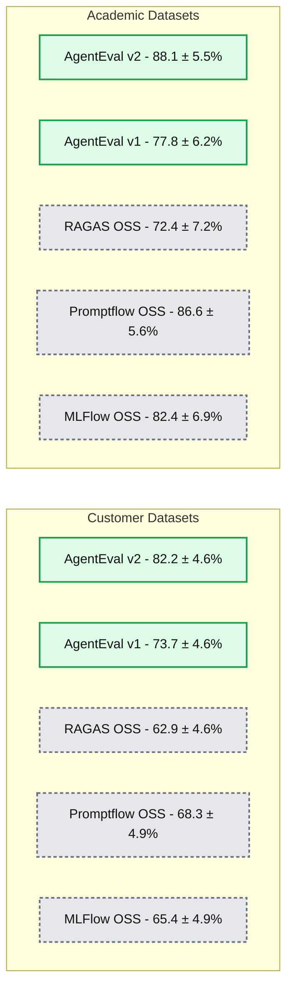
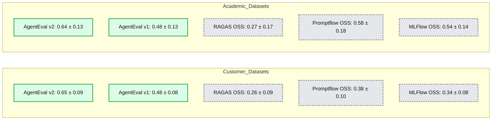

# Databricks announces significant improvements to the built-in LLM judges in Agent Evaluation

- Source: https://www.databricks.com/blog/databricks-announces-significant-improvements-built-llm-judges-agent-evaluation
- Published: 2024-09-05
- Authors: Max Marion, Arnav Singhvi, Samraj Moorjani, Avesh Singh, Michael Carbin, Alkis Polyzotis
- Categories: databricks-ai, data-science-machine-learning
- Images: 6 total, 2 extracted as architecture

## **An improved answer-correctness judge in Agent Evaluation**

[Agent Evaluation](https://docs.databricks.com/en/generative-ai/agent-evaluation/index.html) enables Databricks customers to define, measure, and understand how to improve the quality of agentic GenAI applications. Measuring the quality of ML outputs takes a new dimension of complexity for GenAI applications, especially in industry-specific contexts dealing with customer data: the inputs may comprise complex open-ended questions, and the outputs can be long-form answers that cannot be easily compared to reference answers using string-matching metrics. 

Agent Evaluation solves this problem with two complementary mechanisms. The first is a [built-in review UI](https://docs.databricks.com/en/generative-ai/agent-evaluation/human-evaluation.html) that allows human subject-matter experts judges to chat with different versions of the application and provide feedback on the generated responses. The second is a suite of [built-in LLM judges](https://docs.databricks.com/en/generative-ai/agent-evaluation/llm-judge-metrics.html) that provide automated feedback and can thus scale up the evaluation process to a much larger number of test cases. The built-in LLM judges can reason about the semantic correctness of a generated answer with respect to a reference answer, whether the generated answer is grounded on the retrieved context of the RAG agent, or whether the context is sufficient to generate the correct answer, to name a few examples. Part of our mission is to continuously improve the effectiveness of these judges so that Agent Evaluation customers can handle more advanced use cases and be more productive in improving the quality of their applications. 

In line with this mission, we are happy to announce the launch of an improved answer-correctness judge in Agent Evaluation. Answer-correctness evaluates how a generated answer to an input question compares to a reference answer, providing a crucial and grounded metric for measuring the quality of an agentic application. The improved judge provides significant improvements compared to several baselines, especially on customer representative use cases.

**Summary:** AgentEval v2 achieves the highest human-LLM judge agreement on both customer and academic datasets compared with AgentEval v1, RAGAS, Promptflow, and MLFlow.

**Components:**
- Customer Datasets: benchmark group for five judge implementations.
- Academic Datasets: benchmark group for the same five judge implementations.
- AgentEval v2: judge implementation; underlying technology unspecified.
- AgentEval v1: judge implementation; underlying technology unspecified.
- RAGAS (OSS): open-source judge implementation.
- Promptflow (OSS): open-source judge implementation.
- MLFlow (OSS): open-source judge implementation.
- Human-LLMJudge Agreement (%): vertical axis measuring agreement.

**Flows:**
- none. No arrows are visible.

**Numbers:**
- Vertical axis ticks: 0, 20, 40, 60, 80%.
- Customer Datasets:
  - AgentEval v2: 82.2 ± 4.6%.
  - AgentEval v1: 73.7 ± 4.6%.
  - RAGAS (OSS): 62.9 ± 4.6%.
  - Promptflow (OSS): 68.3 ± 4.9%.
  - MLFlow (OSS): 65.4 ± 4.9%.
- Academic Datasets:
  - AgentEval v2: 88.1 ± 5.5%.
  - AgentEval v1: 77.8 ± 6.2%.
  - RAGAS (OSS): 72.4 ± 7.2%.
  - Promptflow (OSS): 86.6 ± 5.6%.
  - MLFlow (OSS): 82.4 ± 6.9%.

source image: https://www.databricks.com/sites/default/files/inline-images/image3_26.png?v=1725478805

***Figure 1. Agreement of new answer-correctness judge with human raters****: Each bar shows the percentage of agreement between the judge and human labelers for the correctness of an answer, as measured on our benchmark datasets. AgentEval v2 represents the new judge that we have launched with a significant improvement on customer datasets. *

**Summary:** AgentEval v2 has the highest Cohen’s kappa agreement with human raters on both customer and academic datasets.

**Components:**
- Customer Datasets: benchmark group.
- Academic Datasets: benchmark group.
- AgentEval v2: judge evaluated in both groups.
- AgentEval v1: judge evaluated in both groups.
- RAGAS (OSS): open-source judge evaluated in both groups.
- Promptflow (OSS): open-source judge evaluated in both groups.
- MLFlow (OSS): open-source judge evaluated in both groups.
- Cohen’s Kappa: agreement metric on the vertical axis.

**Flows:**
- none. No arrows are visible.

**Numbers:**

| Judge | Customer Datasets | Academic Datasets |
|---|---:|---:|
| AgentEval v2 | 0.65 ± 0.09 | 0.64 ± 0.13 |
| AgentEval v1 | 0.48 ± 0.08 | 0.48 ± 0.13 |
| RAGAS (OSS) | 0.26 ± 0.09 | 0.27 ± 0.17 |
| Promptflow (OSS) | 0.38 ± 0.10 | 0.58 ± 0.18 |
| MLFlow (OSS) | 0.34 ± 0.08 | 0.54 ± 0.14 |

Vertical axis ticks: 0.0, 0.1, 0.2, 0.3, 0.4, 0.5, 0.6, 0.7, 0.8. Values are unitless. Error-bar interpretation is not specified in the image.

source image: https://www.databricks.com/sites/default/files/inline-images/image5_10.png?v=1725478805

***Figure 2. Inter-annotator reliability (Cohen’s kappa) between the answer-correctness judges and human raters: ****Each bar shows the value of Cohen’s kappa between the judge and human labelers for the correctness of an answer, as measured on our benchmark datasets. Values closer to 1 indicate that agreement between the judge and human raters is due less to chance. **AgentEval v2 represents the new judge that we have launched.** *

The improved judge, which is the result of an active collaboration between the research and engineering teams in Databricks, is automatically available to all customers of Agent Evaluation. Read on to learn about the quality improvements of the new judge and our methodology for evaluating the effectiveness of LLM judges in general. You can also test drive Agent Evaluation in our [demo notebook](https://docs.databricks.com/en/generative-ai/agent-evaluation/index.html#agent-evaluation-example).

## **How? The Facts and Just the Facts**

The answer-correctness judge receives three fields as input: a question, the answer generated by the application for this question, and a reference answer. The judge outputs a binary result (“Yes”/”No”) to indicate whether the generated answer is sufficient when compared with the reference answer, along with a rationale that explains the reasoning. This gives the developer a  gauge of agent quality (as a percentage of “Yes” judgements over an evaluation set) as well as an understanding of the reasoning behind individual judgements.

Based on a study of customer-representative use cases and our baseline systems, we have found that a key limitation in the effectiveness of many existing LLM judges is that they rely on grading rubrics that use a soft notion of “similarity” and thus permit substantial ambiguity in their interpretation. Specifically, while these judges may be effective for typical academic datasets with short answers, they can present challenges for customer-representative use cases where answers are often long and open-ended. In contrast, our new LLM judge in Agent Evaluation reasons at the more narrowly defined level of facts and claims in a generated response. 

**Customer-Representative Use Cases**.   The evaluation of LLM judges in the community is often grounded on well-tested, academic question answering datasets, such as [NQ](https://research.google/pubs/natural-questions-a-benchmark-for-question-answering-research) and [HotPotQA](https://hotpotqa.github.io/). A salient future of these datasets is that the questions have short, extractive factual answers such as the following:

***Example 1: Question and reference answer from academic benchmarks: ****The question is typically concrete and has a single and short factual answer.*

While these datasets are well-crafted and well-studied, many of them were developed prior to recent innovations in LLMs and are not representative of customer use cases, namely, open-ended questions with answers that are multi-part or have different multiple acceptable answers of varying elaboration.  For example,

***Example 2: Question and reference/generated answer from customer-representative use cases: ****The question can be open-ended and the answers comprise several parts. There may also be multiple acceptable answers. *

**Rubric Ambiguity**. LLM judgements typically follow a rubric-based approach, but designing a broadly applicable rubric presents a challenge. In particular, such general-purpose rubrics often introduce vague phrasing, which makes their interpretation ambiguous. For example, the following rubrics drive the PromptFlow and MLFlow LLM judges:

***OSS PromptFlow prompt for answer correctness***

***OSS MLFlow prompt for answer correctness***

These rubrics are ambiguous as to 1) what similarity means, 2) the key features of a response to ground a similarity measurement, as well as 3) how to calibrate the strength of similarity against the range of scores. For answers with significant elaboration beyond the extractive answers in academic datasets, we (along with others [[1](https://aclanthology.org/2023.eacl-main.121)]), have found that this ambiguity can lead to many instances of uncertain interpretation for both humans and LLMs when they are tasked with labeling a response with a score.

**Reasoning about the Facts**. Our approach in Agent Evaluation instead takes inspiration from results in the research community on protocols for assessing the correctness of long-form answers by reasoning about primitive facts and claims in a piece of text [[2](https://aclanthology.org/N04-1019/), [1](https://aclanthology.org/2023.eacl-main.121/), [3](https://aclanthology.org/2023.acl-long.228/)] and leveraging the capabilities of language models to do so [[4](https://aclanthology.org/2021.emnlp-main.531), [5](https://aclanthology.org/2024.naacl-long.365), [6](https://aclanthology.org/2023.emnlp-main.741)]. For instance, in the reference answer in Example 2 above, there are 4 implied claims:

1. Leveraging Databricks' MLflow for model tracking is an effective strategy.
2. Using managed clusters for scalability is an effective strategy.
3. Optimizing data pipelines is an effective strategy.
4. Integrating with Delta Lake for data versioning is an effective strategy.

Agent Evaluation’s LLM Judge approach evaluates the correctness of a generated answer by confirming that the generated answer includes the facts and claims from the reference answer; by inspection, the generated answer in Example 2 is a correct answer because it includes all aforementioned implied claims. 

Overall, evaluating the inclusion of facts is a much more narrow and specific task than determining if the generated answer and reference answer are “similar.” Our improvement over these alternative approaches on customer-representative use cases demonstrates the benefits of our approach.

## **Evaluation Methodology**

We evaluate our new answer-correctness judge on a collection of academic datasets, including HotPotQA and Natural Questions, and to highlight the practical benefits of the new LLM judge, we also use an internal benchmark of datasets donated by our customers that model specific use cases in industries like finance, documentation, and HR. (*Feel free to reach out to *[*agent-dataset-donation@databricks.com*](mailto:agent-dataset-donation@databricks.com)* If you are a Databricks customer and you want to help us improve Agent Evaluation for your use cases .*) 

For each (question, generated answer, reference answer) triplet in the academic and industry datasets, we ask several human labelers to rate the correctness of the generated answer and then obtain an aggregated label through majority voting, excluding any examples for which there is no majority. To assess the quality of the aggregated label, we examine the degree of inter-rater agreement and also the skew of the label distribution (a skewed distribution can result in agreement by chance). We quantify the former through [Krippendorf's alpha](https://en.wikipedia.org/wiki/Krippendorff%27s_alpha). The resulting value (0.698 for academic datasets, 0.565 for industry datasets) indicates that there is good agreement among raters. The skew is also low enough (72.7% “yes” / 23.6% “no” in academic datasets, 52.4% “yes” / 46.6% “no” in industry datasets) so it is not likely that this agreement happens at random.

We measure our LLM judge’s performance with respect to human labelers on two key metrics: percentage agreement and [Cohen’s kappa](https://en.wikipedia.org/wiki/Cohen%27s_kappa). Percentage agreement measures the frequency of agreement between the LLM judge and human labelers, providing a straightforward measure of accuracy. Cohen’s kappa, ranging from -1 to 1, captures the chance agreement among the LLM judge and human raters. A Cohen’s kappa value closer to 1 indicates that the agreement is not by chance and is thus a robust signal for the non-random accuracy of an LLM judge. We compute confidence intervals for both metrics by running each benchmark three times (to account for non-determinism in the underlying LLMs) and then constructing bootstrapped intervals with a 95% confidence level.

## **Performance Results**

Figures 1 and 2 above present the results of our evaluation. On academic datasets, the new judge reported 88.1 ± 5.5% agreement and Cohen's kappa scores of 0.64 ± 0.13, showcasing a strong agreement with human labelers.  Our LLM judge maintained strong performance on industry datasets, achieving 82.2 ± 4.6% agreement and Cohen's kappa scores of 0.65 ± 0.09, highlighting substantial non-random agreement. 

Furthermore, we compared our new judge to existing AnswerCorrectness judge baselines, starting with the previous iteration of our internal judge (which we denote as Agent Evaluation v1). We also compared it to the following open-source baselines:  [RAGAS](https://docs.ragas.io/) (semantic similarity scoring), OSS [PromptFlow](https://github.com/microsoft/promptflow) (five-star rating system), OSS [MLFlow](https://docs.databricks.com/en/mlflow/llm-evaluate.html#metrics-with-llm-as-a-judge) (five-point scoring system). We found that our judge consistently achieved the highest labeler-LLM judge agreement and Cohen’s kappa across both academic and customer datasets. On customer datasets, our judge improved the existing Agent Evaluation judge and outperformed the next closest open-source baseline by 13-14% in agreement and 0.27 in Cohen’s kappa, while maintaining a lead of 1-2% in agreement and 0.06 in Cohen’s kappa on academic datasets.

Notably, some of these baseline judges used few-shot settings where the judge is presented with examples of judgements with real data labels within the prompt, whereas our judge was evaluated in a zero-shot setting. This highlights the potential of our judge to be further optimized with few-shot learning, achieving even higher performance. Agent Evaluation already supports [this functionality](https://learn.microsoft.com/en-us/azure/databricks/generative-ai/agent-evaluation/advanced-agent-eval#--create-few-shot-examples) and we are actively working to improve the selection of few-shot examples in the next version of our product.

## **Next Steps**

As mentioned earlier, the improved judge is automatically enabled for all customers of Agent Evaluation. We have used DSPy to explore the space of designs for our judge and, following on that work, we are actively working on further improvements to this judge. 

- Check out our example notebook ([AWS](https://docs.databricks.com/en/generative-ai/agent-evaluation/index.html#agent-evaluation-example) | [Azure](https://learn.microsoft.com/en-us/azure/databricks/generative-ai/agent-evaluation/#agent-evaluation-example)) for a quick demonstration of Agent Evaluation and the built-in judges. 
- Documentation for Agent Evaluation ([AWS](https://docs.databricks.com/en/generative-ai/agent-evaluation/index.html) | [Azure](https://learn.microsoft.com/en-us/azure/databricks/generative-ai/agent-evaluation/)).
- Reach out to [agent-dataset-donation@databricks.com](mailto:agent-dataset-donation@databricks.com) if you are a Databricks customer and you want to help improve the product for your use case by donating evaluation datasets.
- Attend the next Databricks GenAI [Webinar](https://www.databricks.com/resources/webinar/shift-general-data-intelligence) on 10/8: The shift to Data Intelligence.
