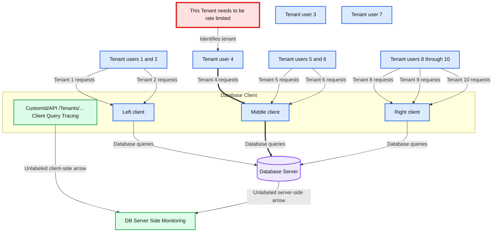

# Databricks on Databricks: Scaling Database Reliability

- Source: https://www.databricks.com/blog/databricks-databricks-scaling-database-reliability
- Published: 2025-09-12
- Authors: Xiaotong Jiang
- Categories: engineering, data-engineering
- Images: 4 total, 3 extracted as architecture

**Key takeaways**

- From Reactive to Proactive: Follow our journey from incidents firefighting to a Continuous Integration‑based scoring mechanism that gives an early signal of database efficiency in the development loop.
- Database Usage Scorecard: See the unified interface that gives owners a 360‑degree view of queries, schemas, data, and traffic—enforcing best practices at scale across thousands of databases.
- Databricks on Databricks: See how we leverage Delta Tables, DLT pipelines, and AI/BI dashboards inside Databricks to instrument, store, and analyze every OLTP query at scale.

**TL;DR**: Databricks engineers, by leveraging big data analytics tools like Databricks products, shifted from reactive monitoring to a proactive scoring mechanism to drive database best practices. This significantly improved database usage efficiency by identifying and resolving problematic queries and schema definitions before customer impact. For instance, one database handled a 4X traffic increase while consuming fewer resources (CPU, memory, and disk) due to optimized database efficiency driven by the scoring mechanism.

At Databricks, our products rely on thousands of databases across multiple clouds, regions, and database engines, supporting diverse use cases like user account metadata, job scheduling, and data governance. These databases power reliable transactions (e.g., atomic updates to user permissions) and fast lookups (e.g., retrieving Genie conversations). However, this scale and variety, combined with a multi-tenant architecture where customer workloads are efficiently managed on shared infrastructure, creates significant reliability challenges. Inefficient queries or suboptimal schemas can cause latency spikes or lock contention, impacting many users.

In this blog post, we offer an in-depth exploration of how our engineering team at Databricks embraced a data-driven mindset to transform our approach to achieve database reliability. We’ll start with the traditional reactive monitoring methods we used and their limitations. Then, we’ll discuss how we introduced client-side query tracing where the query logs are ingested into Delta Tables and allow us to do flexible aggregation to gain insights for database usage during incidents. From there, we’ll dive into the proactive Query Scorer built into our Continuous Integration (CI) pipeline to catch issues early. The query patterns identified by CI are exported as JSON and processed in notebooks, and Spark jobs join everything to compute metrics at scale (remember, the metrics span thousands of databases and 10s of thousands of queries). Finally, we’ll describe how all these pieces come together in a unified Database Usage Scorecard in our AI/BI dashboards that guides teams toward best practices. Throughout, the theme is a shift from reactive firefighting to proactive enforcement. Our journey not only improves the reliability of our own platform—it also showcases how other teams can use the analytics tools to implement a similar “Scorecard” pipeline to monitor and optimize their own systems. While we chose Databricks for its seamless integration with our infrastructure, this strategy is adaptable to any robust analytics platform.

## Original Reactive Approach - Server-Side Metrics

In the early days, our approach to database issues was largely reactive. When a database incident occurred, the primary tools we used were Percona Monitoring and Management and mysqld-exporter, both based on MySQL Performance Schema. These provided insights inside the database server: we could see things like the longest-running queries, the number of rows scanned by different operations, locks held, and CPU usage.

This server-centric monitoring was invaluable, but it had significant limitations. Client context was lacking: the database would tell us what query was problematic, but not much about who or what triggered it. A spike in load might show up as high CPU utilization and an increase in a certain SQL statement’s execution count. But without additional info, we only knew the symptom (e.g., “Query Q has a 20% load increase”), not the root cause (“Which tenant or feature is suddenly issuing Query Q more frequently?”). The investigation often involved guesswork and cross-checking logs from various services to correlate timestamps and find the origin of the offending query. This could be time-consuming during an active incident.

## Refined Reactive Approach - Client Query Tracing

To address the blind spots of server-side monitoring, we introduced client-side query tracing. The idea is simple but powerful: whenever an application (database client) in our platform sends a SQL query to the database, we tag and log it with additional context such as tenant ID, service or API name, and request ID. By propagating these custom dimensions alongside each query, we gain a holistic view that connects the database’s perspective with the application’s perspective.

How does this help in practice? Imagine we observe via the database metrics that “Query Z” is suddenly slow or consuming lots of resources. With client tracing, we can immediately ask: *Which client or tenant is responsible for Query Z?* Because our applications attach identifiers, we might find, for example, that Tenant A’s workspace is issuing Query Z at X load. This turns a vague observation (“the database is under high load”) into an actionable insight (“Tenant A, via a specific API, is causing the load”). With this knowledge, the on-call engineers can rapidly triage—perhaps by rate-limiting that tenant’s requests.

**Summary:** Tenant requests pass through database clients to a database server, with client query tracing and server-side monitoring helping identify a tenant needing rate limiting.

**Components:**

- Tenant users: ten laptop-user icons; technology unspecified.
- This Tenant needs to be rate limited: callout identifying one tenant.
- Database Client: rounded container with three orange client nodes; technology unspecified.
- Database Server: database cylinder; database technology unspecified.
- CustomId/API /Tenants/... Client Query Tracing: client-side identifiers and tracing; technology unspecified.
- DB Server Side Monitoring: database monitoring; technology unspecified.

**Flows:**

- Rate-limit callout -> Tenant: identifies the tenant needing rate limiting.
- Tenant 1 -> Left client: requests.
- Tenant 2 -> Left client: requests.
- Tenant 4 -> Middle client: requests, emphasized with a thicker arrow.
- Tenant 5 -> Middle client: requests.
- Tenant 6 -> Middle client: requests.
- Tenant 8 -> Right client: requests.
- Tenant 9 -> Right client: requests.
- Tenant 10 -> Right client: requests.
- Left client -> Database server: database queries.
- Middle client -> Database server: database queries, emphasized with a thicker arrow.
- Right client -> Database server: database queries.
- Client tracing bracket -> Monitoring area: unlabeled leftward arrow.
- Database server -> DB Server Side Monitoring: unlabeled leftward monitoring arrow.

**Numbers:** none



<sub>source image: https://www.databricks.com/sites/default/files/inline-images/databricks-scaling-database-reliability-blog-imgs-1.png</sub>

We found that client query tracing saved us from several challenging firefights where previously we relied solely on global database metrics and had to speculate about the root cause. Now, the combination of server-side and client-side data answers critical questions in minutes: Which tenant or feature caused the query QPS to spike? Who is using the most database time? Is a particular API call responsible for a disproportionate amount of load or errors? By aggregating metrics on these custom dimensions, we could detect patterns like a single customer monopolizing resources or a new feature issuing inherently expensive queries.

This additional context doesn’t just help during incidents—it also feeds into usage dashboards and capacity planning. We can track which tenants or workloads are the hottest on a database and proactively assign resources or isolation as needed (e.g., migrating a particularly heavy user to their own database instance). In short, instrumentation at the application level gave us a new dimension of observability that complements traditional database metrics.

However, even with faster diagnostics, we were still often reacting to issues after they occurred. The next logical step in our journey was to prevent these issues from ever making it to production in the first place.

## Proactive Approach: Query/Schema Scorer in CI

Just as static analysis tools can catch code bugs or style violations before code is merged, we realized we could also analyze SQL query and schema patterns proactively. This led to the development of a Query Scorer integrated into our pre-merge CI pipeline.

**Summary:** The development lifecycle progresses from Pre-Merge CI through Staging and Prod to Monitoring, with CI Query/Schema Scorer feeding Pre-Merge CI and Client Query Tracing feeding Monitoring.

**Components:**
- Pre-Merge CI: continuous integration stage; technology unspecified.
- Staging: staging environment; technology unspecified.
- Prod: production environment; technology unspecified.
- Monitoring: monitoring stage; technology unspecified.
- CI Query/Schema Scorer: query and schema scoring component; technology unspecified.
- Client Query Tracing: query tracing component; technology unspecified.

**Flows:**
- Pre-Merge CI -> Staging: lifecycle progression shown by adjacent chevrons.
- Staging -> Prod: lifecycle progression shown by adjacent chevrons.
- Prod -> Monitoring: lifecycle progression shown by adjacent chevrons.
- CI Query/Schema Scorer -> Pre-Merge CI: query and schema scoring input.
- Client Query Tracing -> Monitoring: client query tracing input.

**Numbers:** none



<sub>source image: https://www.databricks.com/sites/default/files/inline-images/databricks-scaling-database-reliability-blog-img-2.png</sub>

```mermaid
%% Development lifecycle with CI scoring and client query tracing
flowchart LR
    A[Pre-Merge CI] -->|Lifecycle progression| B[Staging]
    B -->|Lifecycle progression| C[Prod]
    C -->|Lifecycle progression| D[Monitoring]
    E[CI Query/Schema Scorer] -->|Query and schema scoring| A
    F[Client Query Tracing] -->|Client query tracing| D

    classDef client fill:#dbeafe,stroke:#2563eb,stroke-width:2px,color:#111
    classDef service fill:#dcfce7,stroke:#16a34a,stroke-width:2px,color:#111
    classDef store fill:#ede9fe,stroke:#7c3aed,stroke-width:2px,color:#111
    classDef cache fill:#fef3c7,stroke:#d97706,stroke-width:2px,color:#111
    classDef queue fill:#cffafe,stroke:#0891b2,stroke-width:2px,color:#111
    classDef critical fill:#fee2e2,stroke:#dc2626,stroke-width:4px,color:#111
    classDef external fill:#e5e7eb,stroke:#6b7280,stroke-width:2px,color:#111,stroke-dasharray:4 3
    classDef decision fill:#fce7f3,stroke:#db2777,stroke-width:2px,color:#111
    class A,B,C,D,E,F service
```

Develop Lifecycle for SQL Query; Scorer flag anti-patterns early in the development cycle, where they are easiest to fix.

Whenever a developer opens a pull request that includes updates to SQL queries or schema, the Query and Schema Scorer kicks in. It evaluates the proposed changes against a set of best-practice rules and known anti-patterns. If anti-patterns are flagged, the CI system can fail the test and provide actionable suggestions for fixes.

What kinds of query and schema anti-patterns do we look for? Over time, we’ve built up a library of anti-patterns based on past incidents and general SQL knowledge. Some key examples include:

- Unpredictable execution plans: Queries that could use different indexes or plans depending on data distribution or optimizer whims. These are time bombs—they might work fine in testing but behave pathologically under certain conditions.
- Inefficient queries: Queries that scan far more data than needed, such as full table scans on large tables, missing indexes, or non-selective indexes. Or the overly complex queries with deep nested sub-queries may stress the optimizer.
- Unconstrained DML: DELETE or UPDATE operations with no WHERE clause or ones that could lock entire tables.
- Poor Schema Design: Tables lacking primary keys, having excessive/duplicate indexes, or using oversized BLOB/TEXT columns, which cause duplicate data, slow writes, or degraded performance.

### An example “Time Bomb” Sql Query

| SQL Query | Table Definition |
|---|---|
| ``` DELETE FROM t WHERE t.B = ? AND t.C = ?;``` | ``` CREATE TABLE t ( A INT PRIMARY KEY, B INT, C INT, KEY idx_b (B), KEY idx_c (C) );``` |

We call this query anti-pattern "Multiple Index Candidates" pattern. This arises when a query’s WHERE clause can be satisfied by more than one index (idx_b and idx_c), giving the query optimizer multiple valid paths for execution. For example, from above , both idx_b and idx_c could potentially be used to satisfy the WHERE clause. Which index will MySQL use? That depends on the query optimizer’s estimate of which path is cheaper—a decision that may vary as the data distribution changes or if the index statistics become stale.

The danger is that one index path might be significantly more expensive than the other, but the optimizer might misestimate and choose the wrong one.

We actually experienced an incident where the optimizer selected a suboptimal index, which resulted in locking an entire table of over 100 million rows during a delete.

Our Query Scorer would block queries that are not plan-stable. If a query can use multiple indexes and there's no clear, consistent plan, it's flagged as dangerous. In these cases, we ask developers to explicitly enforce a known-safe index using a FORCE INDEX clause, or restructure the query for more deterministic behavior.

By enforcing these rules early in the development cycle, we've significantly reduced the introduction of new database pitfalls. Engineers receive immediate feedback in their pull requests if they introduce queries that could harm database health—and over time, they learn and internalize these best practices.

## Unified Database Usage Scorecard: A Holistic View

Catching static anti-patterns is powerful, but database reliability is a holistic property. It's not just individual queries that matter—it’s also influenced by traffic patterns, data volume, and schema evolution. To address this, we developed a unified Database Usage Scorecard that quantifies a broader set of best practices.

Our philosophy of filling the database efficiency jar - Rocks are Big and Important tasks, Sand is small and less important tasks and pebbles are the tasks in between.

How do we compute this score? We integrate data from all stages of a query’s lifecycle:

- CI Stage (Pre-Merge): We ingest all the queries/schema and their Anti Patterns into delta table
- Production Stage: Using client-side query tracing and server-side metrics, a Delta Live Tables (DLT) pipeline collects real-time performance data—such as query latencies, rows scanned versus returned, and success/failure rates.

All of this information is consolidated into an AI/BI Dashboard in central logfood.

**Summary:** The DB Usage Scorecard tracks weekly database health and compares MySQL and TiDB across traffic, query quality, schema quality, coverage, and amplification metrics.

**Components:**
- Weekly Score Trend: total score over time.
- Evaluation Coverage: client-side unique query counts and server-side query inventory for MySQL and TiDB.
- Traffic Score: average of ExcessiveRowsExamined, SuccessRate, and TimeoutUnbounded.
- Returned / Examined Rows: query row efficiency for MySQL and TiDB.
- SLA: successful minutes for MySQL and TiDB.
- Bounded Timeout QPS: queries with bounded timeout configuration for MySQL and TiDB.
- Query Score: average of AntiPatternDML and AntiPatternSelect.
- CI Query Test Coverage: QPS covered by unit tests in CI for MySQL and TiDB.
- No AntiPattern Select QPS: SELECT queries without anti-patterns for MySQL and TiDB.
- No AntiPattern DML QPS: DML queries without anti-patterns for MySQL and TiDB.
- Schema Score: weighted WriteAmplification, ReadAmplification, and AntiPattern score.
- Failed Anti Pattern Schema Check: failed schema checks for MySQL and TiDB.
- Read Amplification: score, BP/RowsRe, and DataRead/Rt for MySQL and TiDB.
- Write Amplification: score, BP/Row, and DataWrittenPerR for MySQL and TiDB.

**Flows:**
- none. No arrows or directed connections are visible.

**Numbers:**
- Weekly trend: Total Score axis ticks **0, 5, 10**; dates **Mar 17, 2025; Mar 24, 2025; Mar 31, 2025; Apr 07, 2025; Apr 14, 2025**. Individual plotted values are not labeled.
- Evaluation coverage:

  | Database | Coverage % | Client unique queries | Server query inventory |
  |---|---:|---:|---:|
  | mysql | 94.63 | 546 | 577 |
  | tidb | 56.36 | 554 | 983 |

- Aggregate scores, each out of **10**, dated **2025-04-15**: Traffic **6.6**, Query **8.4**, Schema **9.04**.
- Schema weighting: **0.5 × WriteAmplification + 0.3 × ReadAmplification + 0.2 × AntiPattern**.
- SLA panel threshold: success rate over **99.95%**.
- Metric tables use scores out of **10**:

  | Metric | mysql score | mysql value | tidb score | tidb value |
  |---|---:|---:|---:|---:|
  | Returned / Examined Rows | 4.93 | 49.3% | 2.60 | 26.02% |
  | SLA | 5 | 99.79% | 8 | 99.97% |
  | Bounded Timeout QPS | 10 | 98.83% | 10 | 98.15% |
  | Test Covered QPS | 9.99 | 99.9% | 9.97 | 99.74% |
  | No AntiPattern Select QPS | 8.86 | 88.58% | 9.15 | 91.55% |
  | No AntiPattern DML QPS | 8 | 79.62% | 10 | 95.23% |
  | Failed Anti Pattern Checks | 9.83 | 1.71% | 9.83 | 1.71% |

- Amplification tables, with column labels transcribed as visible:

  | Metric | Database | Score | BP/RowsRe or BP/Row | DataRead/Rt or DataWrittenPerR |
  |---|---|---:|---:|---:|
  | Read amplification | mysql | 10 | 2.98 | 22.61 |
  | Read amplification | tidb | 0 | 0.00 | 0.00 |
  | Write amplification | mysql | 8.15 | 3.58 | 7926.95 |
  | Write amplification | tidb | 0 | 0.00 | 0.00 |


<sub>source image: https://www.databricks.com/sites/default/files/inline-images/databricks-scaling-database-reliability-blog-img-4.png</sub>

Example DB Usage Scorecard for one service. The contributing factors include Excessive Rows Examined, SLA, Timeout, Unit Test Coverage, Anti Patterns, Read/Write Amplification.

## Key Takeaways

Our journey to enhance OLTP SQL database reliability at Databricks offers valuable lessons for scaling high-performance products:

- **Shift from Reactive to Proactive**: Moving beyond incident driven reactively, we are transitioning into proactively improving the database best practices using the Database Usage Scorecard which made database best practices measurable and actionable.
- **Enforce Best Practices Earlier in the Devloop**: By integrating the Query Scorer into the early development loop, we reduced the cost and effort of fixing anti-patterns like full table scans or unstable plans, enabling developers to address issues efficiently during coding.
- **Leverage analytics to gain insights**: By leveraging Databricks products like Delta Tables, DLT Pipelines and AI/BI Dashboards, database usage scorecard empowers teams to optimize thousands of database instances and support developers effectively. Databricks product helps us accelerate our process and the solution is also adaptable to other data-driven platforms.

This article was adapted from a talk we presented at SREcon25 Americas 2025 (The slides and recording will be available [here](https://www.usenix.org/conference/srecon25americas/presentation/jiang)). We were honored to share our experience to the community, and we’re excited to bring those insights to a broader audience here.

If you’re passionate about solving database reliability challenges, explore career opportunities at Databricks ([https://www.databricks.com/company/careers/open-positions](https://www.databricks.com/company/careers/open-positions)).
