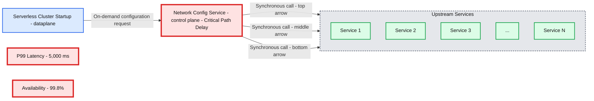
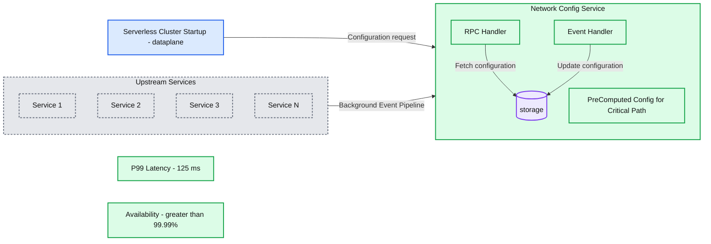

# Databricks Network Configuration delivery to Tens of Millions of Serverless VMs

*How event-driven pre-computation and snapshot serving cut RPC latency by 97.5% (5,000ms → 125ms) and reached 99.99% availability across billions of network-config requests daily.*

- Source: https://www.databricks.com/blog/databricks-network-configuration-delivery-tens-millions-serverless-vms
- Published: 2026-08-12
- Authors: Manish Bansal, Yankai Zhang, Chen He
- Categories: engineering, data-engineering
- Images: 3 total, 3 extracted as architecture

**Key takeaways**

- Event-driven pre-computation: Databricks re-architected serverless network configuration delivery from synchronous upstream calls to an event-driven pipeline that pre-computes configs in the background and serves them from a snapshot store.
- Decoupled critical path: Moving expensive multi-service aggregation off the cluster-startup path turned a fragile dependency chain into a single, fast storage read.
- Proven at scale: Across billions of requests/day, this cut RPC p99 latency 98.5% (5,000ms → 75ms), raised availability to 99.99%, and reduced upstream call volume 86%.

## Summary

- Databricks' serverless platform launches tens of millions of VMs daily, and each VM needs network configuration such as allowed destinations and private endpoints, before serving customer workloads. With each node fetching config at startup and polling for updates throughout its lifetime, this translates to billions of network config requests per day. The old architecture fetched this from multiple upstream services synchronously, creating latency, and availability bottlenecks.
- We re-architected network config delivery using event-driven pipelines and snapshot pre-computation, reducing RPC latency by 97.5% (5,000ms → 125ms), achieving 99.99% service availability.

## Problem Statement

Databricks' serverless compute platform powers virtually all of our data and AI products, such as, SQL warehouses, notebooks, ML serving endpoints, and more. The platform launches tens of millions of VMs daily across AWS, Azure, and GCP.

Before any serverless workload can execute, the VM needs to know its network configuration: What storage destinations can it access? Are there private link endpoints through which it should route traffic? Is there recent changes in Unity Catalog that grants access to new storage destinations? Do we start consuming new destinations shared via Delta Sharing?

The challenge is that network configuration is not stored in any single place. It must be assembled from multiple upstream services, each contributing a piece of the full picture.

## The Old Architecture

In the original design, every time a serverless cluster started, our network configuration service would synchronously call all upstream services, aggregate their responses, compute the per-workspace network configuration, and return it to the serverless dataplane. This happened on the critical path of cluster creation.

**Summary:** Serverless cluster startup depends on a network configuration service that synchronously calls upstream services, creating critical path delay with 5,000 ms p99 latency and 99.8% availability.

**Components:**
- Serverless Cluster Startup: dataplane; technology unspecified.
- Network Config Service: control plane; technology unspecified; labeled Critical Path Delay.
- Upstream Services: group containing Service 1, Service 2, Service 3, an ellipsis, and Service N; technologies unspecified.
- P99 Latency: performance metric box.
- Availability: availability metric box.

**Flows:**
- Serverless Cluster Startup -> Network Config Service: on-demand network configuration request.
- Network Config Service -> Upstream Services: synchronous upstream call, top arrow.
- Network Config Service -> Upstream Services: synchronous upstream call, middle arrow.
- Network Config Service -> Upstream Services: synchronous upstream call, bottom arrow.

**Numbers:**
- P99 latency: 5,000 ms.
- Availability: 99.8%.
- Service identifiers: 1, 2, 3, N.

source image: https://www.databricks.com/sites/default/files/inline-images/2026-06-blog-Databricks-Network-Configuration-delivery-to-Tens-of-Millions-of-Serverless-VMs-Inline-960x524-2x.png

While the old architecture was simple and worked well with small scale, this architecture suffered from fundamental problems, reflected in the following metrics we track on our operational dashboard:

1. Latency: With multiple upstream services on the critical path, the RPC latency for serving network configuration was 5,000ms at p99. This impacted serverless cluster start up latency.
2. Server Success Rate: Each upstream service has its own availability characteristics. With several services in series, the compound availability drops quickly, translating to increased likelihood of severless cluster launch failures per year.

As serverless usage continued its rapid growth, the synchronous model became increasingly unsustainable. Each synchronous call triggered expensive operations across all workspaces, often doing duplicated computation. This added load that grew proportionally with the number of tenants and their configured resources.

## Solution: Event Driven Precomputation

We performed a ground-up re-architecture of how Databricks delivers network configuration. It is built on the core principles:

1. Event-driven pipeline: Instead of making synchronous calls to all upstream services, the new system subscribes to change events via a message queue. When a customer creates a new Unity Catalog connection or modifies a network policy, the upstream service emits an event. The system processes it and updates the pre-computed configuration.
2. Snapshot pre-computation: Network configurations are computed asynchronously in the background and stored in a pre-computed snapshot store. The serving path becomes a single, thin storage fetch, completely decoupled from the upstream services.
3. Static stability: In the event of any upstream service outage, we can maintain a static config, providing static stability for the serverless clusters.

**Summary:** The network configuration service serves precomputed configurations from storage while upstream services supply background events, separating cluster startup from configuration updates.

**Components:**

- Serverless Cluster Startup: dataplane client; technology unspecified.
- Network Config Service: contains the RPC handler, storage, and event handler; technology unspecified.
- RPC Handler: handles RPC requests; framework unspecified.
- Storage: holds precomputed configurations for the critical path; storage technology unspecified.
- Event Handler: processes background events; technology unspecified.
- Upstream Services: Service 1, Service 2, Service 3, and Service N; technologies unspecified.
- P99 Latency: performance metric.
- Availability: reliability metric.

**Flows:**

- Serverless Cluster Startup -> Network Config Service: configuration request.
- RPC Handler -> storage: fetch precomputed configuration.
- Upstream Services -> Network Config Service: background event pipeline.
- Event Handler -> storage: precomputed configuration update.

**Numbers:**

- P99 latency: 125 ms.
- Availability: > 99.99%.
- Service identifiers: 1, 2, 3, and N.

source image: https://www.databricks.com/sites/default/files/inline-images/2026-06-blog-Databricks-Network-Configuration-delivery-to-Tens-of-Millions-of-Serverless-VMs-Inline-960x524-2x-1.png

The architecture cleanly separates two paths. The management path runs asynchronously in the background: upstream services emit change events to a message queue, which an event processor consumes to resolve which workspaces are affected and fan out per-workspace update notifications. A local event manager then fetches the relevant details from upstream, recomputes the workspace's network configuration, and stores the result in a pre-computed snapshot store. A periodic reconciler also re-syncs all workspaces in the background, ensuring eventual consistency even if events are missed. The serving path, by contrast, is critical and fast: when a serverless cluster starts up and needs network configuration, the network configuration service serves it directly from the snapshot store with a single storage read, requiring no upstream service calls and meaningfully reducing load on upstream services.

## Key Design Decisions

- Upstream services push change events to the message queue. The system processes these events in the background. A low-frequency reconciler periodically re-syncs all workspaces as a safety net, providing the reliability of synchronous framework with the efficiency of push.
- Network configurations are computed and stored locally within each service partition, co-located with the workspaces they serve. This distributes computation, reduces blast radius during incidents, and eliminates cross-partition dependencies on the serving path.
- Events carry only workspace and resource identifiers. This keeps events lightweight, makes them idempotent (they can be replayed in any order), and avoids transferring sensitive customer data through the messaging pipeline.

## How Events Flow

When a customer creates a new Unity Catalog connection, Unity Catalog emits a change event to the message queue. The event processor then receives the event, determines which workspaces are attached to the affected metastore, and fans out a per-workspace update notification. In each workspace's partition, the event manager receives this notification, fetches the updated connection details, recomputes the workspace's network configuration, and stores it with a new version mark. From that point on, when a serverless cluster requests the network config, it is served directly from the snapshot store with no upstream calls needed.

## Impact

After rolling out the new architecture, the results were transformative across all operational metrics:

| **Metric** | **Before (Old)** | **After (New)** | **Improvement** |
|---|---|---|---|
| Latency (RPC p99) | ~5,000 ms | 125 ms | 97.5% reduction |
| Server Success Rate | 99.8% | 99.99% | Reduced downtime |

**Summary:** Network Config Service P99 latency falls from roughly 2-5 seconds to near zero after event-driven precomputation is enabled.

**Components:**

- P99 Latency Improvement: chart title.
- Event-Driven Precomputation Enabled: optimization identified in the subtitle.
- P99 Latency Network Config Service: green latency series; underlying technology unspecified.
- Latency on hot path: blue label and vertical dashed marker.
- Red horizontal reference line: unlabeled, positioned at 5 seconds.

**Flows:**

- none. No arrows are visible.

**Numbers:**

- P99: 99th-percentile latency.
- Vertical axis: 0 s, 1 s, 2 s, 3 s, 4 s, 5 s, 6 s, 7 s, 8 s, 9 s, 10 s.
- Horizontal axis: 05/19 08:00, 05/19 16:00, 05/20 00:00, 05/20 08:00, 05/20 16:00, 05/21 00:00, 05/21 08:00, 05/21 16:00, 05/22 00:00, 05/22 08:00, 05/22 16:00.
- Red reference line: 5 s.
- Approximate plotted latency: 2-4.9 s before the drop; about 0.1-0.2 s afterward.

```mermaid
%% P99 latency improvement with event-driven precomputation enabled, represented as chart labels without invented arrows
flowchart TD
    A[P99 Latency Improvement]
    B[Event-Driven Precomputation Enabled]
    C[Network Config Service P99 latency]
    D[Before drop - approximately 2 to 4.9 s]
    E[After drop - approximately 0.1 to 0.2 s]
    F[Latency on hot path - blue dashed marker]
    G[Red reference line - 5 s]
    H[Time axis - 05/19 through 05/22]
    I[Latency axis - 0 to 10 s]

    classDef client fill:#dbeafe,stroke:#2563eb,stroke-width:2px,color:#111
    classDef service fill:#dcfce7,stroke:#16a34a,stroke-width:2px,color:#111
    classDef store fill:#ede9fe,stroke:#7c3aed,stroke-width:2px,color:#111
    classDef cache fill:#fef3c7,stroke:#d97706,stroke-width:2px,color:#111
    classDef queue fill:#cffafe,stroke:#0891b2,stroke-width:2px,color:#111
    classDef critical fill:#fee2e2,stroke:#dc2626,stroke-width:4px,color:#111
    classDef external fill:#e5e7eb,stroke:#6b7280,stroke-width:2px,color:#111,stroke-dasharray:4 3
    classDef decision fill:#fce7f3,stroke:#db2777,stroke-width:2px,color:#111
    class A,B,H,I external
    class C,D,E service
    class F client
    class G critical
```

source image: https://www.databricks.com/sites/default/files/inline-images/2026-06-blog-Databricks-Network-Configuration-delivery-to-Tens-of-Millions-of-Serverless-VMs-Inline-960x605-2x.png

Beyond the topline metrics:

1. Upstream call volume reduced by 86%. The system only calls upstream services when an event indicates a change, not on every request.
2. We observed meaningful improvement in the freshness of the networking configuration.
3. Legacy synchronous framework fully deprecated.

## Conclusion

This project taught us several lessons about operating network infrastructure at cloud scale:

Pre-computation decouples critical paths. By moving expensive aggregation to the background, the serving path becomes trivially simple and fast. This is the single most impactful architectural decision. It turned a multi-service dependency chain into a single storage read.

Event-driven architecture trades consistency for scalability and reconciliation provides the safety net. Event-based push handles the common case efficiently, while a periodic reconciler catches anything that falls through the cracks.

Design for extensibility from day one. The modular, stage-based architecture means adding support for a new upstream data source requires only a new stage implementation with zero changes to the core pipeline. As Databricks' product surface expands, the network configuration system scales with it.

Today, this system serves billions of network config requests per day across Databricks' global serverless fleet, with ~125ms latency and 99.99% availability. As serverless compute continues its rapid growth, the event-driven architecture ensures that network configuration delivery scales right alongside it.

We're always looking for engineers who enjoy tackling distributed systems challenges at global scale. If problems like these excite you, we'd love to hear from you, please check out open roles at databricks.com/careers!
