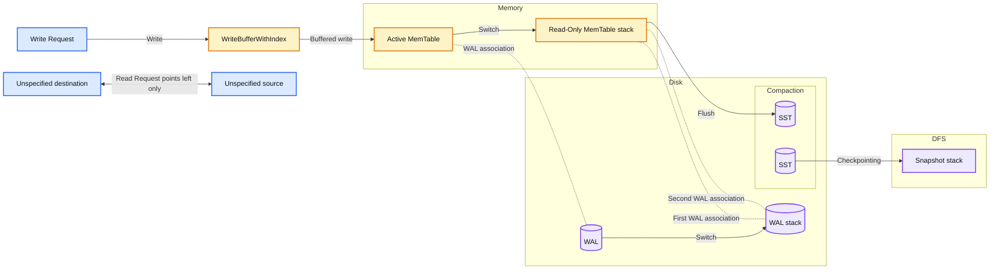
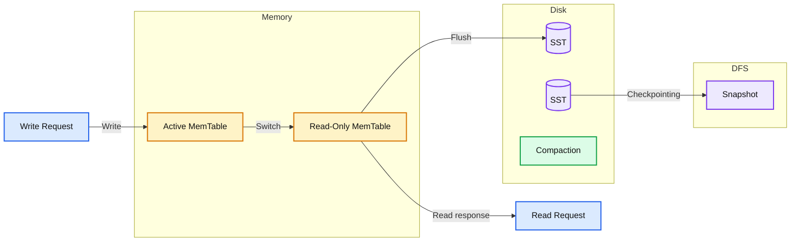
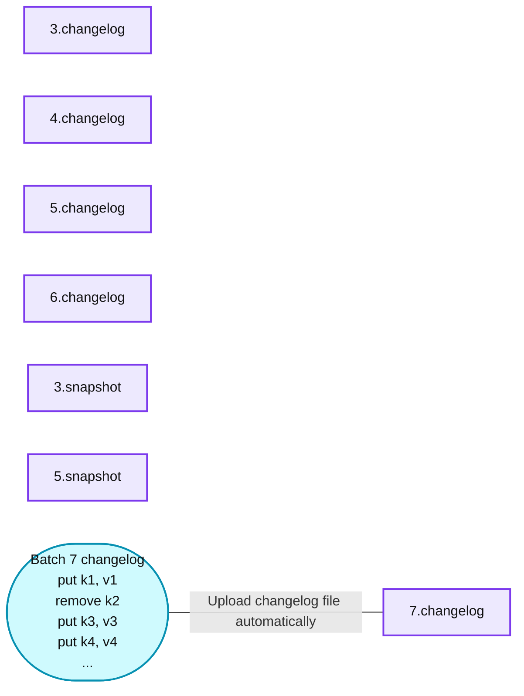
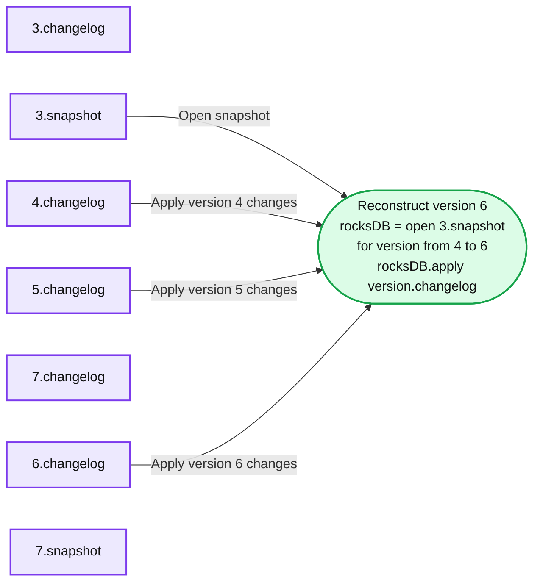
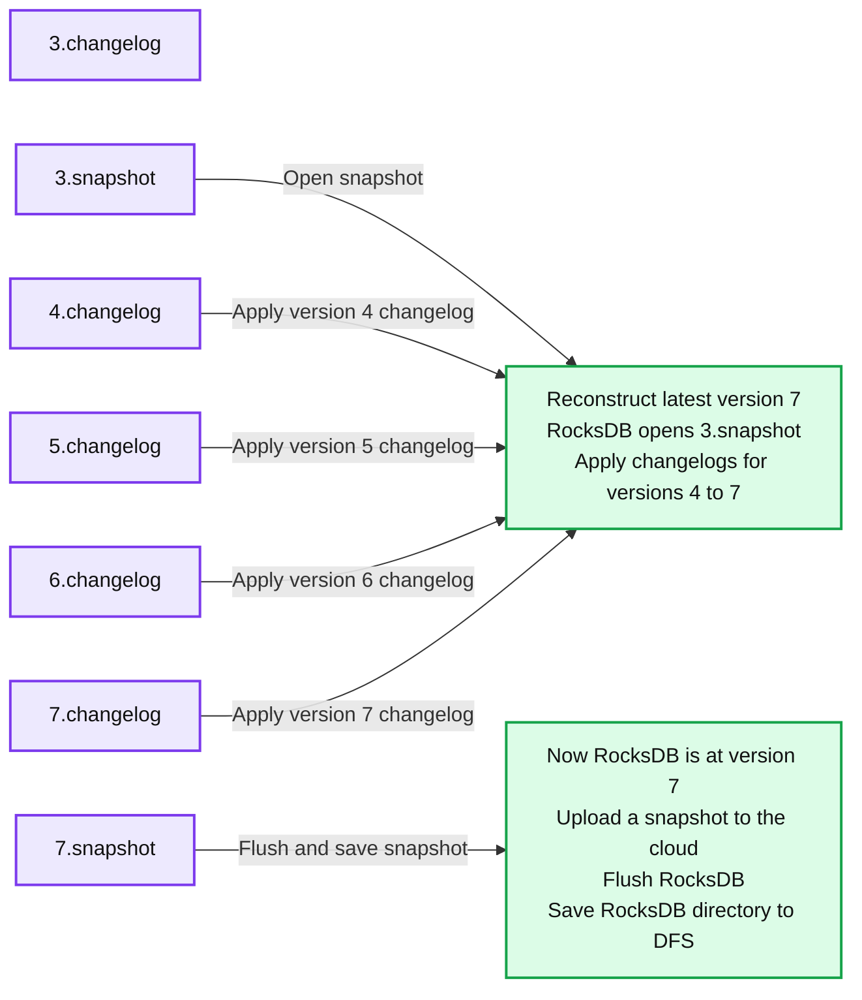

# A Deep Dive into the Latest Performance Improvements of Stateful Pipelines in Apache Spark Structured Streaming

- Source: https://www.databricks.com/blog/deep-dive-latest-performance-improvements-stateful-pipelines-apache-spark-structured-streaming
- Published: 2024-02-28
- Authors: Mojgan Mazouchi, Mrityunjay Kumar, Anish Shrigondekar, Karthikeyan Ramasamy
- Categories: engineering, data-engineering
- Images: 5 total, 5 extracted as architecture

This post is the second part of our two-part series on the latest performance improvements of stateful pipelines. The first part of this series is covered in [Performance Improvements for Stateful Pipelines in Apache Spark Structured Streaming](https://www.databricks.com/blog/performance-improvements-stateful-pipelines-apache-spark-structured-streaming) - we recommend reading the first part before reading this post.

In the [Project Lightspeed update blog](https://www.databricks.com/blog/project-lightspeed-update-advancing-apache-spark-structured-streaming#performance), we provided a high-level overview of the various performance improvements we've added for stateful pipelines. In this section, we will dig deeper into the various issues we observed while analyzing performance and outline specific enhancements we have implemented to address those issues.

## Improvements in the RocksDB State Store Provider

### Memory Management

RocksDB primarily uses [memory](https://github.com/facebook/rocksdb/wiki/Memory-usage-in-RocksDB) for [memtables](https://github.com/facebook/rocksdb/wiki/MemTable), the block cache, and other pinned blocks. Previously, all the updates within a micro-batch were buffered in memory using [*WriteBatchWithIndex*](https://github.com/facebook/rocksdb/wiki/Write-Batch-With-Index). Additionally, users could only configure individual instance memory limits for write buffer and block cache usage. This allowed for unbounded memory use on a per-instance basis, compounding the problem when multiple state store instances were scheduled on a single worker node.

To address these problems, we now allow users to enforce bounded memory usage by leveraging the [write buffer manager](https://github.com/facebook/rocksdb/wiki/Write-Buffer-Manager) feature in RocksDB. This enables users to set a single global memory limit to control block cache, write buffer, and filter block memory use across state store instances on a single executor node. Moreover, we removed the reliance on *WriteBatchWithIndex* entirely so that updates are no longer buffered unbounded and instead written directly to the database.

### Database Write/Flush Performance

With the latest improvements, we no longer explicitly need the [write ahead log (WAL)](https://github.com/facebook/rocksdb/wiki/Write-Ahead-Log-File-Format) since all updates are safely written locally as [SST files](https://github.com/facebook/rocksdb/wiki/A-Tutorial-of-RocksDB-SST-formats) and subsequently backed to persistent storage as part of the checkpoint directory for each micro-batch.

*Architecture with WAL*

**Summary:** Writes pass through an indexed buffer into memory tables backed by disk WAL files, then flush to SST files that are compacted and checkpointed as snapshots in DFS.

**Components:**

- Write Request: incoming write operation.
- WriteBufferWithIndex: indexed write buffer.
- Memory: storage area containing memory tables.
- Active MemTable: active in-memory write table.
- Read-Only MemTable: stacked read-only memory tables.
- Read Request: outgoing left-pointing read arrow with no connected component.
- Disk: local storage area for WAL and SST files.
- WAL: active and stacked write-ahead log files.
- Switch: labels for memory-table and WAL transitions.
- Flush: memory-table transfer to SST storage.
- SST: two disk-resident sorted string table files.
- Compaction: operation grouped beneath the SST files.
- Checkpointing: transfer from SST storage to snapshots.
- DFS: distributed filesystem storage area.
- Snapshot: stacked checkpoint snapshots.

**Flows:**

- Write Request -> WriteBufferWithIndex: write operation.
- WriteBufferWithIndex -> Active MemTable: buffered write.
- Active MemTable -> Read-Only MemTable: switch.
- Active MemTable -> active WAL: dotted association with the write-ahead log, without an arrowhead.
- Active WAL -> stacked WAL: switch.
- Read-Only MemTable -> stacked WAL: two dotted associations, without arrowheads.
- Read-Only MemTable -> SST: flush.
- SST -> Snapshot: checkpointing.
- Unspecified source -> unspecified destination to the left: read request shown as a standalone arrow.

**Numbers:** none

source image: https://www.databricks.com/sites/default/files/inline-images/db-905-blog-img-1.png

Architecture with WAL

*Updated Architecture*

**Summary:** Writes enter an active MemTable, switch to read-only MemTables, flush to disk SST files, and are checkpointed as snapshots in DFS.

**Components:**

- Memory: contains the active and read-only MemTables.
- Write Request: incoming write operation.
- Active MemTable: writable in-memory table.
- Read Request: read operation served from read-only MemTables.
- Read-Only MemTable: stacked immutable in-memory tables.
- Switch: transition from active to read-only MemTable.
- Flush: transfer from read-only MemTables to disk.
- Disk: local storage containing two SST files.
- SST: sorted string table files on disk.
- Compaction: operation grouped beneath the SST files.
- Checkpointing: transfer of disk state to DFS.
- DFS: distributed file system storing snapshots.
- Snapshot: stacked persistent checkpoint snapshots.

**Flows:**

- Write Request -> Active MemTable: write.
- Active MemTable -> Read-Only MemTable: switch.
- Read-Only MemTable -> Read Request: read response in the displayed arrow direction.
- Read-Only MemTable -> SST: flush.
- SST -> Snapshot: checkpointing.

**Numbers:** none

source image: https://www.databricks.com/sites/default/files/inline-images/db-905-blog-img-2.png

Updated Architecture

In addition to serving all reads and writes primarily from memory, this change allows us to flush writes to storage periodically when changelog checkpointing is enabled rather than on each micro-batch.

### Changelog Checkpointing

We identified state checkpointing latency as one of the major performance bottlenecks for stateful streaming queries. This latency was rooted in the periodic pauses of RocksDB instances associated with background operations and the snapshot creation and upload process that was part of committing the batch.

In the new design, we no longer need to snapshot the entire state to the checkpoint location. Instead, we are now leveraging [changelog checkpointing](https://docs.databricks.com/en/structured-streaming/rocksdb-state-store.html#enable-changelog-checkpointing), which makes the state of a micro-batch durable by storing just the changes since the last checkpoint on each micro-batch commit.

Moreover, the snapshotting process is now handled by the same database instance performing the updates, and the snapshots are uploaded asynchronously using the background maintenance task to avoid blocking task execution. The user now has the flexibility of configuring the snapshot interval to trade off between failure recovery and resource usage. Any version of the state can be reconstructed by picking a snapshot and replaying changelogs created after that snapshot. This allows for faster state checkpointing with the RocksDB state store provider.

The following sequence of figures captures how the new mechanism works.

*Step 1. Changelog commit, with async snapshot uploads.*

**Summary:** Batch 7 changes are automatically uploaded as a changelog file alongside existing changelogs and snapshots.

**Components:**
- 3.changelog: stored changelog file for version 3; technology unspecified.
- 4.changelog: stored changelog file for version 4; technology unspecified.
- 5.changelog: stored changelog file for version 5; technology unspecified.
- 6.changelog: stored changelog file for version 6; technology unspecified.
- 7.changelog: destination changelog file for version 7; technology unspecified.
- 3.snapshot: stored state snapshot for version 3; technology unspecified.
- 5.snapshot: stored state snapshot for version 5; technology unspecified.
- Batch 7 changelog: changes including `put(k1, v1)`, `remove(k2)`, `put(k3,v3)`, and `put(k4,v4)`; technology unspecified.

**Flows:**
- Batch 7 changelog -> 7.changelog: upload changelog file automatically. The connector has no visible arrowhead.

**Numbers:** Changelog versions 3, 4, 5, 6, 7; snapshot versions 3, 5; batch 7; key identifiers k1, k2, k3, k4; value identifiers v1, v3, v4. No units, percentages, or sizes are visible.

source image: https://www.databricks.com/sites/default/files/inline-images/db-905-blog-imgs-3.png

Step 1. Changelog commit, with async snapshot uploads. 

*Step 2. Version reconstruction. To load version j, load the latest snapshot i before j, then replay i+j to j version changelog.*

**Summary:** RocksDB reconstructs version 6 by opening snapshot 3 and applying changelogs 4 through 6.

**Components:**
- 3.changelog: RocksDB state changelog.
- 4.changelog: RocksDB state changelog applied during reconstruction.
- 5.changelog: RocksDB state changelog applied during reconstruction.
- 6.changelog: RocksDB state changelog applied during reconstruction.
- 7.changelog: RocksDB state changelog shown with a heavier border.
- 3.snapshot: RocksDB snapshot used as the reconstruction baseline.
- 7.snapshot: RocksDB snapshot shown without a connection.
- Reconstruct version 6: RocksDB operation that opens 3.snapshot and applies version changelogs from 4 to 6.

**Flows:**
- 3.snapshot -> Reconstruct version 6: Open the baseline snapshot.
- 4.changelog -> Reconstruct version 6: Apply version 4 changes.
- 5.changelog -> Reconstruct version 6: Apply version 5 changes.
- 6.changelog -> Reconstruct version 6: Apply version 6 changes.

**Numbers:** Changelog versions 3, 4, 5, 6, and 7; snapshot versions 3 and 7; reconstruction target version 6; code references snapshot 3 and loop bounds 4 to 6.

source image: https://www.databricks.com/sites/default/files/inline-images/db-905-blog-imgs-4.png

Step 2. Version reconstruction. To load version j, load the latest snapshot i before j, then replay i+j to j version changelog.

*Step 3. Periodic snapshotting with background uploads.*

**Summary:** RocksDB reconstructs version 7 from snapshot 3 and changelogs 4 through 7, then flushes its state for a background snapshot upload to cloud storage.

**Components:**
- `3.changelog`: RocksDB state changelog for version 3.
- `4.changelog`: RocksDB state changelog for version 4.
- `5.changelog`: RocksDB state changelog for version 5.
- `6.changelog`: RocksDB state changelog for version 6.
- `7.changelog`: RocksDB state changelog for version 7.
- `3.snapshot`: RocksDB snapshot for version 3.
- Reconstruct latest version 7: RocksDB opens `3.snapshot` and applies version changelogs from 4 to 7.
- `7.snapshot`: RocksDB snapshot for version 7.
- Upload a snapshot to the cloud: RocksDB calls `rocksDB.flush()` and `saveToDFS(rocksDB.directory)`.

**Flows:**
- `3.snapshot` -> Reconstruct latest version 7: load the initial RocksDB snapshot.
- `4.changelog` -> Reconstruct latest version 7: apply version 4 changes.
- `5.changelog` -> Reconstruct latest version 7: apply version 5 changes.
- `6.changelog` -> Reconstruct latest version 7: apply version 6 changes.
- `7.changelog` -> Reconstruct latest version 7: apply version 7 changes.
- `7.snapshot` -> Upload a snapshot to the cloud: flush and save the version 7 RocksDB directory to DFS.

**Numbers:** Changelog versions 3, 4, 5, 6, and 7; snapshot versions 3 and 7; reconstruction target version 7; replay range 4 to 7; upload state version 7.

source image: https://www.databricks.com/sites/default/files/inline-images/db-905-blog-imgs-5.png

Step 3. Periodic snapshotting with background uploads.

### Sink-Specific Improvements

Once a stateful operation is complete, its state is saved to the state stores by calling *commit*. When the state has been saved successfully, the partition data (the executor's slice of the data) has to be written to the sink. The executor communicates with the output commit coordinator on the driver to ensure no other executor has committed results for that same slice of data. The commit can only go through after confirming that no other executors have committed to this partition; otherwise, the task will fail with an exception.

This implementation resulted in some undesired RPC delays, which we determined could be bypassed easily for sinks that only provide "at-least-once" semantics. In the new implementation, we have removed this synchronous step for all DataSource V2 (DSv2) sinks with at-least-once semantics, leading to improved latency. Note that end-to-end exactly-once pipelines use a combination of replayable sources and idempotent sinks, for which the semantic guarantees remain unchanged.

### Operator-Specific and Maintenance Task Improvements

As part of Project Lightspeed, we also made improvements for specific types of operators, such as stream-stream join queries. For such queries, we now support parallel commits of state stores for all instances associated with a partition, thereby improving latency.

Another set of improvements we have made is related to the background maintenance task, primarily responsible for snapshotting and cleaning up the expired state. If this task fails to keep up, large numbers of delta/changelog files might accumulate, leading to slower replay. To avoid this, we now support performing the deletions of expired states in parallel and also running the maintenance task as part of a thread pool so that we are not bottlenecked on a single thread servicing all loaded state store instances on a single executor node.

## Conclusion

We encourage our customers to try these latest improvements on their stateful Structured Streaming pipelines. As part of [Project Lightspeed](https://www.databricks.com/blog/2022/06/28/project-lightspeed-faster-and-simpler-stream-processing-with-apache-spark.html), we are focused on improving the throughput and latency of all streaming pipelines at lower TCO. Please stay tuned for more updates in this area in the near future!

## Availability

All the features mentioned above are available from the DBR 13.3 LTS release.
