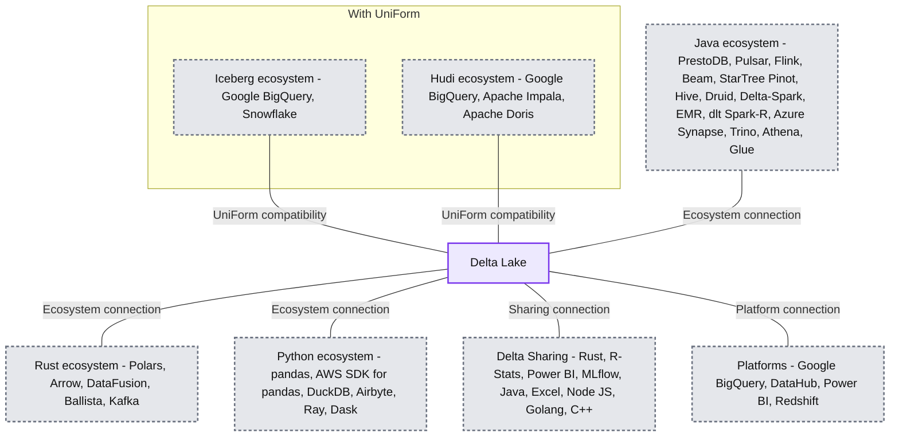
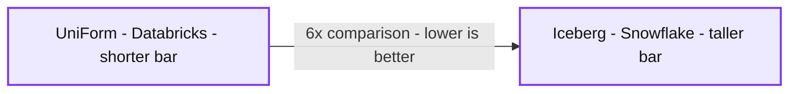
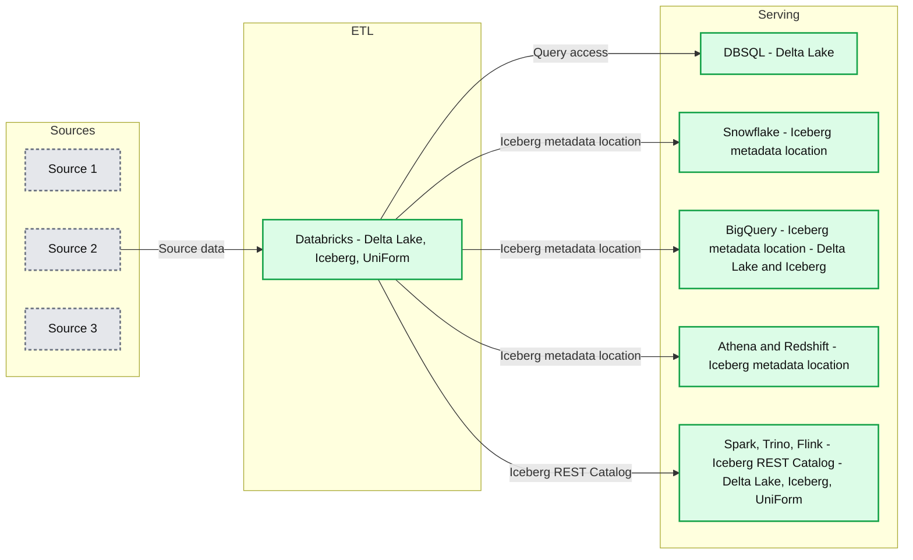

# Delta Lake Universal Format (UniForm) for Iceberg compatibility, now in GA

*One lake, all formats: Delta Lake UniForm simplifies data management for all your needs*

- Source: https://www.databricks.com/blog/delta-lake-universal-format-uniform-iceberg-compatibility-now-ga
- Published: 2024-06-03
- Authors: Jonathan Brito, Fred Liu, Susan Pierce
- Categories: engineering
- Images: 5 total, 4 extracted as architecture

Delta Lake has proven to be the [most popular](https://github.com/delta-io/delta/stargazers) and [fastest lakehouse format](https://brooklyndata.co/blog/benchmarking-open-table-formats) over the years. Delta Lake Universal Format (UniForm), now available in GA, builds on Delta Lake’s rich connector ecosystem to combine Delta Lake’s superior price-performance with access to every tool in your stack. With Delta Lake UniForm, you can write a single copy of your data and make it available to any engine that supports any of the primary open table formats: [Linux Foundation Delta Lake](https://delta.io/), [Apache Iceberg](https://iceberg.apache.org/), and [Apache Hudi](https://hudi.apache.org/) (coming soon). In this blog, we cover the following:

 

- Building the open data Lakehouse with Delta Lake UniForm
- Getting fast performance in any engine
- Using advanced Delta Lake features, like Liquid Clustering, with Delta Lake UniForm

## Building the Open Lakehouse

Delta Lake offers a vibrant connector ecosystem with support from many popular open source frameworks and commercial engines. [UniForm](https://docs.delta.io/latest/delta-uniform.html) expands Delta Lake’s ecosystem by taking advantage of the inherent similarities among the 3 open table formats. Delta Lake, Iceberg, and Hudi all store data in the [Apache Parquet](https://parquet.apache.org/) file format but diverge in how they store additional metadata. Delta Lake UniForm generates Iceberg metadata alongside Delta Lake while maintaining a single copy of the Parquet files. By writing once to Delta Lake UniForm, you can access your data using any engine that supports any one of the open formats:

 

**Summary:** Delta Lake connects to Java, Rust, Python, Delta Sharing, and platform ecosystems, with UniForm extending compatibility to Iceberg and Hudi ecosystems.

**Components:**

- Delta Lake: central storage technology.
- With UniForm: boundary enclosing the Iceberg and Hudi ecosystems.
- Iceberg ecosystem: Google BigQuery and Snowflake.
- Hudi ecosystem: Google BigQuery, Apache Impala, and Apache Doris.
- Java ecosystem: PrestoDB, Pulsar, Flink, Beam, StarTree (Pinot), Hive, Druid, Delta-Spark, EMR, dlt (Spark-R), Azure Synapse, Trino, Athena, and Glue. Delta-Spark, EMR, dlt, and Azure Synapse share one shaded group; Trino, Athena, and Glue share another.
- Rust ecosystem: Polars, Arrow, DataFusion, Ballista, and Kafka.
- Python ecosystem: pandas, AWS SDK for pandas, DuckDB, Airbyte, Ray, and Dask.
- Delta Sharing: Rust, R-Stats, Power BI, MLflow, Java, Excel, Node JS, Golang, and C++.
- Platforms: Google BigQuery, DataHub, Power BI, and Redshift.

**Flows:**

The connectors have no arrowheads or flow labels; they indicate ecosystem connections, with no specified data direction.

- Delta Lake -> Iceberg ecosystem: compatibility connection through UniForm.
- Delta Lake -> Hudi ecosystem: compatibility connection through UniForm.
- Delta Lake -> Java ecosystem: ecosystem connection.
- Delta Lake -> Rust ecosystem: ecosystem connection.
- Delta Lake -> Python ecosystem: ecosystem connection.
- Delta Lake -> Delta Sharing: sharing connection.
- Delta Lake -> Platforms: platform connection.

**Numbers:** none

source image: https://www.databricks.com/sites/default/files/inline-images/with-uniform-delta-lake-supports-all-ecosystems-white-042924-1%29.png

Delta Lake UniForm enables you to choose the best tool for your workload. With Delta Lake UniForm, you get the data flexibility to support any architecture you choose today or in the future. 

## Fast performance, everywhere

With more platforms embracing open table formats, you can write Delta Lake UniForm to access a broader range of tools without expensive data duplication. This provides greater flexibility and lower costs for data previously stored in a proprietary format. With Delta Lake UniForm, you can take advantage of Databricks’ best-in-class ingestion and [ETL price-performance](https://www.databricks.com/blog/2023/04/14/how-we-performed-etl-one-billion-records-under-1-delta-live-tables.html) and connect with any data warehousing or BI tool in your stack. These cost savings can be realized without compromising on query performance downstream.

 

The benchmarks below compare performance ingesting Parquet files into Delta Lake UniForm using Databricks and into Iceberg using Snowflake. 

**Summary:** The ingestion benchmark shows Databricks UniForm performing 6x faster than Snowflake Iceberg, with lower ingestion time being better.

**Components:**
- Iceberg - Snowflake, represented by the taller bar.
- UniForm - Databricks, represented by the shorter bar.
- Ingestion performance - benchmark metric labeled “Lower is better.”

**Flows:**
- UniForm -> Iceberg: comparison arrow labeled 6x, pointing from the shorter bar toward the taller bar.

**Numbers:**
- 6x ingestion performance comparison.
- 3TB data warehouse benchmark ingested by Snowflake and Databricks.
- No numerical axis labels or time units shown.

source image: https://www.databricks.com/sites/default/files/inline-images/Group-2908-2%29.png

Databricks ingested Parquet 6x faster than Snowflake. Databricks was also 90% less expensive than Snowflake. Because Delta Lake UniForm writes both Delta and Iceberg metadata, the table remains accessible to Snowflake. In Snowflake, Delta Lake UniForm can be read using an [Iceberg catalog integration](https://docs.snowflake.com/en/user-guide/tables-iceberg-create#create-an-iceberg-table-with-a-catalog-integration). A catalog integration enables you to create an Iceberg table in Snowflake referencing an external Iceberg catalog or object storage. Benchmarks show that out-of-box read performance for Delta Lake UniForm is comparable to Snowflake managed Iceberg:

 

**Summary:** Snowflake read performance is comparable for Snowflake Iceberg and Databricks UniForm, with a indicated difference of ±10% and lower values being better.

**Components:**
- Iceberg - Snowflake benchmark bar.
- UniForm - Databricks benchmark bar.
- Read performance in Snowflake - benchmark title.
- Lower is better - performance interpretation.
- ±10% - comparison annotation between the bars.

**Flows:**
- Iceberg -> UniForm: read performance comparison marked ±10%, not a data flow.

**Numbers:**
- ±10% read performance difference.
- First 50 queries.
- 3TB data warehouse benchmark in Snowflake.
- No numeric axis values or absolute read times are shown.

```mermaid
%% Snowflake read performance comparison for Iceberg and UniForm
flowchart TD
    T[Read performance in Snowflake]
    L[Lower is better]
    subgraph Comparison
        direction LR
        I[Iceberg - Snowflake] -->|±10%| U[UniForm - Databricks]
    end
    N[First 50 queries in a 3TB data warehouse benchmark in Snowflake]

    classDef client fill:#dbeafe,stroke:#2563eb,stroke-width:2px,color:#111
    classDef service fill:#dcfce7,stroke:#16a34a,stroke-width:2px,color:#111
    classDef store fill:#ede9fe,stroke:#7c3aed,stroke-width:2px,color:#111
    classDef cache fill:#fef3c7,stroke:#d97706,stroke-width:2px,color:#111
    classDef queue fill:#cffafe,stroke:#0891b2,stroke-width:2px,color:#111
    classDef critical fill:#fee2e2,stroke:#dc2626,stroke-width:4px,color:#111
    classDef external fill:#e5e7eb,stroke:#6b7280,stroke-width:2px,color:#111,stroke-dasharray:4 3
    classDef decision fill:#fce7f3,stroke:#db2777,stroke-width:2px,color:#111

    class T,N external
    class L decision
    class I,U store
```

source image: https://www.databricks.com/sites/default/files/inline-images/Group-2908_0.png

 

The difference in query performance is nearly zero! With Delta Lake UniForm, you get the fastest performance and universal connectivity all from a single copy of data in your own storage bucket! 

 

## With Delta Lake UniForm you get the best of all formats

When writing Delta Lake UniForm, you can continue to take advantage of Delta Lake’s advanced table features. For example, Delta Lake UniForm can now be enabled on Delta tables using [Liquid Clustering](https://docs.delta.io/latest/delta-clustering.html), a new feature available in Public Preview. Liquid Clustering is an intelligent data management technique that dynamically clusters Delta tables, allowing data layout to evolve alongside analytics needs. 

 

Together, Delta Lake UniForm and Liquid Clustering provide fast query performance even when reading from Iceberg or Hudi engines. This works because when Liquid Clustering optimizes the physical data layout, Delta Lake UniForm reflects these improvements in both Delta Lake and Iceberg metadata. Because Delta Lake UniForm is only writing additional metadata, there is [negligible overhead on writes](https://www.databricks.com/blog/delta-uniform-universal-format-lakehouse-interoperability). Liquid also automatically clusters new data during ingestion, so query performance remains fast over time. 

## How customers are using Delta Lake UniForm

During Public Preview, organizations proved Delta Lake UniForm’s compatibility with popular Iceberg reader clients including Snowflake, BigQuery, Redshift, and Athena for a range of BI and analytics use cases.

 

**Summary:** Databricks serves as the ETL layer between three sources and multiple query engines, with Iceberg metadata locations or an Iceberg REST Catalog supporting interoperability.

**Components:**

- Sources: Source 1, Source 2, and Source 3; technologies unspecified.
- ETL: Databricks, displaying Delta Lake, Iceberg, and UniForm logos.
- Serving: DBSQL, displaying the Delta Lake logo.
- Serving: Snowflake with an Iceberg metadata location and Iceberg logo.
- Serving: BigQuery with an Iceberg metadata location and Delta Lake and Iceberg logos.
- Serving: Athena and Redshift with an Iceberg metadata location and Iceberg logo.
- Serving: Spark, Trino, and Flink with an Iceberg REST Catalog and Delta Lake, Iceberg, and UniForm logos.

**Flows:**

- Source 2 -> Databricks: source data for ETL; the visible arrow aligns with Source 2.
- Databricks -> DBSQL: data for querying.
- Databricks -> Snowflake: access through an Iceberg metadata location.
- Databricks -> BigQuery: access through an Iceberg metadata location.
- Databricks -> Athena and Redshift: access through an Iceberg metadata location.
- Databricks -> Spark, Trino, and Flink: access through an Iceberg REST Catalog.

**Numbers:** 1, 2, and 3 in the source labels. No quantities or units shown.

source image: https://www.databricks.com/sites/default/files/inline-images/Group-2941.png

 

Now in GA, Delta Lake UniForm is ready for your production workloads. At Databricks, our customers have already started to see the benefits of writing UniForm:

>  At M Science, UniForm provides us with the flexibility to write a single copy of our data that can be queried by any engine that supports Delta or Iceberg – this is key to reducing costs and accelerating time-to-value

-- Ben Tallman, Chief Technology Officer at M Science

We are excited to see customers and commercial vendors choose the open Lakehouse architecture for its simplicity, flexibility, and lower costs. Post GA, we will continue to invest in making Delta Lake UniForm more interoperable and seamless so that users can use any tool in their ecosystem. 

New Delta Lake UniForm features are available as part of the [Delta Lake 3.2 release](https://delta.io/blog/delta-lake-3-2/). Databricks customers can use these features by upgrading to Databricks Runtime version 14.3. 

 

You can learn more about how to read Delta Lake UniForm from your choice Iceberg reader in the links below:

- Snowflake ([Push Method](https://medium.com/dbsql-sme-engineering/query-external-iceberg-tables-created-and-managed-by-databricks-with-snowflake-e4d537d09e31), [Pull Method](https://medium.com/@usman1114/integrate-snowflake-with-databricks-unity-catalog-to-refresh-iceberg-table-metadata-6e2409cb6146))
- [BigQuery](https://www.databricks.com/blog/delta-uniform-universal-format-lakehouse-interoperability#iceberg) 
- [Apache Spark](https://docs.databricks.com/en/delta/uniform.html#read-using-the-unity-catalog-iceberg-catalog-endpoint)
- [Trino](https://www.databricks.com/blog/delta-uniform-universal-format-lakehouse-interoperability#catalog)
