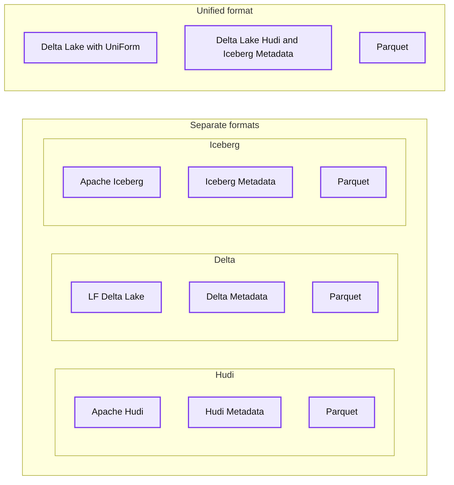
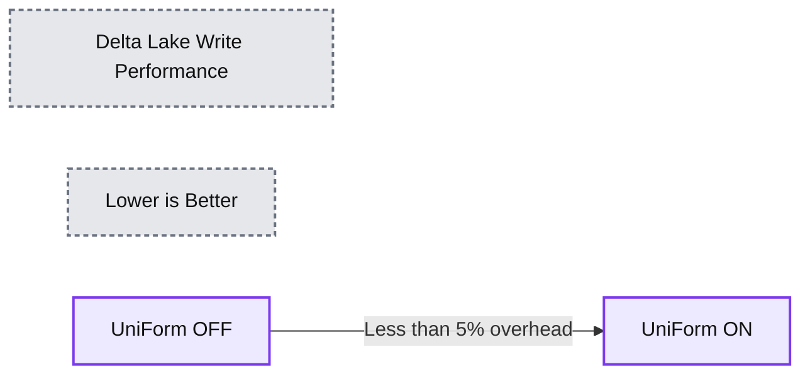
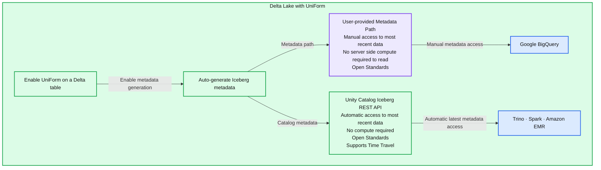

# Delta UniForm: a universal format for lakehouse interoperability

- Source: https://www.databricks.com/blog/delta-uniform-universal-format-lakehouse-interoperability
- Published: 2023-08-14
- Authors: Bilal Obeidat, Sirui Sun, Adam Wasserman, Susan Pierce, Fred Liu, Ryan Johnson, Himanshu Raja
- Categories: engineering
- Images: 4 total, 3 extracted as architecture

**Update:** BigQuery now offers native support for Delta Lake through BigLake. Check out the [documentation](https://cloud.google.com/bigquery/docs/create-delta-lake-table) for more information.

One of the key challenges that organizations face when adopting the open data lakehouse is selecting the optimal format for their data. Among the available options, [Linux Foundation Delta Lake](https://delta.io/), [Apache Iceberg](https://iceberg.apache.org/), and [Apache Hudi](https://hudi.apache.org/) are all excellent storage formats that enable data democratization and interoperability. Any of these formats is better than putting your data into a proprietary format. However, choosing a single storage format to standardize on can be a daunting task, which can result in decision fatigue and fear of irreversible consequences.

Delta UniForm (short for Delta Lake Universal Format) offers a simple, easy to implement, seamless unification of table formats without creating additional data copies or silos. In this blog, we'll cover the following:

- An introduction to Delta UniForm and its benefits
- Reading Delta UniForm as Iceberg tables using
  - Iceberg Metadata Path
  - Iceberg REST Catalog API

## Multiple formats, single copy of data

Delta UniForm takes advantage of the fact that Delta Lake, Iceberg, and Hudi are all built on [Apache Parquet](https://parquet.apache.org/) data files. The main difference among the formats is in the metadata layer, and even then, the differences are subtle. The metadata for all three formats serves the same purpose and contains overlapping sets of information.

Prior to the release of Delta UniForm, the ways to switch between open table formats were copy- or conversion-based and only provided a point-in-time view of the data. In contrast, Delta UniForm solves interoperability needs more elegantly by providing a live view of the data for all readers, regardless of format.

Under the hood, Delta UniForm works by automatically generating the metadata for Iceberg and Hudi alongside Delta Lake - all against a single copy of the Parquet data. As a result, teams can use the most suitable tool for each data workload and all operate on a single data source, with perfect interoperability across the three different ecosystems.

**Summary:** Apache Hudi, LF Delta Lake, and Apache Iceberg each have separate metadata and Parquet storage, while Delta Lake with UniForm groups all three metadata formats above shared Parquet storage.

**Components:**
- Apache Hudi: Hudi table format with Hudi metadata and Parquet data.
- LF Delta Lake: Delta Lake table format with Delta metadata and Parquet data.
- Apache Iceberg: Iceberg table format with Iceberg metadata and Parquet data.
- Delta Lake with UniForm: Delta Lake supporting Delta, Hudi, and Iceberg formats.
- Unified Metadata: Delta Lake, Apache Hudi, and Apache Iceberg metadata grouped together.
- Shared Parquet: one Parquet storage layer beneath the unified metadata.

**Flows:**
- none. No directional flow arrows connect the components; arrows within logos are branding.

**Numbers:** none

source image: https://www.databricks.com/sites/default/files/inline-images/db-722-blog-img-1.png

## Fast setup, minimal overhead

Delta UniForm is extremely easy to set up, and once it's enabled it works seamlessly and automatically.

To start, let's create a Delta UniForm table to generate Iceberg metadata:

With Delta UniForm tables, the metadata for the additional formats is automatically created upon table creation and updated whenever the table is modified. This means there is no need for manual refresh commands or running unnecessary compute to translate table formats. For example, let's write a row to this table:

This command triggers a Delta Lake commit, which then automatically and asynchronously generates the Iceberg metadata for this table. By doing this, Delta UniForm ensures data pipelines are uninterrupted, enabling seamless access to the most up-to-date information for all readers.

Delta UniForm has negligible performance and resource overhead, ensuring optimal utilization of computational resources. Even for petabyte-scale tables, the metadata is typically a tiny fraction of the data file size. In addition, Delta UniForm is able to incrementally generate metadata scoped to only the changes since the previous commit.

**Summary:** Delta Lake write performance shows less than 5% overhead with UniForm enabled, with lower values being better.

**Components:**
- Delta Lake Write Performance: benchmark title identifying Delta Lake.
- Lower is Better: benchmark interpretation.
- UniForm OFF: orange bar representing Delta Lake writes with UniForm disabled.
- UniForm ON: slightly taller green bar representing Delta Lake writes with UniForm enabled.
- <5%: red badge marking the performance difference.

**Flows:**
- UniForm OFF -> UniForm ON: comparison indicating less than 5% write overhead.

**Numbers:** <5%. No axis values or units are displayed.

source image: https://www.databricks.com/sites/default/files/inline-images/db-722-blog-img-2.png

## Reading Delta UniForm as Iceberg

Delta UniForm generates Iceberg metadata in accordance with the Apache Iceberg specification, which means when data is written to a Delta UniForm table, the table can be read as Iceberg by any client in the Iceberg ecosystem that adheres to the open source Iceberg specification.

Per the Iceberg specification, reader clients must figure out which Iceberg metadata represents the latest, most up-to-date version of the Iceberg table. Across the Iceberg ecosystem, we've seen clients take two different approaches to this, both of which are supported by UniForm. We'll explain the differences here and then provide examples in the next section.

Some Iceberg readers require users to provide the path to a metadata file representing the latest snapshot of the Iceberg table. This approach can be cumbersome for customers since it requires users to provide updated metadata file paths every time the table changes.

As an alternative, the Iceberg community recommends using the REST catalog API. The client talks to the catalog to get the latest state of the table, allowing users to read the latest state of an Iceberg table without manual refreshes or worrying about metadata paths.

Unity Catalog now implements the [open Iceberg Catalog REST API](https://github.com/apache/iceberg/blob/master/open-api/rest-catalog-open-api.yaml) in accordance with the Apache Iceberg specification. This is aligned with Unity Catalog's commitment to supporting open APIs, and builds on the momentum of [Unity Catalog's HMS API support](https://www.databricks.com/blog/extending-databricks-unity-catalog-open-apache-hive-metastore-api). The [Unity Catalog Iceberg REST API](https://docs.databricks.com/delta/uniform.html#read-using-the-unity-catalog-iceberg-catalog-endpoint) offers open access to UniForm tables in the Iceberg format without any charges for Databricks compute, while allowing interoperability and auto-refresh support for accessing the latest data. As a byproduct, this should enable other catalogs to federate to Unity Catalog and support Delta UniForm tables.

**Summary:** Delta Lake UniForm automatically generates Iceberg metadata for access through a user-provided metadata path or the Unity Catalog Iceberg REST API.

**Components:**

- Delta Lake with UniForm: Delta Lake table interoperability.
- Enable UniForm on a Delta table: Delta Lake configuration.
- Auto-generate Iceberg metadata: Apache Iceberg metadata generation.
- User-provided Metadata Path: manual access to the most recent data, no server-side compute required to read, and open standards.
- Unity Catalog Iceberg REST API: automatic access to the most recent data, no compute required, open standards, and time travel support.
- Google BigQuery: client using the user-provided metadata path.
- Trino, Spark, and Amazon EMR: clients grouped beneath the Unity Catalog Iceberg REST API.

**Flows:**

- Enable UniForm on a Delta table -> Auto-generate Iceberg metadata: configuration enables metadata generation.
- Auto-generate Iceberg metadata -> User-provided Metadata Path: generated metadata exposed through a supplied path.
- Auto-generate Iceberg metadata -> Unity Catalog Iceberg REST API: generated metadata exposed through the catalog API.
- User-provided Metadata Path -> Google BigQuery: manual metadata access.
- Unity Catalog Iceberg REST API -> Trino, Spark, and Amazon EMR: automatic access to the latest metadata.

**Numbers:** none

source image: https://www.databricks.com/sites/default/files/inline-images/db-722-blog-image-3.png

The Apache Iceberg client libraries come prepackaged with the ability to interface with the Iceberg REST API Catalog - meaning that any client that fully implements the Apache Iceberg standard and has support for configuring catalog endpoints should be able to easily access the Unity Catalog Iceberg REST API Catalog and retrieve the latest metadata for their tables. This eliminates the task of managing table metadata.

 

In the next section, we'll walk through examples of Delta UniForm's support for both the metadata path and Iceberg REST Catalog API approaches.

## Example: read Delta Lake as Iceberg in BigQuery by supplying metadata location

When reading Iceberg in an existing catalog, BigQuery requires you to provide a pointer to the JSON file representing the latest Iceberg snapshot ([BigQuery documentation](https://cloud.google.com/bigquery/docs/iceberg-tables#create-using-metadata-file)), like the following:

In BigQuery:

Delta UniForm with Unity Catalog makes it easy for you to find the required Iceberg metadata file path. Unity Catalog exposes a number of Delta Lake table properties, including this path. You can retrieve metadata location for your Delta UniForm table via UI or API.

**Retrieving Delta UniForm Iceberg metadata path via UI:**

Navigate to your Delta UniForm table in the Databricks Data Explorer, then click on the Details tab. Here, you will find the Delta UniForm Iceberg row containing the metadata path.

In Databricks:

**Retrieving Delta UniForm Iceberg metadata location via API:**

From a tool of your choosing, submit the following GET request to retrieve your Delta UniForm table's Iceberg metadata location.

The `delta_uniform_iceberg.metadata_location` field in the response contains the metadata location for the latest Iceberg snapshot.

Simply paste the location from either the UI or API methods outlined above into the aforementioned BigQuery command, and BigQuery will read the snapshot as Iceberg.

If your table gets updated, you will have to provide BigQuery with the updated metadata location to read the latest data. For production use cases, you should add a step in your ingestion pipeline that updates BigQuery with the latest Iceberg metadata path(s) every time you write to the Delta UniForm table. Note that the need for metadata path updates is a general limitation with this approach, and is not specific to UniForm.

## Example: Read Delta Lake as Iceberg in Trino via REST Catalog API

Let's now read the same Delta UniForm table we created earlier through Trino using Unity Catalog's Iceberg REST Catalog API.

**Note:** Uniform is not necessary for reading Delta tables with Trino as [Trino directly supports Delta tables](https://trino.io/docs/current/connector/delta-lake.html). This is just to illustrate how Uniform further expands the interoperability in the open source ecosystem.

After [setting up Trino](https://trino.io/docs/current/installation.html), you can adjust Iceberg properties by updating the `etc/catalog/iceberg.properties` file to configure Trino to use Unity Catalog's Iceberg REST API Catalog endpoint:

Where:

- **UNITY_CATALOG_ICEBERG_URL** - the URL to Unity Catalog's Iceberg REST API endpoint - it takes the form of: [https://{DATABRICKS_WORKSPACE_URL}/api/2.1/unity-catalog/iceberg](https://databricks_root/api/2.1/unity-catalog/iceberg)
  - **DATABRICKS_WORKSPACE_URL** - the URL of your Databricks workspace, which can be found by navigating to your Databricks workspace in a web browser; it takes the form of: [mydatabricksworkspace.cloud.databricks.com/?o=1231231231231231](http://mydatabricksworkspace.cloud.databricks.com/?o=1231231231231231/)
- **PERSONAL_ACCESS_TOKEN** - a Databricks Personal Access Token that can be generated in a Databricks workspace per [these instructions](https://docs.databricks.com/dev-tools/auth.html#databricks-personal-access-tokens-for-users)

Once your properties file is configured, you can run the Trino CLI and issue an Iceberg query to the Delta UniForm table:

Since Trino implements the Apache Iceberg REST Catalog API, we didn't create any external table, nor did we need to supply the path to the latest Iceberg metadata files. Trino automatically fetches the latest Iceberg metadata from UC and then reads the latest data in the Delta UniForm table.

It is important to note that, from Trino's perspective, there is nothing Delta UniForm-specific happening here. It is reading an Iceberg table, whose metadata has been generated to spec, and retrieving that metadata with a standard REST API call to an Iceberg catalog.

This is the simplicity of Delta UniForm. To Delta Lake writers and readers, the Delta UniForm table is a Delta Lake table. To Iceberg readers, the Delta UniForm table is an Iceberg table - all on a single set of data files without unnecessary copies of data and tables.

## Delta UniForm Impact

Throughout its Preview, we've already helped many customers accelerate towards the open data lakehouse interoperability with Delta UniForm. Organizations can write once to Delta Lake, and then access this data any way, achieving optimal performance, cost-effectiveness, and data flexibility across various workloads such as ETL, BI, and AI - all without the burden of costly and complex migrations.

> "At Instacart, our vision is to have an open data lakehouse with a single copy of data that is interoperable with all compute platforms. Delta UniForm is instrumental to that goal. With Delta UniForm, we can quickly and easily generate tables that can be read as either Delta Lake or Iceberg, unlocking interoperability with all the tools in our ecosystem." —Doug Hyde, a Sr. Staff Software Engineer at Instacart, shared his experience with Delta UniForm

Databricks' mission is to help data teams solve the world's toughest problems, and that starts with being able to use the right tool for the right job without having to make copies of your data. We are excited about the improvements in interoperability that Delta UniForm brings and will continue to invest in this area for years to come.

Delta UniForm is available as part of the [preview release candidate for Delta Lake 3.0](https://github.com/delta-io/delta/releases/tag/v3.0.0rc1). Databricks customers can also preview [Delta UniForm](https://docs.databricks.com/delta/uniform.html) with Databricks Runtime version 13.2 or the Databricks SQL 2023.35 preview channel.
