# DLT pipeline development made simple with notebooks

- Source: https://www.databricks.com/blog/dlt-pipeline-development-made-simple-notebooks
- Published: 2024-06-25
- Authors: Zoé Durand, Dominic Kramer, Pradeep Gopanapalli Venkata, Dylan Steele, Julia Martin
- Categories: engineering, data-engineering
- Images: 7 total, 1 extracted as architecture

We’re just a couple weeks removed from the biggest Data + AI Summit in history, where we introduced [Databricks Lakeflow](https://www.databricks.com/blog/introducing-databricks-lakeflow), a unified, intelligent solution for data engineering. While we are hard at work evolving DLT and Workflows into the new unified solution, we also want our customers to benefit from an improved DLT experience today.

Enhancing DLT development experience is a core focus because it directly impacts the efficiency and satisfaction of developers building data pipelines with DLT. We are excited to announce some enhancements to the DLT development experience with notebooks. These new features provide a seamless and intuitive DLT development interface, and help you build and debug your pipelines quickly and efficiently.

[Delta Live Tables (DLT)](https://www.databricks.com/product/delta-live-tables) is an innovative framework that simplifies and accelerates the building, testing, and maintaining of reliable data pipelines. It offers declarative data engineering and automatic pipeline management, enabling users to focus on defining business logic while it handles dependency tracking, error recovery, and monitoring. This powerful tool is a game changer for organizations aiming to optimize their data operations with efficiency and precision, ensuring data scientists and analysts always have access to up-to-date, high-quality data.

With this new release, we are bringing exciting new features to the experience of developing DLT with notebooks:

- No more context switching: see the DLT graph, the event log and notebook code in one single contextual UI.
- Quickly find syntax errors with the new "Validate" action.
- Develop code more easily with DLT-specific autocomplete, in-line errors, and diagnostics.

## No more context switching: develop your DLT pipelines in one single contextual UI

You may now "connect" to your DLT pipeline directly from the notebook, as you would to a SQL Warehouse or an Interactive cluster.

Once connected to your DLT pipeline, you have access to a new all-in-one UI. You can see the DLT graph (also referred to as the Directed Acyclic Graph or "DAG") and the DLT event log in the same UI as the code you are editing.

**Summary:** A Databricks DLT SQL pipeline links streaming table st1 to materialized views mv1 and mv2, with all three stages completed.

**Components:**
- st1: Databricks DLT streaming table created using SQL from `stream(zoe.default.table1)`.
- mv1: Databricks DLT materialized view created using SQL from `live.st1`.
- mv2: Databricks DLT materialized view created using SQL from `live.mv1`.

**Flows:**
- st1 -> mv1: Table data selected using `select * from live.st1`.
- mv1 -> mv2: Materialized view data selected using `select * from live.mv1`.

**Numbers:**
- Completion durations: st1 2s, mv1 6s, mv2 4s.
- Each graph node shows two counters of 0.
- Notebook cell identifiers: 1, 2, 3.
- Code line numbers: 1, 2, 3.
- Last edit: 21 days ago.
- Workspace item suffixes: (1), (2), (3).
- Workspace notebook timestamp: 2024-01-11 11:35:35.
- Numeric label portions: st1, mv1, mv2, table1, and mv1 repeated in SQL references.

```mermaid
%% DLT pipeline from streaming table st1 through materialized views mv1 and mv2
flowchart LR
    A["st1 - Streaming table - Completed 2s"] -->|Selected table data| B["mv1 - Materialized view - Completed 6s"]
    B -->|Selected view data| C["mv2 - Materialized view - Completed 4s"]

    classDef client fill:#dbeafe,stroke:#2563eb,stroke-width:2px,color:#111
    classDef service fill:#dcfce7,stroke:#16a34a,stroke-width:2px,color:#111
    classDef store fill:#ede9fe,stroke:#7c3aed,stroke-width:2px,color:#111
    classDef cache fill:#fef3c7,stroke:#d97706,stroke-width:2px,color:#111
    classDef queue fill:#cffafe,stroke:#0891b2,stroke-width:2px,color:#111
    classDef critical fill:#fee2e2,stroke:#dc2626,stroke-width:4px,color:#111
    classDef external fill:#e5e7eb,stroke:#6b7280,stroke-width:2px,color:#111,stroke-dasharray:4 3
    classDef decision fill:#fce7f3,stroke:#db2777,stroke-width:2px,color:#111
    class A,B,C store
```

source image: https://www.databricks.com/sites/default/files/inline-images/db-1021-blog-imgs-2.png

With this new all-in-one UI, you can do everything you need to do without switching tabs! You can check the shape of the DLT graph and the schema of each table as you are developing, to make sure that you are getting the results that you want. You can also check the event log for any errors that arise during the development process.

This greatly improves the usability and ergonomics of developing a DLT pipeline.

## Catch errors faster and easily develop DLT code

### 1. Catch syntax errors quickly with "Validate"

We are introducing a "Validate" action for DLT pipelines, alongside "start" and "full refresh".

With "Validate", you can check for problems in a pipeline's source code without processing any data. This feature will allow you to iteratively find and fix errors in your pipeline, such as incorrect table or column names, when you are developing or testing pipelines.

"Validate" is available as a button in the notebook UI, and will also execute when hitting the "shift+enter" keyboard shortcut.

### 2. Develop your code more easily with DLT-aware autocomplete, in-line errors and diagnostics

You can now access DLT-specific auto-complete, which makes writing code faster and more accurate.

Additionally, you can easily identify syntax errors with red squiggly lines that highlight the exact error location within your code.

Finally, you can benefit from the inline diagnostic box, which displays relevant error details and suggestions right at the pertinent line number. Hover over an error to see more information:

## How to get started?

Just create a DLT pipeline, a notebook, and connect to your pipeline from the compute drop-down. You can try these new notebook capabilities across Azure, [AWS](https://docs.databricks.com/en/delta-live-tables/dlt-notebook-devex.html) & [GCP](https://docs.gcp.databricks.com/en/delta-live-tables/dlt-notebook-devex.html).
