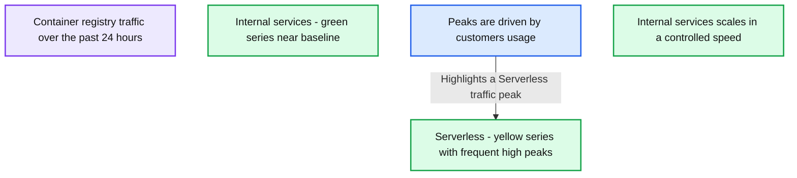
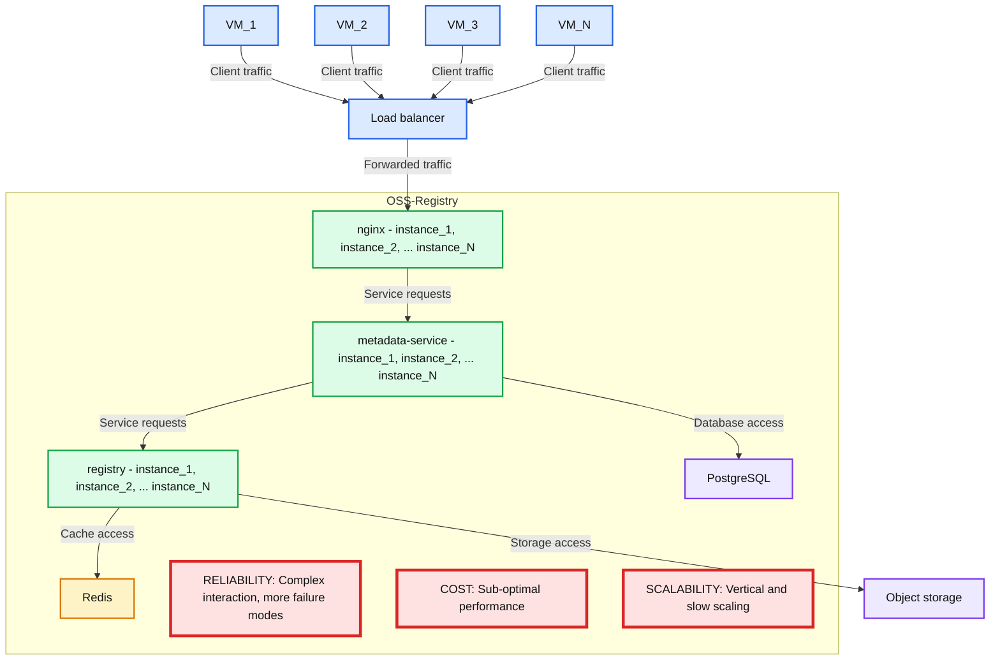
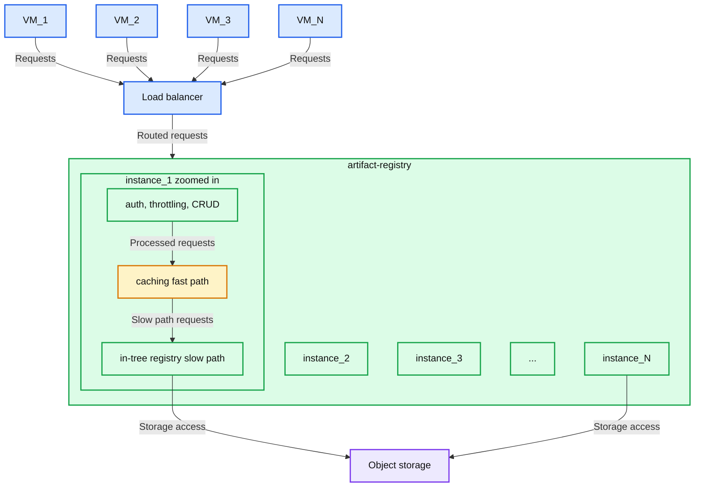
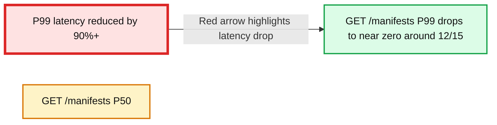
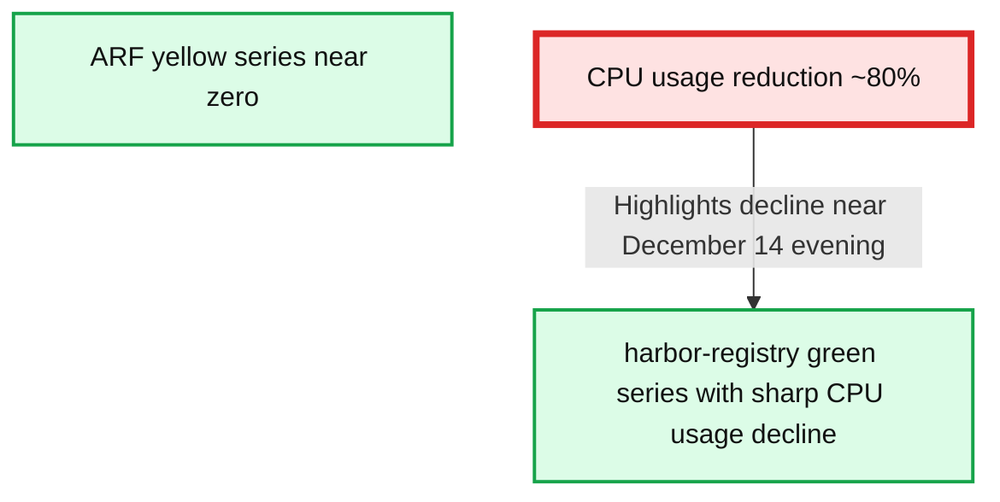
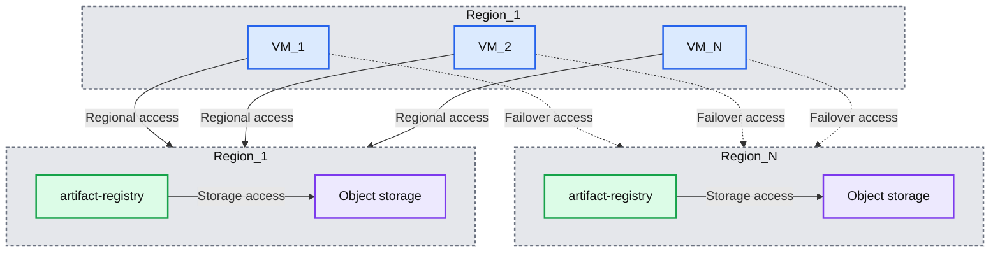

# Downloading tens of millions of container images daily from the Serverless optimized Artifact Registry

- Source: https://www.databricks.com/blog/downloading-tens-millions-container-images-daily-serverless-optimized-artifact-registry
- Published: 2025-03-22
- Authors: Shuai Chang, Anders Liu
- Categories: engineering, data-engineering
- Images: 6 total, 6 extracted as architecture

**Key takeaways**

- Databricks’ Serverless Data and AI products download tens of millions of container images each day. We purpose-built the Serverless optimized Artifact Registry. Compared to the open source registry, it reduced P99 image fetch latency by 90%, and reduced compute resource usage by 80%.
- The Artifact Registry scales seamlessly for the bursty Serverless traffic. The key optimizations include replacing the vertically scaling relational database with cloud object storage, caching extensively on the hot path and reducing networking hops.
- For reliability, we implemented a minimalist design with minimal dependencies (object storage is all we needed) and components, therefore minimal failure modes. Geo-based failover makes it possible to survive even regional cloud object storage outages.

## Entering the Serverless era

In this blog, we share the journey of building a Serverless optimized Artifact Registry from the ground up. The main goals are to ensure container image distribution both scales seamlessly under bursty Serverless traffic and stays available under challenging scenarios such as major dependency failures.

Containers are the modern cloud-native deployment format which feature isolation, portability and rich tooling eco-system. Databricks internal services have been running as containers since 2017.  We deployed a mature and feature rich open source project as the container registry. It worked well as the services were generally deployed at a controlled pace.

Fast forward to 2021, when Databricks started to launch Serverless DBSQL and ModelServing products, millions of VMs were expected to be provisioned each day, and each VM would pull 10+ images from the container registry. Unlike other internal services, Serverless image pull traffic is driven by customer usage and can reach a much higher upper bound.

Figure 1 is a 1-week production traffic load (e.g. customers launching new data warehouses or MLServing endpoints) that shows the Serverless Dataplane peak traffic is more than 100x compared to that of internal services.

*Figure 1: Serverless traffic is very bursty.*

**Summary:** Container registry traffic shows frequent, large Serverless spikes driven by customer usage, while internal services maintain low traffic and scale at a controlled speed.

**Components:**
- Container registry traffic: chart covering the past 24 hours; registry technology unspecified.
- Internal services: green traffic series near the baseline; technology unspecified.
- Serverless: yellow traffic series with frequent peaks; technology unspecified.
- Peaks are driven by customers' usage: annotation pointing to a Serverless peak.
- Internal services scales in a controlled speed: annotation along the baseline.

**Flows:**
- Customer usage annotation -> Serverless peak: highlights a traffic spike driven by customers' usage.

**Numbers:** 24 hours. No numeric axis labels are visible.

source image: https://www.databricks.com/sites/default/files/inline-images/reliable-scalable-artifact-registries-blog-img-1.png

Figure 1: Serverless traffic is very bursty.

Based on our stress tests, we concluded that the open source container registry could not meet the Serverless requirements.

## Serverless challenges

Figure 2 shows the main challenges of serving Serverless workloads with open source container registry:

- **Not sufficiently reliable:** OSS registries generally have a complex architecture and dependencies such as relational databases, which bring in failure modes and large blast radius.
- **Hard to keep up with Databricks’ growth: **in the open source deployment, image metadata is backed by vertically scaling relational databases and remote cache instances. Scaling up is slow, sometimes takes 10+ minutes. They can be overloaded due to under-provisioning or too expensive to run when over-provisioned.
- **Costly to operate:** OSS registries are not performance optimized and tend to have high resource usage (CPU intensive). Running them at Databricks’ scale is prohibitively expensive. 

*Figure 2: Common OSS registry setup and the risks.*

**Summary:** VM clients access an OSS registry through a load balancer, nginx, metadata-service, and registry layers backed by PostgreSQL, Redis, and object storage, with reliability, cost, and scalability risks highlighted.

**Components:**
- VM_1, VM_2, VM_3, VM_N: virtual machine clients.
- Load balancer: technology unspecified.
- OSS-Registry: boundary containing the registry services and dependencies.
- nginx: nginx layer with instance_1, instance_2, and instance_N.
- metadata-service: metadata layer with instance_1, instance_2, and instance_N; technology unspecified.
- registry: registry layer with instance_1, instance_2, and instance_N; technology unspecified.
- PostgreSQL: relational database.
- Redis: cache.
- Object storage: storage technology unspecified.
- RELIABILITY: Complex interaction, more failure modes.
- COST: Sub-optimal performance.
- SCALABILITY: Vertical and slow scaling.

**Flows:**
- VM_1 -> Load balancer: client traffic.
- VM_2 -> Load balancer: client traffic.
- VM_3 -> Load balancer: client traffic.
- VM_N -> Load balancer: client traffic.
- Load balancer -> nginx: forwarded traffic.
- nginx -> metadata-service: service requests.
- metadata-service -> registry: service requests.
- metadata-service -> PostgreSQL: database access.
- registry -> Redis: cache access.
- registry -> Object storage: storage access.

Arrow payloads are not explicitly labeled in the image.

**Numbers:** VM identifiers contain 1, 2, and 3; each of the three service layers has instance identifiers 1 and 2. N and ellipses indicate additional VMs or instances without specifying a count. No quantitative measurements or units are shown.

source image: https://www.databricks.com/sites/default/files/inline-images/standard-oss-registry.png

Figure 2: Common OSS registry setup and the risks.

What about cloud managed container registries? They are generally more scalable and offer availability SLA. However, different cloud provider services have different quotas, limitations, reliability, scalability and performance characteristics. Databricks operates in multiple clouds, we found the heterogeneity of clouds did not meet the requirements and was too costly to operate.

Peer-to-peer (P2P) image distribution is another common approach to reduce the load to the registry, at a different infrastructure layer. It mainly reduces the load to registry metadata but still subject to aforementioned reliability risks. We later also introduced the P2P layer to reduce the cloud storage egress throughput. At Databricks, we believe that each layer needs to be optimized to deliver reliability for the entire stack.

## Introducing the Artifact Registry

We concluded that it was necessary to build Serverless optimized registry to meet the requirements and ensure we stay ahead of Databricks’ rapid growth. We therefore built Artifact Registry - a homegrown multi-cloud container registry service. Artifact Registry is designed with the following principles:

1. **Everything scales horizontally:**
  - Do not use relational databases; instead, the metadata was persisted into cloud object storage (an existing dependency for images manifest and layers storage). Cloud object storages are much more scalable and have been well abstracted across clouds.
  - Do not use remote cache instances; the nature of the service allowed us to cache effectively in-memory.
2. **Scaling up/down in seconds:** added extensive caching for image manifests and blob requests to reduce hitting the slow code path (registry). As a result, only a few instances (provisioned in a few seconds) need to be added instead of hundreds.
3. **Simple is reliable:** unlike OSS, registries are of multiple components and dependencies, the Artifact Registry embraces minimalism. Behind the load balancer, As shown in Figure 3, there is only one component and one cloud dependency (object storage). Effectively, it is a simple, stateless, horizontally scalable web service.

*Figure 3: Artifact Registry, a minimalism design reduces failure modes.*

**Summary:** Multiple VMs connect through a load balancer to Artifact Registry instances, with one instance expanded to show authentication, throttling, CRUD, caching, and an in-tree registry connected to object storage.

**Components:**
- VM_1, VM_2, VM_3, VM_N: virtual machines; specific technology unspecified.
- Load balancer: traffic distribution; technology unspecified.
- artifact-registry: container for registry instances; implementation unspecified.
- instance_1 (zoomed in): expanded registry instance.
- auth, throttling, CRUD: authentication, request throttling, and create/read/update/delete operations.
- caching (fast path): cache layer; technology unspecified.
- in-tree registry (slow path): registry layer; technology unspecified.
- instance_2, instance_3, instance_N: additional registry instances.
- Ellipsis: additional instances omitted from the view.
- Object storage: durable storage; provider unspecified.

**Flows:**
- VM_1 -> Load balancer: incoming requests.
- VM_2 -> Load balancer: incoming requests.
- VM_3 -> Load balancer: incoming requests.
- VM_N -> Load balancer: incoming requests.
- Load balancer -> artifact-registry: routed requests.
- auth, throttling, CRUD -> caching: processed requests enter the fast path.
- caching -> in-tree registry: requests continue to the slow path.
- in-tree registry -> Object storage: storage access.
- instance_N -> Object storage: storage access.

**Numbers:** 1, 2, and 3 appear as VM and instance identifiers. N indicates an unspecified final identifier. No quantitative measurements, units, percentages, or sizes are visible.

source image: https://www.databricks.com/sites/default/files/inline-images/reliable-scalable-artifact-registries-blog-img-3.png

Figure 3: Artifact Registry, a minimalism design reduces failure modes.

Figure 4 and 5 show that P99 latency reduced by 90%+ and CPU usage reduced by 80% after migrating from the open source registry to Artifact Registry. Now we only need to provision a few instances for the same load vs. thousands previously. In fact, handling production peak traffic does not require scale out in most cases. In case auto-scaling is triggered, it can be done in a few seconds.

*Figure 4: Registry latency reduced by 90%.*

**Summary:** GET /manifests P99 latency drops from frequent high spikes to near zero, annotated as a reduction of 90%+.

**Components:**
- Graph: time-series plot; monitoring technology is not identified.
- GET /manifests P99: green latency series.
- GET /manifests P50: yellow latency series.
- P99 latency reduced by 90%+: annotation pointing to the latency drop.
- Lines, Bars, Points, Stacked lines, Stacked bars: plot display options.

**Flows:**
- P99 latency reduced by 90%+ -> latency drop near 12/15: red annotation arrow highlights the reduction.

**Numbers:**
- Percentiles: P99 and P50.
- Annotated reduction: 90%+.
- Vertical axis: 0.0, 0.5, 1.0, 1.5, 2.0, 2.5, 3.0, 3.5, 4.0, 4.5, 5.0. No unit is visible.
- Horizontal axis: 12/12 16:00; 12/13 00:00, 08:00, 16:00; 12/14 00:00, 08:00, 16:00; 12/15 00:00, 08:00, 16:00; 12/16 00:00, 08:00, 16:00; 12/17 00:00, 08:00, 16:00; 12/18 00:00, 08:00, 16:00; 12/19 00:00 and a partially clipped 08:00 label.

source image: https://www.databricks.com/sites/default/files/inline-images/reliable-scalable-artifact-registries-blog-img-4.png

Figure 4: Registry latency reduced by 90%.

*Figure 5: Overall resource usage dropped by 80%.*

**Summary:** CPU usage drops sharply around December 14, with an annotation indicating approximately 80% reduction and plotted series for harbor-registry and ARF.

**Components:**
- Graph: CPU usage time series; measurement unit is not shown.
- harbor-registry: green series for the registry.
- ARF: yellow series; underlying technology is not specified.
- CPU usage reduction ~80%: annotation highlighting the sharp decline.

**Flows:**
- CPU usage reduction ~80% -> green series near December 14 evening: annotation arrow highlights the decrease.

**Numbers:**
- CPU usage reduction: ~80%.
- Vertical axis: 0, 1, 2, 3, 4, 5; no unit shown.
- Horizontal axis: 12/12 16:00; 12/13 00:00, 08:00, 16:00; 12/14 00:00, 08:00, 16:00; 12/15 00:00, 08:00, 16:00; 12/16 00:00, 08:00, 16:00; 12/17 00:00, 08:00, 16:00; 12/18 00:00, 08:00, 16:00; 12/19 00:00, 08:00.

source image: https://www.databricks.com/sites/default/files/inline-images/reliable-scalable-artifact-registries-blog-img-5.png

Figure 5: Overall resource usage dropped by 80%.

## Surviving cloud object storages outage

With all the reliability improvements mentioned above, there is still a failure mode that occasionally happens: cloud object storage outages. Cloud object storages are generally very reliable and scalable; however, when they are unavailable (sometimes for hours), it potentially causes regional outages. At Databricks, we try hard to make cloud dependencies failures as transparent as possible.

Artifact Registry is a regional service, an instance in each cloud/region has an identical replica. In case of regional storage outages, the image clients are able to  fail over to different regions with the tradeoff on image download latency and egress cost. By carefully curating latency and capacity, we were able to quickly recover from cloud provider outages and continue serving Databricks’ customers.

*Figure 6: Serverless VMs failover to other regions to survive cloud storage regional outages.*

**Summary:** Serverless VMs in Region_1 access their regional artifact registry and can fail over to a registry in Region_N, with each registry backed by object storage.

**Components:**
- Region_1, upper box: region containing the serverless VMs.
- VM_1: serverless virtual machine.
- VM_2: serverless virtual machine.
- VM_N: serverless virtual machine.
- Region_1, lower left box: region containing an artifact registry and object storage.
- artifact-registry in Region_1: artifact registry service.
- Object storage in Region_1: durable object storage; technology unspecified.
- Region_N, lower right box: alternate region containing an artifact registry and object storage.
- artifact-registry in Region_N: artifact registry service.
- Object storage in Region_N: durable object storage; technology unspecified.

**Flows:**
- VM_1 -> Region_1 registry region: normal regional access through the shared solid path.
- VM_2 -> Region_1 registry region: normal regional access through the shared solid path.
- VM_N -> Region_1 registry region: normal regional access through the shared solid path.
- VM_1 -> Region_N registry region: failover access through the shared dashed path.
- VM_2 -> Region_N registry region: failover access through the shared dashed path.
- VM_N -> Region_N registry region: failover access through the shared dashed path.
- Region_1 artifact-registry -> Region_1 Object storage: storage access.
- Region_N artifact-registry -> Region_N Object storage: storage access.

**Numbers:** Label indices only: 1 in Region_1 and VM_1; 2 in VM_2. N denotes additional VMs or regions. No quantitative measurements are visible.

source image: https://www.databricks.com/sites/default/files/inline-images/reliable-scalable-artifact-registries-blog-img-6.png

Figure 6: Serverless VMs failover to other regions to survive cloud storage regional outages.

## Conclusions

In this blog post, we shared our journey of scaling container registries from serving low churn internal traffic to customer facing bursty Serverless workloads. We purpose-built Serverless optimized Artifact Registry. Compared to the open source registry, it reduced P99 latency by 90% and resource usages by 80%. To further improve reliability, we made the system to tolerate regional cloud provider outages. We also migrated all the existing non-Serverless container registries use cases to the Artifact Registry. Today, Artifact Registry continues to be a solid foundation that makes reliability, scalability and efficiency seamless amid Databricks’ rapid growth.

## Acknowledgement

Building reliable and scalable Serverless infrastructure is a team effort from our major contributors: Robert Landlord, Tian Ouyang, Jin Dong, and Siddharth Gupta. The blog is also a team work - we appreciate the insightful reviews provided by Xinyang Ge and Rohit Jnagal.
