# Efficient Fine-Tuning with LoRA: A Guide to Optimal Parameter Selection for Large Language Models

- Source: https://www.databricks.com/blog/efficient-fine-tuning-lora-guide-llms
- Published: 2023-08-30
- Authors: Avinash Sooriyarachchi
- Categories: engineering
- Images: 3 total, 3 extracted as architecture

With the rapid advancement of neural network-based techniques and Large Language Model (LLM) research, businesses are increasingly interested in AI applications for value generation. They employ various machine learning approaches, both generative and non-generative, to address text-related challenges such as classification, summarization, sequence-to-sequence tasks, and controlled text generation. Organizations can opt for third-party APIs, but fine-tuning models with proprietary data offers domain-specific and pertinent results, enabling cost-effective and independent solutions deployable across different environments in a secure manner.

Ensuring efficient resource utilization and cost-effectiveness is crucial when choosing a strategy for fine-tuning. This blog explores arguably the most popular and effective variant of such parameter efficient methods, Low Rank Adaptation (LoRA), with a particular emphasis on QLoRA (an even more efficient variant of LoRA). The approach here will be to take an open large language model and fine-tune it to generate fictitious product descriptions when prompted with a product name and a category. The model chosen for this exercise is [OpenLLaMA-3b-v2](https://www.google.com/url?q=https://huggingface.co/openlm-research/open_llama_3b_v2&sa=D&source=editors&ust=1693238695659836&usg=AOvVaw3FigUWTkWN1-NyZxuxm5cZ), an open large language model with a permissive license (Apache 2.0), and the dataset chosen is [Red Dot Design Award Product Descriptions](https://www.google.com/url?q=https://huggingface.co/datasets/xiyuez/red-dot-design-award-product-description&sa=D&source=editors&ust=1693238695660266&usg=AOvVaw3YtbDQ2HIKekcWMUMBhIP-), both of which can be downloaded from the HuggingFace Hub at the links provided.

### Fine-Tuning, LoRA and QLoRA

In the realm of language models, fine tuning an existing language model to perform a specific task on specific data is a common practice. This involves adding a task-specific head, if necessary, and updating the weights of the neural network through backpropagation during the training process. It is important to note the distinction between this finetuning process and training from scratch. In the latter scenario, the model's weights are randomly initialized, while in finetuning, the weights are already optimized to a certain extent during the pre-training phase. The decision of which weights to optimize or update, and which ones to keep frozen, depends on the chosen technique.

Full finetuning involves optimizing or training all layers of the neural network. While this approach typically yields the best results, it is also the most resource-intensive and time-consuming.

Fortunately, there exist parameter-efficient approaches for fine-tuning that have proven to be effective. Although most such approaches have yielded less performance, Low Rank Adaptation (LoRA) has bucked this trend by even outperforming full finetuning in some cases, as a consequence of avoiding catastrophic forgetting (a phenomenon which occurs when the knowledge of the pretrained model is lost during the fine-tuning process).

[LoRA](https://www.google.com/url?q=https://arxiv.org/abs/2106.09685&sa=D&source=editors&ust=1693238695661335&usg=AOvVaw1PC8ynCy6F73KvsHZSiugv) is an improved finetuning method where instead of finetuning all the weights that constitute the weight matrix of the pre-trained large language model, two smaller matrices that approximate this larger matrix are fine-tuned. These matrices constitute the LoRA adapter. This fine-tuned adapter is then loaded to the pretrained model and used for inference.

[QLoRA](https://www.google.com/url?q=https://arxiv.org/abs/2305.14314&sa=D&source=editors&ust=1693238695661760&usg=AOvVaw0AjcZZ7lmAU-nt9YrTNDk3) is an even more memory efficient version of LoRA where the pretrained model is loaded to GPU memory as quantized 4-bit weights (compared to 8-bits in the case of LoRA), while preserving similar effectiveness to LoRA. Probing this method, comparing the two methods when necessary, and figuring out the best combination of QLoRA hyperparameters to achieve optimal performance with the quickest training time will be the focus here.

LoRA is implemented in the Hugging Face Parameter Efficient Fine-Tuning (PEFT) library, offering ease of use and QLoRA can be leveraged by using [bitsandbytes](https://www.google.com/url?q=https://github.com/TimDettmers/bitsandbytes&sa=D&source=editors&ust=1693238695662188&usg=AOvVaw375IMHKhaKOmJQBLDxSspi) and [PEFT](https://www.google.com/url?q=https://huggingface.co/docs/peft/index&sa=D&source=editors&ust=1693238695662417&usg=AOvVaw1M_kCQSn7o_YTHxrVq4kqy) together. HuggingFace [Transformer Reinforcement Learning (TRL)](https://www.google.com/url?q=https://huggingface.co/docs/trl/index&sa=D&source=editors&ust=1693238695662670&usg=AOvVaw1i2Q66m3TI3LvSWadBP0sd) library offers a convenient trainer for supervised finetuning with seamless integration for LoRA. These three libraries will provide the necessary tools to finetune the chosen pretrained model to generate coherent and convincing product descriptions once prompted with an instruction indicating the desired attributes.

### Prepping the data for supervised fine-tuning

To probe the effectiveness of QLoRA for fine tuning a model for instruction following, it is essential to transform the data to a format suited for supervised fine-tuning. Supervised fine-tuning in essence, further trains a pretrained model to generate text conditioned on a provided prompt. It is supervised in that the model is finetuned on a dataset that has prompt-response pairs formatted in a consistent manner.

An example observation from our chosen dataset from the Hugging Face hub looks as follows:

| product | category | description | text |
|---|---|---|---|
| "Biamp Rack Products" | "Digital Audio Processors" | "“High recognition value, uniform aesthetics and practical scalability – this has been impressively achieved with the Biamp brand language …" | "Product Name: Biamp Rack Products; Product Category: Digital Audio Processors; Product Description: “High recognition value, uniform aesthetics and practical scalability – this has been impressively achieved with the Biamp brand language … |

 

As useful as this dataset is, this is not well formatted for fine-tuning of a language model for instruction following in the manner described above.

 

The following code snippet loads the dataset from the Hugging Face hub into memory, transforms the necessary fields into a consistently formatted string representing the prompt, and inserts the response( i.e. the description), immediately afterwards. This format is known as the ‘Alpaca format’ in large language model research circles as it was the format used to finetune the original LlaMA model from Meta to result in the Alpaca model, one of the first widely distributed instruction-following large language models (although not licensed for commercial use).

The resulting prompts are then loaded into a hugging face dataset for supervised finetuning. Each such prompt has the following format.

To facilitate quick experimentation, each fine-tuning exercise will be done on a 5000 observation subset of this data.

### Testing model performance before fine-tuning

Before any fine-tuning, it’s a good idea to check how the model performs without any fine-tuning to get a baseline for pre-trained model performance.

The model can be loaded in 8-bit as follows and prompted with the format specified in the [model card on Hugging Face](https://www.google.com/url?q=https://huggingface.co/openlm-research/open_llama_3b_v2&sa=D&source=editors&ust=1693238695672530&usg=AOvVaw2_XHc7KuCsTqLuRXh9YCLd).

The output obtained is not quite what we want.

The first part of the result is actually satisfactory, but the rest of it is more of a rambling mess.

Similarly, if the model is prompted with the input text in the ‘Alpaca format’ as discussed before, the output is expected to be just as sub-optimal:

And sure enough, it is:

The model performs what it was trained to do, predicts the next most probable token. The point of supervised fine-tuning in this context is to generate the desired text in a controllable manner. Please note that in the subsequent experiments, while QLoRA leverages a model loaded in 4-bit with the weights frozen, the inference process to examine output quality is done once the model has been loaded in 8-bit as shown above for consistency.

### The Turnable Knobs

When using PEFT to train a model with LoRA or QLoRA (note that, as mentioned before, the primary difference between the two is that in the latter, the pretrained models are frozen in 4-bit during the fine-tuning process), the hyperparameters of the low rank adaptation process can be defined in a LoRA config as shown below:

Two of these hyperparameters, r and target_modules are empirically shown to affect adaptation quality significantly and will be the focus of the tests that follow. The other hyperparameters are kept constant at the values indicated above for simplicity.

**r** represents the rank of the low rank matrices learned during the finetuning process. As this value is increased, the number of parameters needed to be updated during the low-rank adaptation increases. Intuitively, a lower r may lead to a quicker, less computationally intensive training process, but may affect the quality of the model thus produced. However, increasing r beyond a certain value may not yield any discernible increase in quality of model output. How the value of r affects adaptation (fine-tuning) quality will be put to the test shortly.

When fine-tuning with LoRA, it is possible to target specific modules in the model architecture. The adaptation process will target these modules and apply the update matrices to them. Similar to the situation with "**r**," targeting more modules during LoRA adaptation results in increased training time and greater demand for compute resources. Thus, it is a common practice to only target the attention blocks of the transformer. However, recent work as shown in the [QLoRA paper](https://www.google.com/url?q=https://arxiv.org/abs/2305.14314&sa=D&source=editors&ust=1693238695681194&usg=AOvVaw0ye_8n4aNLnR-WHNlYCJJN) by Dettmers et al. suggests that targeting all linear layers results in better adaptation quality. This will be explored here as well.

Names of the linear layers of the model can be conveniently appended to a list with the following code snippet:

### Tuning the finetuning with LoRA

The developer experience of fine tuning large language models in general have improved dramatically over the past year or so. The latest high level abstraction from Hugging Face is the SFTTrainer class in the TRL library. To perform QLoRA, all that is needed is the following:

1.  Load the model to GPU memory in 4-bit (bitsandbytes enables this process).

2.  Define the LoRA configuration as discussed above.

3.  Define the train and test splits of the prepped instruction following data into Hugging Face Dataset objects.

4. Define training arguments. These include the number of epochs, batch size and other training hyperparameters which will be kept constant during this exercise.

5. Pass these arguments into an instance of SFTTrainer.

These steps are clearly indicated in the source file in the [repository](https://www.google.com/url?q=https://github.com/avisoori-databricks/Tuning-the-Finetuning&sa=D&source=editors&ust=1693238695685827&usg=AOvVaw34PU2jozVQf6mCbEPcx_9T) associated with this blog.

The actual training logic is abstracted away nicely as follows:

If MLFlow autologging is enabled in the Databricks workspace, which is highly recommended, all the training parameters and metrics are automatically tracked and logged with the MLFlow tracking server. This functionality is invaluable in monitoring long-running training tasks. Needless to say, the fine-tuning process is performed using a compute cluster (in this case, a single node with a single A100 GPU) created using the latest Databricks Machine runtime with GPU support.

**Summary:** Evaluation loss decreases from 2.08 to 1.93 over relative time for one completed run.

**Components:**
- eval_loss: evaluation metric displayed in the tracking interface.
- Completed Runs: run completion indicator.
- Points and Line Smoothness: plot display controls.
- X-axis: Step, Time Wall, and selected Time Relative options.
- Y-axis: eval_loss selector and log scale control.
- Download CSV: metric export control.
- Metric table: Latest, Min, and Max evaluation loss values.

**Flows:**
- none. The line connects metric observations without arrows.

**Numbers:**
- Completed Runs: 1/1.
- Line Smoothness: 1.
- X-axis ticks: 0, 100, 200, 300, 400, 500. Time unit is not shown.
- Y-axis ticks: 1.9, 1.95, 2, 2.05.
- Latest: 1.93 at step 891.
- Min: 1.93 at step 891.
- Max: 2.08 at step 297.

source image: https://www.databricks.com/sites/default/files/inline-images/blogimg1_0.png

### Hyperparameter Combination #1: QLoRA with r=8 and targeting “q_proj”, “v_proj”

The first combination of QLoRA hyperparameters attempted is r=8 and targets only the attention blocks, namely “q_proj” and “v_proj” for adaptation.

The following code snippets gives the number of trainable parameters:

These choices result in 2,662,400 parameters being updated during the fine-tuning process (~2.6 million) from a total of ~3.2 billion parameters the model consists of. This is less than 0.1% of the model parameters. The entire finetuning process on a single Nvidia A100 with 80 GBs of GPU for 3 epochs only takes roughly 12 minutes. The GPU utilization metrics can be conveniently viewed at the metrics tab of the cluster configurations.

**Summary:** Databricks cluster metrics show GPU 0 utilization and memory utilization rising during activity and dropping to zero around 23:05.

**Components:**
- Avi 1 GPU: Databricks compute cluster.
- Metrics: Databricks monitoring tab with GPU and Last hour selected.
- Per-GPU utilization: GPU 0 activity percentage over time.
- Per-GPU memory utilization: GPU 0 memory utilization percentage over time.

**Flows:**
- none. No arrows are visible.

**Numbers:**
- Cluster name: Avi 1 GPU.
- Notebooks count: 2.
- Time window: Last hour.
- Last refreshed: 2 minutes ago.
- GPU identifier on both charts: 0.
- Per-GPU utilization axis: 0%, 50%, 100%.
- Per-GPU memory utilization axis: 0%, 10%, 20%.
- Time labels on both charts: 22:40, 22:45, 22:50, 22:55, 23:00, 23:05, 23:10, 23:15, 23:20, 23:25, 23:30, 23:35.
- Truncated selector identifier: `2928279c60234b50b...`.

```mermaid
%% Databricks GPU activity and memory utilization charts
flowchart TD
    A[Avi 1 GPU]
    B[Metrics - GPU - Last hour]
    C[Per-GPU utilization percent - GPU 0]
    D[Time axis 22:40 to 23:35 - scale 0 to 100 percent]
    E[Per-GPU memory utilization percent - GPU 0]
    F[Time axis 22:40 to 23:35 - labeled ticks 0 10 20 percent]

    classDef client fill:#dbeafe,stroke:#2563eb,stroke-width:2px,color:#111
    classDef service fill:#dcfce7,stroke:#16a34a,stroke-width:2px,color:#111
    classDef store fill:#ede9fe,stroke:#7c3aed,stroke-width:2px,color:#111
    classDef cache fill:#fef3c7,stroke:#d97706,stroke-width:2px,color:#111
    classDef queue fill:#cffafe,stroke:#0891b2,stroke-width:2px,color:#111
    classDef critical fill:#fee2e2,stroke:#dc2626,stroke-width:4px,color:#111
    classDef external fill:#e5e7eb,stroke:#6b7280,stroke-width:2px,color:#111,stroke-dasharray:4 3
    classDef decision fill:#fce7f3,stroke:#db2777,stroke-width:2px,color:#111
    class A service
    class B,C,D,E,F client
```

source image: https://www.databricks.com/sites/default/files/inline-images/blogimg2_0.png

At the end of the training process, the fine-tuned model is obtained by loading the adapter weights to the pre-trained model as follows:

This model can now be used for inference as any other model.

##### **Qualitative Evaluation**

A couple of example prompt-response pairs are listed below

**Prompt (passed to the model in the Alpaca format, not shown for conciseness here):**

Create a detailed description for the following product: Corelogic Smooth Mouse, belonging to category: Optical Mouse

**Response:**

**Prompt:**

Create a detailed description for the following product: Hoover Lightspeed, belonging to category: Cordless Vacuum Cleaner

**Response:**

The model has clearly been adapted for generating more consistent descriptions. However the response to the first prompt about the optical mouse is quite short and the following phrase “*The vacuum cleaner is equipped with a dust container that can be emptied via a dust container*” is logically flawed.

### Hyperparameter Combination #2: QLoRA with r=16 and targeting all linear layers

Surely, things can be improved here. It is worth exploring increasing the rank of low rank matrices learned during adaptation to 16, i.e. double the value of r to 16 and keep all else  the same. This doubles the number of trainable parameters to 5,324,800 (~5.3 million).

##### **Qualitative Evaluation**

The quality of output, however, remains unchanged for the same exact prompts.

**Prompt:**

Create a detailed description for the following product: Corelogic Smooth Mouse, belonging to category: Optical Mouse

**Response:**

**Prompt:**

Create a detailed description for the following product: Hoover Lightspeed, belonging to category: Cordless Vacuum Cleaner

**Response:**

The same lack of detail and logical flaws in detail where details are available persists. If this fine tuned model is used for product description generation in a real-world scenario, this is not acceptable output.

### Hyperparameter Combination #3: QLoRA with r=8 and targeting all linear layers

Given that doubling r does not seemingly result in any perceivable increase in output quality, it is worth changing the other important knob. i.e. targeting all linear layers instead of just the attention blocks. Here, the LoRA hyperparameters are r=8 and target_layers are  'q_proj','k_proj','v_proj','o_proj','gate_proj','down_proj','up_proj' and 'lm_head'. This increases the number of parameters updated to 12,994,560 and increases the training time to roughly 15.5 minutes.

##### **Qualitative Evaluation**

Prompting the model with the same prompts yield the following:

**Prompt:**

Create a detailed description for the following product: Corelogic Smooth Mouse, belonging to category: Optical Mouse

**Response:**

**Prompt:**

Create a detailed description for the following product: Hoover Lightspeed, belonging to category: Cordless Vacuum Cleaner

**Response:**

Now it is possible to see a somewhat longer coherent description of the fictitious optical mouse and there are no logical flaws in the description of the vacuum cleaner. The product descriptions are not only logical, but relevant. Just as a reminder, these relatively high-quality results are obtained by fine-tuning less than a 1% of the model’s weights with a total dataset of 5000 such prompt-description pairs formatted in a consistent manner.

### Hyperparameter Combination #4: LoRA with  r=8 and targeting all linear transformer layers

It is also worth exploring whether the quality of output from the model improves if the pretrained model is frozen in 8-bit instead of 4-bit. In other words, replicating the exact finetuning process using LoRA instead of QLoRA. Here, the LoRA hyperparameters are kept the same as before, in the new-found optimal configuration, i.e. r=8 and targeting all linear transformer layers during the adaptation process.

##### **Qualitative Evaluation**

The results for the two prompts used throughout the article are as given below:

**Prompt:**

Create a detailed description for the following product: Corelogic Smooth Mouse, belonging to category: Optical Mouse

**Response:**

**Prompt:**

Create a detailed description for the following product: Hoover Lightspeed, belonging to category: Cordless Vacuum Cleaner

**Response:**

Again, there isn’t much of an improvement in the quality of the output text.  

### Key Observations

Based on the above set of trials, and further evidence detailed in the excellent publication presenting QLoRA, it can be deduced that the value of r (the rank of matrices updated during adaptation) does not improve adaptation quality beyond a certain point. The biggest improvement is observed in targeting all linear layers in the adaptation process, as opposed to just the attention blocks, as commonly documented in technical literature detailing LoRA and QLoRA. The trials executed above and other empirical evidence suggest that QLoRA does not indeed suffer from any discernible reduction in quality of text generated, compared to LoRA.

### Further Considerations for using LoRA adapters in deployment

It's important to optimize the usage of adapters and understand the limitations of the technique. The size of the LoRA adapter obtained through finetuning is typically just a few megabytes, while the pretrained base model can be several gigabytes in memory and on disk. During inference, both the adapter and the pretrained LLM need to be loaded, so the memory requirement remains similar.

Furthermore, if the weights of the pre-trained LLM and the adapter aren’t merged, there will be a slight increase in inference latency. Fortunately, with the PEFT library, the process of merging the weights with the adapter can be done with a single line of code as shown here:

The figure below outlines the process from fine-tuning an adapter to model deployment.

**Summary:** A LoRA or QLoRA adapter is fine-tuned, merged with a pretrained model, and then deployed.

**Components:**

- Fine-tuning the adapter with LoRA/QLoRA: adapter training using LoRA or QLoRA.
- Merging adapter with pretrained model: combines the adapter and pretrained model; technology unspecified.
- Model Deployment: deploys the model; technology unspecified.

**Flows:**

- Fine-tuning the adapter with LoRA/QLoRA -> Merging adapter with pretrained model: fine-tuned adapter.
- Merging adapter with pretrained model -> Model Deployment: merged model.

**Numbers:** none

source image: https://www.databricks.com/sites/default/files/inline-images/image3_3.png

While the adapter pattern offers significant benefits, merging adapters is not a universal solution. One advantage of the adapter pattern is the ability to deploy a single large pretrained model with task-specific adapters. This allows for efficient inference by utilizing the pretrained model as a backbone for different tasks. However, merging weights makes this approach impossible. The decision to merge weights depends on the specific use case and acceptable inference latency. Nonetheless, LoRA/ QLoRA continues to be a highly effective method for parameter efficient fine-tuning and is widely used.

### Conclusion

Low Rank Adaptation is a powerful fine-tuning technique that can yield great results if used with the right configuration. Choosing the correct value of rank and the layers of the neural network architecture to target during adaptation could decide the quality of the output from the fine-tuned model. QLoRA results in further memory savings while preserving the adaptation quality. Even when the fine-tuning is performed,  there are several important engineering considerations to ensure the adapted model is deployed in the correct manner.

In summary, a concise table indicating the different combinations of LoRA parameters attempted, text quality output and number of parameters updated when fine-tuning OpenLLaMA-3b-v2 for 3 epochs on 5000 observations on a single A100 is shown below.

| r | target_modules | Base model weights | Quality of output | Number of parameters updated (in millions) |
|---|---|---|---|---|
| 8 | Attention blocks | 4 | low | 2.662 |
| 16 | Attention blocks | 4 | low | 5.324 |
| 8 | All linear layers | 4 | high | 12.995 |
| 8 | All linear layers | 8 | high | 12.995 |

Try this on Databricks! Clone the [GitHub repository](https://www.google.com/url?q=https://github.com/avisoori-databricks/Tuning-the-Finetuning.git&sa=D&source=editors&ust=1693238695716460&usg=AOvVaw2SzOs93DACvXYqATkxLuSS) associated with the blog into a Databricks [Repo](https://www.google.com/url?q=https://docs.databricks.com/en/repos/git-operations-with-repos.html&sa=D&source=editors&ust=1693238695717108&usg=AOvVaw2_3V-4nHDrc2ZU_7o1mIuG) to get started. More thoroughly documented examples to finetune models on Databricks are available [here](https://www.google.com/url?q=https://github.com/databricks/databricks-ml-examples&sa=D&source=editors&ust=1693238695717642&usg=AOvVaw3_wcxkZO6juLQf0sD1fhUX).
