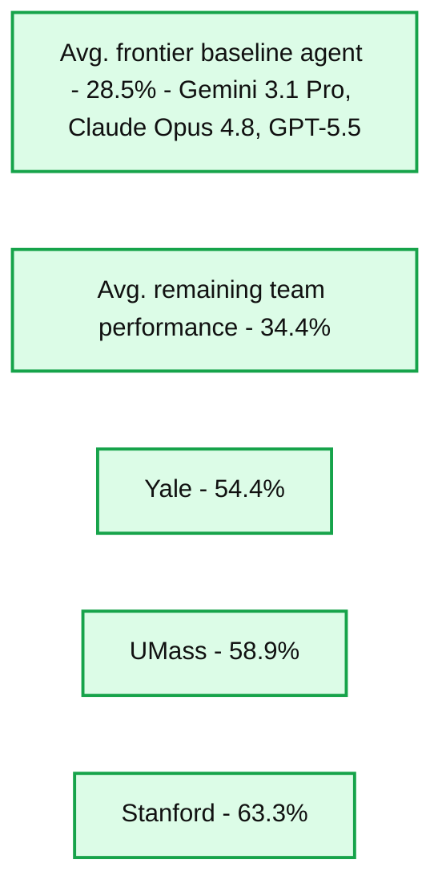
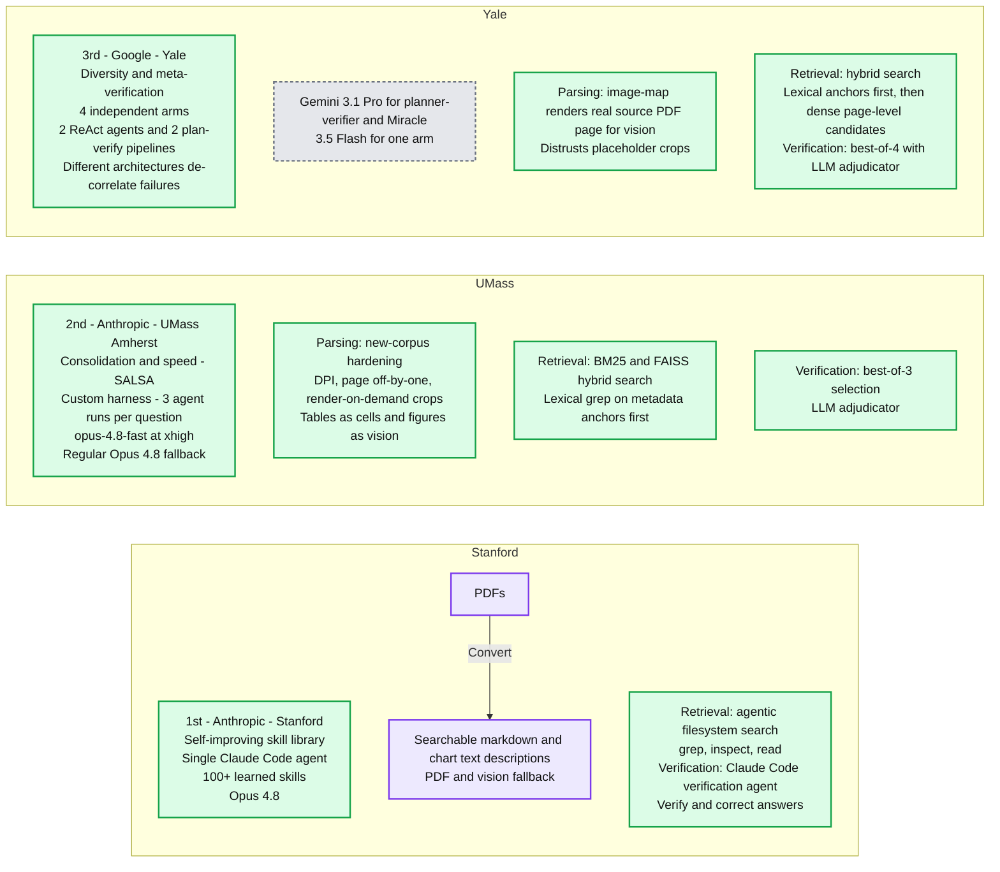
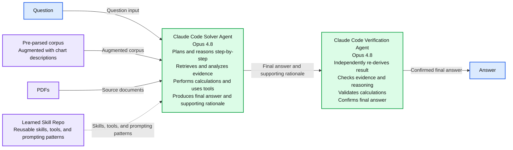
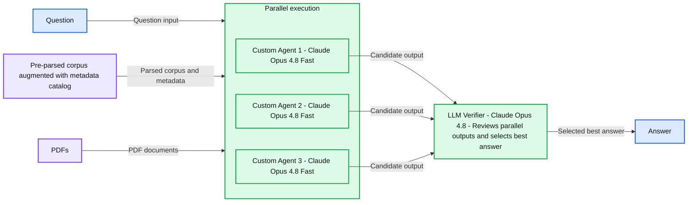

# Evaluating AI Agents Live at the Grounded Reasoning Cup

*How top academic teams built AI agents that generalized to a new enterprise document corpus under live competition conditions.*

- Source: https://www.databricks.com/blog/evaluating-ai-agents-live-grounded-reasoning-cup
- Published: 2026-08-18
- Authors: Databricks AI Research Team
- Categories: platform, product, engineering, data-science-machine-learning, databricks-ai, industries, tech, data-strategy, industry-insights, company, events
- Images: 5 total, 5 extracted as architecture

**Key takeaways**

- The Grounded Reasoning Cup challenged 11 academic teams to apply agents developed on OfficeQA Pro to OfficeQA Pro V2, a newly released benchmark built from approximately 120,000 pages of U.S. Treasury documents.
- Results showed that generalization cannot be assumed. Approaches developed on a familiar benchmark did not always transfer reliably to a new corpus, and out-of-the-box frontier agents averaged less than 30% accuracy.
- Stanford’s winning team achieved 63.3% accuracy through an end-to-end agent optimization strategy that combined a library of reusable skills, targeted document-representation fallbacks, and adaptive verification.

This year, Databricks hosted the inaugural **Grounded Reasoning Cup, a first-of-its-kind live AI competition** to evaluate AI agents’ ability to reason over complex, enterprise-style document collections. By testing agents on a newly released corpus under live competition conditions, the Grounded Reasoning Cup was designed to help answer one of the hardest questions in AI evaluation: how well do performance improvements on a benchmark generalize to similar, real-world tasks?

The competition brought together 11 top academic teams from across the U.S. and Canada, paired with resources and mentorship from frontier labs including OpenAI, Anthropic, and Google DeepMind. Over the course of two months, teams developed and optimized their agents on [OfficeQA](https://www.databricks.com/blog/introducing-officeqa-benchmark-end-to-end-grounded-reasoning), our flagship grounded-reasoning benchmark designed to reflect economically valuable enterprise workflows. On competition day, they were challenged to apply those systems in real time to a newly released grounded-reasoning benchmark, [OfficeQA Pro V2](https://www.databricks.com/blog/introducing-officeqa-pro-v2-new-benchmark-enterprise-grounded-reasoning), designed to test whether their improvements generalized.

Stanford won with a system that achieved 63.3% accuracy, beating out the average team by approximately +22 points, and the average frontier agent offline baseline by approximately +35 points. The top teams demonstrated substantial gains through document preprocessing, targeted retrieval, parallel agents, structured tool use, and verification. At the same time, 18.8% of questions went unsolved by every team, underscoring how much headroom remains in enterprise grounded reasoning.

*Performance of baseline offline AI agents (agents powered by frontier models available at the time of the competition), along with Grounded Reasoning Cup teams. The top 3 teams: Yale, UMass, and Stanford, were able to outperform both baselines and the average of remaining teams by ~20+ points. One caveat is that the offline setting that baselines were run in is not directly comparable with the competition setting teams were tasked with. In our offline agent evaluations, a frozen agent configuration is run once across the full test set, with no round structure, no pauses, and no chance to react to intermediate failures.*

**Summary:** Agent correctness on OfficeQA Pro V2 ranges from 28.5% for the average frontier baseline agent to 63.3% for Stanford.

**Components:**
- Avg. frontier baseline agent: Gemini 3.1 Pro, Claude Opus 4.8, GPT-5.5.
- Avg. remaining team performance: technologies unspecified.
- Yale: technologies unspecified.
- UMass: technologies unspecified.
- Stanford: technologies unspecified.

**Flows:**
- none. No arrows are visible.

**Numbers:**
- OfficeQA Pro V2.
- Average frontier baseline agent: 28.5%.
- Average remaining team performance: 34.4%.
- Yale: 54.4%.
- UMass: 58.9%.
- Stanford: 63.3%.
- Correctness axis: 0%, 10%, 20%, 30%, 40%, 50%, 60%, 70%, 80%.
- Model versions: Gemini 3.1 Pro, Claude Opus 4.8, GPT-5.5.

source image: https://www.databricks.com/sites/default/files/inline-images/2026-08-Blog-OfficeQA-Pro-V2-Evaluating-AI-Agents-Live-at-the-Grounded-Reasoning-Cup-Inline-960x642-2x.png

Performance of baseline offline AI agents (agents powered by frontier models available at the time of the competition), along with Grounded Reasoning Cup teams. The top 3 teams: Yale, UMass, and Stanford, were able to outperform both baselines and the average of remaining teams by ~20+ points. One caveat is that the offline setting that baselines were run in is not directly comparable with the competition setting teams were tasked with. In our offline agent evaluations, a frozen agent configuration is run once across the full test set, with no round structure, no pauses, and no chance to react to intermediate failures.

In this blog post, we recap the competition and discuss agent optimization strategies and insights from the Grounded Reasoning Cup’s winning teams: Stanford, University of Massachusetts Amherst, and Yale.

In general, we find the following:

- **Generalization requires representative, held-out evaluations.** Techniques developed on OfficeQA did not always transfer reliably to our new benchmark. This stresses the importance of utilizing held out test sets like OfficeQA Pro V2 to ensure solutions generalize to new examples.
- **Agent performance depends on the full system, not only the model.** The average gap between the top scoring and lowest scoring teams using the same model was 30.4 points. Parsing, retrieval, tool use, verification, parallelism, and operational infrastructure all made the difference in whether agents could successfully complete end-to-end grounded reasoning tasks.
- **Enterprise grounded reasoning remains far from solved.** Even winning teams struggled with many of the benchmark’s retrieval, parsing, and analytical demands, leaving substantial room for continued research and improvement. We encourage practitioners to use the publicly available OfficeQA benchmark suite to continue advancing this work.

## The Competition Setup

The goal of the Grounded Reasoning Cup was to bring together top academic teams to develop generalizable approaches to grounded reasoning – a common task in enterprise settings that involves answering complex questions using evidence from large, often proprietary, document collections.

Teams of 2-4 people representing their academic institution were paired with an industry partner from OpenAI, Anthropic, or Google DeepMind, who provided access to their models and mentorship throughout the development period. Teams had approximately two months to build an agent using any approaches they saw fit, with the one constraint that they must use their partner lab’s model family exclusively to power their agent. During this period, they used the OfficeQA benchmark to evaluate new techniques they believed would generalize to similar grounded reasoning tasks.

On the day of the competition, teams were then tasked with applying their agents in real time on a new, freshly released benchmark. The competition was governed by the following rules:

- **Benchmark release:** The new corpus (the U.S. Treasury’s Accounts of Receipts and Expenditures) was released just 36 hours before the competition. This gave teams time to process and index the data while limiting the opportunity for methods to overfit to the new benchmark.
- **Design Constraints:** Teams could use any agent framework, corpus version(s), retrieval strategy, tool-use setup, or human-in-the-loop workflow, so long as they used models from their assigned industry lab partner.
- **Format:** The competition consisted of six 15-minute rounds with 15 questions per round. Rounds became progressively harder over the course of the event.
- **Scoring:** Teams received 1 point for each correct answer. To incentivize low latency, they were also awarded a 0.25-point speed bonus if they were the first to answer a given question correctly. Points were worth 2x points in the final round, which consisted of the most challenging questions. Each team was also allowed 3 resubmissions throughout the competition, which they could choose to apply to correct a previous answer.

## Team Performance & Learnings

The competition made one thing clear: grounded reasoning over enterprise-style document corpora has improved since we released the OfficeQA benchmark 7 months ago, but it is still far from solved. The average team score was ~41%, while the top three teams exceeded 50% accuracy with the Stanford team winning the competition with 63.3% accuracy. These results point towards impressive work from top teams, as well as plenty of remaining headroom to explore.

### Winning Team Strategies

While each took a unique approach, several patterns emerged across the agents built by the top three teams. Strong systems tended to combine careful document preprocessing, targeted retrieval, structured tool use, and answer verification steps. In many cases, performance depended less on a single model call and more on the surrounding system: how documents were parsed, how evidence was retrieved, how intermediate calculations were performed, and how answers were verified before submission. While these were qualities the most performant systems generally had in common, they also each employed distinct and creative strategies, as described below.

*High level summary of winning team strategies.*

**Summary:** Stanford, UMass Amherst, and Yale use different agent harnesses, document parsing, retrieval, and verification strategies for grounded reasoning.

**Components:**
- Stanford, 1st place, Anthropic: single Claude Code agent with a self-improving skill library and a learned playbook of 100+ skills.
- Stanford model choice: Opus 4.8.
- Stanford parsing: PDFs converted to searchable markdown and chart text descriptions, with PDF/vision fallback.
- Stanford retrieval: agentic filesystem search using grep, inspect, and read.
- Stanford verification: Claude Code verification agent checks and corrects answers.
- UMass Amherst, 2nd place, Anthropic: custom agent harness running 3 individual agents per question; consolidation and speed strategy named SALSA.
- UMass Amherst differentiator: opus-4.8-fast prioritizes speed, with best-of-3 selection maintaining quality.
- UMass Amherst model choice: opus-4.8-fast at xhigh, with regular Opus 4.8 fallback.
- UMass Amherst parsing: new-corpus parse hardening covering DPI, page off-by-one, and render-on-demand crops; tables as cells and figures as vision.
- UMass Amherst retrieval: hybrid BM25 and FAISS search, leading with lexical grep on metadata anchors.
- UMass Amherst verification: best-of-3 selection using an LLM adjudicator.
- Yale, 3rd place, Google: diversity and meta-verification through 4 independent arms, comprising 2 ReAct agents and 2 structured plan-verify pipelines.
- Yale differentiator: multiple solve paths with different architectures for de-correlated failure modes.
- Yale model choice: Gemini 3.1 Pro for planner-verifier and Miracle, plus 3.5 Flash for one arm.
- Yale parsing: image-map renders the real source PDF page for vision and distrusts placeholder crops.
- Yale retrieval: hybrid search promoting lexical anchors first, then dense page-level candidates.
- Yale verification: best-of-4 selection using an LLM adjudicator.

**Flows:**
- PDFs -> searchable markdown + chart text descriptions: document conversion in Stanford’s parsing cell. No connections between team components are shown.

**Numbers:** 1st; 2nd; 3rd; 100+ skills; 3 individual agent runs per question; 4 independent arms; 2 ReAct agents; 2 structured plan-verify pipelines; best-of-3 selection; best-of-4 selection; Opus 4.8; opus-4.8-fast; Gemini 3.1 Pro; 3.5 Flash; one arm; page off-by-one; BM25.

source image: https://www.databricks.com/sites/default/files/inline-images/High-level-summary-of-winning-team-strategies.png

High level summary of winning team strategies.

### 1st Place: Stanford University

**Summary:** A Claude Code solver agent uses questions, a pre-parsed corpus, PDFs, and reusable learned skills to produce a result that a Claude Code verification agent checks before delivering an answer.

**Components:**
- Question: input to the solver; technology unspecified.
- Pre-parsed corpus: source material augmented with chart descriptions; technology unspecified.
- PDFs: source documents in PDF format.
- Learned Skill Repo: reusable skills, tools, and prompting patterns; storage technology unspecified.
- Claude Code Solver Agent: Opus 4.8; plans and reasons step-by-step, retrieves and analyzes evidence, performs calculations or uses tools, and produces a final answer with supporting rationale.
- Claude Code Verification Agent: Opus 4.8; independently re-derives the result, checks evidence and reasoning, validates calculations, and confirms the final answer.
- Answer: verified output.

**Flows:**
- Question -> Claude Code Solver Agent: question input.
- Pre-parsed corpus -> Claude Code Solver Agent: corpus augmented with chart descriptions.
- PDFs -> Claude Code Solver Agent: source documents.
- Learned Skill Repo -> Claude Code Solver Agent: reusable skills, tools, and prompting patterns through a dashed arrow.
- Claude Code Solver Agent -> Claude Code Verification Agent: final answer and supporting rationale for verification.
- Claude Code Verification Agent -> Answer: confirmed final answer.

**Numbers:** Opus 4.8 appears twice, once for each agent.

source image: https://www.databricks.com/sites/default/files/inline-images/2026-08-Blog-OfficeQA-Pro-V2-Evaluating-AI-Agents-Live-at-the-Grounded-Reasoning-Cup-Inline-960x546-2x.png

The Stanford team’s winning approach came from turning common grounded reasoning failure modes into reusable operating procedures for their Claude Opus 4.8 Claude Code agent to learn from and apply on the competition questions. During their development on the public OfficeQA benchmark, including experiments ablating with Opus 4.8 and even Fable 5 (while available), the team repeatedly traced wrong answers back to the agent’s exact misstep, and then turned those patterns into skills for table localization, answer formatting, clarifications on common financial wordings, etc. The team also integrated skills that would decide when to search across parsed corpus text and markdown-style document representations and when to fall back to the source PDFs if the parsed text lacked full context. By competition day, Stanford had prepared their agent with a playbook of ~100+ skills. They led all teams in accuracy in the 57 correct answers of 88 they attempted.

Despite this in-depth preparation, Stanford still had to adapt its strategy during the competition. In the first three rounds, the team used another Claude Code agent as a verifier to re-extract intermediate values, check common failure modes such as tracing revised values through data lineage and handling unit scaling, and patch calculations when it identified discrepancies. But after earning only two speed bonuses in those rounds, Stanford removed the extra verification pass for the final three. The change significantly reduced latency, helping the team earn speed bonuses on 14 questions and fuel its comeback. The verifier nevertheless proved decisive in the final round, when Stanford switched it back on to correct an answer through a final resubmission, ultimately securing their win.

### 2nd Place: UMass Amherst

**Summary:** Three custom agents run in parallel using Claude Opus 4.8 Fast, then a Claude Opus 4.8 verifier reviews their outputs and selects the best answer.

**Components:**
- Question: input question.
- Pre-parsed corpus: augmented with a metadata catalog.
- PDFs: source documents.
- Parallel execution: group containing three custom agents.
- Custom Agent 1: Claude Opus 4.8 Fast.
- Custom Agent 2: Claude Opus 4.8 Fast.
- Custom Agent 3: Claude Opus 4.8 Fast.
- LLM Verifier: Claude Opus 4.8; reviews parallel outputs and selects the best answer.
- Answer: selected final output.

**Flows:**
- Question -> Parallel execution: question input.
- Pre-parsed corpus -> Parallel execution: parsed corpus and metadata catalog.
- PDFs -> Parallel execution: PDF documents.
- Custom Agent 1 -> LLM Verifier: candidate output.
- Custom Agent 2 -> LLM Verifier: candidate output.
- Custom Agent 3 -> LLM Verifier: candidate output.
- LLM Verifier -> Answer: selected best answer.

**Numbers:** Agent identifiers 1, 2, and 3; model version 4.8 appears four times, once for each agent and once for the verifier.

source image: https://www.databricks.com/sites/default/files/inline-images/2026-08-Blog-OfficeQA-Pro-V2-Evaluating-AI-Agents-Live-at-the-Grounded-Reasoning-Cup-Inline-960x475-2x.png

The UMass team made a bet on speed. They used Claude Opus 4.8 Fast as their primary model and preprocessed the corpus to create a metadata catalog that enabled rapid search and filtering over parsed documents. To improve answer quality while preserving low latency, they ran three agents in parallel on each question, followed by a final Opus verification call to select the best answer.

This strategy gave UMass the fastest average submission time for correct answers: four minutes, less than half the team average of eight minutes and 30 seconds. As a result, they earned 36 speed bonuses, worth 0.25 points each, for being the first team to answer correctly, more than twice Stanford’s second-place total of 16. These bonuses helped them build a 10.25-point lead over Stanford by halftime and preserve a 3.75-point advantage entering the final round. UMass held that lead until the final 56 seconds of the competition, when Stanford’s slower, more accurate agent proved decisive on the most challenging questions and pulled ahead to win by 1.75 points.

UMass’s approach demonstrates how faster models, document preprocessing, and test-time scaling can work together to achieve very low latency without sacrificing too much accuracy.

### 3rd Place: Yale University

**Summary:** Yale’s approach runs four agent arms in parallel and uses an LLM verifier to select a final answer, falling back to majority vote if needed.

**Components:**

- Question: input question.
- Pre-parsed corpus: prepared source material.
- PDFs: source documents.
- Parallel execution: contains four independent agent arms.
- ReAct Agent 1: Gemini 3.1 Pro.
- ReAct Agent 2: Gemini 3.5 Flash.
- Plan-Verify Agent 1: Planner → Verifier using Gemini 3.1 Pro.
- Plan-Verify Agent 2: Planner → Verifier using Gemini 3.1 Pro.
- LLM Verifier: Gemini 3.1 Pro. Reviews answers and reasoning from all four arms, selects an answer proposed by an arm, and falls back to majority vote if needed.
- Answer: selected final output.

**Flows:**

- Question -> Parallel execution: question input.
- Pre-parsed corpus -> Parallel execution: prepared corpus input.
- PDFs -> Parallel execution: document input.
- Parallel execution -> LLM Verifier: answers and reasoning, shown by the upper arrow.
- Parallel execution -> LLM Verifier: answers and reasoning, shown by the middle arrow.
- Parallel execution -> LLM Verifier: answers and reasoning, shown by the lower arrow.
- LLM Verifier -> Answer: selected final answer.

**Numbers:**

- Agent identifiers: 1 and 2 for both ReAct and Plan-Verify.
- Gemini 3.1 Pro: appears four times.
- Gemini 3.5 Flash: appears once.
- “Four arms”: stated in the verifier description.

```mermaid
%% Yale parallel agent arms and final answer verification
flowchart LR
    Q[Question]
    C[Pre-parsed corpus]
    P[PDFs]

    subgraph PAR[Parallel execution]
        R1[ReAct Agent 1<br/>Gemini 3.1 Pro]
        R2[ReAct Agent 2<br/>Gemini 3.5 Flash]
        V1[Plan-Verify Agent 1<br/>Planner → Verifier<br/>Gemini 3.1 Pro]
        V2[Plan-Verify Agent 2<br/>Planner → Verifier<br/>Gemini 3.1 Pro]
    end

    L[LLM Verifier<br/>Gemini 3.1 Pro<br/>Reviews answers and reasoning from all four arms<br/>Selects an answer proposed by one arm<br/>Falls back to majority vote if needed]
    A[Answer]

    Q -->|Question input| PAR
    C -->|Prepared corpus| PAR
    P -->|Source documents| PAR
    PAR -->|Answers and reasoning - upper arrow| L
    PAR -->|Answers and reasoning - middle arrow| L
    PAR -->|Answers and reasoning - lower arrow| L
    L -->|Selected final answer| A

    classDef client fill:#dbeafe,stroke:#2563eb,stroke-width:2px,color:#111
    classDef service fill:#dcfce7,stroke:#16a34a,stroke-width:2px,color:#111
    classDef store fill:#ede9fe,stroke:#7c3aed,stroke-width:2px,color:#111
    classDef cache fill:#fef3c7,stroke:#d97706,stroke-width:2px,color:#111
    classDef queue fill:#cffafe,stroke:#0891b2,stroke-width:2px,color:#111
    classDef critical fill:#fee2e2,stroke:#dc2626,stroke-width:4px,color:#111
    classDef external fill:#e5e7eb,stroke:#6b7280,stroke-width:2px,color:#111,stroke-dasharray:4 3
    classDef decision fill:#fce7f3,stroke:#db2777,stroke-width:2px,color:#111
    class Q,A client
    class C,P store
    class PAR,R1,R2,V1,V2 service
    class L decision
```

source image: https://www.databricks.com/sites/default/files/inline-images/2026-08-Blog-OfficeQA-Pro-V2-Evaluating-AI-Agents-Live-at-the-Grounded-Reasoning-Cup-Inline-960x475-1-2x.png

The Yale team built a multi-arm verification harness designed to remain robust when any individual agent failed. The system ran four independent arms in parallel, spanning two agentic strategies. Two arms used autonomous ReAct agents: one powered by Gemini 3.1 Pro and the other by Gemini 3.5 Flash. The remaining arms used a more structured planner-verifier pipeline, with Gemini 3.1 Pro powering all LLM calls. In this pipeline, the planner inspected and contextualized the source documents, assembling a scratchpad containing the evidence needed to answer the question. The verifier then checked the cited sources and performed the final calculations.

A Gemini 3.1 Pro meta-verifier reviewed the answers and reasoning produced by all four arms and selected the final response. To reduce the risk of introducing a new unsupported answer, the meta-verifier could only select an answer proposed by one of the existing arms. When it could not do so, the system fell back to a majority vote. By combining distinct agent architectures with independent, partially decorrelated failure modes, Yale emphasized consistent, grounded verification. The approach earned the team third place, with 49 of 90 questions answered correctly and a top-three correctness ranking in four of the competition’s six rounds.

### Summary of Winning Team Strategies

One of the core takeaways from these winning approaches is that applying an agent successfully to end-to-end grounded reasoning tasks requires holistic systems thinking, rather than model choice alone. Across the winning approaches, a few key design levers stood out as especially important:

- **Parsing quality:** Top teams used pre-parsed documents and often augmented these parsed representations to include additional metadata (e.g. descriptions of charts or page level metadata) and preserved paths back to source PDFs to fall back to when parsed text was incomplete. In our own studies on OfficeQA Pro V2, we find that pre-parsing documents with `ai_parse` contributes significantly to Genie’s performance improvement of 24.0 pt over baseline frontier agents.
- **Retrieval quality:** Strong systems didn't rely on generic top-k chunk search. They instead used some form of lexical retrieval (e.g. grep), often paired with dense retrieval for a hybrid approach.
- **Tool use:** Successful agents generally delegated search, document inspection, calculations, comparison, and submission to specialized tools.
- **Verification strategies:** Several teams built in some form of explicit verification check via a verification agent or LLM call to boost answer quality.
- **Robust harness:** Under live deadline pressure, operational details like preprocessing, retry logic, parallelism, and submission scaffolding were necessary to ensure correct answers actually made it through in time.

These factors determined whether the model could reliably find the right evidence, perform the right calculation, and submit the right answer under deadline pressure.

## Impact and Next Steps

In summary, the results of the Grounded Reasoning Cup demonstrate a number of broader lessons:

- **Generalization must be tested, not assumed.** Improvements on OfficeQA did not always transfer to OfficeQA Pro V2, and frontier agents still answered fewer than half of its questions correctly on average. Progress on a familiar benchmark does not necessarily translate to a new corpus or task distribution.
- **Representative, held-out evaluations are critical.** They should evaluate the forms of generalization that matter, ideally keeping core qualities of the task fixed (i.e. grounded reasoning over documents), while varying elements of the task that can change, like the corpus. In our post describing OfficeQA Pro V2, we discuss how we leverage synthetic data, combined with our knowledge of customer workflows, to scale these representative evaluations quickly.
- **Agent performance depends on the full system.** Performance depends not only on the model, but also on parsing, retrieval, tool use, verification, and the quality of the underlying data and infrastructure. Winning teams optimized these components holistically. Similarly, [Genie significantly outperforms baseline frontier agents](https://www.databricks.com/blog/introducing-officeqa-pro-v2-new-benchmark-enterprise-grounded-reasoning) when using tools like `ai_parse` to pre-parse documents, and additional harness optimization strategies.

We are grateful to all of the teams and industry sponsors, including OpenAI, Google DeepMind, and Anthropic, who participated in Databricks’s inaugural Grounded Reasoning Cup and helped push the field forward. We also thank USAFacts for their continued partnership, from helping us identify a new corpus and create relevant questions for OfficeQA Pro V2, to partnering with us on the competition itself. Finally, we thank the U.S. Treasury for helping identify the U.S. Accounts of Receipts and Expenditures as the foundation for the competition benchmark, and for releasing the dataset as a cohesive collection for the first time.

Authors: Krista Opsahl-Ong, Arnav Singhvi, Josh Joseph, Jasmine Collins, Ivan Zhou, Brooke Wenig, Denny Lee, Michael Bendersky, Erich Elsen, Xing Chen, Matei Zaharia
