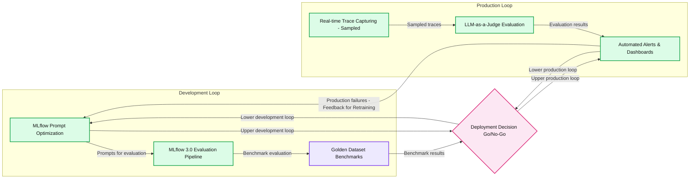
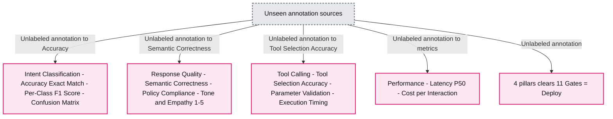
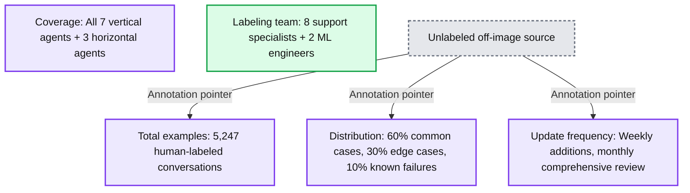
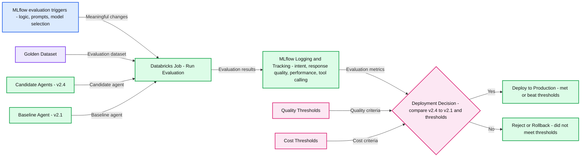
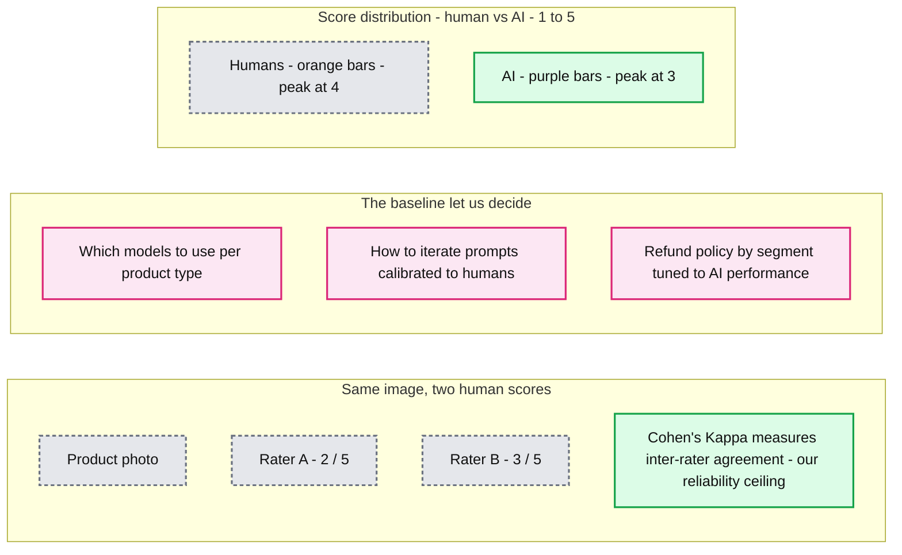

# Evaluation-First AI Agents: How Zepto Scales Customer Support on Databricks and MLflow

*How Zepto uses Databricks and MLflow to build evaluation-first AI agents that manage 80%+ of support tickets, cut support costs by 65%, and deliver payback in under one month*

- Source: https://www.databricks.com/blog/evaluation-first-ai-agents-how-zepto-scales-customer-support-databricks-and-mlflow
- Published: 2026-09-09
- Authors: Gireesh Sreedhar KP, Deepak Dhankani, Eash Sharma
- Categories: platform, product, engineering, data-science-machine-learning, ai-engineering, industries, retail-and-consumer-goods, data-strategy, best-practices, company, customers
- Images: 10 total, 7 extracted as architecture

**Key takeaways**

- How Zepto builds evaluation-first AI agents on Databricks and MLflow, using traces, golden datasets, and LLM-as-judge evaluations as core infrastructure for LLM systems.
- How a dual-loop architecture—development and production connected by a strict quality gate—provides a concrete pattern to engineer reliability, control cost, and manage risk for large-scale agents.
- How this framework achieves 65% lower support costs, and sub-one-month payback, offering AI builders a reusable blueprint for high-impact, production-grade agent design.

## Zepto's Push for Reliable, Real-Time Customer Support

Zepto is one of India's fastest-growing quick-commerce platforms, with more than thousands of products, a presence in over 60 cities, and delivery windows measured in minutes. In a business where speed is the product, customer support has to move just as fast.

To meet that expectation, Zepto runs customer support on a multi-agent AI system that processes over a hundred thousand tickets a day. Early on, the team could build and ship agents quickly. The harder question was how to keep those agents reliable as volume grew, categories expanded, and customer behavior kept changing. Zepto partnered with Databricks to answer that question, not by shipping more agents, but by **making evaluation the primary way agents get built, tested, and operated**.

This blog walks through that journey: the system architecture, the evaluation framework on Databricks and MLflow, the production stories where it earned its keep, and the results and lessons that came out of it.

## Why "Just Ship the Agent" Breaks at Scale

In a high-velocity business, "just ship the agent" works right up until it breaks at scale. At more than 100,000 AI-agent tickets a day, even a 1% error rate creates thousands of bad outcomes and real revenue leakage every single day.

The pressure arrived in uneven waves. Weather events, Diwali, and the start of summer drove sharp spikes in ticket volume. Expansion from groceries into apparel, electronics, and beauty introduced new refund, exchange, and return journeys. Meanwhile, a more diverse, multilingual customer base brought a wider range of support requests—and new failure modes surfaced every few weeks.

The deeper problem is the **assurance gap**. Agentic systems operate as multi-step workflows—classifying intent, retrieving knowledge, analyzing inputs, reasoning through decisions, calling transactional tools, and generating responses—so failures can emerge anywhere along the way, not only in the final answer.

This assurance gap translated into concrete problems:

- Failures were invisible until customers complained
- Fixes were slow
- The final answer hid internal errors
- Lacked a principled way to balance cost, performance, and quality for agent
- Agent design did not capture all critical stakeholder perspectives
- Reliability was hard to assure in the face of rapid agent evolution

The objective became clear: **engineer an evaluation framework on Databricks and MLflow so it functions as core AI infrastructure on which Agents are built and operated**.

## Why Evaluation Framework and its Outcomes

A strong evaluation framework directly affects five axes of production readiness:

- **Reliability**: system-level guarantees that agents behave correctly across steps, not just “sound right”
- **Velocity**: faster, safer iteration on prompts, policies, and models because changes are regression-tested automatically
- **Cost vs Quality vs Performance control**: ability to choose optimal models, Prompt strategies or hybrid routing strategies to hit sweet spot on constraints, backed by hard evaluation data
- **Governance**: auditable traces, versioned evaluation baselines, and well-defined thresholds for deployment and rollback. Moving decisions from gut-feel (“this version feels better”) to evidence (“this version beats the baseline on agreed metrics”)
- **Stakeholder collaboration**: capturing success and reliability criteria from stakeholders perspective, and making trade-offs explicit and measurable for everyone

With Databricks + MLflow as the evaluation backbone and an evaluation-first agent architecture, Zepto achieved

Cost & efficiency

- **80%** plus tickets fully managed by AI agents with human oversight
- **65% reduction in support cost or support tickets**
- **Payback period of less than one month**

Quality & reputation

- **20% improvement in customer satisfaction (CSAT)**
- **8% improvement in accuracy**

Performance & operations

- **3x faster development cycles**
- **4x faster time to resolution**

## Building the Framework: A Dual Loop for Confidence and Control

At the core of this approach is the dual-loop model: a development loop and a production loop, connected by a quality gate. This section outlines how those loops work together.

**Summary:** Development evaluation and production monitoring connect through a deployment decision gate, with production failures feeding back into development.

**Components:**

- Development Loop: MLflow-based development and evaluation.
- MLflow Prompt Optimization: MLflow prompt refinement.
- MLflow 3.0 Evaluation Pipeline: MLflow agent evaluation.
- Golden Dataset Benchmarks: benchmark datasets; storage technology unspecified.
- Deployment Decision - Go/No-Go: quality gate with green and red indicators.
- Production Loop: live tracing, evaluation, and monitoring; platform unspecified.
- Real-time Trace Capturing - Sampled: sampled production traces; technology unspecified.
- LLM-as-a-Judge Evaluation: evaluation using an unspecified LLM.
- Automated Alerts & Dashboards: monitoring and alerting; technology unspecified.
- Feedback for Retraining: production failures returned to development.

**Flows:**

- MLflow Prompt Optimization -> MLflow 3.0 Evaluation Pipeline: optimized prompts for evaluation.
- MLflow 3.0 Evaluation Pipeline -> Golden Dataset Benchmarks: evaluation against benchmarks.
- Golden Dataset Benchmarks -> Deployment Decision: benchmark results inform go/no-go.
- MLflow Prompt Optimization -> Deployment Decision: development iteration follows the upper loop.
- Deployment Decision -> MLflow Prompt Optimization: development iteration returns along the lower loop.
- Deployment Decision -> Automated Alerts & Dashboards: production progression follows the upper loop through the trace-capture side.
- Real-time Trace Capturing -> LLM-as-a-Judge Evaluation: sampled traces for evaluation.
- LLM-as-a-Judge Evaluation -> Automated Alerts & Dashboards: evaluation results for monitoring.
- Automated Alerts & Dashboards -> Deployment Decision: production feedback returns along the lower loop.
- Production Loop -> Development Loop: failures feed back for retraining and enrich the next iteration.

**Numbers:** 3.0 - MLflow version.

source image: https://www.databricks.com/sites/default/files/inline-images/evaluation-first-ai-agents-zepto-scales-customer-support-databricks-mLflow-blog-img-1.png

- **Development loop**: where you design, iterate, and evaluate agent versions to build with confidence before shipping
- **Production loop**: where you monitor live behavior, and detect failures to operate agents with confidence
- **Feedback loop**: where production failures fed back to development to enrich next iteration
- **Quality gate**: controlling movement between loops, it decides which versions are allowed into production and which are pushed back to development for better iterations

Together, these two loops ensure that agents are built and operated with control. Any failure is automatically captured, fed back, and corrected. As a result, agents are built with confidence, run with control, and continuously improve to handle production failures better over time. **The dual loop lies at the core of our framework**.

### Phase 0: Enable Tracing: Transparent Agents by design

Every agent invocation emits a rich execution trace that captures prompts, completions, retrieved documents, tool calls, latencies, and decision paths, so the whole workflow is observable at granular level rather than an input and final output.

We enabled this with a hybrid approach using MLflow. A single line, `mlflow.<library>.autolog()`, turns on [automatic tracing](https://docs.databricks.com/aws/en/mlflow3/genai/tracing/app-instrumentation/automatic), and the `@mlflow.trace `decorator adds [custom spans](https://docs.databricks.com/aws/en/mlflow3/genai/tracing/span-concepts)wherever we need more detail. Traces are emitted in real-time as OpenTelemetry spans with unique IDs so they stay composable, and MLflow's integration with Unity Catalog centralizes logging into Delta tables.

### Phase 1: Set Evaluation Dimensions: Pillars and Gates

With tracing enabled, the next step is to capture, from each stakeholder’s perspective, “**What does success for this agent mean to you?**”. We formalize this as evaluation pillars, each with specific gates.

**Summary:** Four evaluation pillars define 11 gates that must be cleared before deployment.

**Components:**
- Intent Classification: Accuracy (Exact Match), Per-Class F1 Score, Confusion Matrix. No technology specified.
- Response Quality: Semantic Correctness, Policy Compliance, Tone & Empathy (1-5). No technology specified.
- Tool Calling: Tool Selection Accuracy, Parameter Validation, Execution Timing. No technology specified.
- Performance: Latency P50, Cost per Interaction. No technology specified.
- Deployment condition: “4 pillars clears 11 Gates = Deploy”. No technology specified.

**Flows:**
- Unseen source -> Accuracy (Exact Match): unlabeled annotation arrow.
- Unseen source -> Semantic Correctness: unlabeled annotation arrow.
- Unseen source -> Tool Selection Accuracy: unlabeled annotation arrow.
- Unseen source -> Performance metrics: unlabeled annotation arrow.
- Unseen source -> Deployment condition: unlabeled annotation arrow.

**Numbers:** 4 pillars; 11 Gates; F1 Score; Tone & Empathy scale 1-5; Latency P50.

source image: https://www.databricks.com/sites/default/files/inline-images/evaluation-first-ai-agents-zepto-scales-customer-support-databricks-mLflow-blog-img-2.png

This turns a multi-stakeholder debate into a shared, measurable contract. Agents are evaluated along the dimensions that actually matter for each stakeholder. **Typical pillars include customer experience, operational efficiency, risk and compliance, and financial impact; each pillar has clear numeric thresholds that must be met before deployment**.

### Phase 2: The Golden Dataset: Cornerstone of Reliability

The [golden dataset](https://docs.databricks.com/aws/en/mlflow3/genai/eval-monitor/build-eval-dataset) is the single source of truth for evaluating agent behavior in the development loop. It should:

- Cover normal, edge, and failure cases the agent must handle
- Include expectations from different stakeholders captured as examples
- Be richly annotated with metadata (scenario type, business line, risk level, etc.)

Every stakeholder comes together to shape the dataset, for example the security team contributing examples on adversarial patterns such as prompt injection, identity attacks, data-exfiltration attempts, this ensures that reliability is measured against all real-world scenarios as well as ordinary use.

**Summary:** The golden dataset contains 5,247 human-labeled conversations, with defined scenario distribution, agent coverage, maintenance cadence, and labeling staff.

**Components:**
- Total examples: Human-labeled conversation dataset; technology unspecified.
- Distribution: Common cases, edge cases, and known failures; technology unspecified.
- Coverage: Vertical and horizontal agents; technology unspecified.
- Update frequency: Dataset additions and comprehensive reviews; technology unspecified.
- Labeling team: Support specialists and ML engineers; technology unspecified.

**Flows:**
- Unlabeled off-image source -> Total examples: Annotation pointer; no data flow specified.
- Unlabeled off-image source -> Distribution: Annotation pointer; no data flow specified.
- Unlabeled off-image source -> Update frequency: Annotation pointer; no data flow specified.

**Numbers:**
- 5,247 human-labeled conversations.
- 60% common cases, 30% edge cases, 10% known failures.
- All 7 vertical agents + 3 horizontal agents.
- Weekly additions, monthly comprehensive review.
- 8 support specialists + 2 ML engineers.

source image: https://www.databricks.com/sites/default/files/inline-images/evaluation-first-ai-agents-zepto-scales-customer-support-databricks-mLflow-blog-img-3.png

Datasets are a living asset, and their quality compounds over time. The gap between development and production accuracy is itself a dataset quality signal. Zepto invested steadily in MLflow evaluation datasets over six months, moving from 500 examples and an 8-point dev–prod accuracy gap, to 2,000 examples and a 2-point gap, to 5,247 examples and a 0.4-point gap. Every hour spent on dataset quality saves roughly ten hours of production debugging, so the golden dataset becomes a 10x multiplier: every production failure adds failure traces to the golden dataset and makes the system more robust for all future versions.

### Phase 3: Automate Prompt Engineering: Auto generate and auto optimize

Rather than hand-writing prompts, we made prompt engineering a data-driven, automated process. Prompt design is the critical phase where engineers spend most of their time, and the **quality of prompts has a disproportionate impact on the quality and performance of agent outputs**.

Using [MLflow prompt optimization](https://docs.databricks.com/aws/en/mlflow3/genai/prompt-version-mgmt/prompt-registry/automatically-optimize-prompts), we register an initial prompt, generate and optimize variants against the same scorers that gate deployment, run A/B evaluations automatically, and deploy the best result. The optimizer reflects with a strong model and production scores candidates with a cheaper one so the search itself stays cost-aware in production. This reduced manual prompt experimentation, improved accuracy, and ensured that prompt improvements were always measured against the golden dataset before reaching production.

### Phase 4: Define Scorers and setup AI Jury

With traces flowing in the production loop, we need to score them along the dimensions that matter for agent quality (Evaluation dimensions). Think of this as an AI jury, where each scorer plays to its strengths. MLflow provides three options for creating [scorers](https://docs.databricks.com/aws/en/mlflow3/genai/eval-monitor/concepts/scorers).

- [Built-in judges](https://docs.databricks.com/aws/en/mlflow3/genai/eval-monitor/concepts/judges/) - out of the box scorers
- [Custom judges](https://docs.databricks.com/aws/en/mlflow3/genai/eval-monitor/custom-judge/) - create customized judges to meet unique needs
- [Code-based scorers](https://docs.databricks.com/aws/en/mlflow3/genai/eval-monitor/custom-scorers) - for deterministic metrics like tool latency or number of tool calls

We use LLM-based scorers only where human-like judgment is necessary and rely on simple rules where deterministic logic is enough. We calibrate the judges against human labels to reach 80–90% agreement and use multiple judges for high-stakes decisions.

**Summary:** Six evaluation scorers pair LLM judgment, deterministic checks, and hybrid evaluation with their respective models or rules.

**Components:**
- Intent Accuracy: LLM Judge using Claude Sonnet 4.5.
- Groundedness: LLM Judge using Claude Sonnet 4.5.
- Tone, Empathy & Guidelines: LLM Judge using GPT-5.
- Schema Validation: Deterministic using Pydantic validator.
- Latency Scorer & Token Count: Deterministic using Custom rule.
- Warnings: Hybrid using Claude Sonnet 4.5.

**Flows:**
- None visible.

**Numbers:** Claude Sonnet 4.5 appears three times; GPT-5 appears once. No quantitative metrics are displayed.

```mermaid
%% Six evaluation scorers and their judging technologies
flowchart TD
    A[Intent Accuracy<br/>LLM Judge<br/>Model: Claude Sonnet 4.5]
    B[Groundedness<br/>LLM Judge<br/>Model: Claude Sonnet 4.5]
    C[Tone, Empathy & Guidelines<br/>LLM Judge<br/>Model: GPT-5]
    D[Schema Validation<br/>Deterministic<br/>Model: Pydantic validator]
    E[Latency Scorer & Token Count<br/>Deterministic<br/>Model: Custom rule]
    F[Warnings<br/>Hybrid<br/>Model: Claude Sonnet 4.5]

    classDef client fill:#dbeafe,stroke:#2563eb,stroke-width:2px,color:#111
    classDef service fill:#dcfce7,stroke:#16a34a,stroke-width:2px,color:#111
    classDef store fill:#ede9fe,stroke:#7c3aed,stroke-width:2px,color:#111
    classDef cache fill:#fef3c7,stroke:#d97706,stroke-width:2px,color:#111
    classDef queue fill:#cffafe,stroke:#0891b2,stroke-width:2px,color:#111
    classDef critical fill:#fee2e2,stroke:#dc2626,stroke-width:4px,color:#111
    classDef external fill:#e5e7eb,stroke:#6b7280,stroke-width:2px,color:#111,stroke-dasharray:4 3
    classDef decision fill:#fce7f3,stroke:#db2777,stroke-width:2px,color:#111
    class A,B,C,D,E,F service
```

source image: https://www.databricks.com/sites/default/files/inline-images/evaluation-first-ai-agents-zepto-scales-customer-support-databricks-mLflow-blog-img-5.png

### Phase 5: Set up model optionality

Modal optionality is a critical component which allows the framework to switch between many proprietary and open-source models simply by changing model names in [Databricks](https://docs.databricks.com/aws/en/machine-learning/model-serving/foundation-model-overview). This means the development loop can continuously search for a better combination to find the best trade-off between cost, performance, and quality.

### Phase 6: Build auto-regression

We automate regression evaluation to create a repeatable, configurable, and scalable development loop. Any change triggers auto-regression and, when reliability is guaranteed, auto-deployment.

**Summary:** Changes to agent logic, prompts, or models trigger a Databricks evaluation job whose MLflow metrics and quality and cost thresholds determine deployment or rollback.

**Components:**
- Triggers for MLflow Evaluation: meaningful changes to orchestration logic, prompts, or model selection.
- Databricks Job: runs evaluation.
- Golden Dataset: evaluation input; storage technology unspecified.
- Agent(s): candidate agent, illustrated as v2.4; technology unspecified.
- Baseline Agent: comparison agent, illustrated as v2.1; technology unspecified.
- MLflow Logging & Tracking: records evaluation metrics across four groups:
  - Intent Classification: overall accuracy, per-class F1 score, confusion matrix statistics.
  - Response Quality: LLM-as-judge scoring for semantic correctness, policy compliance, completeness, and empathy.
  - Performance: P95/P99 latency and cost per interaction.
  - Tool Calling: tool call accuracy, tool call success rate, invalid tool calls, and average steps per interaction.
- Quality Thresholds: quality criteria for the deployment decision.
- Cost Thresholds: cost criteria for the deployment decision.
- Deployment Decision: compares v2.4 with baseline v2.1 and checks whether thresholds are met or beaten.
- Deploy to Production: outcome when thresholds are met or beaten.
- Reject / Rollback: outcome when thresholds are not met.

**Flows:**
- Triggers for MLflow Evaluation -> Databricks Job: meaningful agent changes trigger evaluation.
- Golden Dataset -> Databricks Job: evaluation dataset.
- Agent(s) -> Databricks Job: candidate agent.
- Baseline Agent -> Databricks Job: baseline agent.
- Databricks Job -> MLflow Logging & Tracking: evaluation results for logging and tracking.
- MLflow Logging & Tracking -> Deployment Decision: evaluation metrics.
- Quality Thresholds -> Deployment Decision: quality criteria.
- Cost Thresholds -> Deployment Decision: cost criteria.
- Deployment Decision -> Deploy to Production: yes, thresholds met or beaten.
- Deployment Decision -> Reject / Rollback: no, thresholds not met.

**Numbers:** v2.4 candidate version; v2.1 baseline version; both versions repeat in the deployment decision. F1 score. P95/P99 latency.

source image: https://www.databricks.com/sites/default/files/inline-images/evaluation-first-ai-agents-zepto-scales-customer-support-databricks-mLflow-blog-img-7.png

Putting the pieces together, a typical change follows this path:

1. Someone changes the agent’s logic, prompt, or model.
2. The evaluation workflow auto-triggers with three inputs: the new agent version, the golden dataset, and the current production baseline.
3. The system runs evaluations and produces metrics across all scorers and pillars.
4. The quality gate checks:
  - Does the new version meet all gates (cost, quality, performance, etc.)?
  - Does it perform at least as well as, or better than, the production baseline?
5. If yes, the new version is promoted to production; if not, it is rejected and the existing agent continues serving traffic.

### Phase 7: Build Production Loop - Setup real-time safety net

Evaluating 100% of traffic is expensive, but naive 10% uniform sampling misses most edge cases. We implemented stratified sampling where evaluation sampling rates depend on high-value customers, new features or recently changed flows, negative sentiment or high escalation risk, and image-based or fraud-prone interactions. This yields an effective 18–20% evaluation sample (~14,400 traces per day) at manageable cost, while capturing 45–60% of edge cases and detecting issues within 4–6 minutes.

The financial logic is compelling: Compared to a uniform sampling approach, the stratified methodology achieved an 86% reduction in review cost per issue identified while delivering a 9X improvement in edge-case detection, making the quality assurance process significantly more efficient and scalable.

Evaluation results are written into Delta tables and surfaced via dashboards and alert rules in Databricks. Critical alerts (checked every 5 minutes) monitor for intent accuracy drops, groundedness violations, high escalation risk, and P95 latency breaches. High/medium alerts track empathy degradation, cost spikes, tool failure rates, CSAT trends, fraud detection rate, and multimodal latency. This enables SRE-like operations for AI agents: fast detection, triage, and mitigation.

## The Composable Architecture Agent Stack

A good evaluation framework works far better when the agent architecture is designed to be observable and decomposable in the first place. Zepto's support stack is built around that idea.

A customer query, in chat or image form, first passes through an agentic orchestrator and router. The router can hand off to a human at any point. Underneath it, the system separates into two kinds of agents.

Vertical agents are specialists, each owning a single, well-defined intent family:

- **WIMO**: for order tracking and ETA questions
- **Missing:** for undelivered or partial orders
- **Expiry**: for expired packaged goods
- **Returns**: for refund status and processing
- **Quality**: for stale or rotten produce
- **Unable to Pay**: for wallet, promo, and payment failures
- General, as the fallback

Horizontal agents act as oversight layers that cut across use cases:

- **Image Deduplication**: catches reused images across claims
- **Item Matching and Image Manipulation Detection**: verify uploaded images match catalog items and have not been edited

**Summary:** Customer queries pass through horizontal oversight and intent routing to specialized vertical agents.

**Components:**

- Customer Query: accepts Chat / Image; technology unspecified.
- Horizontal Oversight: groups oversight models; technology unspecified.
- User Abuse Model: technology unspecified.
- Image Deduplication: technology unspecified.
- Catalogue Item Matching: technology unspecified.
- Manipulation Detection: technology unspecified.
- Intent Routing: Classification; technology unspecified.
- Specialized Vertical Agents: groups specialized agents; technology unspecified.
- WIMO: technology unspecified.
- Missing: technology unspecified.
- Expiry: technology unspecified.
- Return: technology unspecified.
- Quality: technology unspecified.
- Unable to Pay: technology unspecified.

**Flows:**

- Customer Query -> Horizontal Oversight: Chat / Image query.
- Horizontal Oversight -> Intent Routing: query passed for classification.
- Intent Routing -> Specialized Vertical Agents: classified query.

**Numbers:** none

```mermaid
%% Customer queries flow through horizontal oversight and intent routing to specialized vertical agents
flowchart LR
    Q[Customer Query - Chat / Image]
    subgraph H[Horizontal Oversight]
        direction TB
        U[User Abuse Model]
        I[Image Deduplication]
        C[Catalogue Item Matching]
        M[Manipulation Detection]
    end
    R[Intent Routing - Classification]
    subgraph V[Specialized Vertical Agents]
        direction TB
        W[WIMO]
        N[Missing]
        E[Expiry]
        T[Return]
        Y[Quality]
        P[Unable to Pay]
    end

    Q -->|Chat / Image query| H
    H -->|Query for classification| R
    R -->|Classified query| V

    classDef client fill:#dbeafe,stroke:#2563eb,stroke-width:2px,color:#111
    classDef service fill:#dcfce7,stroke:#16a34a,stroke-width:2px,color:#111
    classDef store fill:#ede9fe,stroke:#7c3aed,stroke-width:2px,color:#111
    classDef cache fill:#fef3c7,stroke:#d97706,stroke-width:2px,color:#111
    classDef queue fill:#cffafe,stroke:#0891b2,stroke-width:2px,color:#111
    classDef critical fill:#fee2e2,stroke:#dc2626,stroke-width:4px,color:#111
    classDef external fill:#e5e7eb,stroke:#6b7280,stroke-width:2px,color:#111,stroke-dasharray:4 3
    classDef decision fill:#fce7f3,stroke:#db2777,stroke-width:2px,color:#111
    class Q client
    class H,U,I,C,M,V,W,N,E,T,Y,P service
    class R decision
```

source image: https://www.databricks.com/sites/default/files/inline-images/evaluation-first-ai-agents-zepto-scales-customer-support-databricks-mLflow-blog-img-8.png

This separation pays off twice. Metrics can be computed per vertical agent, such as WIMO intent F1 or Expiry OCR accuracy, and horizontal agents can be evaluated on cross-cutting concerns like fraud precision, image reuse, and manipulation detection. Each piece can be measured in isolation and in combination.

## The Framework in Action

When you first launch an AI agent into production, it feels like sending a brilliant but unpredictable intern out to represent your company. You give them instructions and hope for the best, but until they are under pressure, you are essentially flying blind.

Early on, we realized that traditional software monitoring is completely useless for AI. An agent can have perfect server uptime and zero errors while repeating the exact same wrong answer to a frustrated customer. To the engineers, the dashboard looks green. To the customer, it’s a disaster.

We knew we couldn't scale our AI on hope. We needed an evaluation framework that didn't just track if the AI was talking, but actually understood what it was saying and where it was failing. The following stories are the moments that framework earned its keep, proving that a good evaluation system unlocks entirely new product features.

### Story 1: The ETA That Never Moved

A production issue left riders stuck in traffic while the agent kept replying "arriving in 10 mins" on a loop, because it was reading cached data. The customer asked where their order was, got the same line, asked again, and got the same line again.

The token-counter (monitoring token usage) and warning scorers caught the repetition and high escalation risk within 5 minutes, surfacing traces of stationary riders with unchanged ETAs. That triggered a rule change. If a rider stays stationary for more than 10 minutes, the agent now gives an honest update and proactively offers cancellation for a full refund, rather than repeating a stale promise.

One insight, caught by online evaluation, turned into a whole feature line: cancel on delay, a proactive pitch to cancel during rider shortages, auto-cancel if no rider is assigned within a set window, and no-questions-asked cancellation for high-value customers.

### Story 2: Catching the Cancellation Regression Before Customers Did

When Zepto added cancellation handling to the WIMO agent, the model started confusing three very different intents: "where is my order," "I want to cancel," and "was my order cancelled."

Development-phase MLflow evaluation caught it immediately. Overall intent accuracy dropped from about 92.1 percent to 87.4 percent, with poor F1 on the new WIMO_CANCEL and WIMO_CANCEL_STATUS intents. Because the regression showed up against the golden dataset, no customer ever saw it. Prompt optimization and dataset updates restored overall accuracy to about 94.2 percent, better than the original baseline, with near-perfect tool-calling F1 on the cancellation APIs. The feature went live with zero rollbacks.

### Story 3: Calibrating Multimodal Agents Against Human Judgment

Produce quality is genuinely hard to score, and humans do not always agree. The same image of mushrooms might get a 2 out of 5 from one rater and a 3 out of 5 from another. We measured that disagreement with Cohen's Kappa and treated it as our reliability ceiling, since no model can be more consistent than the humans it learns from.

We also found that the AI played it safe. Left alone, it piled up scores at 3 to avoid making a hard call, while human scores peaked at 4 and 5. So we did not just minimize error against the average. We matched the shape of the human score distribution. Online evaluation also surfaced cases the system was not built for, like curdled milk that is shelved as a packaged good but needs to be judged like fresh produce, and taste or smell complaints that a photo simply cannot show, which were routed to a separate path.

This calibrated baseline lets us decide which models to use per product type, how to iterate prompts against human judgment, and how to tune refund policy by customer segment based on real agent performance.

**Summary:** Human and AI scoring distributions establish a calibrated baseline for model selection, prompt iteration, and refund policy decisions.

**Components:**

- Same image, two human scores: a product photo assessed by Rater A and Rater B.
- Cohen’s Kappa: measures inter-rater agreement as a reliability ceiling.
- Which models to use: model selection per product type; specific technology not named.
- How to iterate prompts: prompts calibrated to humans; specific technology not named.
- Refund policy by segment: policy tuned to AI performance; specific technology not named.
- Score distribution - human vs AI: grouped bars comparing human and AI ratings.

**Flows:**

- none; no arrows are visible.

**Numbers:**

- Rater A: 2 / 5.
- Rater B: 3 / 5.
- Score range: 1-5; horizontal ticks: 1, 2, 3, 4, 5.
- Vertical ticks: 0, 10, 20, 30, 40, 50; no unit shown.
- Approximate bar heights for scores 1 through 5: Humans 3, 7, 16, 40, 34; AI 5, 14, 46, 24, 11.
- Chart annotation: humans peak at 4-4.5; AI piles up at 3 to avoid deciding.

source image: https://www.databricks.com/sites/default/files/inline-images/evaluation-first-ai-agents-zepto-scales-customer-support-databricks-mLflow-blog-img-10.png

### Story 4: Closing the Abuse Backdoors

Refund abuse attempts used catalog images, edited photos, and images reused across claims. The multimodal evaluation pipeline ran images through preprocessing checks for blur, brightness, and resolution, validated them with OCR, and then used a jury of three vision models with consensus rules to decide between auto-approval and human review. Layered on top were blur detection, screenshot detection, duplicate detection, image-versus-SKU matching, image-versus-stated-reason checks, and proof-of-delivery validation.

## What We Learned Running This at Scale

Operating this framework at scale taught us a handful of principles that generalize beyond quick commerce.

- **Never optimize a single metric**. We once chased intent accuracy in isolation and watched CSAT drop. Optimizing intent alone gained 5 points of intent accuracy but raised latency by 133 percent and cost 0.4 points of CSAT. A composite, multi-objective score gained 3 points of intent at only 17 percent more latency and added 0.2 points of CSAT. Multiple perspectives, LLM judges, rule-based checks, human labels, and production metrics, create truth together. That redundancy is insurance, not waste.
- **Golden datasets are the foundation.** Invest early to reach thousands of diverse, high-quality examples. Track the gap between development and production accuracy and tune until it converges. The dev-prod gap is a dataset quality signal, not a mystery.
- **LLM judges need calibration**. Treat judges as models with their own evaluation. Measure their agreement with humans, use ensembles for high-stakes cases, and recalibrate as base models change.
- **Sampling strategy matters more than sampling rate**. Naive uniform sampling is cheap but blind. Stratified sampling focused on high-risk flows gives an order of magnitude better issue detection per dollar.
- **Automate the feedback loop on day one**. Detect, label, retrain, deploy, and monitor should all be automated, with every failure auto-enriching the next training round. For us this saved about 155 hours a month, the equivalent of two full-time engineers redirected to feature work.
- **Treat evaluation as a product surface**. Dashboards and metrics are used by support, product, fraud, and operations teams. They have to be interpretable and actionable, not just technically correct.

## Recommendations for Agent Builders

For organizations building agentic systems on Databricks, the Zepto experience suggests the following roadmap:

- Start from traces, not just models: enforce a shared trace schema and log everything into Delta
- Make MLflow evaluations a mandatory gate in CI/CD: no deployment without beating baseline on agreed metrics
- Build golden datasets as an asset, with owned KPIs (size, dev–prod gap, edge-case coverage)
- Use LLM-as-judge for what humans judge today (quality, empathy, groundedness), but calibrate and limit to the right segments
- Implement stratified sampling and real-time alerts as early as possible; retrofitting operational visibility later is expensive
- Architect agents can be vertical (specialized) plus horizontal (oversight), so you can evaluate them in isolation and in composition

## Conclusion

In the transition from experimental demos to mission-critical infrastructure, the primary constraint has shifted from raw model capability to system assurance. Zepto's journey demonstrates that by establishing evaluation as the fundamental development primitive, organizations can reliably scale agents to manage tens of thousands of complex daily interactions across multimodal inputs, backed by rigorous guarantees on quality, cost, and risk mitigation.

Databricks and MLflow serve as the essential substrate for this evolution, providing trace-centric data infrastructure on Unity Catalog and Delta, alongside scalable evaluation, automated prompt optimization, and seamless CI/CD integration. This composable stack, combined with model optionality, empowers teams to fine-tune the balance between performance and expenditure for every specific task.

Ultimately, the competitive advantage lies in the strategic decision to treat evaluation not as a final check, but as core AI infrastructure. The blueprint for operating production-scale agents is no longer a mystery; Zepto and Databricks have provided the answer. The challenge now is the speed of adoption. In the rapidly evolving AI landscape, the leaders will not be those who wait for perfect certainty, but those who engineer for reliability from day one.

For builders developing agents that must earn trust in production environments, these same foundational building blocks are ready on Databricks and MLflow 3. The organizations that define the next frontier will be the ones that begin their evaluation-first journey today.

[Build Agents on Databricks](https://docs.databricks.com/aws/en/agents/)
[Get started with MLflow evaluation and monitoring](https://docs.databricks.com/aws/en/mlflow3/genai/eval-monitor/)
