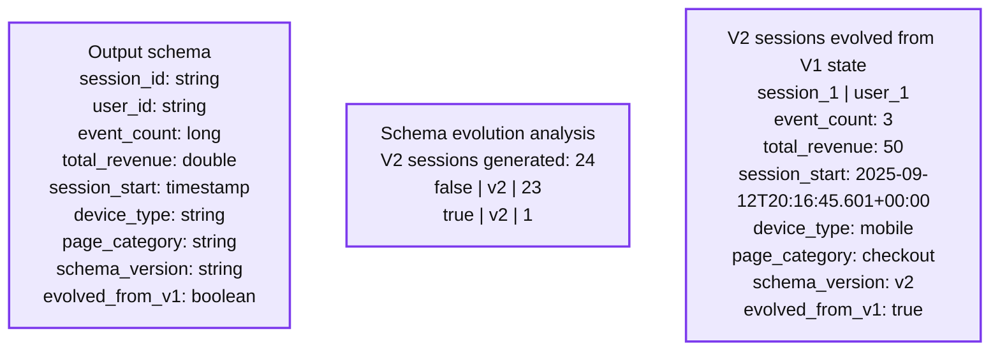

# From Events to Insights: Complex State Processing with Schema Evolution in transformWithState

*Learn how to use the new transformWithState API with schema evolution for a real-world operational sessionization use-case*

- Source: https://www.databricks.com/blog/events-insights-complex-state-processing-schema-evolution-transformwithstate
- Published: 2025-12-01
- Authors: Thangam Vaiyapuri, Jay Palaniappan, Anish Shrigondekar, Karthikeyan Ramasamy
- Categories: engineering, data-engineering
- Images: 4 total, 1 extracted as architecture

**Key takeaways**

- Resilient stateful streaming: Spark 4.0’s transformWithStateInPandas enables pipelines to adapt to schema changes, adding fields or modifying types, while preserving existing state and avoiding service interruptions.
- Adaptive sessionization in action: A StreamShop scenario illustrates how evolving clickstream schemas are handled automatically, allowing V1 session state to upgrade cleanly to V2 without reprocessing.
- Operational continuity and agility: Organizations maintain consistent analytics and accelerate feature delivery by evolving schemas safely, reducing engineering overhead and eliminating downtime during updates.

Across industries, one of the most persistent challenges in data engineering is schema evolution. Business requirements shift, data sources change, and new event fields appear overnight—forcing data engineering teams to constantly adjust pipelines and state stores just to keep systems running.

Traditional streaming methods break down when schemas change. State stores become incompatible, and pipelines fail. Teams face the choice of losing historical data or experiencing expensive downtime for schema migrations. This isn't just a technical problem—it's a barrier to business agility. 

Apache Spark™ 4.0 introduced [`transformWithStateInPandas`](https://www.databricks.com/blog/introducing-transformwithstate-apache-sparktm-structured-streaming), a breakthrough API that makes schema evolution in stateful streaming not just possible, but seamless. Through intelligent state management and automatic schema compatibility, your streaming applications evolve with your business needs while preserving critical state information.

This post is the fourth and latest in the `transformWithState` series: 

- [Introducing transformWithState for Apache Spark™ Structured Streaming](https://www.databricks.com/blog/introducing-transformwithstate-apache-sparktm-structured-streaming), a deep dive into the design principles and architecture behind the new API.
- [The Evolution of Arbitrary Stateful Stream Processing in Spark](https://www.databricks.com/blog/evolution-arbitrary-stateful-stream-processing-spark), explores the unique advantages of `transformWithStateInPandas`.
- [Continuous Environmental Monitoring Using the New transformWithState API](https://www.databricks.com/blog/continuous-environmental-monitoring-using-new-transformwithstate-api), a real-world example of applying transformWithState to environmental IoT use cases.

Together, these blogs showcase how the `transformWithState` API enables advanced stateful processing for real-time workloads, supporting use cases from IoT monitoring to real-time session analytics. 

## The Schema Evolution Challenge in Spark Streaming 

Evolving schemas in stateful Spark Streaming creates significant operational friction. With traditional approaches like `applyInPandasWithState` and `session_window`, state is serialized with schema metadata baked in, creating rigid coupling between your data structure and persisted state.

When you modify your schema—adding fields, changing types, or reordering columns—the existing state becomes incompatible with the new incoming data. Schema mismatches cause deserialization failures, forcing you into manual workarounds:

- **State incompatibility:**The Old state can't reconcile with the new schema structures
- **Manual migration: **Developers must write custom transformation logic to bridge schemas
- **Required downtime**: Schema changes force you to halt streams, migrate state offline, and restart
- **Risk of data loss: **Historical state can be corrupted or lost during migration
- **Version management overhead: **Supporting multiple schema versions requires extensive boilerplate code

### Why `transformWithStateInPandas` (TWS) for Schema Evolution

While Spark offers proven solutions like `session_window` for basic sessionization and `applyInPandasWithState` for custom stateful processing, evolving business requirements often need additional flexibility for seamless schema evolution. `transformWithStateInPandas` builds on these foundations to specifically address scenarios where both your data and your business logic need to evolve continuously.

Here's what makes `transformWithStateInPandas` ideal for schema evolution:

- **Automatic schema compatibility: **existing state seamlessly integrates with new schema versions, whether you're adding fields, widening types, or reordering columns.
- **State preservation during evolution: **no data loss when schemas change; your historical state remains accessible and valuable.
- **Minimum-downtime evolution: **schema changes deploy with minimum service interruptions.

## Scenario Deep-Dive

### Reconstructing the Customer Journey in Real Time

Let's imagine you're part of the data engineering team at "StreamShop," a rapidly growing online retail platform. It's Monday morning, and your CEO just walked into the engineering standup with a printout of competitor analytics showing they're outperforming you in conversion rates. The marketing team is demanding answers:

*"We're spending millions on ads, but where are users dropping off?" "Which customer paths actually lead to purchases?" "Can we personalize the experience based on what users are doing right now?"*

These aren't questions about isolated events—they're about the user journey, the connected sequence, and the behavioral story that unfolds as users click, browse, add items to cart, and either purchase or abandon them. These journeys live in sessions.

Your clickstream data pours in from web and mobile apps through Apache™ Kafka: every page view, click, and "add to cart," and your streaming pipeline tracks them, sessionizes them using a defined schema, and stores the records using flatMapGroupsWithState.  However, now there's a new challenge. Just last week, the mobile team deployed a new version that started sending additional fields like `device_type` and `page_category` without informing the data team.

Your current windowed aggregation solution does not support this scenario out of the box, so you need to stop the pipeline, fix the schema, and reset the checkpoints. This is impractical because you have to perform this operation every time the schema changes. You need something more robust, more flexible, and capable of handling schema evolution transparently.

### The Foundation: Building Intelligent Sessions with Schema Evolution

#### **Understanding Session Evolution**

Your clickstream events started simple with a basic V1 schema—just session ID, user ID, timestamp, and event type. But as StreamShop evolves, so are the events. Now you're receiving V2 events with rich contextual information: device types, page categories, and commerce-specific data like revenue amounts.

The challenge isn't just handling two schemas—it's evolving existing states without losing them or starting over. Your sessionization logic needs to gracefully handle this evolution while maintaining session continuity.

#### `**transformWithStateInPandas**`** Schema Evolution: **

**What is Schema Evolution in the State Store?**

Schema evolution refers to the ability of a streaming query to handle changes to the state store schema of data without losing state information or requiring full reprocessing of historical data. For transformWithStateInPandas, this means you can modify your state variable schemas between query versions while preserving existing session state. Let's look at the implementation below.

**The Sessionizer Implementation**

In this example, we created two custom classes, SessionizerV1 and SessionizerV2, for advanced session processing. They show how `transformWithStateInPandas` can help track not just basic metrics but also understand the context and evolution of each user journey.

**V1 Processor: The Foundation**

In V1 of the sessionizer, we set up a basic schema for the session to track custom values like `event_count`, `total_revenue`. 

**V2 Processor: Defining the Evolved Schema**

V2 demonstrates the true strength of automatic schema evolution. In V2 of the processor, we added two new columns and expanded the type of an existing column (`event_count`), which is seamlessly updated in the underlying state store. 

Unlike traditional window-based sessionization, the `transformWithStateInPandas` sessionizer can help maintain rich context about each user's journey, including their engagement patterns, commerce behavior, and even which schema versions they've used.

[**Evolving the State Schema**](https://docs.databricks.com/aws/en/stateful-applications/schema-evolution#supported-schema-evolution-patterns-in-the-state-store):

- **Type Widening:** `IntegerType` → `LongType` for `event_count` (automatic conversion)
- **New Fields:** `device_type` and `page_category` (appear as `None` for evolved V1 state)
- **Same State Variable: **Using "`session_state`" name enables automatic evolution
- **Field Order: **New fields added at the end for compatibility

**Processing Events with Schema Evolution**

The `handleInputRows` method demonstrates how V2 intelligently handles both new V2 events and evolved V1 state:

### Mastering Schema Evolution: The Technical Deep Dive

#### **Understanding the Schema Evolution Challenge**

The real complexity of modern sessionization isn't just grouping events—it's handling the evolution of those events over time. At StreamShop, this became critical when mobile app updates started sending enhanced data while the web platform still used the original schema.

Here's what schema evolution looks like in practice:

**V1 Events (Original Schema):**

**V2 Events (Enhanced Schema):**

#### **The Complete Pipeline Configuration**

By using the same `checkpointLocation`, V2 seamlessly continues processing from V1's state store schema from the last committed offset, allowing the schema to evolve without reprocessing data.

#### **How Databricks Handles Schema Evolution Automatically**

The magic happens automatically when the V2 processor reads the V1 state. Databricks performs these transformations behind the scenes:

**1. Type Widening (Automatic)**

**2. Field Addition (Automatic)**

**3. Evolution Detection (Our Logic)**

### Business Impact: The Results Story

#### **Seeing Schema Evolution in Action**

After deploying our sessionization pipeline, the results demonstrate successful schema evolution. Here's what happens:

**V1 Results - Initial sessions with basic schema:**

- session_2 and session_4 complete with terminal events (purchase/logout)
- session_1, session_3, session_5, session_6 remain active with non-terminal events (page_view)
- State persists for sessions 1, 3, 5, 6

#### **Delta Output:**

**V1 sessionization output:**

**Inspecting StateStore:**

**V2 sessionization output:**

Reading records state schema version **V2**  - Enhanced sessions with evolved schema:

- session_1 complete using **evolved V1 state** + new V2 fields
- `evolved_from_v1`: true confirms successful schema evolution
- Enhanced context: device_type (mobile, desktop, tablet), page_category (checkout, profile, product)
- Event accumulation: 3 total events with $50 revenue.
- Demonstrates clean migration from V1 to V2 processor with state continuity.

#### **Schema Evolution Analysis:**

**Summary:** The schema evolution analysis shows 24 V2 sessions, including one session evolved from V1 state with 3 events and 50 total revenue.

**Components:**
- Output schema - Databricks table fields: session_id string, user_id string, event_count long, total_revenue double, session_start timestamp, device_type string, page_category string, schema_version string, evolved_from_v1 boolean.
- Evolution Analysis - tabular counts grouped by evolved_from_v1 and schema_version.
- V2 sessions evolved from V1 state - result table containing session_1, user_1, mobile device type, checkout page category, schema_version v2, and evolved_from_v1 true.

**Flows:**
- none - no arrows are visible.

**Numbers:**
- V2 sessions generated: 24.
- V2 sessions with evolved_from_v1 false: 23.
- V2 sessions with evolved_from_v1 true: 1.
- Displayed row index: 1.
- Identifiers: session_1 and user_1.
- event_count: 3.
- total_revenue: 50.
- session_start: 2025-09-12T20:16:45.601+00:00.
- Version labels: V1 and V2.
- Numeric column type icons: 1, 2, 3 and 1.2.

source image: https://www.databricks.com/sites/default/files/inline-images/Screenshot-2025-11-25-at-1.32.31-PM.png

### Real-World Schema Evolution Success

The key insight: sessions 1 in V2 show `evolved_from_v1`: true because:

1. It had non-terminal events in V1 (page_view) → state persisted
2. V2 processor automatically detected None values in new fields when reading V1 state
3. Databricks seamlessly converted V1 state (5 fields) to V2 state (7 fields)
4. Type widening (`IntegerType` → `LongType`) happened automatically
5. New fields (device_type, page_category) populated from V2 events
6. Session completed with 3 accumulated events, demonstrating successful state continuity

#### **Prerequisite Configurations**

Schema evolution **is only supported with a combination of Spark **configurations. 

1. **Avro Encoding (REQUIRED)**

**2. RocksDB State Store (REQUIRED)**

#### **The Business Value of Schema Evolution**

Schema evolution enables organizations to add new features and insights without disrupting daily operations. This flexibility allows businesses to continuously improve, innovate more quickly, and stay competitive.

- **Minimal Downtime Between Deployments:** New data fields or tracking capabilities can be introduced with minimal downtime. Customers and internal teams experience uninterrupted service while the business gains richer insights.
- **Gradual Rollouts:** Schema changes can be introduced gradually, reducing risk and making adoption smoother across teams and systems. Business leaders can test and validate new features without committing to disruptive, large-scale changes all at once.
- **Historical Continuity: **Organizations avoid costly data reprocessing by maintaining existing session states and historical context. This provides a seamless view of the past and present, helping decision-makers rely on long-term trends and insights.
- **Analytics Continuity: **Consistent metrics are maintained even as the platform evolves. This stability allows executives and analysts to focus on decision-making rather than worrying about data or reporting inconsistencies.

Ultimately, the ability to evolve schemas while preserving state changes how businesses approach real-time analytics. It ensures that innovation and operational excellence go hand-in-hand, supporting continuous growth with minimal or no service disruptions.

## Conclusion

Apache Spark™ 4.0’s [transformWithState](https://docs.databricks.com/aws/en/stateful-applications/) API is more than a technical upgrade—it’s a shift in how real-time customer analytics are built.

At StreamShop, it powered real-time visibility across teams:

- Marketing tracks customer journeys live
- Product measures feature impact within hours
- Engineering gains deep system insight through state transparency

With built-in schema evolution, our sessionization pipeline adapts automatically as the business evolves—new events, platforms, and touchpoints are handled seamlessly.

Whether tracking journeys, engagement, or conversion funnels, `transformWithStateInPandas` turns raw events into actionable insights—building continuous customer understanding that fuels growth.

This post concludes our `transformWithState` series, highlighting how the API enables scalable, stateful processing across IoT and session-based analytics use cases.

### Related Resources

- [Spark Structured Streaming Programming Guide](https://spark.apache.org/docs/latest/structured-streaming-programming-guide.html)
- [Stateful applications schema evolution](https://docs.databricks.com/aws/en/stateful-applications/schema-evolution)
- [Performance Improvements in Stateful Pipelines](https://www.databricks.com/blog/performance-improvements-stateful-pipelines-apache-spark-structured-streaming)
- [Github repo](https://github.com/databricks-solutions/databricks-blogposts/tree/main/2025-07-sessionization-transformWithStateInPandas)
