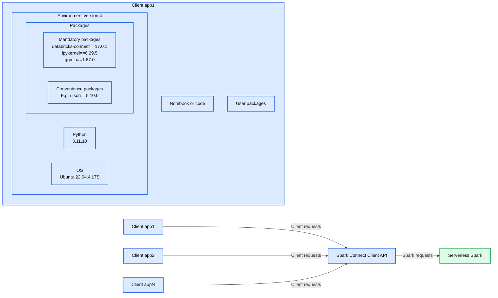
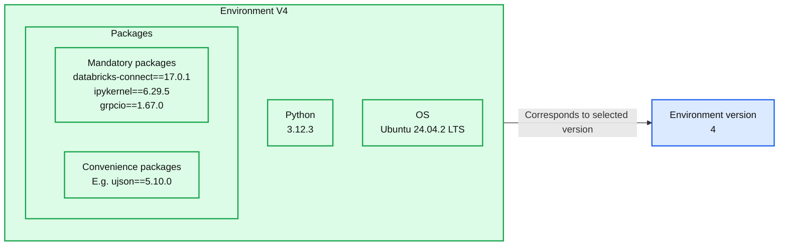
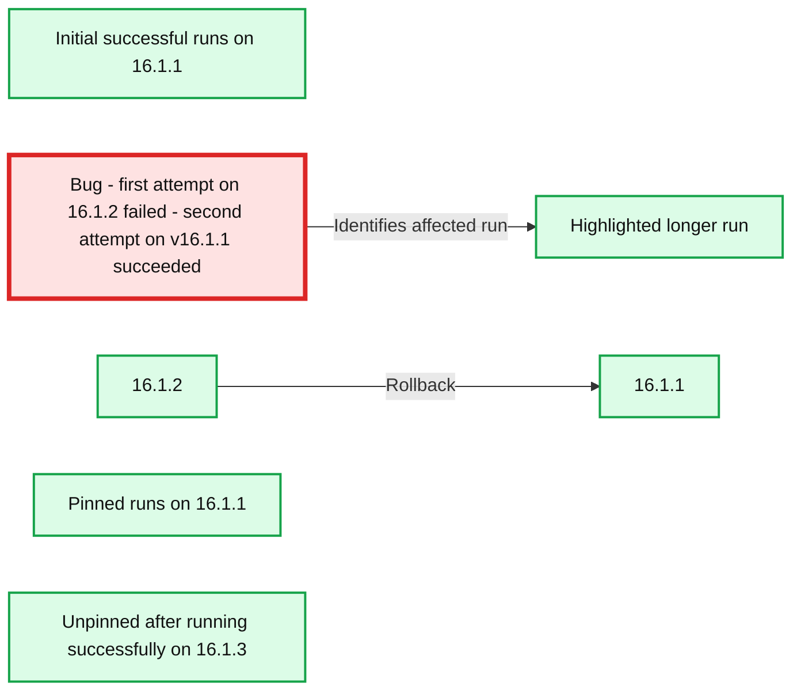

# Examining Versionless Apache Spark™: AI-powered upgrades and seamless stability for 2 billion workloads

*How we eliminated manual Spark upgrades from the platform*

- Source: https://www.databricks.com/blog/examining-versionless-apache-sparktm-ai-powered-upgrades-and-seamless-stability-2-billion
- Published: 2025-10-07
- Authors: Justin Breese, Vijayan Prabhakaran, Amit Shukla, Martin Grund, Stefania Leone, Chris Munson, Tatiana Romanova, Lennart Kats
- Categories: engineering, data-engineering
- Images: 4 total, 3 extracted as architecture

**Key takeaways**

- Apache Spark™ upgrades are now automatic with versionless for Serverless Notebooks and Jobs, removing the need for migrations or code changes.
- A stable client API and AI-powered release management keep workloads reliable while still delivering the latest features and fixes.
- More than two billion workloads have been upgraded with a 99.99% success rate, proving the system works at scale.

Upgrading Apache Spark™ has never been easy. Every major version brings performance improvements, bug fixes, and new features, but getting there is painful. Most Spark users know the drill. Workloads break, APIs change, and developers can spend weeks fixing jobs just to catch up. This results in new features, performance improvements, and bug and security fixes taking significantly longer to adopt.

At Databricks, we wanted to remove this friction entirely. The result is Versionless Spark, a new way of running Spark that delivers continuous upgrades, zero code changes, and unmatched stability. Over the past 18 months, since [launching Serverless Notebooks and Jobs](https://www.databricks.com/blog/announcing-general-availability-serverless-compute-notebooks-workflows-and-delta-live-tables), Versionless Spark has automatically upgraded more than 2 billion Spark workloads across 25 Databricks Runtime releases, including major Spark versions, without any user intervention.

In this blog, we’ll share how we built versionless Spark, highlight the results we’ve seen, and show you where to find more details in our recently published [SIGMOD 2025 paper](https://dl.acm.org/doi/10.1145/3722212.3725084).

## A new path forward: Stable public API via versioned client

To make upgrades seamless and get Databricks users time back, we needed to have a stable, public Spark API so that we could seamlessly update the server. We achieved this with a stable, versioned client API, based on [Spark Connect](https://www.databricks.com/blog/2022/07/07/introducing-spark-connect-the-power-of-apache-spark-everywhere.html), that decouples the client from the Spark server, enabling Databricks to upgrade the server automatically.

*Fig 1 - Environment version as a versioned client*

**Summary:** Versioned client environments package application dependencies and connect multiple client applications to Serverless Spark through the Spark Connect Client API.

**Components:**
- Client app1: expanded application containing notebook or code, user packages, and Environment version 4.
- Notebook or code: application code.
- User packages: application dependencies.
- Environment version 4: versioned runtime containing packages, Python, and an OS.
- Packages: mandatory and convenience packages.
- Mandatory packages: databricks-connect, ipykernel, and grpcio.
- Convenience packages: example dependency ujson.
- Python: Python runtime.
- OS: Ubuntu operating system.
- Client app1, Client app2, Client appN: client applications.
- Spark Connect Client API: interface connecting clients to Spark.
- Serverless Spark: Spark compute service.

**Flows:**
- Client app1 -> Spark Connect Client API: client requests.
- Client app2 -> Spark Connect Client API: client requests.
- Client appN -> Spark Connect Client API: client requests.
- Spark Connect Client API -> Serverless Spark: Spark requests.

**Numbers:**
- Client app1 and Client app2: application indices 1 and 2.
- Environment version 4.
- databricks-connect==17.0.1.
- ipykernel==6.29.5.
- grpcio==1.67.0.
- ujson==5.10.0.
- Python 3.11.10.
- Ubuntu 22.04.4 LTS.

source image: https://www.databricks.com/sites/default/files/inline-images/environment-version-as-a-versioned-client.png

Fig 1 - Environment version as a versioned client

The Databricks environment version serves as a base image containing client packages such as Spark Connect, Python, and pip dependencies. User code and additional packages run on top of this environment (e.g. Client app1) and communicates with our serverless Spark service. Databricks periodically releases new environment versions, each with three years of support - similar to DBR LTS. By default, new workloads use the latest version, but users can continue running on older, supported versions if they prefer.

When using serverless Notebooks, users can choose from any supported environment versions in the Environment panel of the notebook (as shown in Figure 2). For serverless jobs, the environment version is defined via the [Job API](https://docs.databricks.com/api/workspace/jobs/create#environments).

*Fig 2 - Definition of Environment version 4 overlaid on a Notebook that has the same version selected (orange box)*

**Summary:** Environment V4 bundles specific package, Python, and operating system versions and corresponds to version 4 selected in the notebook Environment panel.

**Components:**

- Environment V4: versioned runtime environment.
- Packages: mandatory and convenience Python packages.
- Mandatory packages: databricks-connect, ipykernel, and grpcio.
- Convenience packages: ujson example.
- Python: Python interpreter.
- OS: Ubuntu LTS.
- Environment version: notebook selector set to 4.

**Flows:**

- Environment V4 -> Environment version: links the environment definition to the selected version 4.

**Numbers:** Environment V4; databricks-connect==17.0.1; ipykernel==6.29.5; grpcio==1.67.0; ujson==5.10.0; Python 3.12.3; Ubuntu 24.04.2 LTS; selected environment version 4. Background notebook: 16GB memory; simplejson==3.19.*; 55 minutes ago; 08:53 AM; 4s; code lines 1 through 5; See performance 1; row indices 1 and 2; Alice quantity 2; Bob quantity 3; 2 rows; 4.38s runtime.

source image: https://www.databricks.com/sites/default/files/inline-images/definition-of-environment-version-4-overlaid-on-a-Notebook-that-has-the-same-version-selected.png

Fig 2 - Definition of Environment version 4 overlaid on a Notebook that has the same version selected (orange box)

## Automatic upgrades and AI-powered rollbacks

Providing our users with frequent security, reliability, and performance updates is critical when running automated workloads on Databricks. This must be done automatically and without compromising stability, especially for production pipelines. This is done through our AI-powered Release Stability System (RSS), which combines an automated workload’s unique fingerprint with run metadata, to detect regressed workloads on new server versions and automatically revert subsequent runs to the previous server version. The RSS contains several components:

- Each workload has a *workload fingerprint* to identify repeated runs of the same workload based on a set of properties
- *Historical runs* retain metadata about previous runs
- *Pinning service* keeps track of workloads that behave differently on two different server versions
- *ML models* determine error classification, triage tickets, and detect anomalies within the fleet
- *Anomaly detection* pipelines run across the fleet
- Release health *reports* and alerts provide real-time release health information to the Databricks engineering team

## Automatic rollbacks ensure that workloads continue running successfully after encountering regressions

When the RSS performs a rollback on an automated job, the workload automatically re-runs on its last known version, where it previously succeeded. Let’s illustrate the RSS using a real-world example: A particular automated job ran on April 9th using DBR version 16.1.2 and experienced an error. Historical runs indicated that the workload had succeeded for several consecutive days on 16.1.1. The ML model found that the error was likely caused by a bug. As a result, a pinning entry was automatically created in the pinning service. When the automatic - in this case - retry of the workload started, it found the pinning service entry and the workload was re-run on 16.1.1 and succeeded. This resulted in an automatic triage process whereby Databricks engineering got alerted, identified the bug and issued a fix. In the interim, subsequent runs of the workload stayed pinned on 16.1.1 until the bug fix was rolled out in 16.1.3 and the workload was eventually released to 16.1.3 (blue box) and continued to run successfully.

**Summary:** Workload runs succeed on 16.1.1, recover from a failed upgrade by rolling back, remain pinned, and later run successfully on 16.1.3.

**Components:**
- AutoTriage_Model_Training: workload shown in the Databricks runs interface.
- Initial yellow box: successful runs on version 16.1.1.
- Bug callout and red box: failed first attempt and successful retry on 16.1.1.
- Pinned yellow box: subsequent runs held on 16.1.1.
- Blue box: runs unpinned after successfully running on version 16.1.3.
- Run total duration: duration chart with green run bars.
- Runs, Tasks, Include time in queue, Start date, Previous, Next: interface labels and controls.

**Flows:**
- Bug callout -> Red highlighted run: identifies the failed first attempt and successful retry.
- 16.1.2 -> 16.1.1: rollback shown beneath the highlighted run.

**Numbers:** 
- Duration ticks: 34m 15s; 17m 7s.
- Dates: Mar 23; Mar 28; Apr 09; Apr 19.
- Initial version: 16.1.1.
- Callout: first attempt on 16.1.2 failed; second attempt on v16.1.1 succeeded.
- Rollback label: 16.1.2 → 16.1.1.
- Pinned version: 16.1.1.
- Unpinned version: 16.1.3.

source image: https://www.databricks.com/sites/default/files/inline-images/customer-rollback-bug.png

In this case, we were able to quickly detect and remediate a very subtle bug that only affected a small number of customer workloads, without any impact to the customer's reliability. Compare that to the classic Spark upgrade model, which relies on the user upgrading manually and usually at a significant delay. The user would perform the upgrade, see their job start to fail, and then may have to file a support ticket to resolve the issue. This would likely take much longer to resolve – ultimately requiring more customer involvement and with worse reliability.

## Conclusion

We have used the Release Stability System to upgrade more than 2 billion jobs, from DBR 14 to DBR 17 - including the transition to Spark 4 - while seamlessly delivering new features like [collation](https://docs.databricks.com/aws/en/sql/language-manual/sql-ref-collation), bloom filter join optimization, and JDBC drivers. Of those, only 0.000006% of jobs required an automatic rollback, and every rollback was remediated with a fix and successfully upgraded to the latest version within an average of 12 days. This achievement marks an industry first: upgrading billions of production Spark workloads automatically, with zero code changes from users.

We have made Spark upgrades completely seamless by building a new architecture that combines environment versioning, an auto-upgrading versionless server, and the Release Stability System. This industry-first approach has enabled Databricks to deliver features and fixes to users much faster, with greater stability, allowing data teams to focus more on high-value business outcomes rather than infrastructure maintenance.

We are just getting started on this journey and look forward to improving the UX further.

## Next steps

- Check out our in-depth [paper](https://dl.acm.org/doi/10.1145/3722212.3725084) on this topic from [SIGMOD 2025](https://2025.sigmod.org/)
- [Original GA announcement](https://www.databricks.com/blog/announcing-general-availability-serverless-compute-notebooks-workflows-and-delta-live-tables) of Serverless compute for notebooks and jobs
