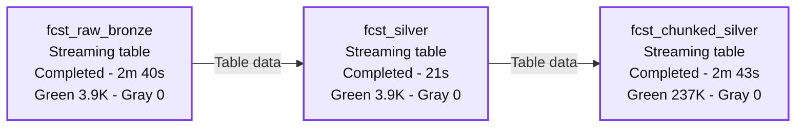
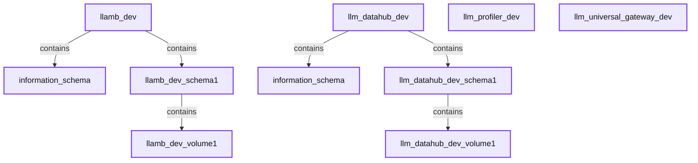
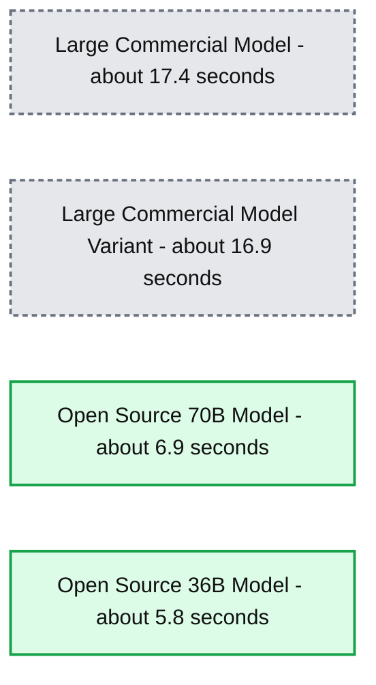
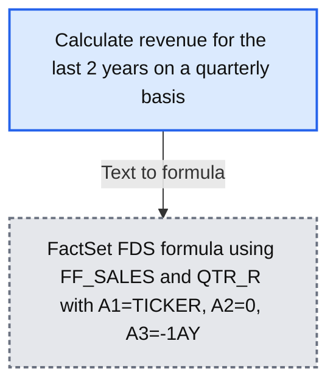
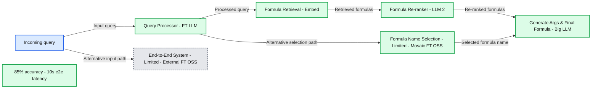

# FactSet: Implementing an Enterprise GenAI Platform with Databricks

- Source: https://www.databricks.com/blog/factset-genai
- Published: 2024-06-12
- Authors: Wilson Tsai (FactSet), Michael Edelson (FactSet), Nikhil Hiriyur Sunderraj (FactSet), Yogendra Miraje (FactSet), Ricardo Portilla, Keon Shahab, Patrick Putnam
- Categories: engineering, data-science-machine-learning, databricks-ai, industries, financial-services, company, customers
- Images: 11 total, 8 extracted as architecture

> "FactSet’s mission is to empower clients to make data-driven decisions and supercharge their workflows and productivity. To deliver AI-driven solutions across our entire platform, FactSet empowers developers at our firm and our customers’ firms to innovate efficiently and effectively. Databricks has been a key component to this innovation, enabling us to drive value using a flexible platform that enables developers to build solutions centered around data and AI." - Kate Stepp, CTO, FactSet

### Who We Are and Our Key Initiatives

FactSet helps the financial community to see more, think bigger, and work smarter. Our digital platform and enterprise solutions deliver financial data, analytics, and open technology on a global scale. Clients across the buy-side and sell-side, as well as wealth managers, private equity firms, and corporations, achieve more every day with our comprehensive and connected content, flexible next-generation workflow solutions, and client-centric specialized support. 

In 2024, our strategic focus is on leveraging advancements in technology to improve client workflows, particularly through the application of Artificial Intelligence (AI), to enhance our offerings in search and various client chatbot experiences. We aim to drive growth by integrating AI into various services, which will enable more personalized and efficient client experiences. These AI-driven enhancements are designed to automate and optimize various aspects of the financial workflow, from generating financial proposals to summarizing portfolio performances​ for [FactSet Investors](https://investor.factset.com/).

As a leading solutions and data provider and technology early adopter, FactSet has identified several opportunities to enhance customer experience and internal applications with generative AI (GenAI). Our[FactSet Mercury](https://insight.factset.com/how-we-use-llm-technology-to-supercharge-junior-banker-workflows) initiative enhances the user experience within the FactSet workstation by offering an AI-driven experience for new and existing users. This initiative is powered by large language models (LLMs) that are customized for specific tasks, such as code generation and summarization of FactSet-provided data. However, while the vision for FactSet’s end-user experience was clear, there were several different approaches we could take to make this vision a reality.  

*Figure 1: FactSet Mercury. We developed and launched the beta release of a Large Language Model-based knowledge agent- FactSet Mercury, to support junior banker workflows and enhance fact-based decision-making.*

To empower our customers with an intelligent, AI-driven experience, FactSet began exploring various tools and frameworks to enable developers to innovate rapidly. This article describes our evolution from an early approach focused on commercial models to an end-to-end AI framework powered by Databricks that balances cost and flexibility.  

### The Opportunity Cost of Developer Freedom: Tackling GenAI Tool Overload

#### **Lack of a Standardized LLM Development Platform** 

In our early phases of GenAI adoption, we faced a significant challenge in the lack of a standardized LLM development platform. Engineers across different teams were using a wide array of tools and environments or leveraging bespoke solutions for particular use cases. This diversity included cloud-native commercial offerings, specialized services for fine-tuning models, and even on-premises solutions for model training and inference.  The absence of a standardized platform led to several issues: 

- **Collaboration Barriers**: Teams struggled to collaborate due to different tools and frameworks 
- **Duplicated Efforts**: Similar models were often redeveloped in isolation, leading to inefficiencies 
- **Inconsistent Quality**: Varied environments resulted in uneven model performance across applications 

#### **Lack of a Common LLMOps Framework** 

Another challenge was the fragmented approach to LLMOps within the organization. While some teams were experimenting with open source solutions like MLflow or utilizing native cloud capabilities, there was no cohesive framework in place. This fragmentation resulted in lifecycle challenges related to: 

- **Isolated Workflows**: Teams had difficulty collaborating and were unable to share prompts, experiments, or models 
- **Rising Demand**: The lack of standardization hindered scalability and efficiency as the demand for ML and LLM solutions grew 
- **Limited Reusability**: Without a common framework, reusing models and assets across projects was challenging, leading to repeated efforts 

#### **Data Governance and Lineage Issues** 

Using multiple development environments for Generative AI posed significant data governance challenges: 

- **Data Silos**: Different teams stored data in various locations, leading to multiple data copies and increased storage costs 
- **Lineage Tracking**: It was hard to track data transformations, affecting our understanding of data usage across pipelines 
- **Fine-Grained Governance**: Ensuring compliance and data integrity was difficult with scattered data, complicating governance 

#### **Model Governance + Serving** 

Lastly, managing and serving models in production effectively faced several obstacles: 

- **Multiple Serving Layers**: Maintaining and governing models became cumbersome and time-consuming
- **Endpoint Management**: Managing various model serving endpoints increased complexity and impacted monitoring 
- **Centralized Oversight**: The lack of oversight hindered consistent performance tracking and optimal model maintenance amid ever-increasing requirements like content moderation 

### Empowering Developers with a Framework, Not Fragments 

Once our AI projects gained traction and moved toward production, we realized that offering our team unbridled platform flexibility inadvertently created challenges in managing the LLM lifecycle, especially for dozens of applications. In the second phase of GenAI implementation at FactSet, developers are empowered to choose the best model for their use case — with the guardrails of a centralized, end-to-end framework.  

 

After a thorough evaluation based on specific business requirements, FactSet selected Databricks as their enterprise ML / AI platform in late 2023. After the existing challenges faced during the early adoption and development of different AI platforms and services, FactSet decided to standardize new development of LLM / AI applications on Databricks and Databricks-managed MLflow for several reasons outlined below: 

#### **Data Preparation for Modeling + AI / ML Development** 

We found that Databricks tools and [managed MLflow](https://www.databricks.com/product/managed-mlflow) enhanced efficiency and reduced the complexity of maintaining underlying cloud infrastructure for practitioners. By abstracting away the complexity of many cloud infrastructure tasks, developers could spend more time innovating new use cases with managed compute running on AWS and both serverless and non-serverless compute from Databricks. Without needing in-depth cloud expertise or specialized AI and ML experience, our product engineers were able to access abstracted compute and install libraries and any dependencies directly from their Databricks environment. 

 

As an example, an application developer leveraging our enterprise deployment was able to easily create an end-to-end pipeline for a RAG application for earnings call summarization. They used [Delta Live Tables](https://www.databricks.com/product/delta-live-tables) to ingest and parse news data in an XML format, chunked the text by length and speaker, created embeddings and updated [AI Search](https://www.databricks.com/product/machine-learning/vector-search) indexes, and leveraged an [open-source model of choice](https://marketplace.databricks.com/?asset=Models&sortBy=date) for RAG. Finally, [Model Serving](https://www.databricks.com/product/model-serving) endpoints served responses into a front end application.     

 

*Figure 2: Example of the end-to-end pipeline for a RAG application for earnings call summarization.*

**Summary:** Three Databricks streaming tables form a completed pipeline from raw bronze data through silver data to chunked silver data.

**Components:**
- `fcst_raw_bronze`: Databricks streaming table for raw bronze data.
- `fcst_silver`: Databricks streaming table for silver data.
- `fcst_chunked_silver`: Databricks streaming table for chunked silver data.

**Flows:**
- `fcst_raw_bronze -> fcst_silver`: Table data flows downstream; transformation details are not shown.
- `fcst_silver -> fcst_chunked_silver`: Table data flows downstream; transformation details are not shown.

**Numbers:**
- `fcst_raw_bronze`: Completed in `2m 40s`; green indicator `3.9K`; gray indicator `0`.
- `fcst_silver`: Completed in `21s`; green indicator `3.9K`; gray indicator `0`.
- `fcst_chunked_silver`: Completed in `2m 43s`; green indicator `237K`; gray indicator `0`.
- The indicator counts have no visible unit labels.

source image: https://www.databricks.com/sites/default/files/inline-images/factset-implemented-enterprise-generative-ai-platform-img-2.png

*Figure 2: Example of the end-to-end pipeline for a RAG application for earnings call summarization.*

These frameworks provide an easy-to-use, collaborative development environment for practitioners to create reusable ingestion and transformation pipelines using the Databricks Data + AI Platform. Data is consolidated in S3 buckets maintained by FactSet. 

#### **Governance, Lineage, Traceability** 

[Unity Catalog](https://www.databricks.com/product/unity-catalog) helped resolve prior challenges such as data silos, multiple governance models, lack of data and model lineage, and lack of auditability by providing cataloging capabilities with a hierarchical structure and fine-grained governance of data, models, and additional assets. Additionally, Unity Catalog also enables isolation at both the metadata and physical storage levels in a shared environment with multiple users across different teams and reduces the need for individual user IAM role-based governance. 

 

For example, FactSet has several lines of business and multiple teams working on specific use cases and applications. When a user from a team signs in to Databricks using their SSO credentials, that user sees an isolated, customized access view of governed data assets. The underlying data resides in FactSet’s S3 buckets that are specific to that user’s team and have been registered to Unity Catalog as external locations with an assigned storage credential. Unity Catalog enforces isolation and governance without requiring the user to have specific IAM permissions granted.   

 

*Figure 3: We organized projects with isolation. Each project gets a pre-made catalog, schema, service principal, and volume. Additional schemas and volumes can be requested as needed.*

**Summary:** Project catalogs in Databricks Unity Catalog contain separate schemas and volumes.

**Components:**
- `llamb_dev`: Unity Catalog catalog.
- `information_schema` under `llamb_dev`: Unity Catalog metadata schema.
- `llamb_dev_schema1`: Unity Catalog schema.
- `llamb_dev_volume1`: Unity Catalog volume.
- `llm_datahub_dev`: Unity Catalog catalog.
- `information_schema` under `llm_datahub_dev`: Unity Catalog metadata schema.
- `llm_datahub_dev_schema1`: Unity Catalog schema.
- `llm_datahub_dev_volume1`: Unity Catalog volume.
- `llm_profiler_dev`: Collapsed Unity Catalog catalog.
- `llm_universal_gateway_dev`: Collapsed Unity Catalog catalog.

**Flows:**
- No flow arrows are visible. The tree shows catalog, schema, and volume containment.

**Numbers:** `1` appears in the schema and volume names for `llamb_dev` and `llm_datahub_dev`. No quantitative values are shown.

source image: https://www.databricks.com/sites/default/files/inline-images/factset-implemented-enterprise-generative-ai-platform-img-3.png

*Figure 3: We organized projects with isolation. Each project gets a pre-made catalog, schema, service principal, and volume. Additional schemas and volumes can be requested as needed.*

 

By consolidating ingestion and transformation and leveraging Unity Catalog as a consistent, standardized governance framework, we were able to capture table/column level lineage for all operations using Databricks compute. The ability to capture lineage is critical for monitoring underlying data and enables explainability of downstream GenAI applications. Unity Catalog’s lineage, combined with the auditability of underlying data, enables FactSet application owners to better understand the data lifecycle and downstream query patterns.  

#### **LLMOps + FactSet Self-Service Capabilities** 

In addition to building a cross-business unit enterprise deployment, we also integrated Databricks with our internal GenAI Hub which manages all ML and LLM resources for a given project. This integration enabled centralization of Databricks workspaces, the Model Catalog, and other essential meta-share that facilitates ML producer <> ML consumer collaborations and reusability of models across our firm. Significant integrations of MLflow and Databricks cost-attribution were included, streamlining our project hub and cost-attribution workflows by leveraging Databricks cost views to provide better per-project business transparency.

 

*Figure 4: GenAI Hub Integration. Projects are searchable by name, team or description. Links out to code, documentation, and GenAI resources like models and experimentation are provided across the firm, with notebook and metrics transparency.*

 

Perhaps the most critical driving factor for FactSet's platform evaluation was creating a comprehensive, standardized LLMOps framework and model deployment environment. During model development, MLflow makes it easy to compare model performance across different iterations. By having MLflow integrated into the Databricks UI, practitioners can easily take advantage of MLflow through point-and-click operations, while also having the flexibility to programmatically leverage MLflow capabilities. MLflow also enables a collaborative experience for teams to iterate on model versions, reduce siloed work, and enhance efficiency.  

 

A key consideration during FactSet’s evaluation was Databricks' support for a wide range of open-source and commercial models. Our goal is to leverage commercial and open-source models that provide our clients with the best accuracy, performance, and cost. Databricks enables serving multiple types of models from a single serving layer, including custom models (ex. Langchain, HuggingFace), open-source foundation models (ex. Llama 3, DBRX, Mistral), and even external models (ex. OpenAI, Anthropic). The [MLflow Deployments Server](https://mlflow.org/docs/latest/llms/deployments/index.html) enables simplified model serving for a variety of model types.  

### Our Product Outcomes 

#### **Fine-Tuning Open-Source Alternatives to Proprietary Frameworks in Mercury** 

An early adopter of the platform was a code generation component of Mercury that could generate boilerplate data frames based on client prompts to request data from existing data interfaces.  

*Figure 5: Example of Mercury's code generation component.*

This application heavily leveraged a large commercial model, which provided the most consistent, high-quality results. However, early testers encountered over a minute in response time with the existing commercial model in the pipeline. Using Databricks, we were able to fine-tune [meta-llama-3-70b](https://marketplace.databricks.com/details/f6b5930b-1829-4f7e-a01b-c43a03704595/Databricks_Meta-Llama-3-Models) and, recently, [Databricks DBRX](https://marketplace.databricks.com/details/357c33c9-7cd3-48d2-bb5b-b4a88172d193/Databricks_DBRX-Models) to reduce average user request latency by over 70%.  

 

This code generation project demonstrated the flexibility of Databricks for testing and evaluating open-source models, which led to major performance improvements and added value to the end-user experience in FactSet workstations.

*Figure 6: Development results for the Mercury Coder leveraging Fine-Tuned alternatives to Large Commercial Models to improve performance.*

**Summary:** Mercury LLM Coder average runtime per request is lower for the open-source 70B and 36B models than for the two large commercial models.

**Components:**
- Large Commercial Model: commercial model with unspecified technology.
- Large Commercial Model Variant: commercial model variant with unspecified technology.
- Open Source 70B Model: open-source model labeled 70B.
- Open Source 36B Model: open-source model labeled 36B.

**Flows:**
- none. No arrows are visible.

**Numbers:**
- Vertical axis: average runtime per request in seconds, with ticks at 0, 2, 4, 6, 8, 10, 12, 14, 16, 18, and 20.
- Approximate bar heights, with no printed values: Large Commercial Model 17.4 seconds; Large Commercial Model Variant 16.9 seconds; Open Source 70B Model 6.9 seconds; Open Source 36B Model 5.8 seconds.
- Model size labels: 70B and 36B.

source image: https://www.databricks.com/sites/default/files/inline-images/factset-implemented-enterprise-generative-ai-platform-img-6.png

*Figure 6: Development results for the Mercury Coder leveraging Fine-Tuned alternatives to Large Commercial Models to improve performance.*

#### **Text to Formula Advanced RAG With Open-Source Fine-Tuning Workflow** 

Another project which reaped benefits from our Databricks tooling was our Text-to-Formula initiative. The goal of this project is to accurately generate custom FactSet formulas using natural language queries. Here is an example of a query and respective formula:

*Figure 7: Text-to-code example.*

**Summary:** A natural-language request for quarterly revenue over the last two years maps to a FactSet formula.

**Components:**
- Request: “Calculate revenue for the last 2 years on a quarterly basis”, expressed in natural language.
- Formula: FactSet FDS function using FF_SALES and QTR_R, with parameters A1=TICKER, A2=0, and A3=-1AY.

**Flows:**
- Request -> Formula: natural-language request converted to a FactSet formula.

**Numbers:** 2 years; quarterly frequency; cell references A1, A2, A3; A2=0; A3=-1AY.

source image: https://www.databricks.com/sites/default/files/inline-images/factset-implemented-enterprise-generative-ai-platform-img-7.png

*Figure 7: Text-to-code example.*

We started the project with a simple Retrieval-Augmented Generation (RAG) workflow but we quickly hit a ‘quality ceiling’ and were unable to scale up with more complex formulas. After extensive experimentation, we developed the below architecture and have achieved notable improvements in accuracy, but with high end-to-end (e2e) latency, as illustrated below. The image below reflects the architecture prior to using Databricks.

 

*Figure 8: Compound AI architecture with high accuracy and “high” e2e latency.*

**Summary:** A four-stage compound AI pipeline uses large language models, embeddings, and MLflow evaluation, achieving 85% accuracy with 25 seconds of end-to-end latency.

**Components:**

- Query Processor: Big LLM.
- Formula Retrieval: Embed.
- Formula Re-ranker: LLM 2.
- Generate Args & Final Formula: Big LLM.
- Evaluation: MLflow.
- Performance labels: accuracy and e2e latency.

**Flows:**

- Incoming arrow -> Query Processor: input query.
- Query Processor -> Formula Retrieval: processed query.
- Formula Retrieval -> Formula Re-ranker: retrieved formulas.
- Formula Re-ranker -> Generate Args & Final Formula: re-ranked formulas.
- Query Processor -> Evaluation: evaluation input through the shared dashed path.
- Formula Retrieval -> Evaluation: evaluation input through the shared dashed path.
- Formula Re-ranker -> Evaluation: evaluation input through the shared dashed path.
- Generate Args & Final Formula -> Evaluation: evaluation input through the shared dashed path.

**Numbers:**

- 85% accuracy.
- 25s e2e latency.
- 2 in the model label LLM 2.

```mermaid
%% Compound AI formula generation pipeline with shared MLflow evaluation
flowchart LR
    I[Incoming query] -->|Query| Q[Query Processor - Big LLM]
    Q -->|Processed query| R[Formula Retrieval - Embed]
    R -->|Retrieved formulas| F[Formula Re-ranker - LLM 2]
    F -->|Re-ranked formulas| G[Generate Args & Final Formula - Big LLM]
    Q -.->|Evaluation input| E[Evaluation - MLflow]
    R -.->|Evaluation input| E
    F -.->|Evaluation input| E
    G -.->|Evaluation input| E
    P[85% accuracy - 25s e2e latency]

    classDef client fill:#dbeafe,stroke:#2563eb,stroke-width:2px,color:#111
    classDef service fill:#dcfce7,stroke:#16a34a,stroke-width:2px,color:#111
    classDef store fill:#ede9fe,stroke:#7c3aed,stroke-width:2px,color:#111
    classDef cache fill:#fef3c7,stroke:#d97706,stroke-width:2px,color:#111
    classDef queue fill:#cffafe,stroke:#0891b2,stroke-width:2px,color:#111
    classDef critical fill:#fee2e2,stroke:#dc2626,stroke-width:4px,color:#111
    classDef external fill:#e5e7eb,stroke:#6b7280,stroke-width:2px,color:#111,stroke-dasharray:4 3
    classDef decision fill:#fce7f3,stroke:#db2777,stroke-width:2px,color:#111
    class I client
    class Q,R,F,G,E service
    class P external
```

source image: https://www.databricks.com/sites/default/files/inline-images/factset-implemented-enterprise-generative-ai-platform-img-8.png

* Figure 8: Compound AI architecture with high accuracy and “high” e2e latency.*

The Databricks platform offers an array of functionalities, including detailed fine-tuning metrics that allow us to rigorously monitor training progress. Additionally, the platform supports model versioning, facilitating the deployment and management of specific model versions in a native serverless environment.   

 

Implementing such a cohesive and seamless workflow is paramount. It not only enhances the end-to-end experience for the engineering, ML DevOps, and Cloud teams but also ensures efficient synchronization and collaboration across these domains. This streamlined approach significantly accelerates the development and deployment pipeline, thereby optimizing productivity and ensuring that our models adhere to the highest standards of performance and compliance. Now is the time to step back, transcend our initial requirements, and devise a strategy to enhance ‘Functional’ Key Indicators, ultimately rendering our product self-service capable. Achieving this vision necessitates an enterprise-level LLMOps platform. 

 

The following workflow diagram describes the integration of a RAG process designed to systematically gather data, incorporate subject matter expert (SME) evaluations, and generate supplementary examples that comply with FactSet’s governance and compliance policies. This curated dataset is subsequently stored within the Unity Catalog’s project schema, enabling us to develop fine-tuned models leveraging Databricks [Foundation Model APIs](https://docs.databricks.com/en/machine-learning/foundation-models/index.html) or models from the Hugging-Face Models Hub. 

 

*Figure 9: Compound AI architecture with “low” e2e latency as a result of fine-tuned (FT) Models.*

**Summary:** A compound AI pipeline uses fine-tuned models for query processing and limited alternative paths, reporting 85% accuracy and 10-second end-to-end latency.

**Components:**
- Query Processor: FT LLM.
- Formula Retrieval: Embed.
- Formula Re-ranker: LLM 2.
- Generate Args & Final Formula: Big LLM.
- End-to-End System (Limited): External FT OSS.
- Formula Name Selection (Limited): Mosaic FT OSS.
- Performance labels: accuracy and e2e latency.

**Flows:**
- Incoming query -> Query Processor: input query.
- Incoming query -> End-to-End System (Limited): alternative input path.
- Query Processor -> Formula Retrieval: processed query.
- Query Processor -> Formula Name Selection (Limited): alternative formula selection path.
- Formula Retrieval -> Formula Re-ranker: retrieved formulas.
- Formula Re-ranker -> Generate Args & Final Formula: re-ranked formulas.
- Formula Name Selection (Limited) -> Generate Args & Final Formula: selected formula name.

**Numbers:**
- 85% accuracy.
- 10s e2e latency.
- 2 in the label LLM 2.

source image: https://www.databricks.com/sites/default/files/inline-images/factset-implemented-enterprise-generative-ai-platform-img-9.png

*Figure 9: Compound AI architecture with “low” e2e latency as a result of fine-tuned (FT) Models.*

Crucial ‘Functional’ Key Indicators for us include ‘Accuracy’ and ‘Latency,’ both of which can be optimized by incorporating fine-tuned (FT) models, leveraging both proprietary systems and open-source solutions. Because of our investment in fine-tuning efforts, we were able to significantly reduce end-to-end latency by about 60%. Most of these fine-tuned models are from open-source LLM models, as depicted in the figure above.  

 

### Why This Matters to our GenAI Strategy 

With Databricks integrated into FactSet workflows, there is now a centralized, unified set of tools across the LLM project lifecycle. This allows different teams and even business units to share models and data, reducing isolation and increasing LLM-related collaboration. Ultimately, this democratized many advanced AI workflows that were traditionally gated behind traditional AI engineers due to complexity.  

 

*Figure 10: FactSet’s Compound AI Platform Overview.*

**Summary:** FactSet centralizes six GenAI/ML platform capabilities to lower the barrier to complex GenAI workflows for product engineers.

**Components:**
- **Deployment Infrastructure:** AWS Cloud and FactSet Networking, Terraform and IAC, and self-service capabilities.
- **Prompt Management:** Unified Prompt Management System, private and company-wide Metastore, and prompt security and governance.
- **Model Management Framework:** Model catalog, model versioning capabilities, and model serving capabilities.
- **Project & Experiment Tracking:** Experiment tracking and cross-sharing results and metrics. No specific technology named.
- **Retrieval Augmented Generation Workflow:** Data Pipeline Golden Path and simplified access to FactSet data. No specific technology named.
- **Fine-Tuning & Inference:** Infrastructure abstraction covering GPU variations and libraries, sharable and exportable models, and ease of LLM serving.

**Flows:**
- None. No arrows or connections are shown.

**Numbers:**
- 2024: Copyright year.
- 9: Slide number.

```mermaid
%% FactSet centralized GenAI and ML platform capabilities
flowchart TD
    A["Deployment Infrastructure<br/>AWS Cloud and FactSet Networking<br/>Terraform and IAC<br/>Self-Service Capabilities"]
    B["Prompt Management<br/>Unified Prompt Management System<br/>Private and Company-Wide Metastore<br/>Prompt Security and Governance"]
    C["Model Management Framework<br/>Model Catalog<br/>Model Versioning Capabilities<br/>Model Serving Capabilities"]
    D["Project & Experiment Tracking<br/>Experiments Tracking<br/>Cross-Share Results and metrics"]
    E["Retrieval Augmented Generation Workflow<br/>Data Pipeline Golden Path<br/>Make this Easy for FactSet Data"]
    F["Fine-Tuning & Inference<br/>Abstract infrastructure from developers<br/>GPU variations and libraries<br/>Sharable and Exportable Models<br/>Ease of LLM Serving"]

    classDef client fill:#dbeafe,stroke:#2563eb,stroke-width:2px,color:#111
    classDef service fill:#dcfce7,stroke:#16a34a,stroke-width:2px,color:#111
    classDef store fill:#ede9fe,stroke:#7c3aed,stroke-width:2px,color:#111
    classDef cache fill:#fef3c7,stroke:#d97706,stroke-width:2px,color:#111
    classDef queue fill:#cffafe,stroke:#0891b2,stroke-width:2px,color:#111
    classDef critical fill:#fee2e2,stroke:#dc2626,stroke-width:4px,color:#111
    classDef external fill:#e5e7eb,stroke:#6b7280,stroke-width:2px,color:#111,stroke-dasharray:4 3
    classDef decision fill:#fce7f3,stroke:#db2777,stroke-width:2px,color:#111
    class A,B,C,D,E,F service
```

source image: https://www.databricks.com/sites/default/files/inline-images/factset-implemented-enterprise-generative-ai-platform-img-10.png

*Figure 10: FactSet’s Compound AI Platform Overview.*

Like many technology firms, FactSet’s initial experimentation with GenAI heavily leveraged commercial LLMs because of their ease of use and fast time to market. As our ML platform evolved, we realized the importance of governance and model management when building a GenAI strategy. Databricks MLflow allowed us to enforce best practice standards for LLMOps, experiment with open models, and evaluate across all model types, offering a great deal of flexibility.

 

*Figure 11: Model Inference Cost Analysis for our Transcript Chat Product. Annual Cost in USD based on token analysis of varying different models we fine tuned(training costs not included).*

**Summary:** Annual Transcript Chat model inference costs range from $1,270.65 for Open Source 7B on DBX to $154,670.32 for Extra Large Commercial Family 1.

**Components:**
- Open Source 7B DBX: open source model on DBX.
- Open Source 36B on DBX: open source model on DBX.
- Open Source 70B on DBX: open source model on DBX.
- Open Source 45B: open source model.
- Open Source 70B: open source model.
- Medium Commercial Model Family 2: commercial model.
- Large Commercial Family 1 Variant: commercial model.
- Large Commercial Model Family 2: commercial model.
- Large Commercial Family 1 w Small Context: commercial model with small context.
- Extra Large Commercial Family 1: commercial model.

**Flows:**
- none. No arrows or data flows are shown.

**Numbers:**
- Annual cost unit: USD per year.
- Open Source 7B DBX: $1,270.65.
- Open Source 36B on DBX: $1,960.77.
- Open Source 70B on DBX: $2,614.48.
- Open Source 45B: $3,811.78.
- Open Source 70B: $6,765.42.
- Medium Commercial Model Family 2: $8,062.80.
- Large Commercial Family 1 Variant: $26,144.26.
- Large Commercial Model Family 2: $40,314.00.
- Large Commercial Family 1 w Small Context: $77,335.16.
- Extra Large Commercial Family 1: $154,670.32.
- Horizontal axis: $- at zero, $20,000.00, $40,000.00, $60,000.00, $80,000.00, $100,000.00, $120,000.00, $140,000.00, $160,000.00.
- Model size labels: 7B, 36B, 45B, 70B. Commercial family identifiers: 1 and 2.

source image: https://www.databricks.com/sites/default/files/inline-images/factset-implemented-enterprise-generative-ai-platform-img-11.png

*Figure 11: Model Inference Cost Analysis for our Transcript Chat Product. Annual Cost in USD based on token analysis of varying different models we fine tuned(training costs not included).*

 

As our product teams continue to innovate and find new ways to adopt LLMs and ML, our technology goal is to enable model choice and adopt a culture that lets our teams use the right model for the job. This is consistent with our leadership principles, which support the adoption of new technologies to enhance client experiences. With the adoption of managed MLflow and Databricks, our GenAI strategy supports a unified experience that includes a range of more fine-tuned open-source models alongside commercial LLMs that are already embedded in our products. 

 

*This blog post was jointly authored by [Wilson Tsai (FactSet)](https://www.linkedin.com/in/wilsontsai/), [Michael Edelson (FactSet)](https://www.linkedin.com/in/michael-edelson-6783bb39/), [Nikhil Hiriyur Sunderraj (FactSet)](https://www.linkedin.com/in/nikhil-hiriyur-sunderraj-a5748217/), [Yogendra Miraje (FactSet)](https://www.linkedin.com/in/mirajey/), [Ricardo Portilla](https://www.databricks.com/blog/author/ricardo)[(Databricks)](https://www.linkedin.com/in/ricardo-portilla-a51b6a19/), [Keon Shahab](https://www.databricks.com/blog/author/keon-shahab)[(Databricks)](https://www.linkedin.com/in/keon-shahab/) and [Patrick Putnam](https://www.databricks.com/blog/author/patrick-putnam)[(Databricks)](https://www.linkedin.com/in/patrick-putnam-4814a01/).*
