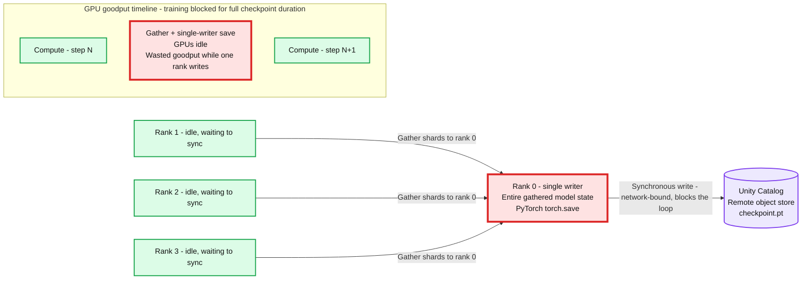
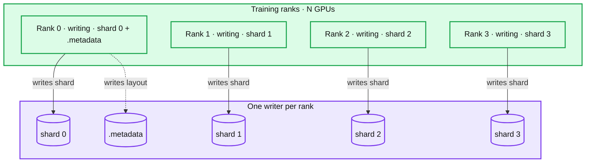
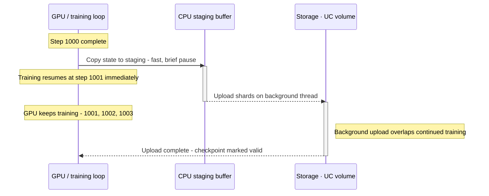
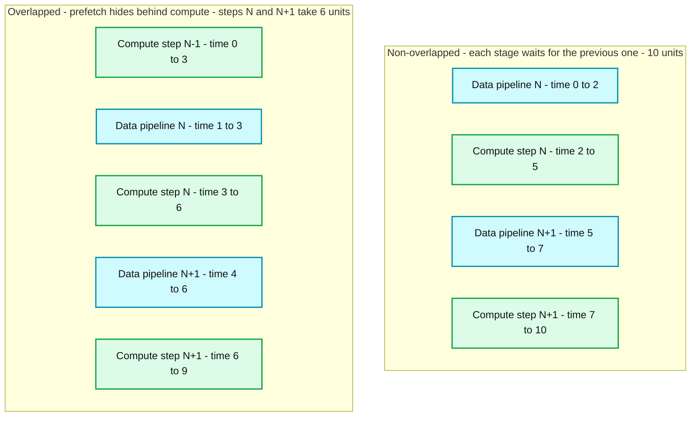
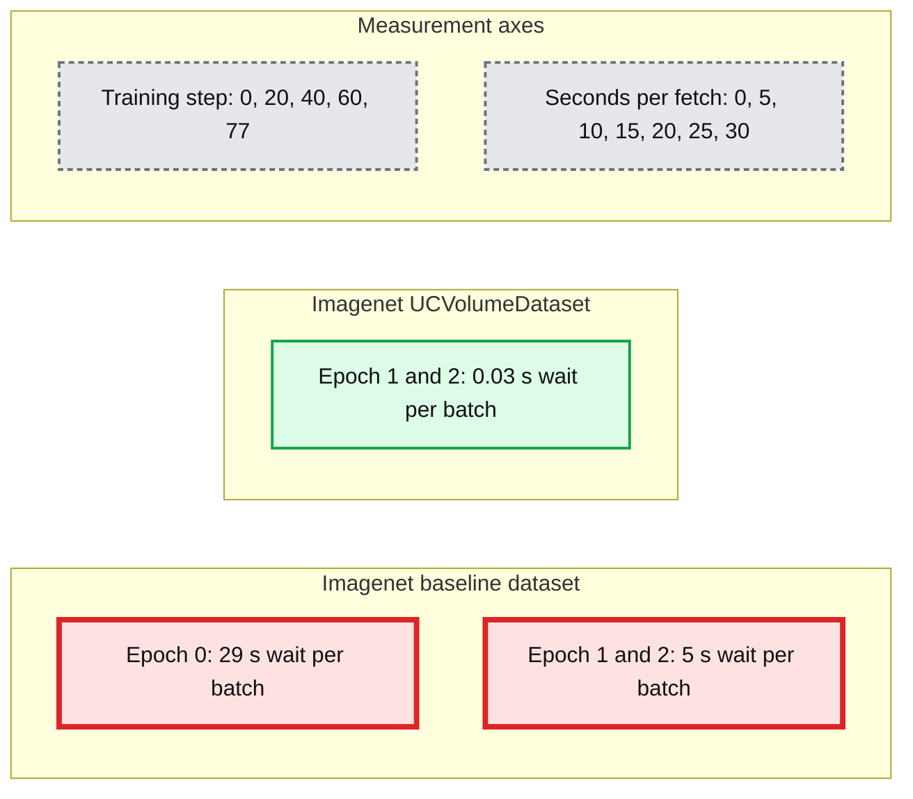

# Fast, fault-tolerant PyTorch training on AI Runtime

*How dataloading and checkpointing choices decide your GPU utilization, recovery cost, and training bill at scale and the AI Runtime APIs that get them right.*

- Source: https://www.databricks.com/blog/fast-fault-tolerant-pytorch-training-ai-runtime
- Published: 2026-08-28
- Authors: Bruce Fontaine
- Categories: engineering, data-science-machine-learning, databricks-ai, ai-engineering
- Images: 7 total, 7 extracted as architecture

**Key takeaways**

- At scale, GPU failures are the expected case, not the exception, code must be built to survive them.
- Torch’s distributed asynchronous checkpoint saves make frequent checkpointing nearly free, enabling more frequent checkpointing and cutting recovery cost.
- Model checkpointing by itself is not sufficient, checkpointing the data pipeline prevents silent training-data corruption on resume.

At scale, your training efficiency is determined by a single metric: "[goodput](https://cloud.google.com/blog/products/ai-machine-learning/goodput-metric-as-measure-of-ml-productivity)", the proportion of time your GPUs spend on productive computation rather than waiting or recovering from failures. Because GPU failures are the expected case at scale, the ability to rapidly and automatically recover from a failure is the only way to maintain high goodput and manage your total GPU spend.

Two subsystems make or break that recovery, yet both are routinely treated as afterthoughts: the data pipeline that feeds your accelerators, and the checkpointing mechanism that snapshots state so a job can resume. Get either one wrong and every failure costs you far more idle GPU time than it should. Even outside of failure scenarios, a data pipeline that can't keep pace with your accelerators will silently starve your GPUs and erode goodput just as surely as a crash would. We'll walk through the mechanisms and trade-offs of both, and how each one shapes your goodput and total GPU spend. See the companion[Training performance and resiliency guide](https://docs.databricks.com/machine-learning/ai-runtime/guides/performance-and-resiliency) for code pointers and examples.

For the *infrastructure* side of the same problem, how a fleet detects and isolates unhealthy GPUs before they take down a job, see the companion post, [How we keep GPUs reliable across Databricks AI](https://www.databricks.com/blog/how-we-keep-gpus-reliable-across-databricks-ai).

## Why failures are the expected case at scale

As the number of GPUs in a job grows, the probability that it survives its full duration without an interruption falls rapidly. A useful back-of-the-envelope model from the companion Databricks post assumes each GPU carries roughly a 1% annualized failure rate. Under that assumption, [the post notes](https://www.databricks.com/blog/how-we-keep-gpus-reliable-across-databricks-ai) that "a 256-GPU job running for 30 days has about a 19% chance of seeing a failure. At 1,024 GPUs, that climbs to 57%." and these are just infrastructure level issues.

To ground that estimate in reality, the [608 H100 GPUs delta super computer](https://arxiv.org/html/2503.11901v4) saw failures every 1.9 hours, this means that for a 32 GPU job, the average time to failure would be 36 hours. The main take away, is that your training job will likely fail at some point and making the correct decisions can make your model resilient and reduce the total time lost when it happens.

## Impact 1: Checkpoint format decides how often you can afford to save

Checkpointing is where resilience is won or lost, and the mechanism you choose has a first-order effect on how frequently you can save. This is the single biggest lever on your goodput: if you checkpoint once a day, then a failure requires rerunning on average 12 hours of duplicate work to bring your back to the state it was in when the failure occurred.

### The monolithic torch.save bottleneck

The first checkpoint most teams write is a simple torch.save on rank 0. Depending on how your model is trained, potentially two issues:

1. For distributed training, it gathers all states to rank 0 and writes a single file.
2. A single process writes the entire checkpoint to sync synchronously. This can be blocked on things like network transfers when saving to remote object stores like Unity Catalog (UC).

**Summary:** PyTorch checkpointing gathers model shards onto rank 0 for a synchronous write to Unity Catalog, leaving other GPUs idle and blocking training.

**Components:**

- Rank 1: distributed training worker, idle and waiting to sync.
- Rank 2: distributed training worker, idle and waiting to sync.
- Rank 3: distributed training worker, idle and waiting to sync.
- Rank 0: single PyTorch writer holding the entire gathered model state and using `torch.save(state, uc://…)`.
- Unity Catalog: remote object store receiving `checkpoint.pt`.
- GPU goodput timeline: compute step N, gather and single-writer save with GPUs idle, then compute step N+1.
- Blocking labels: network-bound write blocks the loop for the full checkpoint duration, wasting goodput while one rank writes.

**Flows:**

- Rank 1 -> Rank 0: gather model shards.
- Rank 2 -> Rank 0: gather model shards.
- Rank 3 -> Rank 0: gather model shards.
- Rank 0 -> Unity Catalog: synchronous checkpoint write, network-bound and blocking the training loop.

**Numbers:** Rank identifiers 0, 1, 2, and 3; symbolic compute steps N and N+1. No numerical durations or sizes are shown.

source image: https://www.databricks.com/sites/default/files/blog_images/fast-fault-tolerant-pytorch-training-on-ai-blog-img-1.png

This blocking behaviour leaves your GPUs idle, reducing your goodput. But there is a way to reduce the amount of time your GPU spends checkpointing: Torch’s distributed checkpoint API.

### Distributed checkpoint (DCP): every rank writes its own shard

PyTorch's distributed checkpoint inverts the design. Every rank writes its own distinct shard in parallel, alongside a small `.metadata` file describing how the shards compose into the full tensors.

**Summary:** Four GPU training ranks write their own checkpoint shards in parallel, while Rank 0 also writes the layout to a `.metadata` file.

**Components:**

- Training ranks · N GPUs: GPU training group containing Rank 0 through Rank 3.
- Rank 0: GPU training rank marked writing, responsible for shard 0 and `.metadata`.
- Rank 1: GPU training rank marked writing, responsible for shard 1.
- Rank 2: GPU training rank marked writing, responsible for shard 2.
- Rank 3: GPU training rank marked writing, responsible for shard 3.
- One writer per rank: storage group containing the checkpoint outputs.
- shard 0: checkpoint shard storage for Rank 0.
- shard 1: checkpoint shard storage for Rank 1.
- shard 2: checkpoint shard storage for Rank 2.
- shard 3: checkpoint shard storage for Rank 3.
- `.metadata`: layout metadata storage written by Rank 0. Storage technology is unspecified.

**Flows:**

- Rank 0 -> shard 0: writes checkpoint shard.
- Rank 1 -> shard 1: writes checkpoint shard.
- Rank 2 -> shard 2: writes checkpoint shard.
- Rank 3 -> shard 3: writes checkpoint shard.
- Rank 0 -> .metadata: writes layout.

**Numbers:** N GPUs; rank identifiers 0, 1, 2, 3; shard identifiers 0, 1, 2, 3; one writer per rank.

source image: https://www.databricks.com/sites/default/files/blog_images/fast-fault-tolerant-pytorch-training-on-ai-blog-img-2.png

Saving time decreases roughly as 1/N with the number of ranks and, because the `.metadata` file records the global layout, the same checkpoint can reload onto a *different* number of GPUs. DCP re-plans which bytes each new rank needs, so recovering onto a reduced-capacity cluster after losing nodes just works.

### DCP is worth it even for plain data-parallel jobs

A common assumption is that DCP is only for sharded models, that a data-parallel (DDP) job, where every rank holds an identical replica of the weights, has nothing to gain. Not so, DCP shards the model state and writes it in parallel across each worker even for DDP training tasks.

It is also the same API you will need the day you move to FSDP or tensor parallelism, so adopting it early means you never rewrite resilience code at the worst possible time.

### Asynchronous saves make frequency nearly free

Even with parallel writes, a synchronous save blocks training until the bytes are durable in storage, for a large checkpoint to a remote volume, tens of seconds of idle accelerator time. `async_save` splits the operation: a fast copy to a staging buffer, then a background upload that overlaps continued training.

**Summary:** Checkpoint state copies from the GPU training loop to a CPU staging buffer during a brief pause, then uploads to storage in the background while training continues.

**Components:**
- GPU / training loop: GPU compute, completing step 1000 and continuing through steps 1001, 1002, and 1003.
- CPU staging buffer: CPU memory holding staged checkpoint state.
- Storage · UC volume: UC volume storing uploaded checkpoint shards.
- Time: downward progression of staging, continued training, and upload completion.

**Flows:**
- GPU / training loop -> CPU staging buffer: copy state to staging with a fast, brief pause.
- CPU staging buffer -> Storage · UC volume: upload shards on a background thread, overlapping continued training.
- Storage · UC volume -> GPU / training loop: signal upload completion and mark the checkpoint valid.

**Numbers:** Step 1000 complete; training resumes immediately at step 1001; continued GPU training at steps 1001, 1002, and 1003. No durations or sizes are shown.

source image: https://www.databricks.com/sites/default/files/blog_images/fast-fault-tolerant-pytorch-training-on-ai-blog-img-3.png

The training loop pays only for the staging copy, not the upload. A checkpoint that used to cost tens of seconds of idle time now costs almost nothing, which is exactly what makes the frequent checkpointing in the next section affordable.

On AI Runtime, `UCVolumeWriter` and `UCVolumeReader` implement DCP against UC volumes, staging I/O through local NVMe and marking a checkpoint complete only once its data has fully landed. See the [performance and resiliency guide](https://docs.databricks.com/machine-learning/ai-runtime/guides/performance-and-resiliency) for full details and code examples.

| Training Job | Savings of async_save over torch.save |
|---|---|
| DDP LLM with 2.8B parameters on 32xH100 | 1.8x (36s vs 66s) |
| FSPD LLM with 20B parameters on 32xH100 | 58x (522s vs 9s) |

The above excludes the network storage time for torch.save.

## Impact 2: Checkpoint frequency decides your recovery cost

This is where the pieces compound. When a job fails, it loses everything since the last valid checkpoint and must recompute it. So the *expected* wasted work per failure is about half the checkpoint interval and cheap async saves let you make that interval small.

Cutting the interval by a factor of 10 cuts expected time to recover by a factor of 10. Recall the Llama 3 figure of ~8.6 interruptions per day: at that failure rate, checkpointing every 2 hours means you expect to waste 8.6 hours per day on retraining, a goodput of 64%. Checkpointing every 30 minutes, you only spend 2.15 hours, a goodput of 91%.

The recovery must also be *automatic*. On restart, the job should find the most recent checkpoint that finished writing, skipping any left half-written by the crash, and resume from it with no human in the loop. DCP makes this reliable: the `.metadata` file is written only after all shards land, so its presence is a trustworthy "this save is complete" marker to select on.

**Summary:** Parallel saves through DCP enable asynchronous checkpointing, making frequent checkpoints affordable and bounding recovery cost.

**Components:**
- DCP: Makes saves parallel using DCP.
- ASYNC: Makes saves nearly free using asynchronous saving.
- FREQUENCY: Low-cost saves allow frequent checkpointing.
- RECOVERY: Frequent checkpoints bound recovery cost.

**Flows:**
- DCP -> ASYNC: Parallel saves enable nearly free asynchronous saves.
- ASYNC -> FREQUENCY: Low-cost saves enable frequent checkpoints.
- FREQUENCY -> RECOVERY: Frequent checkpoints bound recovery cost.

**Numbers:** 1, 2, 3, 4 are the stage numbers.

source image: https://www.databricks.com/sites/default/files/blog_images/fast-fault-tolerant-pytorch-training-on-ai-blog-img-4.png

## Impact 3: Dataloading decides whether your GPUs are ever idle

A training job proceeds at the speed of its slowest input. When accelerators wait on the next batch, your goodput is reduced as your GPUs are simply idle. The only way to fix this issue is to ensure that your input pipeline overlaps data preparation for the next step with computation on the current one as seen in the figure below:

**Summary:** Overlapping data preparation with compute reduces the illustrated time for steps N and N+1 from 10 units to 6 units.

**Components:**

- Non-overlapped: each stage waits for the previous one.
- Data pipeline N: batch preparation, technology unspecified.
- Compute step N: computation, technology unspecified.
- Data pipeline N+1: next batch preparation, technology unspecified.
- Compute step N+1: next computation, technology unspecified.
- Overlapped: prefetch hides behind compute.
- Compute step N-1: preceding computation, technology unspecified.
- Data pipeline N: preparation overlaps compute step N-1.
- Compute step N: computation overlaps preparation for N+1.
- Data pipeline N+1: preparation overlaps compute step N.
- Compute step N+1: computation follows compute step N.
- Time axis: time in units.

**Flows:**

- none. No arrows are shown; bar positions indicate timing and overlap.

**Numbers:**

- Time axis ticks: 0, 1, 2, 3, 4, 5, 6, 7, 8, 9, 10 units.
- Step indices: N-1, N, N+1.
- Non-overlapped intervals: data N 0-2; compute N 2-5; data N+1 5-7; compute N+1 7-10.
- Non-overlapped annotation: steps N + N+1 = 10 units.
- Overlapped intervals: compute N-1 0-3; data N 1-3; compute N 3-6; data N+1 4-6; compute N+1 6-9.
- Overlapped annotation: compute N + N+1 = 6 units.

source image: https://www.databricks.com/sites/default/files/blog_images/fast-fault-tolerant-pytorch-training-on-ai-blog-img-5.png

We often see customers that shift to overlapping dataloading with compute see a 20–50% decrease in wall-clock time.

### The cost of reading straight from remote storage

On a governed platform, training data lives in remote object storage. On AI Runtime, Unity Catalog (UC) volumes are surfaced as network mounts.

Reading files directly from that mount on every access binds your step time to network latency and re-downloads the same files every epoch. The fix is a dataloader that copies each file to fast local storage on first access, serves subsequent reads from that local cache, and fetches upcoming files in parallel while the GPU computes.

**Summary:** Files from a UC volume are copied through a network mount to a local NVMe cache on first access, then served locally and prefetched while the GPU computes.

**Components:**
- UC volume: remote object storage.
- Mount path: network-mounted files at `/Volumes/...`.
- Local NVMe cache: fast local file copies.
- Decode · augment · GPU: decoding, augmentation, and GPU training.
- Remote to local cache: transfer paid once, on first access.
- Cache to GPU: local access every step.

**Flows:**
- UC volume -> mount path: network-mounted reads with latency on every read.
- Mount path -> local NVMe cache: copy on first access, once per file.
- Local NVMe cache -> decode · augment · GPU: cached path served instantly.
- Local NVMe cache -> decode · augment · GPU: prefetch in parallel while the GPU computes.

**Numbers:** none

```mermaid
%% Files move from remote UC storage to local NVMe cache and GPU training
flowchart LR
    A[(UC volume<br/>remote object store)]
    B[Mount path<br/>/Volumes/...]
    C[Local NVMe cache<br/>fast local copy]
    D[Decode · augment · GPU<br/>training step]

    A -->|Network mount - latency on every read| B
    B -->|Copy on first access - once per file| C
    C -->|Cached path - served instantly| D
    C -.->|Prefetched in parallel while GPU computes| D

    classDef client fill:#dbeafe,stroke:#2563eb,stroke-width:2px,color:#111
    classDef service fill:#dcfce7,stroke:#16a34a,stroke-width:2px,color:#111
    classDef store fill:#ede9fe,stroke:#7c3aed,stroke-width:2px,color:#111
    classDef cache fill:#fef3c7,stroke:#d97706,stroke-width:2px,color:#111
    classDef queue fill:#cffafe,stroke:#0891b2,stroke-width:2px,color:#111
    classDef critical fill:#fee2e2,stroke:#dc2626,stroke-width:4px,color:#111
    classDef external fill:#e5e7eb,stroke:#6b7280,stroke-width:2px,color:#111,stroke-dasharray:4 3
    classDef decision fill:#fce7f3,stroke:#db2777,stroke-width:2px,color:#111
    class A,B store
    class C cache
    class D service
```

source image: https://www.databricks.com/sites/default/files/blog_images/fast-fault-tolerant-pytorch-training-on-ai-blog-img-6.png

With AI Runtime, `UCVolumeDataset` and `DataLoader` do exactly this (see [the guide](https://docs.databricks.com/aws/en/machine-learning/ai-runtime/guides/performance-and-resiliency#load-data-efficiently-to-minimize-idle-gpu-time) for code examples) . `UCVolumeDataset` streams files from a UC volume, caching each one to local NVMe on first access, and partitions files across ranks and workers so every accelerator gets a disjoint, non-overlapping slice. Our `DataLoader` is a drop-in subclass of the PyTorch `DataLoader` whose **defaults are tuned for this path**, so files are fetched and cached concurrently while the GPU computes instead of one at a time on the training thread.

### Example: training an image model off UC files

Consider a straightforward image-classification workload: decode JPEGs from a UC volume, augment, and train a vision model. Let’s look at two ways to do this on the same GPU, model, and batch size: the stock PyTorch `Dataset` reading from a UC volume versus `UCVolumeDataset` plus the Databricks `DataLoader` defaults.

| **Metric (per GPU, steady state)** | **Stock PyTorch ****DataLoader****, reading directly from UC** | **UCVolumeDataset**** + databricks ****DataLoader** |
|---|---|---|
| Epoch 1 Throughput (images/sec) | 57.2 | 417 |
| Epoch 2 Throughput (images/sec) | 371.6 | 6590 |
| GPU utilization (%) | 12.6% | 53.3% |

### You don't have to guess where the time goes

As part of engineering `DataLoader`, we’ve ensured that it logs its metrics to MLFlow, making it easy to tell at a glance if your data pipeline is blocking training.

**Summary:** ImageNet batch fetch times show the baseline waiting 29 seconds per batch in epoch 0 and 5 seconds in epochs 1 and 2, while UCVolumeDataset waits 0.03 seconds in epochs 1 and 2.

**Components:**

- Imagenet UCVolumeDataset: red series showing batch fetch time using UCVolumeDataset.
- Imagenet baseline dataset: blue-gray series showing baseline batch fetch time.
- Seconds per fetch: vertical axis measuring batch wait time.
- Training step: horizontal axis tracking training progress.

**Flows:**

- none. The lines connect measurements; no arrows are shown.

**Numbers:**

- Vertical axis, seconds per fetch: 0, 5, 10, 15, 20, 25, 30.
- Horizontal axis, training step: 0, 20, 40, 60, 77.
- Baseline epoch 0: 29 s wait per batch.
- Baseline epochs 1 and 2: 5 s wait per batch.
- UCVolumeDataset epochs 1 and 2: 0.03 s wait per batch.

source image: https://www.databricks.com/sites/default/files/blog_images/fast-fault-tolerant-pytorch-training-on-ai-blog-img-7.png

The metric `fetch_seconds` measures explicitly how long it takes the dataloader to produce a batch and during this time your GPU is sitting idle.

## Impact 4: Forgetting the data pipeline silently corrupts your model

There is one last resilience bug that produces no error message, no crash, and no failed job, just a model that is subtly worse than it should be. It happens when you checkpoint the model, optimizer, and step, but *not* the position of your data pipeline within the dataset.

Consider a job interrupted partway through an epoch. It restores the model correctly and resumes the training loop but the dataloader starts over from the beginning of the dataset.

The resumed job re-trains on examples it already saw this epoch and potentially skips the ones it hadn't reached yet. Across the many restarts that scale makes routine, this silently biases your data distribution. The model still trains; it just trains on the wrong sampling of your data, precisely the kind of *silent* failure that’s the most costly, because the job completes and nobody sees a problem until the metrics are disappointing.

The fix is to treat data position as part of the checkpoint. Depending on your pipeline, that means tracking a sample or shard offset and skipping ahead on resume, having a custom dataset serialize its own position, or checkpointing at epoch boundaries. All of these rest on one prerequisite: **determinism.** Shuffling and augmentation draw from random number generators, so those seeds and RNG states must be part of the checkpoint too, otherwise the data order after a restart won't match the order before it, and a saved position points at the wrong samples.

Seed, reproducible order, and resumable data pipeline are three expressions of a single idea. The [guide](https://docs.databricks.com/aws/en/machine-learning/ai-runtime/guides/performance-and-resiliency#checkpoint-the-data-pipeline) covers each strategy with code.

## Summary

Fast, fault-tolerant training comes from a handful of decisions that compound:

1. **Use Distributed Checkpoint instead of **`torch.save`, even for DDP, so saves are parallel and cheap rather than a serial bottleneck.
2. **Save asynchronously so checkpoints are nearly free**, which lets you save *often*.
3. **Recover automatically to the most recent valid checkpoint**, so a failure costs minutes of recomputation, not hours.
4. **Overlap data loading with compute** by caching and prefetching from remote storage so accelerators never idle waiting for input. This is recurring GPU-hours saved on every step.
5. **Checkpoint the data pipeline and RNG state**, so a resumed job continues on the correct data instead of silently corrupting your model.

The unifying principle: frequent, inexpensive, complete checkpoints turn a hardware failure from a job-ending event into a rounding error, and an overlapped input pipeline keeps the accelerators busy in between. Cheap (async) saves make frequency affordable; complete saves (model, data, and RNG) make recovery correct. With both in place, and a fleet that [detects and isolates failing hardware](https://www.databricks.com/blog/how-we-keep-gpus-reliable-across-databricks-ai), your effective training time approaches the ceiling the hardware allows, regardless of how flaky the cluster underneath it is.

## References

- Meta, [The Llama 3 Herd of Models](https://arxiv.org/abs/2407.21783) (2024): §3.3.1, training reliability and interruption breakdown on up to 16,384 H100 GPUs.
- [Characterizing the Resilience of Hopper H100 and Ampere A100 GPUs](https://arxiv.org/html/2503.11901v4) (2025): 2.5-year field study of the Delta system; MTBE and failure probability by job size.
- Databricks, [How we keep GPUs reliable across Databricks AI](https://www.databricks.com/blog/how-we-keep-gpus-reliable-across-databricks-ai): fleet-level GPU health checking and the probabilistic failure model.

Ready to try it? See the [Training performance and resiliency guide](https://docs.databricks.com/machine-learning/ai-runtime/guides/performance-and-resiliency) in the Databricks AI Runtime docs for the full code, and read [How we keep GPUs reliable across Databricks AI](https://www.databricks.com/blog/how-we-keep-gpus-reliable-across-databricks-ai) for the infrastructure side of the story.
