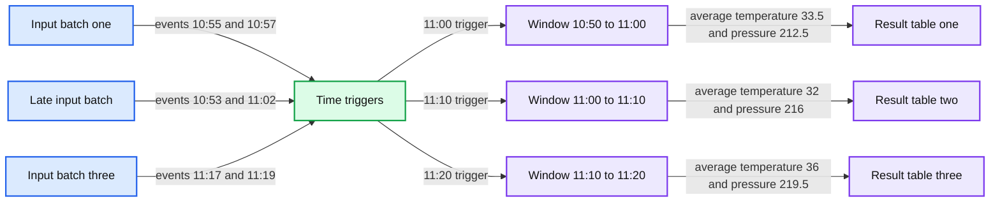
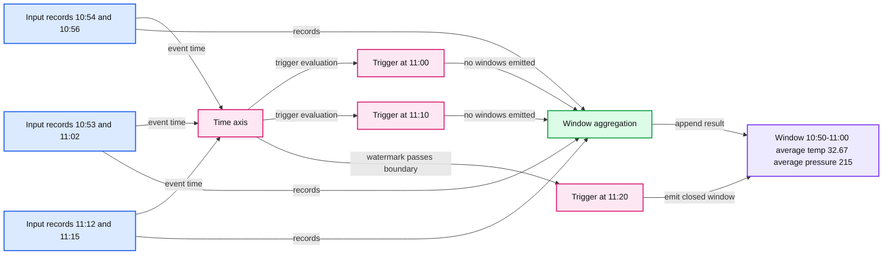
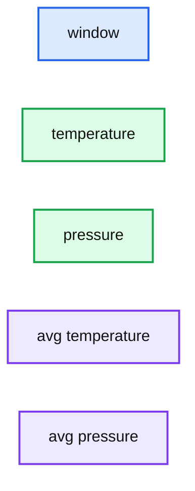

# Feature Deep Dive: Watermarking in Apache Spark Structured Streaming

- Source: https://www.databricks.com/blog/feature-deep-dive-watermarking-apache-spark-structured-streaming
- Published: 2022-08-22
- Authors: Max Fisher
- Categories: product, data-streaming
- Images: 3 total, 3 extracted as architecture

## Key Takeaways

- Watermarks help Spark understand the processing progress based on event time, when to produce windowed aggregates and when to trim the aggregations state
- When joining streams of data, Spark, by default, uses a single, global watermark that evicts state based on the minimum event time seen across the input streams
- RocksDB can be leveraged to reduce pressure on cluster memory and GC pauses
- StreamingQueryProgress and [StateOperatorProgress](https://spark.apache.org/docs/latest/api/java/org/apache/spark/sql/streaming/StateOperatorProgress.html#numRowsDroppedByWatermark--) objects contain key information about how watermarks affect your stream

## Introduction

When building real-time pipelines, one of the realities that teams have to work with is that distributed data ingestion is inherently unordered. Additionally, in the context of stateful [streaming](https://www.databricks.com/product/data-streaming) operations, teams need to be able to properly track event time progress in the stream of data they are ingesting for the proper calculation of time-window aggregations and other stateful operations. We can solve for all of this using Structured Streaming.

For example, let’s say we are a team working on building a pipeline to help our company do proactive maintenance on our mining machines that we lease to our customers. These machines always need to be running in top condition so we monitor them in real-time. We will need to perform stateful aggregations on the streaming data to understand and identify problems in the machines.

This is where we need to leverage Structured Streaming and Watermarking to produce the necessary stateful aggregations that will help inform decisions around predictive maintenance and more for these machines.

## What Is Watermarking?

Generally speaking, when working with real-time streaming data there will be delays between event time and processing time due to how data is ingested and whether the overall application experiences issues like downtime. Due to these potential variable delays, the engine that you use to process this data needs to have some mechanism to decide when to close the aggregate windows and produce the aggregate result.

While the natural inclination to remedy these issues might be to use a fixed delay based on the wall clock time, we will show in this upcoming example why this is not the best solution.

To explain this visually let’s take a scenario where we are receiving data at various times from around 10:50 AM → 11:20 AM. We are creating 10-minute tumbling windows that calculate the average of the temperature and pressure readings that came in during the windowed period.

In this first picture, we have the tumbling windows trigger at 11:00 AM, 11:10 AM and 11:20 AM leading to the result tables shown at the respective times. When the second batch of data comes around 11:10 AM with data that has an event time of 10:53 AM this gets incorporated into the temperature and pressure averages calculated for the 11:00 AM → 11:10 AM window that closes at 11:10 AM, which does not give the correct result.

**Summary:** The diagram shows Apache Spark Structured Streaming processing temperature and pressure event batches into tumbling-window averages, including a late event.

**Components:**

- Input Stream: streaming batches of event-time, temperature, and pressure records
- Time: event-time timeline with triggers at 11:00, 11:10, and 11:20
- Result Tables: windowed average temperature and pressure outputs
- Late Event: red-highlighted event with event time 10:53

**Flows:**

- Input Stream -> Time: event records ordered by arrival and event time
- Time -> Result Tables: 10-minute triggers produce windowed aggregates
- Late Event -> 10:50 to 11:00 window: late event is incorporated into the earlier aggregate
- Input Stream -> 11:10 trigger: second batch arrives with late data
- Input Stream -> 11:20 trigger: third batch arrives with later events

**Numbers:** 10:55, 33, 212, 10:57, 34, 213, 10:53, 31, 220, 11:02, 33, 212, 11:17, 35, 219, 11:19, 37, 220, 11:00, 11:10, 11:20, 10 min, 10:50-11:00, 33.5, 212.5, 11:00-11:10, 32, 216, 11:10-11:20, 36, 219.5

source image: https://www.databricks.com/sites/default/files/inline-images/db-197-blog-img-1.png?v=1661798880

To ensure we get the correct results for the aggregates we want to produce, we need to define a **watermark** that will allow Spark to understand when to close the aggregate window and produce the correct aggregate result.

In Structured Streaming applications, we can ensure that all relevant data for the aggregations we want to calculate is collected by using a feature called **watermarking.** In the most basic sense, by defining a **watermark** Spark Structured Streaming then knows when it has ingested all data up to some time, **T**, (based on a set lateness expectation) so that it can close and produce windowed aggregates up to timestamp **T**.

This second visual shows the effect of implementing a watermark of 10 minutes and using Append mode in Spark Structured Streaming.

**Summary:** The diagram shows how a 10-minute watermark delays a Structured Streaming windowed aggregation until the watermark passes the window boundary.

**Components:**

- Input Stream with event time, temperature, and pressure records
- Time axis tracking event-time progress
- Result Tables using 10-minute triggers, 10-minute watermark, and Append Mode
- Windowed aggregation with average temperature and average pressure

**Flows:**

- Input Stream -> Time: event-time records advance time
- Time -> Result Tables: triggers evaluate whether windows can be emitted
- Input Stream -> Result Tables: records contribute to windowed averages
- Result Tables -> Result Tables: the 10:50-11:00 window is emitted once the watermark passes its upper bound

**Numbers:** 10:54, 33, 212, 10:56, 34, 213, 10:53, 31, 220, 11:02, 33, 212, 11:12, 35, 219, 11:15, 37, 220, 10:56, 10:59, 11:00, 11:03, 11:07, 11:10, 11:15, 11:18, 11:20, 10 min. Triggers, 10 min. Watermark, 10:50-11:00, 32.67, 215

source image: https://www.databricks.com/sites/default/files/inline-images/db-197-blog-img-2.png?v=1661798880

Unlike the first scenario where Spark will emit the windowed aggregation for the previous ten minutes every ten minutes (i.e. emit the 11:00 AM →11:10 AM window at 11:10 AM), Spark now waits to close and output the windowed aggregation once **the max event time seen minus the specified watermark is greater than the upper bound of the window.**

In other words, Spark needed to wait until it saw data points where the latest event time seen minus 10 minutes was greater than 11:00 AM to emit the 10:50 AM → 11:00 AM aggregate window. At 11:00 AM, it does not see this, so it only initializes the aggregate calculation in Spark’s internal state store. At 11:10 AM, this condition is still not met, but we have a new data point for 10:53 AM so the internal state gets updated, just **not emitted.** Then finally by 11:20 AM Spark has seen a data point with an event time of 11:15 AM and since 11:15 AM minus 10 minutes is 11:05 AM which is later than 11:00 AM the 10:50 AM → 11:00 AM window can be emitted to the result table.

This produces the correct result by properly incorporating the data based on the expected lateness defined by the watermark. Once the results are emitted the corresponding state is removed from the state store.

### Incorporating Watermarking into Your Pipelines

To understand how to incorporate these watermarks into our Structured Streaming pipelines, we will explore this scenario by walking through an actual code example based on our use case stated in the introduction section of this blog.

Let’s say we are ingesting all our sensor data from a Kafka cluster in the cloud and we want to calculate temperature and pressure averages every ten minutes with an expected time skew of ten minutes. The Structured Streaming pipeline with watermarking would look like this:

**PySpark**

Here we simply read from Kafka, apply our transformations and aggregations, then write out to Delta Lake tables which will be visualized and monitored in Databricks SQL. The output written to the table for a particular sample of data would look like this:

**Summary:** Structured Streaming output table showing windowed temperature and pressure values with their averages.

**Components:**

- window
- temperature
- pressure
- avg temperature
- avg pressure

**Flows:**

- none

**Numbers:** 1, 2, 3, 4, 5, 33.03, 289, 33.030000, 30.83, 245, 30.830000, 64.64, 383, 64.640000, 55.90, 237, 55.900000, 35.73, 299, 35.730000, 2021-08-29T05:50:00.000+0000, 2021-08-29T06:00:00.000+0000, 2021-07-23T07:40:00.000+0000, 2021-07-23T07:50:00.000+0000, 2021-04-23T21:10:00.000+0000, 2021-04-23T21:20:00.000+0000, 2021-05-10T18:40:00.000+0000, 2021-05-10T18:50:00.000+0000, 2021-06-12T04:10:00.000+0000, 2021-06-12T04:20:00.000+0000

source image: https://www.databricks.com/sites/default/files/inline-images/db-197-blog-img-3.png?v=1661798880

To incorporate watermarking we first needed to identify two items:

1. The column that represents the event time of the sensor reading
2. The estimated expected time skew of the data

Taken from the previous example, we can see the watermark defined by the `.withWatermark()` method with the eventTimestamp column used as the event time column and 10 minutes to represent the time skew that we expect.

**PySpark**

Now that we know how to implement watermarks in our Structured Streaming pipeline, it will be important to understand how other items like streaming join operations and managing state are affected by watermarks. Additionally, as we scale our pipelines there will be key metrics our data engineers will need to be aware of and monitor to avoid performance issues. We will explore all of this as we dive deeper into watermarking.

### Watermarks in Different Output Modes

Before we dive deeper, it is important to understand how your choice of output mode affects the behavior of the watermarks you set.

Watermarks can only be used when you are running your streaming application in **append** or **update** output modes. There is a third output mode, complete mode, in which the entire result table is written to storage. This mode cannot be used because it requires all aggregate data to be preserved, and hence cannot use watermarking to drop intermediate state.

The implication of these output modes in the context of window aggregation and watermarks is that in ‘append’ mode an aggregate can be produced only once and can not be updated. Therefore, once the aggregate is produced, the engine can delete the aggregate’s state and thus keep the overall aggregation state bounded. Late records – the ones for which the approximate watermark heuristic did not apply (they were older than the watermark delay period), therefore have to be dropped by necessity – the aggregate has been produced and the aggregate state deleted.

Inversely, for ‘update’ mode, the aggregate can be produced repeatedly starting from the first record and on each received record, thus a watermark is optional. The watermark is only useful for trimming the state once heuristically the engine knows that no more records for that aggregate can be received. Once the state is deleted, again any late records have to be dropped as the aggregate value has been lost and can’t be updated.

It is important to understand how state, late-arriving records, and the different output modes could lead to different behaviors of your application running on Spark. The main takeaway here is that in both append and update modes, once the watermark indicates that all data is received for an aggregate time window, the engine can trim the window state. In append mode the aggregate is produced only at the closing of the time window plus the watermark delay while in update mode it is produced on every update to the window.

Lastly, by increasing your watermark delay window you will cause the pipeline to wait longer for data and potentially drop less data – higher precision, but also higher latency to produce the aggregates. On the flip side, smaller watermark delay leads to lower precision but also lower latency to produce the aggregates.

| Window Delay Length | Precision | Latency |
|---|---|---|
| Longer Delay Window | Higher Precision | Higher Latency |
| Shorter Delay Window | Lower Precision | Lower Latency |

## Deeper Dive into Watermarking

### Joins and Watermarking

There are a couple considerations to be aware of when doing join operations in your streaming applications, specifically when joining two streams. Let’s say for our use case, we want to join the streaming dataset about temperature and pressure readings with additional values captured by other sensors across the machines.

There are three overarching types of stream-stream joins that can be implemented in Structured Streaming: inner, outer, and semi joins. The main problem with doing joins in streaming applications is that you may have an incomplete picture of one side of the join. Giving Spark an understanding of when there are no future matches to expect is similar to the earlier problem with aggregations where Spark needed to understand when there were no new rows to incorporate into the calculation for the aggregation before emitting it.

To allow Spark to handle this, we can leverage a combination of watermarks and event-time constraints within the join condition of the stream-stream join. This combination allows Spark to filter out late records and trim the state for the join operation through a time range condition on the join. We demonstrate this in the example below:

**PySpark**

However, unlike the above example, there will be times where each stream may require different time skews for their watermarks. In this scenario, Spark has a policy for handling multiple watermark definitions. Spark maintains **one global watermark** that is based on the slowest stream to ensure the highest amount of safety when it comes to not missing data.

Developers do have the ability to change this behavior by changing `spark.sql.streaming.multipleWatermarkPolicy` to `max;` however, this means that data from the slower stream will be dropped.

To see the full range of join operations that require or could leverage watermarks check out [this section](https://spark.apache.org/docs/latest/structured-streaming-programming-guide.html#support-matrix-for-joins-in-streaming-queries) of Spark's documentation.

### Monitoring and Managing Streams with Watermarks

When managing a streaming query where Spark may need to manage millions of keys and keep state for each of them, the default state store that comes with Databricks clusters may not be effective. You might start to see higher memory utilization, and then longer garbage collection pauses. These will both impede the performance and scalability of your Structured Streaming application.

This is where RocksDB comes in. You can leverage RocksDB natively in Databricks by enabling it like so in the Spark configuration:

This will allow the cluster running the Structured Streaming application to leverage RocksDB which can more efficiently manage state in the native memory and take advantage of the local disk/SSD instead of keeping all state in memory.

Beyond tracking memory usage and garbage collection metrics, there are other key indicators and metrics that should be collected and tracked when dealing with Watermarking and Structured Streaming. To access these metrics you can look at the StreamingQueryProgress and the [StateOperatorProgress](https://spark.apache.org/docs/latest/api/java/org/apache/spark/sql/streaming/StateOperatorProgress.html#numRowsDroppedByWatermark--) objects. Check out our documentation for examples of how to use these [here](https://docs.databricks.com/spark/latest/structured-streaming/production.html#monitoring-streaming-queries).

In the StreamingQueryProgress object, there is a method called "eventTime" that can be called and that will return the **max**, **min**, **avg**, and **watermark** timestamps. The first three are the max, min, and average event time seen **in that trigger.** The last one **is the watermark used in the trigger.**

**Abbreviated Example of a StreamingQueryProgress object**

These pieces of information can be used to reconcile the data in the result tables that your streaming queries are outputting and also be used to verify that the watermark being used is the intended eventTime timestamp. This can become important when you are joining streams of data together.

Within the StateOperatorProgress object there is the **numRowsDroppedByWatermark** metric. This metric will show how many rows are being considered too late to be included in the stateful aggregation. Note that this metric is measuring rows dropped *post-aggregation* and not the raw input rows, so the number is not precise but can give an indication that there is late data being dropped. This, in conjunction with the information from the StreamingQueryProgress object, can help developers determine whether the watermarks are correctly configured.

### Multiple Aggregations, Streaming, and Watermarks

One remaining limitation of Structured Streaming queries is chaining multiple stateful operators (e.g. aggregations, streaming joins) in a single streaming query. This limitation of a singular global watermark for stateful aggregations is something that we at Databricks are working on a solution for and will be releasing more information about in the coming months. Check out our blog on Project Lightspeed to learn more: [Project Lightspeed: Faster and Simpler Stream Processing With Apache Spark (databricks.com)](https://www.databricks.com/blog/2022/06/28/project-lightspeed-faster-and-simpler-stream-processing-with-apache-spark.html).

## Conclusion

With Structured Streaming and Watermarking on Databricks, organizations, like the one with the use case described above, can build resilient real-time applications that ensure metrics driven by real-time aggregations are being accurately calculated even if data is not properly ordered or on-time. To learn more about how you can build real-time applications with Databricks, contact your Databricks representative.
