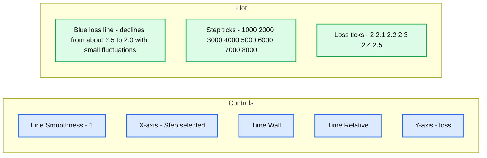
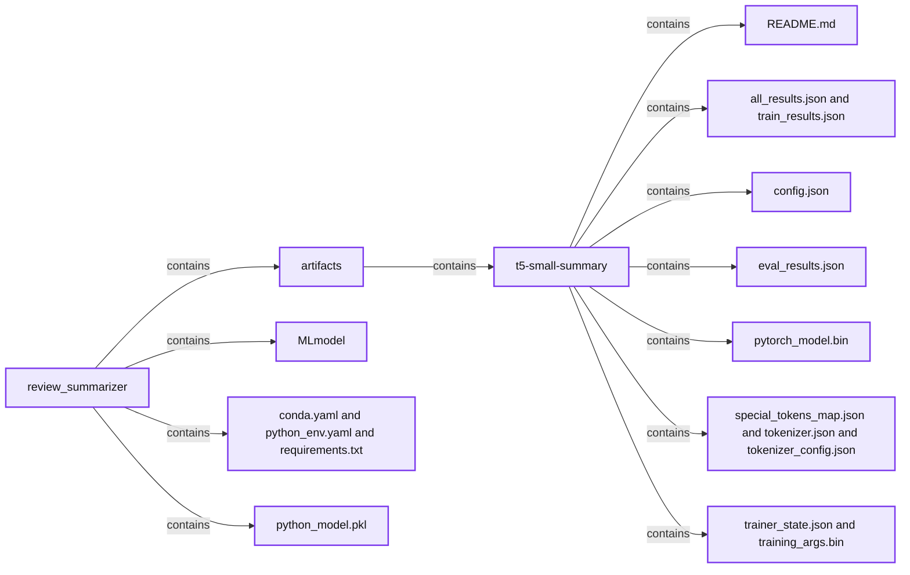

# Fine-Tuning Large Language Models with Hugging Face and DeepSpeed

*Easily apply and customize large language models of billions of parameters*

- Source: https://www.databricks.com/blog/fine-tuning-large-language-models-hugging-face-and-deepspeed
- Published: 2023-03-20
- Authors: Sean Owen
- Categories: engineering, data-science-machine-learning
- Images: 5 total, 4 extracted as architecture

Large language models (LLMs) are currently in the spotlight following the sensational release of ChatGPT. Many are wondering how to take advantage of models like this in their own applications. However, this is merely one of several advances in transformer-based models, many others of which are open and readily available for tasks like translation, classification, and summarization - not just chat.

A [previous blog](https://www.databricks.com/blog/2023/02/06/getting-started-nlp-using-hugging-face-transformers-pipelines.html) explored the basics of accessing these models on Databricks via the popular [Hugging Face](https://huggingface.co/) transformers library. Off-the-shelf, pre-trained, LLMs like [T5](https://github.com/google-research/text-to-text-transfer-transformer) and [BERT](https://github.com/google-research/bert) can work well for a wide range of real-world problems, without additional data or training. However, sometimes it's valuable or essential to "fine-tune" these models to perform better on a specific task.

This blog will explore easy fine-tuning of the [T5](https://github.com/google-research/text-to-text-transfer-transformer) family of language models, from its smallest to largest size, to specialize it for a simple use case: constructing a product review overview from many product reviews. It will use Hugging Face on Databricks, including its [MLflow integration](https://huggingface.co/docs/transformers/v4.26.1/en/main_classes/callback#transformers.integrations.MLflowCallback).

It will also introduce Microsoft's [DeepSpeed](https://github.com/microsoft/DeepSpeed) to accelerate fine-tuning of very large language models. It's not hard to fine-tune even an 11 billion parameter model on Databricks – if that is what is necessary!

## Problem: Summarizing Product Reviews

Let's imagine you run an e-commerce site selling camera products. Users leave reviews on products, and you think it would be nice to condense *all* reviews for a product into one summary for customers, rather than have them sift through a hundred reviews. You've collected hundreds of thousands of reviews along with user-provided headlines (which is a sort of 'summary' of a review) and want to use LLMs to create these product summaries.

As a stand-in for such a dataset, this example will use the [Amazon Customer Review dataset](https://s3.amazonaws.com/amazon-reviews-pds/readme.html), containing 130 million product reviews from Amazon customers. Of interest here are just the text of the reviews, the headline, and just those in the "cameras" category, naturally.

The free text in this dataset is not entirely clean. In order to mimic the nice, curated dataset that *your* e-commerce site maintains, load the data, apply some basic cleaning (see accompanying notebook for details), and write it as a Delta table. Here the length of reviews is limited (somewhat arbitrarily) to 100 tokens, as a few very long sequences can cause out-of-memory errors. Shorter sequences are faster to fine-tune on, at the expense of course of some accuracy; some of the review text is omitted.

| review_body | review_headline |
|---|---|
| Great camera for the price. | Five Stars |
| im not happy, the cable gets out. need a stronger closer | Two Stars |
| Nice camera for the price. Be aware that it comes in at 240, the 933 cameras come in at 480, so this is not quite as sharp. Does the job for what I need, tho I do wish I would have known this before I bought it. | Nice camera, not as sharp as previous model |
| I was really happy with these stickers. They came promptly and they were just as expected. I like all of the designs. | I was really happy with these stickers |
| don't try to recharge these with an auto charger cord or adapter plug! it will actually drain the battery. | warning! don't try to recharge these with ... |

That's better. Start from here, then see what large language models can do with this data.

## Quick Summaries with t5-small

[T5](https://github.com/google-research/text-to-text-transfer-transformer) (Text-to-Text Transfer Transformer) is a family of general-purpose LLMs from Google. It's helpful in many tasks like summarization, classification, and translation, and comes in several sizes from "small" (~60M parameters) to quite large (~11B parameters). These sizes are increasingly powerful, but also increasingly expensive to wield. An important theme in dealing with these LLMs is "keep it simple". Use smaller models if they're sufficient, and start with off-the-shelf resources where possible. Inference with larger models takes longer and costs more, so latency and budget constraints might mean that larger models are out of the question from the start.

The [previous blog](https://www.databricks.com/blog/2023/02/06/getting-started-nlp-using-hugging-face-transformers-pipelines.html) showed how to easily apply T5 with Spark and Hugging Face, and the same can happen here. It's not clear that it will work well out-of-the-box on this data set, as will be seen shortly, because the input text and output text are quite short. A recap, with a few new elements:

| review_body | summary |
|---|---|
| Great camera for the price. | great camera for the price for the camera. the camera is a great choice for a professional photographer. it is the best camera in the world. |
| im not happy, the cable gets out. need a stronger closer | im not happy, the cable gets out. need a stronger closer closer to the cable. click here for all the latest tv news. |
| Nice camera for the price. Be aware that it comes in at 240, the 933 cameras come in at 480, so this is not quite as sharp. Does the job for what I need, tho I do wish I would have known this before I bought it. | the 933 cameras come in at 240, so this is not quite as sharp. I wish I would have known this before I bought it. |
| I was really happy with these stickers. They came promptly and they were just as expected. I like all of the designs. | the stickers came promptly and they were just as expected. I like all of the designs and the designs. the stickers are a great addition to the stickers. |
| don't try to recharge these with an auto charger cord or adapter plug! it will actually drain the battery. | don't try to recharge these with an auto charger cord or adapter plug. it will actually drain the battery. if you want to recharge them, it's a good idea. |

Not bad for a few lines of code and a few minutes of execution – this does not even need a GPU. The results look plausible as concise summaries of the review. However, the stock model is struggling a bit with the excessively short reviews it summarizes, and even goes a bit too far in the first two summaries! This suggests the need for some fine-tuning.

The listing above highlights a few useful usage tips:

- Set the TRANSFORMERS_CACHE environment variable to a location on /dbfs, to download the model just once and reuse across many jobs and clusters
- Broadcasting the pipeline helps Spark efficiently transfer and share it - not essential here, but important for larger models
- Use [pandas UDFs](https://spark.apache.org/docs/latest/api/python/reference/pyspark.sql/api/pyspark.sql.functions.pandas_udf.html) with Spark to efficiently process whole batches of input at a time
- Start with a small model like t5-small and work up as needed
- The summarization pipeline has several settings, a few of which are useful to know:
  - min_new_tokens encourages the output to not be too short; this is used below to generate longer summaries over more text; this will be used later
  - num_beams can improve the quality of the output by trying more possibilities, at the cost of more computation

So far, this much is not new. However, the goal is to summarize *all* reviews for each product. That's easy with Spark; just aggregate text of reviews to summarize instead:

Here is one example of the output, with aggregate review truncated for brevity:

| reviews | summary |
|---|---|
| Nothing was wrong with this item. All its functionalities work perfectly. I recommend this item for anyone that want to take black and white photos. This camera wasn't exactly what I had expected, it was much lighter and seemed a bit flimsy, but it was in very good condition and it arrived very quickly, just as the sender advertised it would. It is a very easy to use camera and I am happy I have it to learn on, but the quality of the first role of film I developed was not great. | the camera works well for the photography student for which it was purchased. it arrived very quickly, just as the sender advertised it would. the price was very low considering the battery that this camera needs to work is hard to find, and maybe the seller should have specified it with the information. |

Intriguing, but it's clear that the summaries aren't quite as good as they could be. Two next logical steps would be trying a larger model, or fine-tuning one of these models. The following sections will try both.

## Off-the-Shelf Fine-Tuning

Fine-tuning simply means further training of a pre-trained model on new data to improve its performance on one specific task. Models like T5 have been trained to do many things that look like transforming one sequence of words into another. Here, it should do one thing well: transform many product reviews into review summaries. This is like the summarization task that T5 does well, and we only want it to adjust its summaries to better fit the actual review data already on hand. This is not the same as training the T5 architecture from scratch. Not only would that take far longer, but it would lose all the related learning about language that the pre-trained T5 model already has.

The example above is pleasingly simple, relative to the complexity of what's happening, because it reuses an existing model, and all the research, data, and computing power that went into creating it. Fine-tuning is, however, model *training*, and, even for experienced practitioners, it's not trivial to write the PyTorch or Tensorflow code needed to continue its training process.

Fortunately, these open source models often come with training or fine-tuning code. Unfortunately for notebook users, they are typically Python scripts, not notebooks. This isn't a problem in Databricks, where even notebooks can execute shell commands, scripts from git repos, or either one interactively in a [web terminal](https://docs.databricks.com/clusters/web-terminal.html).

### Obtaining the Fine-Tuning Script

In fact, Hugging Face *also* provides some handy [fine-tuning scripts that work on T5 models](https://github.com/huggingface/transformers/blob/main/examples/pytorch/summarization/run_summarization.py), via its Trainer API. It will be apparent later why it's advantageous to use these scripts, even if it seems a little awkward to consider at first. Reusing an existing solution is a great way to get started quickly.

First, clone the [Hugging Face Github repository](https://github.com/huggingface/transformers) as a Repo in Databricks. Only clone the summarization examples, not the whole repo, using the sparse checkout mode:

This gets a copy of the run_summarization.py script. It's also fine to just copy and paste [run_summarization.py](https://raw.githubusercontent.com/huggingface/transformers/main/examples/pytorch/summarization/run_summarization.py) into any Repo that you like.

One small change is needed. The script checks to see if the transformers library version matches what it expects. This source checkout expects a source install of transformers. You can actually add %pip install git+https://github.com/huggingface/transformers instead of changing this file, but it's also likely fine to remove the check. Delete the line reading check_min_version("...dev0") from your copy.

### Environment Setup

As anywhere, using these scripts needs a little bit of setup. In [Databricks Runtime 12.2 ML](https://docs.databricks.com/release-notes/runtime/12.2ml.html) (GPU – this will definitely need a GPU!):

-

Install necessary libraries that aren't already in the runtime:

-

Set environment variables to connect Databricks's hosted [MLflow](https://mlflow.org/) tracking server to Hugging Face's [MLflow integration](https://huggingface.co/docs/transformers/v4.26.1/en/main_classes/callback#transformers.integrations.MLflowCallback):

One modern GPU easily handles fine-tuning t5-small. It's advantageous to use a recent Ampere architecture GPU like NVIDIA's A10 or A100 for these models. For example, on AWS, this could be the g5 instance type. A10s may be more readily available than A100s.

Scripts like this typically want local input files; here, the tuning script wants a CSV file of (text,summary) pairs. No problem; distributed storage looks like local files with /dbfs. Just write out the Delta dataset as a pair of training and validation files:

### Tuning the Fine-Tuning

The actual fine-tuning is then a matter of running a script. It's almost anticlimactic.

The script has too many parameters to cover here, but a few items are worth noting:

- Export of the environment variables allows the MLflow integration to work
- source_prefix: "summarize: " helps T5 understand that the data are examples of text summarization
- optim: The [Adafactor](https://arxiv.org/abs/1804.04235) optimizer is not strictly required here, but its reduced memory usage can be important later when tuning larger models
- bf16: enables faster 16-bit floating point arithmetic using the [bfloat16](https://en.wikipedia.org/wiki/Bfloat16_floating-point_format) type, which retains more numeric range. This requires modern [Ampere](https://en.wikipedia.org/wiki/Ampere_(microarchitecture)) GPUs.
- num_train_epochs: Fine-tuning doesn't need as many epochs as training from scratch, so a handful of epochs can be fine
- per_device_train_batch_size: this important parameter controls the batch size. As in any training, large batch sizes can exhaust GPU memory. This will be a key issue when fine-tuning larger models, but large values like 64 should be OK for data sets with short sequences, and on modern GPUs that have 24GB or more of memory. Your mileage will vary significantly.

This takes about an hour on an A10 GPU, for example, costing a few dollars. During training (and afterwards), MLflow records training metrics, such as loss by step:

**Summary:** Training loss decreases from about 2.5 to 2.0 as training advances to step 8000, with small fluctuations near the end.

**Components:**
- Line Smoothness: slider and numeric input set to 1.
- X-axis: Step selected, with Time (Wall) and Time (Relative) alternatives.
- Y-axis: loss selected.
- Plot: blue line showing loss against training step; the underlying technology is not identified.

**Flows:**
- none. The line connects measurements; no arrows are shown.

**Numbers:**
- Line Smoothness: 1.
- X-axis step ticks: 1000, 2000, 3000, 4000, 5000, 6000, 7000, 8000.
- Y-axis loss ticks: 2, 2.1, 2.2, 2.3, 2.4, 2.5.
- No units, percentages, or sizes are displayed.

source image: https://www.databricks.com/sites/default/files/inline-images/db-551-blog-img-2.png

It appears that while training could have proceeded a bit longer, 8 epochs was already enough to roughly reconverge. There is much more that is captured (eval metrics, the model) or could be captured (checkpoints, [TensorBoard](https://docs.databricks.com/machine-learning/train-model/tensorflow.html#tensorboard) logs); see the accompanying notebooks for more detail about how MLflow tracks the model and can even deploy it as a REST API.

**Summary:** MLflow stores a T5 summarization model, its supporting files, and evaluation results reporting ROUGE scores and processing throughput.

**Components:**

- `review_summarizer`: MLflow model directory.
- `artifacts/t5-small-summary`: saved T5 model artifacts.
- `README.md`: Markdown documentation.
- `all_results.json`, `eval_results.json`, `train_results.json`: JSON results.
- `config.json`: model configuration.
- `pytorch_model.bin`: PyTorch model weights.
- `special_tokens_map.json`, `tokenizer.json`, `tokenizer_config.json`: tokenizer files.
- `trainer_state.json`, `training_args.bin`: training state and arguments.
- `MLmodel`: MLflow model metadata.
- `conda.yaml`, `python_env.yaml`, `requirements.txt`: environment and dependency specifications.
- `python_model.pkl`: serialized Python model.
- Full Path: artifact location under `dbfs:/databricks/mlflow-tracking/`, with the remainder cropped.

**Flows:**

- none. The visible connections represent directory nesting, with no arrows.

**Numbers:**

- Model name: `t5-small-summary`.
- Selected file size: 342 B.
- epoch: 8.
- eval_gen_len: 7.102427538263161.
- eval_loss: 2.4867517948150635.
- eval_rouge1: 28.4496.
- eval_rouge2: 17.4947.
- eval_rougeL: 28.0945.
- eval_rougeLsum: 28.1331.
- eval_runtime: 95.575.
- eval_samples: 17837.
- eval_samples_per_second: 186.628.
- eval_steps_per_second: 2.919.
- Cropped tracking path numeric prefix: `35389`.

source image: https://www.databricks.com/sites/default/files/inline-images/db-551-blog-img-3.png

You can find additional metrics automatically logged with the model, like [ROUGE metrics](https://en.wikipedia.org/wiki/ROUGE_(metric)) that evaluate the quality of the summary. This can be useful in deciding how *long* to fine-tune, as this metric gives a somewhat more meaningful picture of the result's quality than loss does.

That's it! You fine-tuned a T5 model on Databricks using open, off-the-shelf models and tools. What about the results, did they improve? Just re-run the summarization pipeline described above, replacing "t5-small" with your model's output path:

| reviews | summary |
|---|---|
| Nothing was wrong with this item. All its functionalities work perfectly. I recommend this item for anyone that want to take black and white photos. This camera wasn't exactly what I had expected, it was much lighter and seemed a bit flimsy, but it was in very good condition and it arrived very quickly, just as the sender advertised it would. It is a very easy to use camera and I am happy I have it to learn on, but the quality of the first role of film I developed was not great. | Great Camera, Great Price, Great Shipping, Great Customer Service - Great Price - Good Product - Easy to Use & Easy To Use - Just As Good As I Expected - Exactly What I Needed! |

The text looks more like a review headline for sure, as expected. It lacks some depth perhaps! This can even be [turned into a REST API](https://docs.databricks.com/archive/serverless-inference-preview/serverless-real-time-inference.html) with a few clicks.

It's worth thinking about *latency* too, if contemplating a REST API. How long would it take to respond with a summary? If latency is important, then executing on a GPU is important. As it turns out, running a single summary alone takes about 480ms.

To get more sophisticated summaries, it is worth trying a larger T5 model.

## Scaling Up to t5-large With DeepSpeed

Very little changes when scaling up to a larger model like t5-large, even though the model is an order of magnitude larger, at 770M parameters versus 60M. In fact, all that should change in running the fine-tuning script above is:

- Switch to multiple GPUs - 4 A10 GPUs for example, instead of 1
- Specify t5-large
- Reduce batch size to about 12

A much bigger model calls for more hardware, and means that less can fit on the GPU at once. Getting the batch size right can be difficult, in part because sequences are of uneven length and sometimes long. This is why the data preparation limited the length of reviews and summaries. The script also has options like `max_source_length` to manually truncate inputs. Smaller inputs can help scale, but, depending on the problem, it may harm the quality of the model by arbitrarily truncating inputs.

Were you to re-run with these changes, you would find it works. It also takes 2 hours per epoch. Cost is no longer just a few dollars, but more like $90 for 8 epochs. For this reason, it becomes important to think carefully about the number of epochs. For example, running for just 4 epochs did not seem to result in a significantly higher loss in the plot above, so one might reasonably run just 4 epochs when tuning here, at least to start. One can always resume a checkpoint and train further if desired.

### Enter DeepSpeed

It also becomes important to utilize more sophisticated parallelization than what tools like Hugging Face offers out of the box. Fortunately, once again open source has some answers. Microsoft's [DeepSpeed](https://github.com/microsoft/DeepSpeed) can accelerate existing deep learning training and inference jobs, with little or no change, by implementing a number of sophisticated optimizations. Of particular interest is ZeRO, a set of optimizations that tries to reduce memory usage. For full details and papers, see the [DeepSpeed](https://www.deepspeed.ai/) site.

DeepSpeed can [automatically optimize](https://huggingface.co/docs/transformers/main_classes/deepspeed) fine-tuning jobs that use Hugging Face's Trainer API, and offers a drop-in replacement script to run existing fine-tuning scripts. This is one reason that reusing off-the-shelf training scripts is advantageous.

To use DeepSpeed, install its package, along with accelerate. It's recommended to install it from source, although installing a released package works too: `%pip install … git+https://github.com/microsoft/DeepSpeed accelerate`

The same execution with DeepSpeed looks only slightly different:

python is replaced with the deepspeed runner script. It also takes a path to a configuration file. Exploring the options in this file is out of scope here, though it is reasonable to start with the [default "ZeRO stage 2" configuration](https://huggingface.co/docs/transformers/main_classes/deepspeed#zero2-example) and make minor changes. For example, this current setup requires two edits:

- Explicitly enable bf16 (and disable normal float16 / fp16 support)
- Remove optimizer configuration, to let it use [Adafactor](https://arxiv.org/abs/1804.04235) instead of AdamW. Adafactor require much less memory and is a good alternative when fine-tuning any large models

DeepSpeed makes it possible to add a few more improvements:

- gradient_checkpointing: releases some large intermediate results in the forward pass and recalculates them in backward pass; saves memory at the cost of a little more computation
- Per-device batch size can go up to 20 (likely higher if desired). Note that with 4 GPUs, the effective batch size is now 4 x 20 = 80.

Batch size becomes an important tuning issue. Batch size is often tuned per device because it's individual GPU memory that constrains how much one GPU can process at once. Larger batch sizes increase throughput – if they don't exhaust GPU memory! The maximum batch size depends on several factors, including GPU memory, size of input sequences, the size of the largest layers in the model, optimizer settings, and more. Typically, it has to be tuned with some trial and error.

Sometimes excessively large batch sizes are problematic for training too. However, with very large language models, the issue is typically finding ways to fit even a few, or one, batch into each device's memory. It is at least important to keep in mind that the effective batch size is (*number of devices x per-device batch size*), as the batch size is important for reproducing results.

This drops execution time to more like 40 minutes per epoch. About 3 times faster is also about 3 times less expensive, meaning this tuning might cost more like $30. This will become increasingly valuable when time is measured in days, and cost in hundreds or thousands of dollars.

The improvement is visible in GPU metrics, like these Ganglia metrics from the Databricks cluster:

*Without DeepSpeed:*

**Summary:** GPU utilization fluctuates sharply over time, with frequent peaks near 100% and an average of 51.31%.

**Components:**
- gpu1 GPU Utilization: GPU utilization chart rendered with RRDTOOL.
- gpu1_util: Filled gray utilization series.
- RRDTOOL / TOBI OETIKER: Chart software attribution.

**Flows:**
- none. Axis arrowheads indicate increasing time and utilization, not component flows.

**Numbers:**
- GPU identifier: gpu1.
- Vertical axis unit: %.
- Vertical ticks: 20, 40, 60, 80, 100.
- Horizontal ticks: 00:00, 00:10, 00:20, 00:30, 00:40, 00:50.
- Now: 47.67%.
- Min: 7.47%.
- Avg: 51.31%.
- Max: 100.0 visible, with the remaining text clipped.

source image: https://www.databricks.com/sites/default/files/inline-images/db-551-blog-imgs-4.png

*With DeepSpeed:*

**Summary:** GPU1 utilization stays near 100% for most of the displayed interval, with early dips and a final drop to zero.

**Components:**
- gpu1 GPU Utilization: GPU utilization metric rendered with RRDtool.
- gpu1_util: gray filled utilization series.

**Flows:**
- none. The arrows mark axis directions, not data flows.

**Numbers:**
- GPU identifier: gpu1.
- Utilization unit: %.
- Vertical ticks: 0, 20, 40, 60, 80, 100.
- Time ticks: 21:30, 21:40, 21:50, 22:00, 22:10, 22:20.
- Now: 0.00%.
- Min: 0.00%.
- Avg: 92.48%.
- Max: 100.0 visible; remaining text is clipped.

```mermaid
%% GPU1 utilization chart with visible axes and summary statistics
flowchart TD
    A[gpu1 GPU Utilization]
    B[gpu1_util filled series near 100 percent with early dips and final drop]
    C[Time ticks 21:30 21:40 21:50 22:00 22:10 22:20]
    D[Percent ticks 0 20 40 60 80 100]
    E[Now 0.00 percent - Min 0.00 percent - Avg 92.48 percent - Max 100.0 clipped]
    F[RRDTOOL / TOBI OETIKER]

    classDef client fill:#dbeafe,stroke:#2563eb,stroke-width:2px,color:#111
    classDef service fill:#dcfce7,stroke:#16a34a,stroke-width:2px,color:#111
    classDef store fill:#ede9fe,stroke:#7c3aed,stroke-width:2px,color:#111
    classDef cache fill:#fef3c7,stroke:#d97706,stroke-width:2px,color:#111
    classDef queue fill:#cffafe,stroke:#0891b2,stroke-width:2px,color:#111
    classDef critical fill:#fee2e2,stroke:#dc2626,stroke-width:4px,color:#111
    classDef external fill:#e5e7eb,stroke:#6b7280,stroke-width:2px,color:#111,stroke-dasharray:4 3
    classDef decision fill:#fce7f3,stroke:#db2777,stroke-width:2px,color:#111
    class A,B service
    class C,D,E,F external
```

source image: https://www.databricks.com/sites/default/files/inline-images/db-551-blog-imgs-5.png

How do the summaries look with this model?

| reviews | summary |
|---|---|
| Nothing was wrong with this item. All its functionalities work perfectly. I recommend this item for anyone that want to take black and white photos. This camera wasn't exactly what I had expected, it was much lighter and seemed a bit flimsy, but it was in very good condition and it arrived very quickly, just as the sender advertised it would. It is a very easy to use camera and I am happy I have it to learn on, but the quality of the first role of film I developed was not great. | Great Camera, great condition LIKE NEW. It takes amazing photographs and is easy to handle and work with. Great camera for a photography class and so far am happy with the quality of the photos I have taken with it. Great seller to deal with! |

Concise, and perhaps better still, as it now offers some accurate detail from the review text. Model latency on a single GPU is now about 3 seconds, which may already give pause if considering scaling further to larger models. One might stop here, but it is also possible to scale out to the largest T5 model.

## Super-Size It: Fine-Tuning t5-11b

The largest T5 model is t5-11b, and it has, as you guessed, 11 billion parameters, over 14 times more than t5-large. Fine-tuning it is *still* possible on one machine, albeit the largest types available in the cloud, with the same approach.

It's a gargantuan task, and practically speaking, to make this complete in reasonable time needs a few more changes:

- An 8-GPU machine with 400GB+ of RAM
- 1 training epoch (or less)
- Per device batch size of 8 (effective batch size of 8 x 8 = 64)
- Full ["ZeRO stage 3" optimization](https://huggingface.co/docs/transformers/main_classes/deepspeed#zero3-example), which includes full parameter partitioning, with parameter [offload](https://arxiv.org/abs/2101.06840) enabled

It works, but for this data set and input size, an epoch takes about 1.8 *days* to complete. Cost will approach hundreds of dollars per epoch. This can certainly be tuned further, but gives a sense of the scale of the computation to expect. For the purposes of this example, just fine tuning for a few hundred steps (1% of an epoch) yielded summaries like:

| reviews | summary |
|---|---|
| Nothing was wrong with this item. All its functionalities work perfectly. I recommend this item for anyone that want to take black and white photos. This camera wasn't exactly what I had expected, it was much lighter and seemed a bit flimsy, but it was in very good condition and it arrived very quickly, just as the sender advertised it would. It is a very easy to use camera and I am happy I have it to learn on, but the quality of the first role of film I developed was not great. | Great camera for a photography class!! I am very happy with my purchase. Delivery was quick and I received the camera a couple days after purchase. I am taking a black and white film photography class and so far am happy with the results my first roll of film |

It's a better summary, qualitatively. For this particular problem, it is unlikely to be worth the time and cost, however, even if it is entirely possible. Even where fine-tuning cost and time is acceptable, inference cost and time may not be. For example, inference with t5-11b could take tens of seconds on a GPU, and that could be too slow. For most problems, this scale or smaller is sufficient, but very large scale tuning is easily accessible.

## Conclusion and Next Directions

Large language models are powerful new tools for a range of business problems, and open source ones can be applied as-is, easily, with open source tools, on Databricks. Fine-tuning these large language models can be equally straightforward with open source tooling; there is no need to write tools by hand. Even scripts are no problem in Databricks notebooks. These easy approaches scale up to sizes that suffice for almost any real-world problem.

The results of quick experiments with fine-tuning various sizes of T5, along order-of-magnitude resource requirements to fine-tune and run inference:

| T5 Size | Example Summary | Tuning Time | Tuning Cost | Inference Latency |
|---|---|---|---|---|
| **t5-small** 60M params No fine-tuning | the camera works well for the photography student for which it was purchased. it arrived very quickly, just as the sender advertised it would. the price was very low considering the battery that this camera needs to work is hard to find, and maybe the seller should have specified it with the information. | n/a | n/a | 100s of ms |
| **t5-small** 60M params Fine-tuning | Great Camera, Great Price, Great Shipping, Great Customer Service - Great Price - Good Product - Easy to Use & Easy To Use - Just As Good As I Expected - Exactly What I Needed! | an hour | $10s | 100s of ms |
| **t5-large** 770M params Fine-tuning | Great Camera, great condition LIKE NEW. It takes amazing photographs and is easy to handle and work with. Great camera for a photography class and so far am happy with the quality of the photos I have taken with it. Great seller to deal with! | several hours | $100s | seconds |
| **t5-11b** 11B params Fine-tuning | Great camera for a photography class!! I am very happy with my purchase. Delivery was quick and I received the camera a couple days after purchase. I am taking a black and white film photography class and so far am happy with the results my first roll of film | days | $1000s | 10s of seconds |

Yet, there will always be cases that need more, and need more resources than even the largest machines provide. With more work, these tools can be adapted to clusters of machines on Databricks, and is a topic for a future blog.

Try this on Databricks! Import this [notebook archive](https://www.databricks.com/wp-content/uploads/notebooks/db-551/summarization.dbc) into a Repository.
