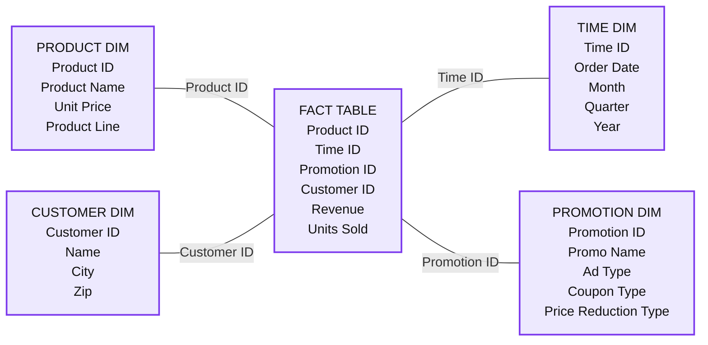

# Five Simple Steps for Implementing a Star Schema in Databricks With Delta Lake

*An updated way to consistently get the best performance from star schema databases used in data warehouses and data marts with Delta Lake*

- Source: https://www.databricks.com/blog/five-simple-steps-for-implementing-a-star-schema-in-databricks-with-delta-lake
- Published: 2024-09-12
- Authors: Cary Moore, Lucas Bilbro, Brenner Heintz
- Categories: platform, product, data-warehousing
- Images: 2 total, 1 extracted as architecture

**Key takeaways**

- Use Delta Tables to create your fact and dimension tables.
- Use Liquid Clustering to provide the best file size.
- Use Liquid Clustering on your fact tables.

We are updating this blog to show developers how to leverage the latest features of Databricks and the advancements in Spark.

Most data warehouse developers are very familiar with the ever-present star schema. Introduced by Ralph Kimball in the 1990s, a star schema is used to denormalize business data into dimensions (like time and product) and facts (like transactions in amounts and quantities). A star schema efficiently stores data, maintains history and updates data by reducing the duplication of repetitive business definitions, making it fast to aggregate and filter.

The common implementation of a star schema to support business intelligence applications has become so routine and successful that many data modelers can practically do them in their sleep. At Databricks, we have produced so many data applications and are constantly looking for best practice approaches to serve as a rule of thumb, a basic implementation that is guaranteed to lead us to a great outcome.

Just like in a traditional data warehouse, there are some simple rules of thumb to follow on Delta Lake that will significantly improve your Delta star schema joins.

Here are the basic steps to success:

1. Use Delta Tables to create your fact and dimension tables
2. Use Liquid Clustering to provide the best file size
3. Use Liquid Clustering on your fact tables
4. Use Liquid Clustering on your larger dimension table’s keys and likely predicates
5. Leverage Predictive Optimization to maintain tables and gather statistics

## 1. Use Delta Tables to create your fact and dimension tables

[Delta Lake](https://www.databricks.com/product/delta-lake-on-databricks) is an open storage format layer that provides the ease of inserts, updates, deletes, and adds ACID transactions on your data lake tables, simplifying maintenance and revisions. Delta Lake also provides the ability to perform [dynamic file pruning](https://www.databricks.com/blog/2020/04/30/faster-sql-queries-on-delta-lake-with-dynamic-file-pruning.html) to optimize for faster SQL queries.

The syntax is simple on Databricks Runtimes 8.x and newer (the current Long Term Support runtime is now 15.4) where Delta Lake is the default table format. You can create a Delta table using SQL with the following:

CREATE TABLE MY_TABLE (COLUMN_NAME STRING) CLUSTER BY (COLUMN_NAME);

Before the 8.x runtime, Databricks required creating the table with the USING DELTA syntax.

Before the 8.x runtime, Databricks required creating the table with the `USING DELTA` syntax.

**Summary:** A star schema connects a central fact table containing revenue and units sold to product, time, customer, and promotion dimensions.

**Components:**
- PRODUCT DIM: Table with Product ID, Product Name, Unit Price, and Product Line. Storage technology is not specified.
- TIME DIM: Table with Time ID, Order Date, Month, Quarter, and Year. Storage technology is not specified.
- FACT TABLE: Table with Product ID, Time ID, Promotion ID, Customer ID, Revenue, and Units Sold. Storage technology is not specified.
- CUSTOMER DIM: Table with Customer ID, Name, City, and Zip. Storage technology is not specified.
- PROMOTION DIM: Table with Promotion ID, Promo Name, Ad Type, Coupon Type, and Price Reduction Type. Storage technology is not specified.

**Flows:**
- PRODUCT DIM -> FACT TABLE: Product ID relationship.
- TIME DIM -> FACT TABLE: Time ID relationship.
- CUSTOMER DIM -> FACT TABLE: Customer ID relationship.
- PROMOTION DIM -> FACT TABLE: Promotion ID relationship.

The connectors indicate relationships without directional data flow.

**Numbers:** none

source image: https://www.databricks.com/wp-content/uploads/2022/05/db-162-blog-img-1.png

## 2. Use Liquid Clustering to provide the best file size

Two of the biggest time sinks in an Apache Spark™ query are the time spent reading data from cloud storage and the need to read all underlying files. With [data skipping](https://docs.databricks.com/delta/optimizations/file-mgmt.html#data-skipping) on Delta Lake, queries can selectively read only the Delta files containing relevant data, saving significant time. Data skipping can help with static file pruning, dynamic file pruning, static partition pruning and dynamic partition pruning.

Before [Liquid Clustering](https://docs.databricks.com/en/delta/clustering.html), this was a manual setting.  There were rules of thumb to make sure that the files were appropriately sized and efficient for querying.  Now with Liquid Clustering, the file sizes are automatically determined and maintained with the optimization routines.

If you happen to be reading this article (or have read the previous version) and you have already created tables with ZORDER, you will need to recreate the tables with the Liquid Clustering.

In addition, Liquid clustering optimizes to prevent files that are too small, or too large (skew and balance) and updates the file sizes as new data is appended to keep your tables optimized.

## 3. Use Liquid Clustering on your fact tables

To improve query speed, Delta Lake supports the ability to optimize the layout of data stored in cloud storage with Liquid Clustering.  Cluster by the columns you would use in similar situations as clustered indexes in the database world, though they are not actually an auxiliary structure. A liquid clustered table will cluster the data in the CLUSTER BY definition so that rows like column values from the CLUSTER BY definition are collocated in the optimal set of files. 

Most database systems introduced indexing as a way to improve query performance. Indexes are files, and thus as the data grows in size, they can become another big data problem to solve. Instead, Delta Lake orders the data in the Parquet files to make range selection on object storage more efficient. Combined with the stats collection process and data skipping, liquid clustered tables are similar to seek vs. scan operations in databases, which indexes solved, without creating another compute bottleneck to find the data a query is looking for. 

For Liquid Clustered tables, the best practice is to limit the number of columns in the CLUSTER BY clause to the best 1-4. We chose the foreign keys (foreign keys by use, not actually enforced foreign keys) of the 3 largest dimensions which were too large to broadcast to the workers.

Lastly, Liquid clustering replaces the need for both ZORDER and Partitioning, so if you use liquid clustering, you no longer need to, or can, explicitly hive partition the tables.

## 4. Use Liquid Clustering on your larger dimension's keys and likely predicates

Since you are reading this blog, you likely have dimensions and a surrogate key or a primary key exists on your dimension tables.  A key that is a big integer and is validated and expected to be unique.  After databricks runtime 10.4, Identity columns were generally available and are part of the [CREATE TABLE](https://docs.databricks.com/en/sql/language-manual/sql-ref-syntax-ddl-create-table-using.html) syntax.

Databricks also introduced unenforced [Primary Keys and Foreign Keys](https://docs.databricks.com/en/tables/constraints.html#declare-primary-key-and-foreign-key-relationships) in Runtime 11.3 and are visible in Unity Catalog enabled clusters and workspaces. 

One of the dimensions we were working with had over 1 billion rows and benefitted from the file skipping and dynamic file pruning after adding our predicates into the clustered tables. Our smaller dimensions were clustered on the dimension key field and were broadcasted in the join to the facts. Similar to the advice on fact tables, limit the number of columns in the Cluster By to the 1-4 fields in the dimension that are most likely to be included in a filter in addition to the key.

In addition to the file skipping and ease of maintenance, liquid clustering allows you to add more columns than ZORDER and is more flexible than hive style partitioning.

## 5. Analyze Table to gather statistics for Adaptive Query Execution Optimizer and enable Predictive Optimization

One of the major advancements in Apache Spark™ 3.0 was the Adaptive Query Execution, or AQE for short. As of Spark 3.0, there are three major features in AQE, including coalescing post-shuffle partitions, converting sort-merge join to broadcast join, and skew join optimization. Together, these features enable the accelerated performance of dimensional models in Spark. 

In order for AQE to know which plan to choose for you, we need to collect statistics about the tables. You do this by issuing the ANALYZE TABLE command. Customers have reported that collecting table statistics has significantly reduced query execution for dimensional models, including complex joins.

ANALYZE TABLE MY_BIG_DIM COMPUTE STATISTICS FOR ALL COLUMNS

You can still leverage the Analyze table as part of your load routines, but now it is better to simply enable Predictive Optimization on your Account, Catalog and Schema.

ALTER CATALOG [catalog_name] {ENABLE | DISABLE} PREDICTIVE OPTIMIZATION;

ALTER {SCHEMA | DATABASE} schema_name {ENABLE | DISABLE} PREDICTIVE OPTIMIZATION;

[Predictive optimization](https://docs.databricks.com/en/optimizations/predictive-optimization.html) removes the need to manually manage maintenance operations for Unity Catalog managed tables on Databricks.

With predictive optimization enabled, Databricks automatically identifies tables that would benefit from maintenance operations and runs them for the user. Maintenance operations are only run as necessary, eliminating unnecessary runs for maintenance operations and the burden associated with tracking and troubleshooting performance. 

Currently Predictive Optimizations perform Vacuum and Optimize on tables.  Watch for updates for Predictive Optimization and stay tuned for when the feature incorporates the analyze table and gather stats in addition to automatically applying liquid clustered keys.

## Conclusion

By following the above guidelines, organizations can reduce query times - in our example, we improved query performance by 9 times on the same cluster. The optimizations greatly reduced the I/O and ensured that we only processed the required data. We also benefited from the flexible structure of Delta Lake in that it would both scale and handle the types of queries that will be sent ad hoc from the Business Intelligence tools.

Since the first version of this blog, Photon is now on by default for our Databricks SQL Warehouse, and is available on All Purpose and Jobs clusters. Learn more about [Photon](https://docs.databricks.com/runtime/photon.html) and the performance boost it will provide to all of your Spark SQL queries with Databricks.

Customers can expect their ETL/ELT and SQL query performance to improve by enabling Photon in the Databricks Runtime. Combining the best practices outlined here, with the Photon-enabled Databricks Runtime, you can expect to achieve low latency query performance that can outperform the best cloud data warehouses.

[Build your star schema database with Databricks SQL today](https://www.databricks.com/product/databricks-sql).
