# Flexible node types are now Generally Available

*Improve cluster launch reliability and reduce compute costs with automatic instance fallback*

- Source: https://www.databricks.com/blog/flexible-node-types-are-now-generally-available
- Published: 2026-02-18
- Authors: Kelsey Ge, Andrew Bagshaw, Tianyi Zhang, Vedaant Shah, Rishan Girish, Hugh March
- Categories: engineering
- Images: 2 total, 1 extracted as architecture

**Key takeaways**

- Protect workloads against capacity errors: When your preferred VM type isn’t available, Databricks automatically falls back to compatible alternatives so clusters can still launch.
- Get Fleet-style flexibility on every cloud: Flexible node types bring automatic instance type fallback to Azure, GCP, and AWS. Enjoy a simpler "1-click" workspace-wide activation, with clear visibility into acquired resources and optionally configurable fallback ordering.
- Reduce spend without sacrificing reliability: Prioritize discounted Spot instances when available, and fall back only when needed to maintain launch success.

Securing specific compute capacity can be challenging, especially during high-traffic (and high-pressure) periods. Data engineers and platform administrators are all too familiar with the frustration of insufficient capacity, or "stockout", errors that occur when a cluster launch fails because a cloud provider cannot fulfill a request for a specific instance type.

Whether it’s:

- `AWS_INSUFFICIENT_INSTANCE_CAPACITY_FAILURE`
- `CLOUD_PROVIDER_RESOURCE_STOCKOUT` on Azure, or
- `GCP_INSUFFICIENT_CAPACITY`,

These errors disrupt critical workloads, especially during business-critical periods when uptime matters most.

## What Are Flexible Node Types?

Traditionally, Databricks clusters required every node to be the exact instance type specified in your configuration. If that specific type were unavailable, the cluster launch would fail.

Flexible node types remove this constraint. When a preferred instance type isn’t available, Databricks automatically falls back to a compatible alternative that shares the same compute shape. In other words, the cluster successfully launches using a mix of similar instance types instead of failing outright.

For teams that need tighter control, they can also define a custom fallback list through the API, including which instance types to try and in what order.

**Summary:** Databricks flexible node types allow a cluster to launch using preferred and compatible AWS instances when insufficient capacity would cause a strict homogeneous cluster launch to fail.

**Components:**
- Traditional Homogeneous Cluster, No Flexibility: Databricks cluster restricted to AWS c5.2xlarge instances.
- Traditional User Request: 3 nodes with strict c5.2xlarge instance selection.
- Traditional Cloud Provider Pool, AWS: one c5.2xlarge available and two c5.2xlarge entries out of stock.
- Traditional Cluster Outcome, Cluster Launch Failed: Node 1 c5.2xlarge provisioned; Node 2 and Node 3 failed due to stockout.
- Flexible Node Types Cluster, Heterogeneous Composition: Databricks cluster using compatible AWS instance types.
- Flexible User Request: 3 nodes, preferred c5.2xlarge, flexibility ON.
- Flexible Cloud Provider Pool, AWS: c5.2xlarge available; c5a.2xlarge and c6i.2xlarge compatible.
- Compatibility criteria: same vCPU, similar RAM, disk, and architecture.
- Flexible Cluster Outcome, Cluster Launch Successful: Node 1 c5.2xlarge preferred; Node 2 c5a.2xlarge fallback; Node 3 c6i.2xlarge fallback.
- Legend: blue indicates preferred instance type; yellow indicates compatible fallback type A; burgundy indicates compatible fallback type B.

**Flows:**
- Traditional User Request -> Traditional AWS Pool: request 3 nodes of strictly c5.2xlarge.
- Traditional AWS Pool -> Failed Cluster Outcome: insufficient specific instance capacity leaves one node provisioned and two failed.
- Flexible User Request -> Flexible AWS Pool: request 3 nodes with c5.2xlarge preferred and flexibility ON.
- Flexible AWS Pool -> Successful Cluster Outcome: provision a mix of preferred and compatible fallback instances.

**Numbers:** Both requests specify 3 nodes. Both outcomes label Node 1, Node 2, and Node 3. Visible instance types are c5.2xlarge, c5a.2xlarge, and c6i.2xlarge. No numerical vCPU, RAM, or disk capacities are shown.

```mermaid
%% Databricks strict and flexible node selection under AWS capacity constraints
flowchart TD
  subgraph Traditional Homogeneous Cluster
    A[User request - 3 nodes - strict c5.2xlarge]
    B[AWS pool - c5.2xlarge available - two c5.2xlarge out of stock]
    C[Cluster launch failed - Node 1 c5.2xlarge provisioned - Nodes 2 and 3 stockout]
    A -->|Request strict instance type| B
    B -->|Insufficient specific instance capacity| C
  end
  subgraph Flexible Node Types Cluster
    D[User request - 3 nodes - preferred c5.2xlarge - flexibility ON]
    E[AWS pool - c5.2xlarge available - c5a.2xlarge and c6i.2xlarge compatible]
    F[Cluster launch successful - Node 1 c5.2xlarge preferred - Node 2 c5a.2xlarge fallback - Node 3 c6i.2xlarge fallback]
    D -->|Request preferred type with flexibility| E
    E -->|Provision preferred and compatible fallback instances| F
  end

  classDef client fill:#dbeafe,stroke:#2563eb,stroke-width:2px,color:#111
  classDef service fill:#dcfce7,stroke:#16a34a,stroke-width:2px,color:#111
  classDef store fill:#ede9fe,stroke:#7c3aed,stroke-width:2px,color:#111
  classDef cache fill:#fef3c7,stroke:#d97706,stroke-width:2px,color:#111
  classDef queue fill:#cffafe,stroke:#0891b2,stroke-width:2px,color:#111
  classDef critical fill:#fee2e2,stroke:#dc2626,stroke-width:4px,color:#111
  classDef external fill:#e5e7eb,stroke:#6b7280,stroke-width:2px,color:#111,stroke-dasharray:4 3
  classDef decision fill:#fce7f3,stroke:#db2777,stroke-width:2px,color:#111
  class A,D client
  class B,E external
  class C critical
  class F service
```

source image: https://www.databricks.com/sites/default/files/inline-images/2026-02-blog-announcing-flexible-node-types-for-compute-launch-reliability-inline-960x725.6-2.png

## Key Benefits

**Fewer failed cluster launches during peak demand**
Flexible node types reduce both the frequency and severity of capacity-related failures. When a cloud provider cannot fulfill the preferred instance type, Databricks automatically falls back to compatible alternatives, allowing clusters to launch rather than erroring out.

**Optimized Spot Instance Usage**
For clusters configured with Spot-with-fallback, flexible node types attempt to acquire Spot capacity across the full fallback list before reverting to On-Demand instances. This increases the portion of the cluster running on Spot, helping lower compute costs while still prioritizing successful launches.

**Clear visibility and precise control**
Teams can inspect exactly which node types are acquired using the node_timeline system table. Additionally, a custom fallback order can be defined via the API, allowing precise control over cost and performance behavior.

## Quick Start

Workspace admins can easily enable the feature in admin settings (Docs: [AWS](https://docs.databricks.com/aws/en/compute/flexible-node-types), [Azure](https://learn.microsoft.com/en-us/azure/databricks/compute/flexible-node-types), [GCP](https://docs.databricks.com/gcp/en/compute/flexible-node-types)). From there, the feature applies immediately to all new cluster launches. Long-running clusters will adopt the feature on their next restart, and future job clusters created for existing jobs will automatically utilize the feature.

Custom fallback lists can be configured through the API, independent of the workspace setting.

**Additional details**
Please see the documentation for further details on configuring flexible node types with instance pools, billing, node type quotas, and selective enablement / disablement (Docs: [AWS](https://docs.databricks.com/aws/en/compute/flexible-node-types), [Azure](https://learn.microsoft.com/en-us/azure/databricks/compute/flexible-node-types), [GCP](https://docs.databricks.com/gcp/en/compute/flexible-node-types)).

Flexible Node Types are designed to make your data platform more resilient and cost-effective. Administrators can 1-click enable this feature today in the workspace admin settings following the instructions in the documentation.
