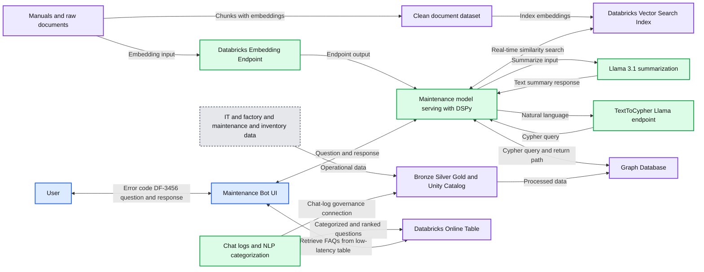

# From Generalists to Specialists: The Evolution of AI Systems toward Compound AI

- Source: https://www.databricks.com/blog/generalists-specialists-evolution-ai-systems-toward-compound-ai
- Published: 2024-10-01
- Authors: Yared Gudeta
- Categories: data-science-machine-learning, databricks-ai, manufacturing
- Images: 1 total, 1 extracted as architecture

**Key takeaways**

- How to use Databricks to build a Maintenance Bot to assist with troubleshooting machinery, accessing repair manuals, and providing contextual insights.

The buzz around [compound AI systems](https://www.databricks.com/blog/mosaic-ai-build-and-deploy-production-quality-compound-ai-systems) is real, and for good reason. Compound AI systems combine the best parts of multiple AI models, tools, and systems to solve complex problems that a single AI, no matter how powerful, might struggle to tackle efficiently.

### **A Look Back: From Monolithic to Microservices**

Before diving into the magic of compound AI systems, let’s rewind a bit and explore how application development has evolved. Remember the days of monolithic applications? These were giant, all-in-one software systems that handled everything—front-end interactions, back-end processing, and database management—within a single codebase. They were powerful, but they had their drawbacks.

 

#### **Monolithic Architecture Challenges:**
 

- **Slow Updates**: A small tweak to one part of the application required redeploying the entire system.
- **Scaling Issues**: If one area of the system was under a heavy load, the entire system had to scale up.
- **Single Point of Failure**: If one component crashed, the whole system could go down with it.
 

This paved the way for **Microservices Architecture**, a game-changer that allowed businesses to split large, monolithic applications into smaller, self-contained services. Each microservice focused on a specific business function like user authentication or inventory management, offering flexibility and scalability that monolithic systems couldn’t match.

#### **Microservices Advantages:**

- **Faster Updates**: Update or deploy just one microservice without touching the rest.
- **Scalability**: Scale individual services based on demand.
- **Fault Isolation**: If one service crashes, the others keep running.
 

But, microservices weren’t without their challenges:

- **Higher Overhead**: Managing many services required more coordination and infrastructure.
- **Latency**: Inter-service communication could slow things down.
- **Consistency Issues**: Keeping data synchronized across services was tricky.
 

### **The AI World is Heading the Same Way**

We’re seeing the same evolution in the AI world, where large language models (LLMs) like GPT-4 and Meta Llama have become powerful generalists. They excel at handling a wide range of tasks, but, much like monolithic apps, they aren’t perfect for every job.
 

 

**Compound AI Systems** are the GenAI version of microservices. These systems decompose AI tasks into specialized segments. Instead of relying on one giant model to do it all, several models, tools, and components are deployed, each optimized for specific tasks.
 

#### **Why Compound AI Systems Work So Well:**

- **Generalists and Specialists**: A large foundational model offers broad insights, while specialized models handle niche tasks like medical diagnostics or real-time cybersecurity threat detection.
- **Modularity**: Need a new model? Just swap it in without retraining the whole system.
- **Optimization**: Models and tools can be fine-tuned for specific parts of the task, making the entire system more efficient and accurate.
 

### **How Compound AI Systems Work**

So, what does a compound AI system look like in practice? Picture a team of AI models, each excelling in a particular area, working together to solve complex tasks:

1. **Multiple LLMs**: Different language models can be used, each optimized for a particular task or domain.
2. **External Tools**: Search engines, APIs, or data retrieval systems can feed enriched information into the AI pipeline.
3. **Orchestrators**: A task orchestrator directs when and how to use each model or tool for the task at hand.
 

This modular approach allows compounded AI systems to break down complex challenges into smaller, manageable steps, much like how microservices revolutionized traditional application development.

### **Databricks: The Power Behind Compound AI Systems**

One platform leading the charge is **Databricks**. It gives businesses the tools they need to build production-quality compound AI systems by integrating multiple AI models, data retrieval systems, and external APIs.
 

#### **Why Databricks Stands Out:**

- **Seamless Integration**: It securely and easily connects to both internal data sources and external tools, providing rich, contextual data for models to work with.
- **Scalability**: Individual components can be scaled based on demand using Databricks model serving.
- **Customization**: Each component can be fine-tuned on custom data to ensure more accurate results.
 

### **Building a Compound AI System for Maintenance Bots**

To make this more concrete, let’s take a look at a **Maintenance Bot** powered by Databricks. The bot is built to assist with troubleshooting machinery, accessing repair manuals, and providing contextual insights.

**Summary:** A Databricks maintenance bot combines manual retrieval, a maintenance knowledge graph, specialized models, and frequently asked questions derived from chat logs.

**Components:**
- Databricks Volume: stores user, maintenance, installation, service, parts, training, and safety manuals.
- Raw Documents: document storage shown with database and Azure icons.
- Databricks Embedding Endpoint: foundation model as a service.
- Clean Dataset: document chunks with embeddings.
- Vector Store Endpoint: Databricks Vector Search Index.
- Maintenance: Bot Model Serving using DSPy Framework for Model Orchestration.
- Databricks Foundation Model: Llama 3.1 for summarization.
- Databricks Model Endpoint: fine-tuned TextToCypher Llama Model.
- Maintenance Bot UI: user interface for maintenance questions.
- User: asks how to fix error code DF-3456.
- IT Data: ERP, MES, and PLM sources.
- Factory/Shop Floor: sources such as historians.
- Maintenance History Data: historical maintenance records.
- Inventory Data: inventory records.
- Bronze: more raw, append-only data.
- Silver: exploded data with varying SLA and append/merge processing.
- Gold: pivoted or aggregated data, as needed, with varying SLA.
- Unity Catalog: governance.
- Graph Database: connected Inventory, Station, Part, Defect, Defect Code, Machine, and Out of Service entities.
- Graph relationship labels: IS_PART_OF, OCCURRED_AT, HAS_DEFECT, IS_TYPE, HAS_PARTS, REASON, IS_OUT_OF_SERVICE, and HAS_MACHINE.
- Clean Dataset for chat logs: stored chat records.
- NLP: categorizes and ranks questions.
- Databricks Online Table: stores FAQs for low-latency retrieval.

**Flows:**
- Databricks Volume -> Raw Documents: manuals.
- Raw Documents -> Embedding vector stage: documents for embedding.
- Embedding vector stage -> Databricks Embedding Endpoint: embedding input.
- Embedding vector stage -> Clean Dataset: document chunks with embeddings.
- Clean Dataset -> Vector Store Endpoint: embeddings for the search index.
- Databricks Embedding Endpoint -> Maintenance: endpoint output.
- Maintenance -> Vector Store Endpoint: real-time similarity search.
- Vector Store Endpoint -> Maintenance: similarity-search results.
- Maintenance -> Databricks Foundation Model: summarize input.
- Databricks Foundation Model -> Maintenance: input text summary response.
- User -> Maintenance Bot UI: “How to fix error code DF-3456?”
- Maintenance Bot UI -> User: response along the shared connection.
- Maintenance Bot UI -> Maintenance: question.
- Maintenance -> Maintenance Bot UI: response along the question connection.
- Maintenance -> Databricks Model Endpoint: natural language.
- Databricks Model Endpoint -> Maintenance: Cypher query.
- Maintenance -> Graph Database: Cypher query.
- Graph Database -> Maintenance: return path on the Cypher-query connection.
- IT, factory, maintenance-history, and inventory sources -> Bronze/Silver/Gold pipeline: operational data.
- Bronze/Silver/Gold pipeline -> Graph Database: processed data.
- Part -> Inventory: IS_PART_OF.
- Defect -> Station: OCCURRED_AT.
- Part -> Defect: HAS_DEFECT.
- Defect -> Defect Code: IS_TYPE.
- Machine -> Part: HAS_PARTS.
- Machine -> Defect: HAS_DEFECT.
- Out of Service -> Defect: REASON.
- Machine -> Out of Service: IS_OUT_OF_SERVICE.
- Machine -> Station: HAS_MACHINE.
- Clean Dataset for chat logs -> NLP: chat logs for categorization and ranking.
- NLP -> Databricks Online Table: categorized and ranked questions.
- Maintenance Bot UI -> Databricks Online Table: FAQ retrieval.
- Databricks Online Table -> Maintenance Bot UI: FAQs from a low-latency table.
- Clean Dataset for chat logs -> Unity Catalog governance area: connection back to the governed data pipeline.

**Numbers:**
- Llama 3.1.
- Error code DF-3456, shown in the user question and the Maintenance component.
- Document embedding vector: 0.1, 0.2, 1.1, 0.8, 0.3, 1.20, 1, …
- First vector in the search index: 0.1, 0.2, 1.1, 0.8, 0.3, 1.20, 1, …
- Second vector in the search index: 0.8, 0.1, 1.2, 0.23, 0.6, 1.20, 1, …

source image: https://www.databricks.com/sites/default/files/inline-images/compound-ai-system-architecture-for-maintenance-bot.png?v=1727817740

#### **Step-by-Step Flow Breakdown:**

1. **Chunking and Storing Manuals**:
  - Manuals are broken into smaller pieces and transformed into vector embeddings using Databricks’ embedding model. These embeddings are stored in a vector search index for quick retrieval.
 
2. **Historical Data Collection and Storage**:
  - The system collects maintenance logs, service requests, inventory data, and IoT sensor readings from factory equipment. This data is cleaned and aggregated stored in the medallion architecture and enriched data will be stored in a graph database, which stores relationships between machines, parts, defects, and error codes, etc.
 
3. **Building the Compounded AI System**:
  - Using the **DsPy framework**, the AI orchestrates multiple components:
    - The user's question (e.g., “How to fix error DF-3466?”) is converted into a vector embedding and searched in the manual data inside the vector database.
    - Simultaneously, the question is converted into a Cipher query using a fine-tuned [text-to-cypher Llama model.](https://huggingface.co/collections/tomasonjo/llama3-text2cypher-demo-6647a9eae51e5310c9cfddcf) The cipher query is used to query the graph database to see if the error has been previously reported and how it was fixed, delivering contextual insights.
 
4. **Response Summarization**:
  - The DsPy framework combines both responses—from the manuals and the graph database—and summarizes the results for the user using the Llama foundation model.
 
5. **Deploying with Databricks**:
  - The **DsPy** framework that orchestrates the compound AI systems is deployed on [**Databricks Model Serving**](https://www.databricks.com/product/model-serving), ensuring that the AI system is scalable and secure. The [**Agent Bricks AI Gateway**](https://www.databricks.com/blog/new-updates-mosaic-ai-gateway-bring-security-and-governance-genai-models) manages endpoint access and security.
 
6. **FAQ Generation with NLP**:
  - Logs of user requests and responses are stored in **Delta tables**. Using NLP, frequently asked questions are identified, ranked, and served to users when similar issues arise in the future.
 

This Maintenance Bot is a perfect example of a compound AI system that combines multiple AI components, such as vector embeddings, graph databases, and LLMs, to resolve complex user queries efficiently and intelligently.
 

### **The Future is Compound**

Just like microservices transformed how we build applications, compound AI systems are transforming how we solve complex problems with AI. With specialized models and tools working together, we can build AI systems that are more flexible, efficient, and powerful.

 

And with platforms like [**Databricks**,](https://www.databricks.com/product/machine-learning) companies can deploy these systems at scale, ensuring their AI solutions are not only cutting-edge but also production-ready. So, why settle for one brain when you can have a team of genius AIs working together? The future of AI is compound, and it's happening now. 

 

For more information on compound AI systems, you can read more in this blog post: [*The Shift from Models to Compound AI Systems*](https://bair.berkeley.edu/blog/2024/02/18/compound-ai-systems/).
